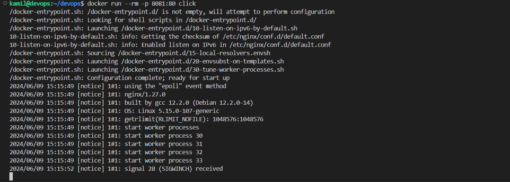

# Sprawozdanie 5

## Cel ćwiczenia
## Przebieg ćwiczenia - zajęcia 10 

### Instalacja minikube 

Aby pobrać i zainstalować `minikube` użyłem dwóch poleceń:

```
curl -LO https://storage.googleapis.com/minikube/releases/latest/minikube_latest_amd64.deb
sudo dpkg -i minikube_latest_amd64.deb
```

<div align="center">
    
</div>

<br>

Zaopatrzyłem się w polecenie `kubectl` tworząc alias:

```
alias kubectl="minikube kubectl --"
```

### Uruchomienie kubernetes

Uruchomiłem kubernetesa za pomocą polecenia:

```
minikube start
```

<div align="center">
    
</div>

<br>

Działający kontener kubernetes

<div align="center">
    
</div>

<br>

Wyświetliłem wszystkie pody

```
kubectl get po -A
```

<div align="center">
    
</div>

<br>

Uruchomiłem dashboard. Visual studio code automatycznie przekierowuje porty więc nie musiałem się o to martwić

```
minikube dashboard
```

<div align="center">
    
</div>

Po kliknięciu w link uruchamia się strona z dashboardem

<div align="center">
    
</div>

### Analiza posiadanego kontenera

Przez to ze wybrana przeze mnie aplikacja na poprzednich zajęciach nie nadaje się do pracy w kontenerze, wymieniłem ją na obraz nginx z wykonaną przeze stroną startową.

Stworzyłem nowego dockerfile:
```
FROM nginx

COPY index.html /usr/share/nginx/html/index.html
```

Zbudowałem obraz:
```
docker build -f click.Dockerfile -t click .
```
<div align="center">
    
</div>

<br>

uruchomiłem aplikacje udostępniając port 8081 (oraz przekierowałem port w visual studio code)
```
docker run --rm -p 80:8081 click
```

<div align="center">
    
</div>

<br>

Aplikacja pracuje jako kontener

<div align="center">
    
</div>

<br>

Stworzona przeze mnie aplikacja wyświetla liczbę kliknięć czerwonego przycisku przez użytkownika :)

<div align="center">
    
</div>

### Uruchamianie oprogramowania na stosie k8s

Próbowałem uruchomić poda

```
kubectl run click --image=click --port=80 --labels app="click"
```

Ale wystąpił błąd. Zrozumiałem że k8s nie wykrywa obrazów lokalnych więc muszę mój zbudowany obraz przesłać do docker huba.

<div align="center">
    
</div>

### Docker hub

Zalogowałem się do docker huba
```
docker login
```

<div align="center">
    
</div>

<br>

Dodałem tag z wersją do obrazu i przesłałem obraz do docker huba

```
docker tag click chlebiej/click:1.0
docker push chlebiej/click:1.0
```

<div align="center">
    
</div>

<div align="center">
    
</div>

### Uruchamianie oprogramowania na stosie k8s v2

Uruchomiłem poda

```
kubectl run click --image=chlebiej/click:1.0 --port=80 --labels app="click"
```
 
<div align="center">
    
</div>

Tym razem pod uruchomił się poprawnie i działa

<div align="center">
    
</div>

<br>

Wyprowadziłem port 8082 (oraz przekierowałem port 8082 w visual studio code)

<div align="center">
    
</div>

Udało się połączyć

<div align="center">
    
</div>

## Przebieg ćwiczenia - zajęcia 11 