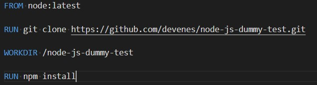
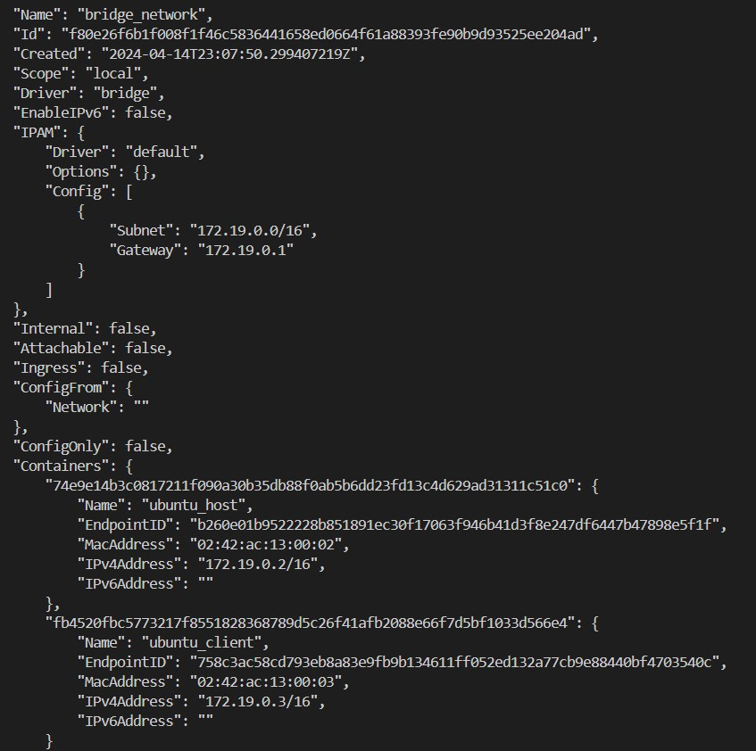

# Sprawozdanie 2
Krystian Gliwa, IO.

## Cel projektu
Zrozumienie i praktyczne zastosowanie konteneryzacji oraz narzędzi do automatyzacji procesów, takich jak Jenkins.

## Laboratoria numer 3. Dockerfiles, kontener jako definicja etapu

### Wybór oprogramowania na zajęcia

#### Znalezienie repozytorium
Pierwszym krokiem na ćwiczeniach nr 3. było znalezienie odpowiedniego repozytorium z kodem dowolnego oprogramowania, które spełnia następujące warunki: 
- dysponuje otwartą licencją,
- jest umieszczone wraz ze swoimi narzędziami Makefile tak, aby możliwe był uruchomienie w repozytorium czegoś na kształt make build oraz make test,
- zawiera zdefiniowane i obecne w repozytorium testy, które można uruchomić np. jako jeden z "targetów" Makefile'a. Testy muszą jednoznacznie formułować swój raport końcowy.

Moim wyborem było repozytorium **node-js-dummy-test** które spełnia wszystkie powyższe warunki.

#### Klonowanie repozytorium, oraz przeprowadzenie buildu programu.

Repozytorium sklonowałem poleceniem: 
```
git clone https://github.com/devenes/node-js-dummy-test.git
```


Następnie aby przeprowadzić build programu postępowałem zgodnie z instrukcją zamieszczoną w pliku README.md w tym repozytorium na githubie. Przeszedłem do katalogu **node-js-dummy-test** i tam chcąc doinstalować wszystkie wymagane zależności użyłem polecenia : 
```
npm install
```

jednak jak się okazało najpierw musiałem zainstalować **npm** (Node Package Manager) - menedżer pakietów dla środowiska programistycznego Node.js: 


Tak więc doinstalowałem **npm** poleceniem podanym wyżej, oraz ponownie spróbowałem doinstalować wymagane zależności, tym razem zakończyło się to powodzeniem: 


#### Uruchomienie dołączonych do repozytorium testów jednostkowych

Aby uruchomić testy jednostkowe użyłem polecenie 
```
npm test
```


### Przeprowadzenie buildu w kontenerze

#### Wykonanie kroków *build* i *test* wewnątrz wybranego kontenera bazowego.

- Uruchomienie kontenera i podłączenie do niego TTY(połączenie terminalowe, które Docker przekierowuje z hosta do kontenera, co umożliwia interaktywną pracę z kontenerem poprzez terminal) celem rozpoczęcia interaktywnej pracy: 

Dla mojej aplikacji *Node.js* wybrałem kontener bazowy **node** którego nie miałem pobranego na mojej maszynie wirtualnej, więc najpierw pobrałem obraz poleceniem:

```
docker pull node:latest
```


A następnie uruchomiłem kontener z flagą **-it**, aby móc interaktywnie korzystać z kontenera poleceniem: 
```
docker run -it node bash
```


- Zaopatrzenie konteneru w wymagania wstępne:
Jednym takim wymaganiem jest git który będzie potrzebny potem do sklonowania repozytorium, tak więc sprawdziłem czy w kontenerze jest *git* poleceniem:
```
git -v
```
i okazało się że nie ma ma potrzeby doinstalowywania go gdyż jest on juz w tym kontenerze: 


- Klonowanie repozytorium

Kolejnym krokiem było sklonowanie repozytorium na uruchomiony wczesniej kontener, zrobiłem to wykorzystując HTTPS, poleceniem: 

```
git clone https://github.com/devenes/node-js-dummy-test.git
```


- Uruchomieie buildu i testów
Po sklonowaniu przeszedłem do katalogu *node-js-dummy-test* i w nim uruchomiłem build w celu doinstalowania zależności, poleceniem: 

```
npm install
```


A następnie testy, poleceniem: 

```
npm test
```


#### Utworzenie dwóch plików **Dockerfile** które automatyzują powyższe kroki.

Pliki Dockerfile utworzyłem w katalogu roboczym *lab_3*. Pierwszy z nich ma odpowiadać za samego builda aplikacji, nazwałem go więc *Dockerfile_node_build* a oto jego zawartoś:



- *FROM node:latest*, określa obraz bazowy kontenera,
- *RUN git clone...*, klonuje repozytorium,
- *WORKDIR /node-js-dummy-test*, ustawia katalog roboczy wewnątrz kontenera,
- *RUN npm install*, instaluje wymagane zależności

Kontener za pomocą tego Dockerfile utworzyłem poleceniem  **docker build** wykorzystując opcje **-t** która służy do nadania tagu obrazowi, oraz **-f** która pozwala na określenie nazwy i lokalizacji pliku Dockerfile : 
```
docker build -t node-build -f ./Dockerfile_node_build .
```


Kolejnym krokiem było utworzenie kolejnego Dockerfile który ma tworzyć kontener bazujący na tym poprzednim i wykonywać testy, nazwałem go *Dockerfile_node_test*, a oto jego zawartość: 


- *FROM node-build*, określa obraz bazowy kontenera,
- *WORKDIR /node-js-dummy-test* ustawia katalog roboczy wewnątrz kontenera,
- *RUN npm test*, wykonuje testy aplikacji.

A następnie aby wybudować obraz na podstawie tego pliku użyłem polecenia: 
```
docker build -t node-test -f ./Dockerfile_node_test .
```


Następnie aby sprawdziłem czy obrazy napewno zostały utworzone:


#### Wykazanie że kontener wdraża się i pracuje poprawnie.

Uruchomiłem kontener bazujący na obrazie node_build polceniem: 
```
docker run node-build
```
Oraz na obrazie node-test polceniem:
```
docker run node-test
``` 
Po czym sprawdziłem czy kontenery napewno się uruchomiły poleceniem: 
```
docker ps -a
```


Jak widać oba te kontenery uruchomiły się, jednak po wykonaniu swoich zdań zostały zamknięte.

## Laboratoria numer 4. Dodatkowa terminologia w konteneryzacji, instancja Jenkins

### Zachowanie stanu

#### Przygotowanie woluminu wejściowego i wyjściowego i podłączenie ich do kontenera bazowego, z którego rozpoczynano poprzednio pracę, uruchomienie kontenera

Na początek utworzyłem dwa woluminy: *volume_input* i *vloume_output* poleceniem: 
```
docker volume create nazwa_woluminu
```


Następnie aby podłączyć je do kontenera bazowego użyłem polecenia:
```
docker run -it --name volume-container --mount source=volume_input,target=/input --mount source=volume_output,target=/output node bash

```
Które uruchamia dany kontener z podpiętymi dwoma voluminami w trybie interaktywnym.

Spradzenie czy woluminy zostały podpięte: 


Katalogi output i input zosały utworzone, wiec operacja przesza pomyślnie.


#### Sklonowanie repozytorium na wolumin wejściowy

Aby sklonować repozytorium wykorzystałem kontener pomocniczy utworzony na obrazie node który juz zawierał gita i do którego podłączyłem wolumin wejściowy, poleceniem(zrobiłem to w nowym terminalu):
```
docker run -it --rm --name tmp_container --mount source=volume_input,target=/input node bash
```

Następnie w kontenerze w folderze wejściowym *input* sklonowałem repozytorium wykorzystując:
```
git clone
```


Po wróceniu do starego terminala i kontenera, sprawdziłem katalog *input* czy udało się sklonować repozytorium i jak widać udało się: 


#### uruchomienie buildu w kontenerze

W sklonowanym folderze *node-js-dummy-test* przeprowadziłem build aplikacji poleceniem: 

```
npm install
```


Skopiowałem również repozytorium do wewnątrz kontenera będąc w katalogu *input* poleceniem:
```
cp -r node-js-dummy-test/ ..
```

#### Zapis powstałych/zbudowanych plików na woluminie wyjściowym

Aby takowe pliki były dostępne po wyłączeniu kontenera konieczne jest własnie wykoanienie tej czynności. Pilki te znajdują się w katalogu *node-modules* tak więc skopiowałem ten katalog na wolumin wyjściowy poleceniem:
```
cp -r node-modules ../../output
```


Następnie na hoście (poza kontenerem) sprawdzam scieżkę do *volume_output*: 


Aby przekonać się czy tam też znajduje sie plik node-modules poleceniem: 


#### Klonowanie na wolumin wejściowy wewnątrz kontenera (z wykorzystaniem gita w kontenerze)

W kontenerze do którego wcześniej podpiołem dwa woluminy, w woluminie wejsciowym utworzyłem nowy folder *new_repo* do którego sklonowałem repozytorium polecenime:
```
git clone https://github.com/devenes/node-js-dummy-test.git
```


#### Dyskusja na temat wykorzystania docker build i pliku Dockerfile do zrealizowania ww. kroków

Możliwe byłoby wykonanie ww. kroków za pomocą *Docker build* i pliku *Dockerfile*, wykorzystując instrukcję RUN --mount, która pozwala montować woluminy podczas budowy obrazu. W pliku Dockerfile trzebaby było zdefiniować kolejne kroki takie jak klonowanie repozytorium, wykonanie buildu aplikacji, oraz kopiowanie plików na wolumin wyjściowy.

### Eksponowanie portu

#### Uruchomienie wewnątrz kontenera serwera iperf3

Najpierw uruchomiłem kontener na obrazie *Ubuntu* potem w kontenerze zainstalowałem *iperf3* poleceniem:
```
apt install iperf3
```
A następnie uruchomiłem go poleceniem:
```
iperf3 -s
```


#### Połączenie się z serwerem z drugiego kontenera, badanie ruchu

Aby połączyć się z serwerem potrzebowałem IP kontenera na którym jest serwer. Sprawdziłem je poleceniem (gdzie ostatni jego element to ID konteneru):
```
docker inspect -f'{{range .NetworkSettings.Networks}}{{.IPAddress}}{{end}}' e92c2cf3abe0
```


Następnie utworzyłem nowy kontener,  tez na obazie ubuntu, zainstalowałem tam iperf3, oraz połączyłem się z serwerem jako klient poleceniem: 
```
iperf3 -c 172.17.0.3
```
Oto rezultaty tego połączenia na kliencie i na hoscie: 


#### Powtorzenie kroku wyżej z wykorzystaniem własnej dedykowanej sieci mostkowej

Sieć mostkowa to  rodzaj sieci wirtualnej, która umożliwia komunikację między różnymi kontenerami oraz z hostem. W sieci mostkowej każdy kontener ma swój własny interfejs sieciowy z unikalnym adresem IP, dzięki czemu mogą one komunikować się ze sobą i z hostem używając nazw kontenerów lub adresów IP.
Aby ją utworzyć użyłem polecenia: 
```
docker network create bridge_network
```

Następnie tworze i odrazu podpinam kontenera do sieci, jeden jako klient poleceniem: 
```
docker run --name ubuntu_host -it --rm --network=bridge_network ubuntu
```
a drugi jako host, poleceniem:
```
docker run --name ubuntu_client -it --rm --network=bridge_network ubuntu

```
Po czym wchodzę w szczegóły sieci aby sprawdzić czy połączenie się przebiegło pomyślmie poleceniem: 
```
docker network inspect bridge_network
```


W kontenerze *ubuntu_host* uruchamiam serwer poleceniem: 
```
iperf3 -s
```
Natomiast w kontenerze *ubuntu_client* do połączenia się z serwerem wykorzystuje teraz nazwe kontenera z serewerem:
```
iperf3 -c ubuntu_host
```
Rezultat dla serwera: 


Rezultat dla klienta:


#### Połączenie się spoza kontenera z hosta

Połączenie się spoza kontenera z hosta jest poprostu połączeniem się z serverem bezpośrednio z wirtualnej maszyny. By to wykonać najpierw musiałem wystawić port(5201) nasłuchujący połączeń przy uruchamianiu kontenera (z serwerem) poleceniem: 
```
docker run --name ubuntu_host -it --rm --network=bridge_network -p 5201:5201 ubuntu bash
```
W kontenerze uruchomiłem serwer poleceniem:
```
iperf3 -s
```
Oraz połączyłem się z hosta z serwerem poleceniem(IP sprawdziłem tak jak wcześniej): 
```
iperf3 -c 172.19.0.2
```
Wyniki dla hosta:


Wyniki dla klienta:


#### Połączenie się spoza kontneru spoza hosta

Połączenie to próbowałem zrealizować u siebie na windowsie, pobierając iperf3 jednak nie udało mi się takowego osiągnąć: 


#### Przepustowość komunikacji

Połączenia:
-kontener-kontener przez domyślną sieć Dockera: 26.9 Gbits/sec
-kontener-kontener przez własną sieć mostkową: 26.2 Gbits/sec
-kontener-host: 29.9 Gbits/sec
-kontener-spoza hosta: nie udało się osiągnąć

Tak więc najlepszą przepustowość osiągnęło połączenie z hostem. Połączenia między kontenerami osiągnęły porównywalną przepustowość.

### Instalacja Jenkins

#### Instalacja skonteneryzowanej instancji Jenkinsa z pomocnikiem DIND

Przy instalowaniu kierowałem sięinstrukcją zamieszczoną na stronie https://www.jenkins.io/doc/book/installing/docker/. 
Najpierw utworzyłem sieć mostkową w Docker poleceniem: 
```
docker network create jenkins
```


Następnie pobrałem i uruchomiłem docker:dind Obraz dokera poleceniem: 
```
docker run --name jenkins-docker --rm --detach \
  --privileged --network jenkins --network-alias docker \
  --env DOCKER_TLS_CERTDIR=/certs \
  --volume jenkins-docker-certs:/certs/client \
  --volume jenkins-data:/var/jenkins_home \
  --publish 2376:2376 \
  docker:dind --storage-driver overlay2
```


Następnie utworzyłem *jenkins.Dockerfile* aby zbudować z niego nowy docker obraz, poleceniem:
```
docker build -t myjenkins-blueocean:2.440.3-1 -f jenkins.Dockerfile .
```


Następnie uruchamiam mój obraz *myjenkins-blueocean:2.440.3-1* jako konetner za pomocą polecenia:
```
docker run --name jenkins-blueocean --restart=on-failure --detach \
  --network jenkins --env DOCKER_HOST=tcp://docker:2376 \
  --env DOCKER_CERT_PATH=/certs/client --env DOCKER_TLS_VERIFY=1 \
  --publish 8080:8080 --publish 50000:50000 \
  --volume jenkins-data:/var/jenkins_home \
  --volume jenkins-docker-certs:/certs/client:ro \
  myjenkins-blueocean:2.440.3-1
```


Aby móc połączyć się z serwerem Jenkinsa uruchomionego na wirtualnej maszynie, na hoscie potrzebowałem przekierować porty. Aby to zrobić najpierw musiałem sprawdzić IP, poleceniem: 
```
ip addr show
```


Następnie w ustawieniach mojej VM przekierowałem porty z wirtualnej maszyny do hosta(Jenkins domyślnie korzysta z portu 8080):


Następnie spróbowałem połączyć się z lokalnym serwerem internetowym działającym na twoim komputerze na porcie 8080, wpisując w przeglądarce: 
```
localhost:8080
```
To co otrzymałem:


Aby otrzymać wymagane do zalogowania hasło administratora użyłem polecenia:
```
docker exec adf68180c417 cat /var/jenkins_home/secrets/initialAdminPassword
```
Po czym pomyślnie się zalogowałem:


