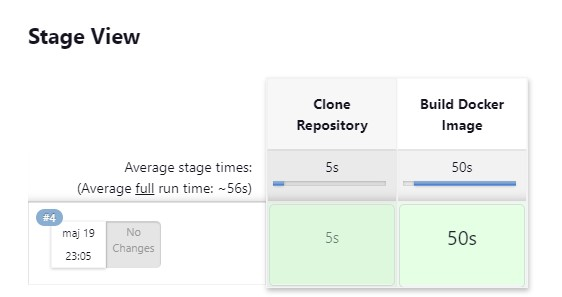

# Sprawozdanie 3
Krystian Gliwa, IO.

## Cel projektu
Celem projektu jest zapoznanie się z procesami CI/CD oraz wykorzystaniu narzędzia Jenkins do automatyzacji tego procesu. 

## Pipeline, Jenkins, izolacja etapów

### Przygotowanie

#### Upewnienie się że na pewno działają kontenery budujące i testujące, stworzone na poprzednich zajęciach
Aby sprawdzić czy kontenery budujący i testujący dziłają poprawnie użyłem poleceń: 
```
sudo docker build -f Dockerfile_node_build -t node-app-build .
sudo docker build -f Dockerfile_node_test -t node-app-test .
```
W efekcie czego nie otrzymałem żadnych błędów podczas budowania obrazów, tak więc działają poprawnie: 


#### Instalacja Jenkinsa
Po zapoznaniu się z instrukcją instalacji Jenkinsa rozpocząłem ją.
Najpierw utworzyłem  sieć mostkowa w Docker poleceniem: 
```
docker network create jenkins
```
Następnie aby wykonać polecenia Docker w węzłach Jenkins, pobierałem i uruchomiłem docker:dind poleceniem: 
```
docker run --name jenkins-docker --rm --detach \
  --privileged --network jenkins --network-alias docker \
  --env DOCKER_TLS_CERTDIR=/certs \
  --volume jenkins-docker-certs:/certs/client \
  --volume jenkins-data:/var/jenkins_home \
  --publish 2376:2376 \
  docker:dind --storage-driver overlay2
  ```
Następnie utorzyłem plik o nazwie *jenkins.Dockerfile* z następującą zawartością:
```
FROM jenkins/jenkins:2.440.3-jdk17
USER root
RUN apt-get update && apt-get install -y lsb-release
RUN curl -fsSLo /usr/share/keyrings/docker-archive-keyring.asc \
  https://download.docker.com/linux/debian/gpg
RUN echo "deb [arch=$(dpkg --print-architecture) \
  signed-by=/usr/share/keyrings/docker-archive-keyring.asc] \
  https://download.docker.com/linux/debian \
  $(lsb_release -cs) stable" > /etc/apt/sources.list.d/docker.list
RUN apt-get update && apt-get install -y docker-ce-cli
USER jenkins
RUN jenkins-plugin-cli --plugins "blueocean docker-workflow"
```
I zbudowałem nowy obraz dockera (myjenkins-blueocean:2.440.3-1) z tego pliku poleceniem:
```
docker build -t myjenkins-blueocean:2.440.3-1 -f jenkins.Dockerfile .
```
Na koniec uruchomiłem kontener z tego obrazu poleceniem: 
```
docker run --name jenkins-blueocean --restart=on-failure --detach \
  --network jenkins --env DOCKER_HOST=tcp://docker:2376 \
  --env DOCKER_CERT_PATH=/certs/client --env DOCKER_TLS_VERIFY=1 \
  --publish 8080:8080 --publish 50000:50000 \
  --volume jenkins-data:/var/jenkins_home \
  --volume jenkins-docker-certs:/certs/client:ro \
  myjenkins-blueocean:2.440.3-1
```


Różnica między obrazem dockera a blueocean polega na tym, że *docker* to obraz Docker-in-Docker, który zapewnia środowisko Docker wewnątrz kontenera, podczas gdy *blueocean* to obraz Jenkinsa, który został rozbudowany o wtyczkę Blue Ocean, dostarczającą interfejs użytkownika dla Jenkinsa.

### Uruchomienie
Konfiguracja wstępna i pierwsze uruchomienie opisane zostały w poprzednim sprawozdaniu. 
Przeszedłem więc do tworzenia mojego pierwszego projektu który ma za zadanie wyświetlać *uname*
Tak też go nazwałem, po czym w krokach budowania dodałem tylko 
```
uname -a
```
Po czym uruchomiłem build a w efekcie w logach otrzymałem: 


Kolejnym krokiem było utworzenie projektu który zwraca błąd gdy godzina jest nieparzysta. 
W buildzie tego projektu dodałem więc kod realizujący to zadanie: 
```
#!/bin/bash
hour=$(date +%H)

if [ $((hour % 2)) -ne 0 ]; then
    echo "Błąd - godzina jest nieparzysta (godzina: $hour)."
    exit 1
else
    echo "Brak błędu - godzina jest parzysta (godzina: $hour)."
fi
```
Wynik: 


Kolejnym krokiem było tym razem utworzenie projektu który: 
- klonuje nasze repozytorium
- przechodzi na osobistą gałąź
- buduje obrazy z dockerfiles i/lub komponuje via docker-compose

Aby go zrealizować skorzystałem z Jenkins Pipeline który umożliwia definiowanie zestawu kroków do wykonania w sposób skryptowy. Definicje ustawiłem na *Pipeline skript* . Moj pipeline składa się z trzech etapów: klonowanie (zawiera w sobie również zmiane na moją gałąź) i build obrazu(**sh "..."** przed poleceniami jest używana w Pipelinie do wykonania poleceń powłoki(shell)):
```
pipeline {
    agent any

    stages {
        stage('Clone Repository') {
            steps {
                echo 'Klonowanie'
                sh 'rm -r MDO2024_INO || true'
                git branch: 'KG411149', url: 'https://github.com/InzynieriaOprogramowaniaAGH/MDO2024_INO.git'
            }
        }

        stage('Build Docker Image') {
            steps {
                script {
                    echo 'Budowanie obrazu'
                    sh 'docker build -f ./INO/GCL1/KG411149/Sprawozdanie2/Dockerfile_node_build -t node-build .'
                }
            }
        }
    }
}
```



### Wstęp - opracowanie dokumentu z diagramami UML, opisującymi proces CI.

#### Wymagania wstępne środowiska

- uruchomiony obraz DIND,
- uruchomiony obraz blueocean na podstawie obrazu Jenkinsa.

Diagram aktywności, pokazujący kolejne etapy (prepare-clone, build, test, deploy i publish)


Diagram wdrożeniowy opisujący relacje między składnikami, zasobami i artefaktami: 


### Pipeline 

Mój pipeline składa się z pięciu etapów(stages) - clone, build, test, deploy i publish i służy do automatyzacji procesu CI/CD. Dyrektywa **agent any** wskazuje, że pipeline może być wykonywany na jakimkolwiek wolnym agencie, który jest skonfigurowany w systemie Jenkins.

#### Clone 
Pierwszy z etapów wyświetla informacje za co jest odpowiedzialny, a następnie usuwa repozytorium MDO2024_INO jeśli takowe juz jest pobrane poleceniem: 
```
sh "rm -rf MDO2024_INO || true"
```
Następnie pobiera repozytorium z gałęzią **KG411149** poleceniem: 
```
git branch: 'KG411149', url: 'https://github.com/InzynieriaOprogramowaniaAGH/MDO2024_INO.git'
```

#### Build
Ten stage buduje obraz budujący o nazwie **node-build** korzystając z pliku **build.Dockerfile** poleceniem: 
```
sh "docker build -f ./INO/GCL1/KG411149/Sprawozdanie2/build.Dockerfile -t node-build ."
```
Plik build.Dockerfile znajduje się w wyżej wymienionej ścieżce w tym repozytorium a jego zawartość jest następująca: 
```
FROM node:14

RUN git clone https://github.com/devenes/node-js-dummy-test.git

WORKDIR /node-js-dummy-test

RUN npm install
```
Opisany on został juz w wcześniejszym sprawozdaniu, zmieniona została tylko wersja z latest na 14.

#### Test 
Ten stage opiera się na wykonaniu testów przypisanych do aplikacji. Też tworzony jest obraz Dockerowy - node-test lecz tym razem na podstawie pliku **test.Dockerfile**. Oto jego zawartość: 
```
FROM node-build

WORKDIR /node-js-dummy-test

RUN npm test
```

#### Deploy
W tym etapie najpierw, jeśli istnieje zatrzymywany i usuwany jest kontener aplikacji o nazwie first-app-con, aby zapewnić czyste środowisko dla nowej wersji aplikacji. Następnie tworzona jest sieć Dockerowa o nazwie moja_siec, jeśli jeszcze nie istnieje, co umożliwia kontenerom wewnątrz niej komunikację między sobą. Potem w scieżce INO/GCL1/KG411149/Sprawozdanie2 tworzony jest obraz na podstawie pliku deploy.Dockerfile: 
```
FROM node-build

WORKDIR /node-js-dummy-test

CMD ["npm", "start"]
```
Po zbudowaniu obrazu, ewentualny istniejący kontener o nazwie first-app zostaje usunięty, aby uniknąć konfliktów z nowym kontenerem. Następnie nowy kontener aplikacji jest uruchamiany na podstawie wcześniej zbudowanego obrazu, poleceniem: 
```
sh 'docker run -d -p 3000:3000 --name first-app-con --network moja_siec krystian3243/first-app'

```
 Ten kontener jest nazwany first-app_con, mapuje port 3000 na zewnątrz i wewnątrz kontenera, oraz jest podłączony do wcześniej utworzonej sieci moja_siec.

 #### Publish
 Ostatnim etapem w moim pipelinie jest Publish który ma na celu opublikowanie zbudowanego obrazu kontenera Docker na zewnętrznym rejestrze Docker Hub.
 Najpierw używam polecenia: 
 ```
withCredentials([usernamePassword(credentialsId: 'moje_ID', usernameVariable: 'DOCKER_USERNAME', passwordVariable: 'DOCKER_PASSWORD')]) {...}
 ```
Służy ono do uwierzytelnienia się w zewnętrznym systemie (Docker Hub) za pomocą przechowywanych w Jenkins nazwy użytkownika i hasła. Aby z tego skorzystać wcześniej musiałem dodać "Credential" w "Zarządzanie Jenkinsem"->"Credentials":

 

 Następnie nastąpiło zalogowanie się do Docker hub poleceniem: 
 ```
 sh "echo $DOCKER_PASSWORD | docker login -u $DOCKER_USERNAME --password-stdin"
 ``` 
 Po czym za pomocą polecenia: 
 ```
 sh 'docker push krystian3243/first-app'
 ```
 wysyłany jest zbudowany obraz kontener na Docker Hub. **krystian3243/first-app** jest nazwą i tagiem obrazu. Dzięki temu krokowi obraz jest udostępniany na Docker Hub.

 
Cały pipeline prezentuje się następująco: 
```
pipeline {
    agent any
    
    stages {
        
        stage('Clone') {
            steps {
                echo "Klonowanie"
                sh "rm -rf MDO2024_INO || true"
                git branch: 'KG411149', url: 'https://github.com/InzynieriaOprogramowaniaAGH/MDO2024_INO.git'
            }
        }

        stage('Build') {
            steps {
                echo "Budowanie obrazu budującego"
                sh "docker build -f ./INO/GCL1/KG411149/Sprawozdanie2/build.Dockerfile -t node-build ."
            }
        }
        
        stage('Test') {
            steps {
                echo 'Budowanie obrazu testujacego'
                sh "docker build -f ./INO/GCL1/KG411149/Sprawozdanie2/test.Dockerfile -t node-test ."
            }
        }
        
        stage('Deploy') {
            steps {
                sh 'docker stop first-app-con || true'
                sh 'docker rm first-app-con || true'
                sh 'docker network create moja_siec || true'
                echo 'Budowanie obrazu i uruchamianie aplikacji'
                dir('INO/GCL1/KG411149/Sprawozdanie2') {
                    sh 'docker build -f deploy.Dockerfile -t krystian3243/first-app .'  // Zaktualizowany tag
                    sh 'docker rm -f first-app || true'
                    sh 'docker run -d -p 3000:3000 --name first-app-con --network moja_siec krystian3243/first-app'
                }
            }
        }
        
        stage('Publish') {
            steps {
                withCredentials([usernamePassword(credentialsId: 'moje_ID', usernameVariable: 'DOCKER_USERNAME', passwordVariable: 'DOCKER_PASSWORD')]) {
                    script {
                        sh "echo $DOCKER_PASSWORD | docker login -u $DOCKER_USERNAME --password-stdin"
                        sh 'docker push krystian3243/first-app'
                    }
                }
            }
        }
    }
}
```

Po uruchomieniu projektu otrzymałem następujący "Stage Viev": 

 
 
 Co świadczy że wszytko pipeline przeprowadzono pomyślnie. 

 Końcowe logi:

 

 Utworzony obraz na Docker Hub:

 


### Definition of done

Utworzony obraz jest teraz ogólnie dostępny więc moge go pobrać i uruchomić aby sprawdzić czy wszystko napewno działa dobrze: 


A następnie sprawdzam działanie w przeglądarce wpisując: 
```
http://localhost:3000
```


Wszytko działa poprawnie.

