# Sprawozdanie 4
Krystian Gliwa, IO.

## Cel projektu


## Automatyzacja i zdalne wykonywanie poleceń za pomocą Ansible

### Instalacja zarządcy Ansible

#### Druga wirtualna maszyna (mała)

Na początku przystąpiłem do utworzenia nowej maszyny wirtualnej o jak najmniejszym zbiorze zainstalowanego oprogramowania.

- Zastosowałem ten sam system operacyjny co moja "główna" maszyna czyli **ubuntu-22.03.4 - serwer**
- W systemie był juz wbudowany program **tar**: 

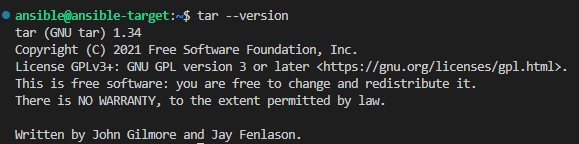

Ale oprucz niego potrzebny będzie nam jeszcze serwer OpenSSH, zainstalowałem go poleceniem: 
```
sudo apt-get install openssh-server
```


- Podczas instalacji ustawiłem na mojej maszynie hostname na **ansible-target** oraz utworzyłem w systemie użytkownika **ansible** co widać na screenie poniżej (ansible@ansible-target):


#### Instalacja oprogramowania Ansible

Na głównej maszynie zainstalowałem oprogramowanie Ansible zgodnie z instukcją ze strony *https://docs.ansible.com/ansible/latest/installation_guide/installation_distros.html#installing-ansible-on-ubuntu* poleceniem: 
```
$ sudo apt update
$ sudo apt install software-properties-common
$ sudo add-apt-repository --yes --update ppa:ansible/ansible
$ sudo apt install ansible
```

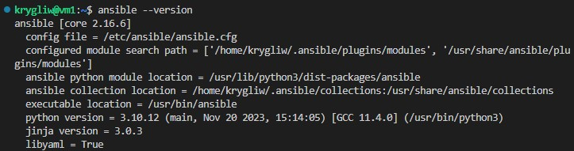

#### Wymiana kluczy SSh

Kolejnym krokiem było wymienienie kluczy SSH między użytkownikiem w głównej maszynie wirtualnej, a użytkownikiem ansible z nowej tak, by logowanie *ssh ansible@ansible-target* nie wymagało podania hasła, wykonałem to wpisując następujące polecenie na głównej maszynie: 
```
ssh-copy-id ansible@192.0.227
```
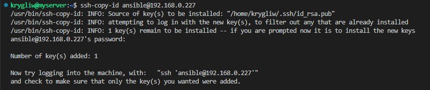

Teraz mogłem się juz zalogować na nową vm bez podawania hasła: 

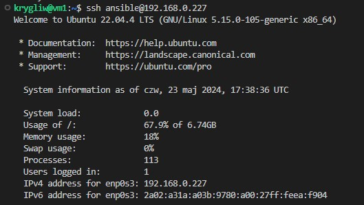

### Inwentaryzacja

#### Inwentaryzacja systemów

- Na początku stosując **hostnamectl** ustaliłem nową przewidywalną nazwe głównej maszyny na **vm1**: 

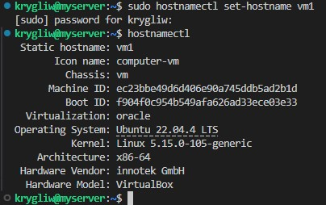

- Następnie wprowadziłem nazwy DNS, aby możliwe było wywoływanie komputerów za pomocą nazw, a nie tylko adresów IP. Za pomocą dodania w pliku **/etc/hosts** poniższej linijki(dla głownej maszyny):
```
192.168.0.227 ansible-target
```


- Weryfikacja łączności za pomocą **ping**:

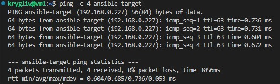

- Kolejnym krokiem było stworzenie plików inwentaryzacji. W katalogu **ansible_quickstart** utworzyłem plik **inventory.ini** o zawartości: 
```
Orchestrators:
vm1 ansible_user=krygliw

Endpoints:
ansible-target ansible_user=ansible
```

Następnie w katalogu z tym plikiem użyłem polecenia:
```
ansible-inventory -i inventory.ini --list
```
do wyświetlenia listy hostów i grup zdefiniowanych w pliku inwentaryzacyjnym:

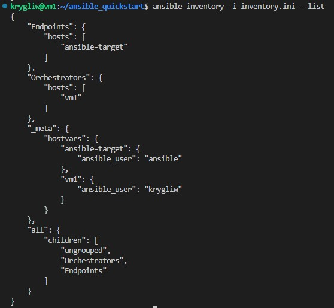

Następnie chciałem wysłać żądanie ping do wszystkich maszyn za pomocą polecenia: 
```
ansible all -i inventory.ini -m ping
```
Jednak po tej próbie wyrzuciło mi błąd: 

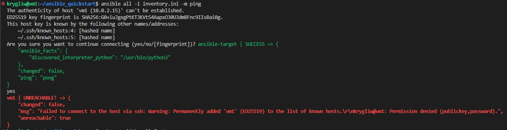

Który związany był z tym że Ansible nie może połączyć się z hostem vm1. Jak się okazało rozwiązaniem na ten problem było dodanie klucza publicznego do autoryzowanych kluczy na vm1, poleceniem: 
```
ssh-copy-id krygliw@vm1
```
Po tym jeszcze raz spróbowałem wysłać żądanie ping do wszystkich maszyn, tym razem z pozytywnym rezultatem: 

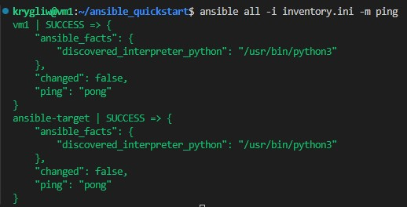

### Zdalne wywoływanie procedur

Następną częścią zadania było utworzenie playbooka Ansible który w skrócie służy do automatyzacji różnych zadań na wielu komputerach(zdalnych maszynach) jednocześnie. Tak więc na początek musiałem utwrorzyć taki plik, nazwałem go **playbook.yaml** w utworzonym wcześćniej katalogu **ansible_quickstart**, oraz przystąpiłem do edycji go aby realizował kolejne instrukcje:

- wysłanie żądania **ping** do wszystkich maszyn: 
```
- name: Zdalne wywoływanie procedur
  hosts: all
  tasks:
    - name: Wysyłanie żądania ping do wszystkich maszyn
      ping:
```
Aby teraz uruchomić playbooka użyłem polecenia:
```
ansible-playbook -i inventory.ini playbook.yaml
```
Zadanie wykonane pomyślnie: 

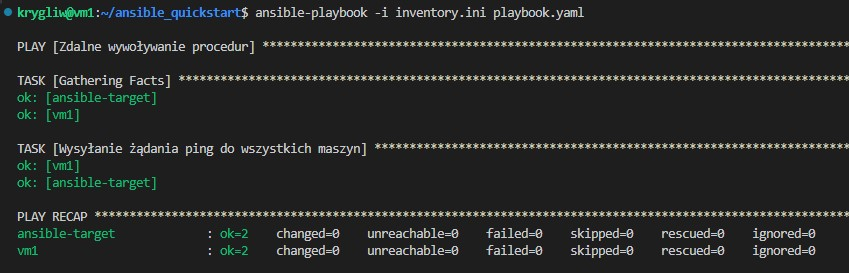

- Skopiowanie pliku inwentaryzacji na maszyny/ę Endpoints (tutaj rozpoczeła się sekcja tasków dla maszyn Endpoints):
```
- name: Operacje na Endpoints
  hosts: Endpoints
  tasks:
    - name: Skopiowanie pliku inventory.ini na maszyny Endpoints
      copy:
        src: /path/to/your/inventory.ini
        dest: /etc/ansible/inventory.ini
```
Efekt: 

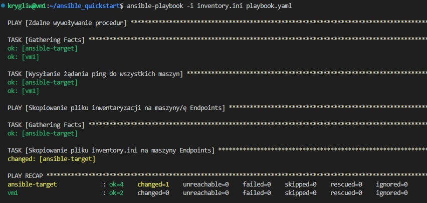

Aby sprawdzić czy wszystko zadziałało uruchomiłem playbooka ponownie, lecz teraz nie wyświetliło żeby jakieś zmiany się wykonały, tak więc plik **inventory.ini** musiał się juz znajdować skopiowany na naszym Endpoincie: 

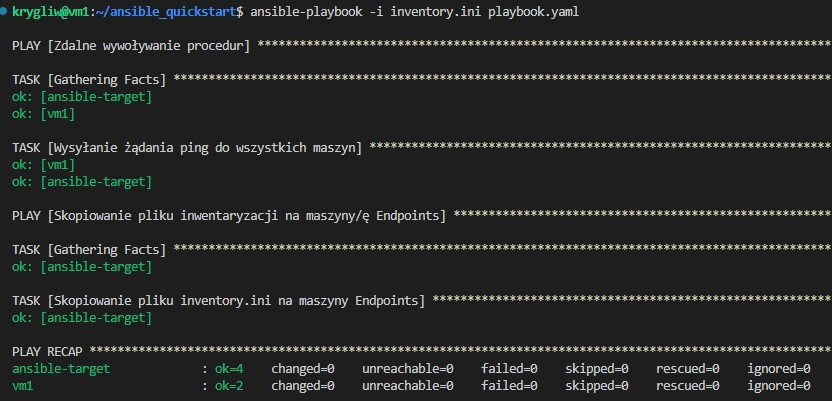

- Aktualizacja pakietów w systemie:
```
 - name: Aktualizacja pakietów w systemie
  hosts: Endpoints
  vars:
    ansible_become_pass: hasło_ansible
  tasks:
    - name: Aktualizacja pakietów
      become: yes
      apt:
        name: '*'
        state: latest
```
Efekt:

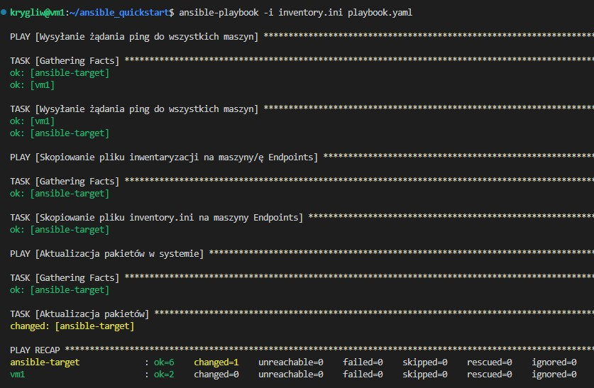

- Restart usługi sshd i rngd:
Fragment dodany do playbooka udpowiedzialny za zresetowanie tych usług wygląda następująco:
```
- name: Restart usług
  hosts: Endpoints
  vars:
    ansible_become_pass: hasło_ansible
  tasks:
    - name: Restart sshd
      become: yes
      service:
        name: sshd
        state: restarted

    - name: Restart rngd
      become: yes
      service:
        name: rngd
        state: restarted
```
Efekt: 

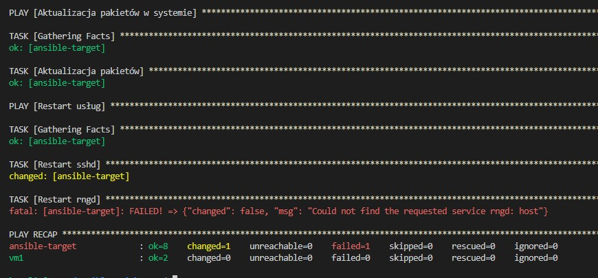

Jak widać wyrzuciło błąd który był związany z tym że usługi **rngd** nie było w systemie ansible-host, tak więc doinstalowałem ją poleceniem:
```
sudo apt-get update
sudo apt-get install rng-tools
```
Po czym w playbooku zmieniłem nazwe restartowanej usługi na **rng-tools** (z **rngd**) i ponownie uruchomiłem playbooka:

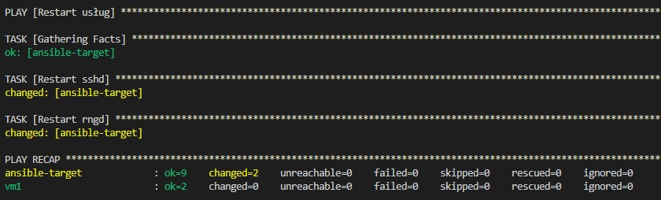

- Przeprowadzenie operacji względem maszyny z wyłączonym serwerem SSH, odpiętą kartą sieciową:

SSH na *ansible-target* wyłączyłem poleceniem:
```
sudo systemctl stop ssh
```
Po tym uruchomiłem playbooka, a w rezultacie otrzymałem następujący błąd: 

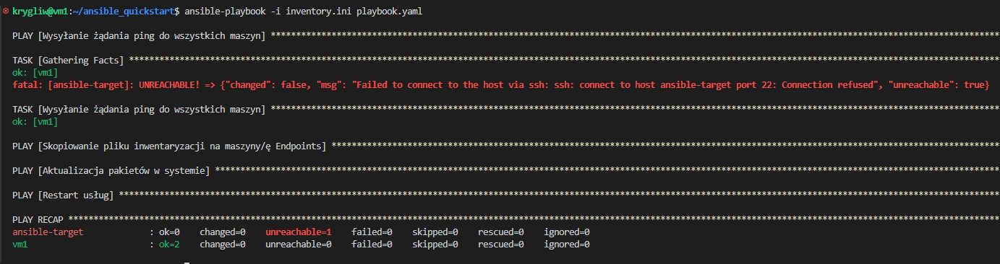

Który informuje że połączenie z hostem przez SSH zostało odrzucone. 

Natomiast wersje z odpiętą kartą siciową otrzymałem poprzez odznaczenie opcji: *Kabel podłączony* w ustawieniach sieciowych maszyny:

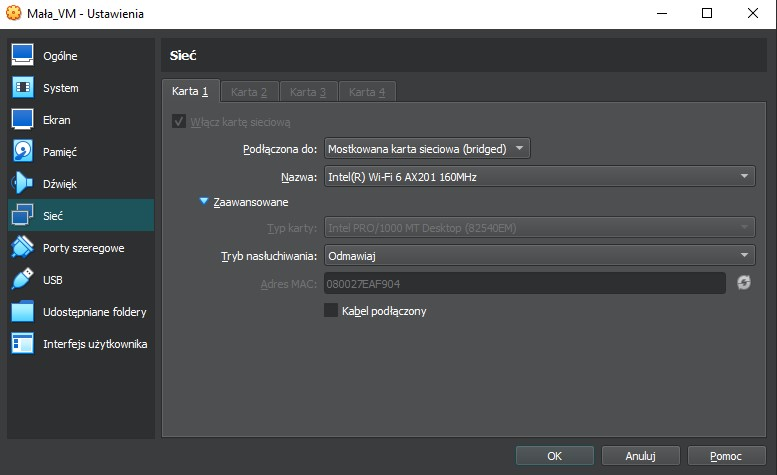

Po czym uruchomiłem playbooka, a w rezultacie otrzymałem następujący błąd: 

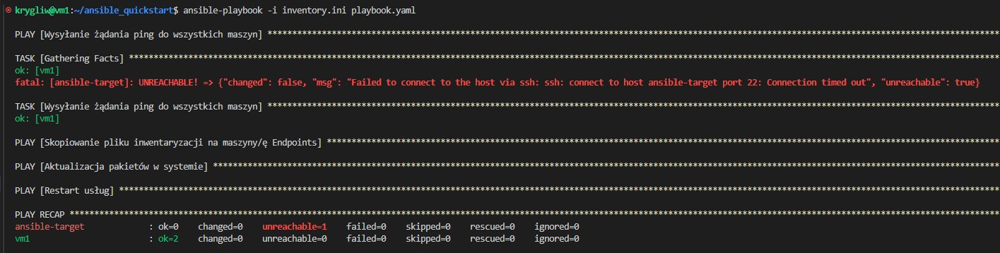
 
 Który informuje że połączenie z hostem przez SSH nie udalo się - *Connection timed out*

 ### Zarządzanie kontenerem

Kolejnym krokiem było wykorzystanie playbooka do wdrożenia aplikacji utrzonej w ramach poprzedniego sprawozdania z kontenera na maszynie ansible-target. Tak więc utworzyłem nowego playbooka o nazwie **playbook2.yaml** który realizuje zadanie instalacji dockera. Aby to zrobić najpierw aktualizuje pakiety, potem instaluje dockera i uruchamia go przy każdym uruchomieniu systemu: 
```
- name: Instalowanie Dockera
  hosts: Endpoints
  vars:
    ansible_become_pass: hasło_ansible
  become: yes
  tasks:
    - name: Aktualizacja pakietów
      apt:
        name: '*'
        state: latest
    
    - name: Instalacja Dockera
      apt:
        name: docker.io
        state: latest

    - name: Uruchomianie Dockera przy uruchomieniu systemu
      command: systemctl enable --now docker
```
Efekt: 

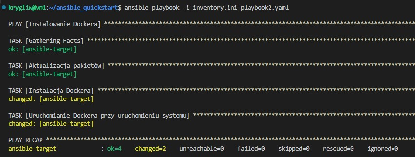

Kolejnym etapem było pobranie z Docker Hub alikacji "opublikowanej" w ramach kroku Publish z ostatnich zajęć oraz uruchomienie kontenera ( z opcją detach: yes - aby kontener pracował w tle, oraz ze zmapowanym portem 3000):
```
- name: Pobieranie aplikacji
  hosts: Endpoints
  vars:
    ansible_become_pass: hasło_ansible
  become: yes
  tasks:
    - name: Pobieranie obrazu z Docker Hub
      community.docker.docker_image:
        name: krystian3243/first-app
        source: pull
    - name: Uruchomienie kontenera
      become: yes
      community.docker.docker_container:
        name: first-app-con
        image: krystian3243/first-app
        state: started
        detach: yes
        ports:
          - "3000:3000"
```

Efekt: 

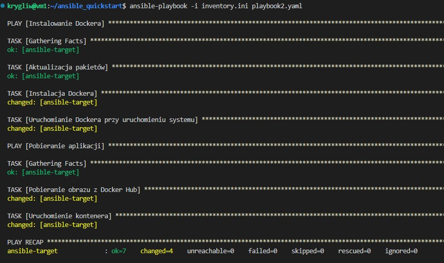

Sprawdzenie na ansible-target czy wszystko się udało: 
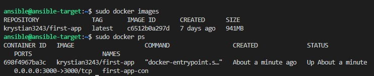

Kolejnym etapem było dodanie do playbooka istrukcji która spowoduje zatrzymanie i usunięcie kontenera:
```
- name: Zatrzymanie i usunięcie kontenera
  hosts: Endpoints
  vars:
    ansible_become_pass: hasło_ansible
  become: true
  tasks:
    - name: Zatrzymanie i usunięcie kontenera
      docker_container:
        name: first-app-con
        state: absent
```
Efekt:

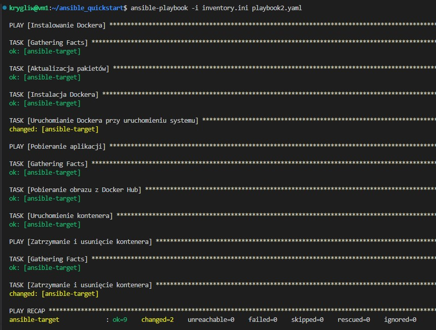

Potwierdzenie z ansible-target:

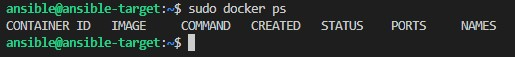

Ostatnim korkiem było ubranie powyższych kroków w *rolę* za pomocą szkieletowania ansible-galaxy. Na początku utworzyłem folder *roles* w którym będą znajdować się moje role. Następnie w tym katalogu utworzyłem trzy role: install_docker, download_app i container_cleanup poleceniem:
```
ansible-galaxy init <nowa_rola>
```
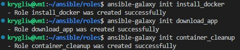

Następnie w każdym nowo utworzonym katalogu przeszedłem do podkatalogu *tasks* oraz do każdego maina wkleiłem odpowiedni fragment wcześniejszego playbooka odpowiadający za taski danej roli. 
Dla *install_docker* było to : 

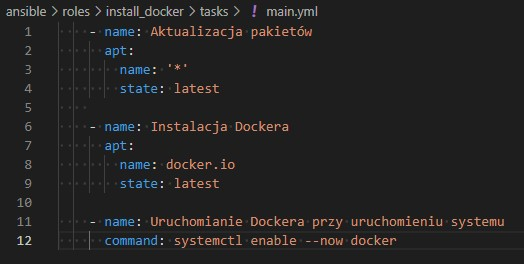

Dla *download_app* było to:

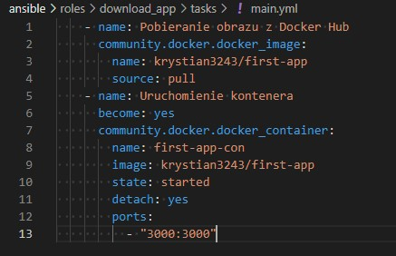

Dla *container_cleanup* było to:

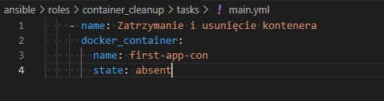

Następnie w katalogu *ansible* gdzie utworzony został katalog *roles* utworzyłem nowego playbooka o nazwie **playbook_roles.yaml** o zawartości: 
```
- name: Zarządzanie kontenerem z użyciem roli
  hosts: Endpoints
  become: yes
  vars:
    ansible_become_pass: hasło_ansible
  roles:
    - install_docker
    - download_app
    - container_cleanup
```
Skopiowałem też z katalogu **ansible_quickstart** plik **inventory.ini** do bieżącego katalogu, oraz uruchomiłem playbooka poleceniem: 
```
ansible-playbook -i inventory.ini playbook_roles.yaml
```
Efekt: 

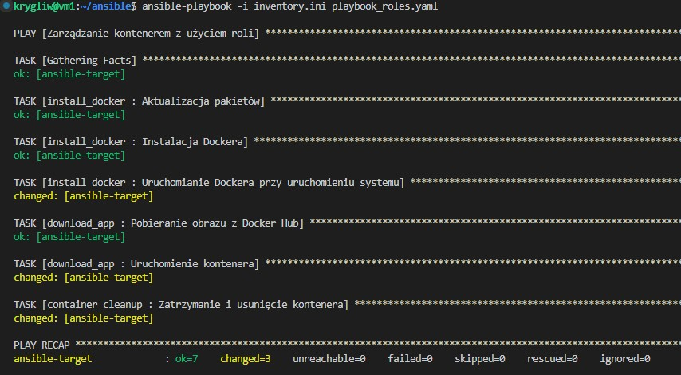


## Zajęcia 9

Drugą częścią tego spawozdania jest zadanie które polega na utworzeniu źródła instalacji nienadzorowanej dla systemu operacyjnego, który będzie hostował nasze oprogramowanie, umożliwiając zautomatyzowaną instalację środowiska testowego dla aplikacji, które nie są uruchamiane w kontenerze, a po uruchomieniu systemu będą hostować nasz program.

### Instalacja nienadzorowana

Na początku przeszedłem do instalacji systemu Fedora (ja wybrałem Fedora 40), stosując instalator sieciowy (netinst). 

Jako źródło instalacji wybrałem typ adresu URL jako lista serwerów lustrzanych i wpisałem adres 
```
http://mirrors.fedoraproject.org/mirrorlist?repo=fedora-40&arch=x86_64:
```
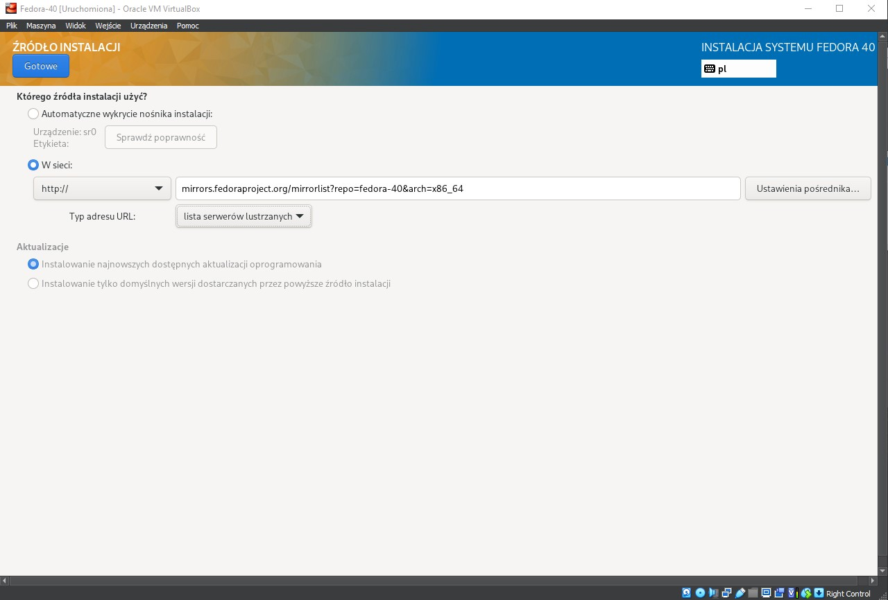


