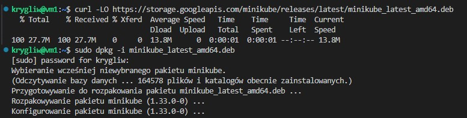
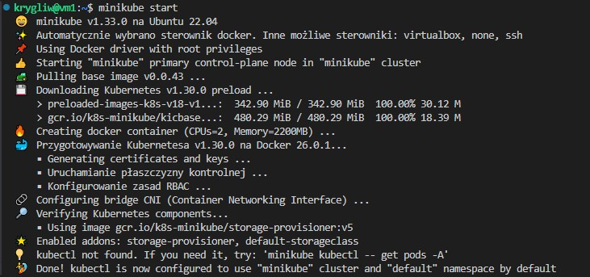
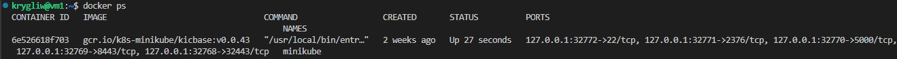
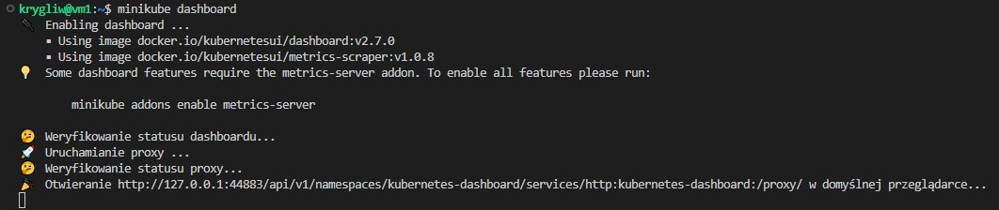
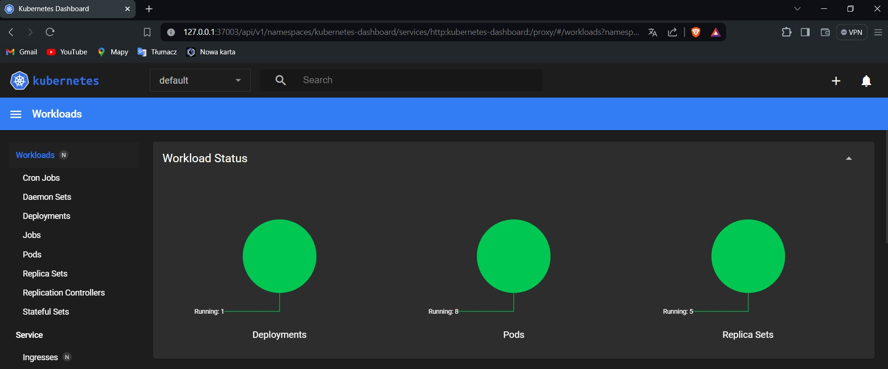

# Sprawozdanie 5
Krystian Gliwa, IO.

## Cel projektu

## Wdrażanie na zarządzalne kontenery: Kubernetes

### Instalacja klastra Kubernetes

#### Zaopatrzenie się w implementację stosu k8s: minikube oraz instalacja

Na początku zajęć przeszedłem do instalacji zgodnie z zamieszczoną na tej stronie instrukcją https://minikube.sigs.k8s.io/docs/start/?arch=%2Flinux%2Fx86-64%2Fstable%2Fdebian+package, pobrałem najnowszą wersje pakietu Minikube dla systemów opartych na architekturze AMD64 (czyli x86_64) w formacie **.deb**, który jest typowy dla dystrybucji Linux opartych na Debianie, takich jak Ubuntu, poleceniem:
```
curl -LO https://storage.googleapis.com/minikube/releases/latest/minikube_latest_amd64.deb
```
oraz rozpocząłem instalacje poleceniem:
```
sudo dpkg -i minikube_latest_amd64.deb
```


#### Zaopatrzenie się w polecenie **kubectl** w wariancie minikube
**kubectl** - jest to narzędzie wiersza poleceń do interakcji z klastrem Kubernetes, najpierw utworzyłem alias *kubectl*, który zawsze uruchamia *minikube kubectl --* zamiast bezpośredniego *kubectl* poleceniem:
```
alias kubectl="minikube kubectl --"
```
A następnie wykorzystując to uruchomiłem polecenie które służy do pobrania i wyswietlenia listy wszystkich podów we wszystkich przestrzeniach nazw w klastrze Kubernetes uruchomionym przez Minikube:
```
kubectl get po -A
```


#### Uruchomienie Kubernetesa

Aby pokazać działający kontener (uruchomić Kubernetesa) użyłem polecenia: 
```
minikube start
```




#### Wymagania sprzętowe

Podczas konfigurowania Minikube istnieją określone wymagania sprzętowe, które należy spełnić, aby zapewnić płynne działanie: 
- 2 CPU lub więcej
- 2 GB wolnej pamięci RAM
- 20 GB wolnego miejsca na dysku
- Połączenie z internetem
-Menadżer kontenerów lub maszyn wirtualnych, taki jak **Docker**, QEMU, Hyperkit, Hyper-V, KVM, Parallels, Podman, VirtualBox lub VMware Fusion/Workstation
Każde kryterium zostało spełnione przez moją maszynę, więc nie były konieczne teraz żadne modyfikacjie.

#### Uruchomienie Dashboard

Dashboard to graficzny interfejs użytkownika (GUI) dla klastra Kubernetes, który uruchamia się w przeglądarce - dzięki wykorzystaniu Visual Studio Code który automatycznie przekierował porty.  Do otworzenia użyłem polecenia:
```
minikube dashboard
```




Dzięki wykorzystaniu Dashboarda moge szybko przeglądać i zarządzać podami, deploymentami i jobami, wykonując takie akcje jak przeglądanie logów, skalowanie, aktualizacje i usuwanie zasobów.

### Analiza posiadanego kontenera
