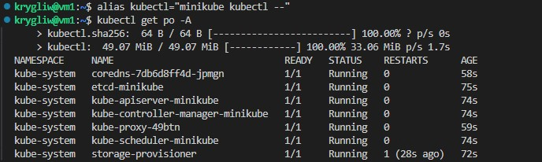

# Sprawozdanie 5
Krystian Gliwa, IO.

## Cel projektu
Celem projektu jest wdrożenie aplikacji opartej na kontenerach na platformie Kubernetes przy użyciu narzędzia Minikube. Projekt obejmuje instalację klastra Kubernetes, uruchomienie kontenerów z wykorzystaniem różnych strategii wdrożenia oraz zarządzanie nimi za pomocą YAML.

## Wdrażanie na zarządzalne kontenery: Kubernetes

### Instalacja klastra Kubernetes

#### Zaopatrzenie się w implementację stosu k8s: minikube oraz instalacja

Na początku zajęć przeszedłem do instalacji zgodnie z zamieszczoną na tej stronie instrukcją https://minikube.sigs.k8s.io/docs/start/?arch=%2Flinux%2Fx86-64%2Fstable%2Fdebian+package, pobrałem najnowszą wersje pakietu Minikube dla systemów opartych na architekturze AMD64 (czyli x86_64) w formacie **.deb**, który jest typowy dla dystrybucji Linux opartych na Debianie, takich jak Ubuntu, poleceniem:
```
curl -LO https://storage.googleapis.com/minikube/releases/latest/minikube_latest_amd64.deb
```
oraz rozpocząłem instalacje poleceniem:
```
sudo dpkg -i minikube_latest_amd64.deb
```


#### Zaopatrzenie się w polecenie **kubectl** w wariancie minikube
**kubectl** - jest to narzędzie wiersza poleceń do interakcji z klastrem Kubernetes, najpierw utworzyłem alias *kubectl*, który zawsze uruchamia *minikube kubectl --* zamiast bezpośredniego *kubectl* poleceniem:
```
alias kubectl="minikube kubectl --"
```
A następnie wykorzystując to uruchomiłem polecenie które służy do pobrania i wyswietlenia listy wszystkich podów we wszystkich przestrzeniach nazw w klastrze Kubernetes uruchomionym przez Minikube:
```
kubectl get po -A
```


#### Uruchomienie Kubernetesa

Aby pokazać działający kontener (uruchomić Kubernetesa) użyłem polecenia: 
```
minikube start
```


#### Wymagania sprzętowe

Podczas konfigurowania Minikube istnieją określone wymagania sprzętowe, które należy spełnić, aby zapewnić płynne działanie: 
- 2 CPU lub więcej
- 2 GB wolnej pamięci RAM
- 20 GB wolnego miejsca na dysku
- Połączenie z internetem
-Menadżer kontenerów lub maszyn wirtualnych, taki jak **Docker**, QEMU, Hyperkit, Hyper-V, KVM, Parallels, Podman, VirtualBox lub VMware Fusion/Workstation
Każde kryterium zostało spełnione przez moją maszynę, więc nie były konieczne teraz żadne modyfikacjie.

#### Uruchomienie Dashboard

Dashboard to graficzny interfejs użytkownika (GUI) dla klastra Kubernetes, który uruchamia się w przeglądarce - dzięki wykorzystaniu Visual Studio Code który automatycznie przekierował porty.  Do otworzenia użyłem polecenia:
```
minikube dashboard
```


Dzięki wykorzystaniu Dashboarda moge szybko przeglądać i zarządzać podami, deploymentami i jobami, wykonując takie akcje jak przeglądanie logów, skalowanie, aktualizacje i usuwanie zasobów.

### Analiza posiadanego kontenera

Z racji tego że moja wcześniej wybrana aplikacja uruchomiona w kontenerze kończyła swoją pracę odrazu, do tego zadania musiałem wybrać inną. Wybrałem **nginx** którego na swojej maszynie zainstalowałem poleceniem:
```
sudo apt update
sudo apt install nginx
```
Sprawdzenie czy **nginx** działa poprawnie:


Następnie po skopiowaniu do katalogu roboczego pliku **/usr/share/nginx/html/index.html** dodałęm do niego odpowiedni fragment kodu który odpowiada za wyświetlenie aktualnej godziny na domyślnej stronie wyświetlanej przez serwer Nginx: 
```
<script>
    function updateTime() {
        var now = new Date();
        var timeString = now.toLocaleTimeString();
        document.getElementById('current-time').textContent = "Current time: " + timeString;
    }

    updateTime();
    setInterval(updateTime, 1000);
</script>
```
Cały plik **index.html**:


Oraz utworzyłem nowy plik **Dockerfile**:
```
FROM nginx
COPY index.html /usr/share/nginx/html/index.html
```
Który bazuje na oficjalnym obrazie **nginx** z Docker Hub i kopiuje lokalny plik *index.html* (który znajduje się w tym samym katalogu co Dockerfile) do obrazu Docker w miejsce */usr/share/nginx/html/index.html.* 

Następnie utworzyłem obraz Docker na podstawie tego pliku Dockerfile poleceniem:
```
docker build -f Dockerfile -t clock-nginx .
```
Potwierdzenie zbudowania obrazu: 


Następnie sprawdziłem czy zbudowany obraz działa poprawnie, uruchomiłem kontener poleceniem: 
```
docker run -d -p 8080:80 --name nginx-clock-container nginx-clock
```
Oraz w przeglądarce wpisałem **http://localhost:8080/** aby sprawdzić czy wyświetlany jest zegar - czy kontener uruchamia się i pracuje. Wszystko działa jak powinno:


Działający obraz trzeba było opublikować w DockerHub. Zalogowałem się poleceniem:
```
docker login
```
Przypisałem nowy tag do obrazu Docker **nginx-clock** poleceniem:
```
docker tag nginx-clock krystian3243/nginx-clock:1.0
```
Oraz opublikowałem go poleceniem: 
```
docker push krystian3243/nginx-clock:1.0
```


Teraz mój obraz znajduje się juz na DockerHub: 


Następnie spawdziłem czy mogę teraz wykorzystać ten obraz z mojego Dockera do utworzenia działającego kontenera, poleceniem (wcześniej musiałem zatrzymać uruchomiony lokalnie kontener):
```
docker run -d --rm -p 8080:80 --name nginx-clock krystian3243/nginx-clock:1.0
```


Ponownie wpisałem w przeglądarce adres **http://localhost:8080/** Oto rezutlat: 


Aplikacja **nginx** z moją modyfikacją wyświetlającą godzine działa poprawnie.

### Uruchamianie oprogramowania

Uruchomiłem kontener na stosie k8s poleceniem:
```
minikube kubectl run -- nginx-clock --image=krystian3243/nginx-clock:1.0 --port=80 --labels app=nginx-clock
```
Co uruchomiło kontener w minikube który został automatycznie ubrany w pod:


Widać to wyżej w uruchomionym dashboardzie, ale spawdziłem tez to za pomocą **kubectl** poleceniem:
```
minikube kubectl -- get pods
```


Następnym krokiem było wyprowadzenie portu celem dotarcia do eksponowanej funkcjonalności, poleceniem:
```
kubectl port-forward pod/clock-nginx 8080:80
```

Następnie sprawdziłem działanie wpisując w przeglądarce adres **lockalhost:8080** jednak tym razem strona nie wczytała się - "Ta witryna jest nieosiągalna". Musiałem przekierować port w Visal Studio Code:


Oraz ponownie spróbowałem uruchomić aplikacje w przeglądarce, teraz juz adres to **lockalhost:8081**:


Output zmienił się po przekierowaniu portu: wypisały się linie: "Handling..."

### Konwersja wdrożenia ręcznego na wdrożenie deklaratywne YAML

Na początku utworzyłem plik **nginx-clock-deployment.yaml** który definiuje jak aplikacja powinna być wdrożona, wzorując się przykładem z strony *kubernetes.io*:
```
apiVersion: apps/v1
kind: Deployment
metadata:
  name: nginx-clock-deployment
  labels:
    app: nginx-clock
spec:
  replicas: 4
  selector:
    matchLabels:
      app: nginx-clock
  template:
    metadata:
      labels:
        app: nginx-clock
    spec:
      containers:
      - name: nginx-clock
        image: krystian3243/nginx-clock:1.0
        ports:
        - containerPort: 80
```
Taki plik wzbogaca mój obraz o 4 replik. Następnie rozpocząłem wdrożenie poleceniem:
```
minikube kubectl -- apply -f nginx-clock-deployment.yaml
```
A następnie sprawdziłem jego stan poleceniem:
```
minikube kubectl rollout status deployments/nginx-clock
```


Sprawdzenie działania w dashboardzie:


### Przygotowanie nowego obrazu

Nową wersje obrazu utworzyłem dopisanie nazwy tej wersji w tytule w wcześniej utworzonym plik **index.html**  A następnie zbudowałem obraz korzystając z istniejącego juz Dockerfila poleceniem:
```
docker build -f Dockerfile -t nginx-clock .
```
Potem otagowałem nowy obraz poleceniem:
```
docker tag nginx-clock krystian3243/nginx-clock:1.1
```
I opublikowałem go w DockerHub poleceniem:
```
docker push krystian3243/nginx-clock:1.1
```
Potwierdzenie wykonania w DockeHub: 


Następnym krokiem było utworzenie wersji której uruchomienie kończy się błędem. Użyłem do tego polecenia:
```
CMD ["false"]
```
Które dodałem na końcu Dockerfila, a w pliku **index.html** zmieniłem numer wersji na 1.2. Cały Dockerfile:
```
FROM nginx
COPY ./index.html /usr/share/nginx/html/index.html
CMD ["false"]
```
Następnie tak jak przy tworzeniu wersji 1.1, zbudowałem obraz, otagowałem go i opublikowałem w DockerHub: 


Sprawdzam działanie w kubernetesie: 


### Zmiany w deploymencie

Kolejnym krokiem było zaktualizowanie pliku YAML z wdrożeniem i przeprowadzenie go ponownie dla nowych przypadków. Na początku zwiększyłem liczbę replik do 8: 
```
spec:
  replicas: 8
```
Następnie rozpocząłem wdrożenie poleceniem:
```
minikube kubectl -- apply -f nginx-clock-deployment.yaml
```
I po tym do monitorowania zmian użyłem polecenia:
```
minikube kubectl rollout status deployments/nginx-clock-deployment
```


I po tym sprawdziłem jak to wygląda w Dashboardzie:


Następnie zmieniłem liczbę replik do 1 po czym, powtórzyłem powyzsze kroki: 


Dashboard:


Następnie zminiejszyłem liczbę replik do 0, oraz powtórzyłem kroki jak wcześniej: 
Dashboard:


Kolejnym krokiem było zastosowanie nowej wersji obrazu, aby to wykonać w pliku YAML zmieniłem wersję z **nginx-clock:1.0** na **nginx-clock:1.1** oraz ustawiłem liczbę replik na 4.


Dashboard:


Widać że stare repliki są aktualizowane.

Następnie zmieniłem w pliku YAML wersje na starszą z 1.1 na 1.0, a oto co otrzymałem: 


Następnie sprawdziłem liste zmian deploymentu poleceniem:
```
minikube kubectl rollout history deployment/nginx-clock-deployment
```


Teraz na podstawie kolumny REVISION możemy wybrać wersje aplikacji do której chcemy wrócić, a robimy to poleceniem:
```
minikube kubectl rollout undo deployment/nginx-clock-deployment --to-revision=10
```
Lub poprostu gdy chcemy cofnąć się do poprzedniej wersji (tutaj-1.1) , użyjemy polecenia:
```
minikube kubectl rollout undo deployment/nginx-clock-deployment
```


### Kontrola wdrożenia 

Kolejnym krokiem było napisanie skryptu weryfikującego, czy wdrożenie "zdążyło" się wdrożyć w 60 sekund. Treść: 
```
#!/bin/bash

DEPLOYMENT_NAME="nginx-clock-deployment"
TIMEOUT=60

minikube kubectl -- apply -f ./nginx-clock-deployment.yaml

minikube kubectl get deployments 

if minikube kubectl -- rollout status deployment/$DEPLOYMENT_NAME --timeout=${TIMEOUT}s > /dev/null 2>&1; then
echo "Wdrożenie wykonało się w czasie poniżej 60 sekund."
exit 0
else
echo "Wdrożenie nie wykonało się w czasie poniżej 60 sekund."
exit 1
fi
```
Skrypt ten automatyzuje wdrażanie aplikacji w Kubernetesie przy użyciu minikube. Po zastosowaniu konfiguracji z pliku clock-deployment.yaml, sprawdza status wdrażania i w zależności od wyniku, informuje, czy wdrożenie zakończyło się pomyślnie w określonym czasie, czy nie.
Następnie dodałem uprawnienia do wykonywania dla tego pliku poleceniem:
```
chmod +x skrypt.sh
```
oraz uruchomiłem go dla wersji 1.1: 


Aby sprawdzić czy poprawnie działa uruchomiłem go również dla wersji 1.2 czyli wersja która zwraca błąd: 


Po czym cofnąłem go do poprzedniej, działającej wersji korzystając z polecenia **rollout undo**:


### Strategie wdrożenia

Kolejnym krokiem było utworzenie trzech wersji wdrożeń stosując następujące strategie wdrożeń:
- Recreate
- Rolling Update (z parametrami maxUnavailable > 1, maxSurge > 20%)
- Canary Deployment workloadt

#### Recreate
Pierwsza z nich - recreate polegała na usunięciu wszystkich starych replik przed uruchomieniem nowych. Oznacza to, że podczas wdrożenia nie ma jednoczesnego działania starych i nowych wersji aplikacji. Aby ją zastosować utworzyłem nowy plik **recreate.yaml** o treści: 
```
apiVersion: apps/v1
kind: Deployment
metadata:
  name: nginx-clock-deployment
  labels:
    app: nginx-clock
    version: 1.0
spec:
  replicas: 4
  strategy: 
    type: Recreate
  selector:
    matchLabels:
      app: nginx-clock
  template:
    metadata:
      labels:
        app: nginx-clock
    spec:
      containers:
      - name: nginx-clock
        image: krystian3243/nginx-clock:1.1
        ports:
        - containerPort: 80
```
Typ strategii *Recreate* został określony w *spec*.

Następnie rozpoczynam wdrożenie poleceniem:
```
minikube kubectl -- apply -f recreate.yaml
```
Oraz monitoruje je poleceniem:
```
minikube kubectl rollout status deployments/nginx-clock-deployment-recreate
```


#### Rolling Update
Strategia ta polega na stopniowym zastępowaniu starych replik nowymi. Aby ją zastosować utworzyłem nowy plik **rolling.yaml** o treści: 
```
apiVersion: apps/v1
kind: Deployment
metadata:
  name: nginx-clock-deployment-rolling
  labels:
    app: nginx-clock
spec:
  replicas: 4
  strategy:
    type: RollingUpdate
    rollingUpdate:
      maxUnavailable: 2
      maxSurge: 30%
  selector:
    matchLabels:
      app: nginx-clock
  template:
    metadata:
      labels:
        app: nginx-clock
    spec:
      containers:
      - name: nginx-clock
        image: krystian3243/nginx-clock:1.0
        ports:
        - containerPort: 80
```
Dla tej strategi przyjąłem parametry: *maxUnavailable: 2*(określa maksymalną liczbę replik, które mogą być niedostępne (niedziałające) w trakcie aktualizacji) i *maxSurge: 30%*(określa maksymalną liczbę nowych replik, które mogą zostać utworzone powyżej liczby określonej w specyfikacji replicas w trakcie aktualizacji). Następnie rozpoczynam wdrożenie poleceniem:
```
minikube kubectl -- apply -f rolling.yaml
```
Oraz monitoruje je poleceniem:
```
minikube kubectl rollout status deployments/nginx-clock-deployment-rolling
```


#### Canary Deployment workloadt
Strategia ta polega na wdrożeniu nowej wersji aplikacji tylko na kilku replikach, aby przetestować jej działanie. Jeśli nowa wersja działa poprawnie, stopniowo zwiększa się jej udział w całkowitym ruchu. Aby ją zrealizowąc utworzyłem nowy plik **canary.yaml** do którego dodałem etykiety "track: canary" aby umożliwić Deployment oraz Podom włączenie do Canary Deployment, zmieniłem też liczbę replik na 1. Cały plik: 
```
apiVersion: apps/v1
kind: Deployment
metadata:
  name: nginx-clock-deployment-canary
  labels:
    app: nginx-clock
    track: canary
spec:
  replicas: 1
  selector:
    matchLabels:
      app: nginx-clock
      track: canary
  template:
    metadata:
      labels:
        app: nginx-clock
        track: canary
    spec:
      containers:
      - name: nginx-clock
        image: krystian3243/nginx-clock:1.1
        ports:
        - containerPort: 80
```
Rozpoczynam wdrożenie poleceniem:
```
minikube kubectl -- apply -f canary.yaml
```
Oraz monitoruje je poleceniem:
```
minikube kubectl rollout status deployments/nginx-clock-deployment-canary
```


Wszystkie pody:


Podsumowanie:
- Recreate: Całkowita zamiana wszystkich starych replik nowymi jednocześnie.
- Rolling Update: Stopniowa aktualizacja replik, gdzie stare są zastępowane nowymi na bieżąco.
- Canary Deployment:  Wprowadzenie nowej wersji aplikacji na niewielkiej liczbie replik do testowania przed pełnym wdrożeniem.

Ostatnim krokiem było użycie serwisów - w Kubernetes jest to metoda udostępniania aplikacji sieciowej działającej jako jeden lub więcej Podów w klastrze. Utworzyłem nowy plik **service.yaml** o następującej treści: 
```
apiVersion: v1
kind: Service
metadata:
  name: nginx-clock-service
spec:
  selector:
    app: nginx-clock
  ports:
    - protocol: TCP
      port: 80
      targetPort: 80
```

Następnie wykonałem go poleceniem:
```
minikube kubectl -- apply -f service.yaml
```
Oraz przekierowałem port poleceniem:
```
minikube kubectl port-forward service/nginx-clock-service 3000:80
```
Oraz dodałem port 3000 w VScode:


Po czym w przeglądarce wpisałem adres **localhost:3000** aby sprawdzić czy zadziałało to poprawnie:


