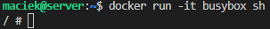
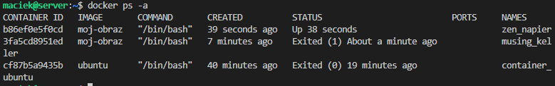

*Maciej Dziura*
*IO 409926*

**CEL PROJEKTU**
Przetestowanie gotowości środowiska, zdobycie podstawowej wiedzy na temat funkcji gita oraz zrozumienie zasad działania Docker'a. Zagłębienie się w kluczowe aspekty, takie jak używanie kluczy SSH do łączenia się z repozytoriami zdalnymi, tworzenie i zarządzanie gałęziami oraz korzystanie z hooków gita do automatyzacji określonych działań. Ponadto, skupienie się na instalacji, konfiguracji i uruchamianiu kontenerów Docker'a, co pozwoli  lepiej zrozumieć izolację aplikacji oraz sposób, w jaki Docker ułatwia zarządzanie środowiskami deweloperskimi.

**WYKONANE KROKI**
**GIT**

**1. Zainstalowanie klienta Git i obsługi kluczy SSH**
Aby zainstalować klienta Git i obsługę kluczy korzystamy z menedżera pakietów APT (Advanced Package Tool), który jest wbudowany w system Ubuntu. Aktualizujemy listę dostępnych pakietów, wykonując następujące polecenie:

```sudo apt update```

Po zakończeniu aktualizacji instalujemy klienta Git, wpisując:

```sudo apt install git```

Po zakończeniu instalacji sprawdzamy, czy Git został pomyślnie zainstalowany, wpisując:

```git --version```


Następnie instalujemy obsługę SSH, wpisując:

```sudo apt install openssh-client```


Po zakończeniu instalacji upewniamy się, że obsługa kluczy SSH została zainstalowana, wpisując:

```ssh -V```

**2. Klonujemy [repozytorium przedmiotowe] za pomocą HTTPS i [personal access token]**
Wchodzimy na stronę repozytorium na Githubie i z zakładki HTTPS kopiujemy potrzebny link.


Potrzebujemy jeszcze odpowiednio wygenerowanego tokenu.
Robimy to w ustawieniach konta na Githubie -> Developer settings -> Personal access tokens
Teraz, abyśmy mogli sklonować repozytorium musimy jeszcze potwierdzić naszą tożsamość poprzez zapisanie naszych danych:

```git config --global user.email "dmaciej@student.agh.edu.pl"\n```

```git config --global user.name "dmaciej409926"```

Klonujemy nasze repozytorium korzystając z wcześniej skopiowanego linku:

```git clone https://github.com/InzynieriaOprogramowaniaAGH/MDO2024_INO.git```

**3. Klonujemy [repozytorium przedmiotowe] za pomocą utworzonego klucza SSH.**

- Tworzymy dwa klucze SSH w tym jeden zabezpieczony hasłem

Generujemy pierwszy klucz ed25519 bez hasła (pole na hasło pozostawiamy puste). Korzystamy z komendy:

```ssh-keygen -t ed25519 -f ~/.ssh/id_ed25519```


Generujemy drugi klucz ecdsa już z hasłem:

```ssh-keygen -t ecdsa -f ~/.ssh/id_ecdsa```


- Konfigurujemy klucz SSH jako metodę dostępu do GitHuba

Wygenerowane klucze pojawiają nam się w miejscu zapisu w wersji publicznej (.pub) jak i w prywatnej. Możemy skonfigurować nasz klucz z hasłem na platformie Github. Wykonujemy to poprzez skopiowanie zawartości publiczego klucza (zawartość wyświetlamy za pomocą konsoli i komendy cat):


Wklejamy zawartość w odpowiednie miejsce na platformie Github. W ustawienach konta wchodzimy w zakładkę SSH and GPG keys i dodajemy klucz:


- Klonujemy repozytorium z wykorzystaniem protokołu SSH

Wchodzimy na stronę repozytorium na Githubie i kopiujemy zawartośc zakładki SSH


Klonujemy nasze repozytorium (będzie wymagane podanie hasła utworzonego podczas generowania klucza):

```clone git git@github.com:InzynieriaOprogramowaniaAGH/MDO2024_INO.git```


**4. Przełączamy się na gałąź ```main```, a potem na gałąź swojej grupy.**
Wchodzimy do folderu i sprawdzamy wszystkie istniejące gałęzie przy pomocy komendy:

```git branch --all```


Widzimy gałąź naszej grupy GCL1, na którą przełączamy się za pomocą komendy:

```git checkout GCL1```

Sprawdzamy na jakiej gałęzi się znajdujemy:

```git branch```


**5. Tworzymy gałąź o nazwie "inicjały & nr indeksu".

Gdy już znajdujemy się na gałęzi grupy możemy stworzyć swoją gałąź na której będziemy dokonywać zmian, wykonujemy to w ten sposób:

```git checkout -b MD409926```

Po jej stworzeniu od razu powinniśmy się na niej znaleźć, sprawdzamy czy tak się stało:

```git branch```


**6. Rozpoczynamy pracę na nowej gałęzi**

- W katalogu właściwym dla grupy tworzymy nowy katalog, także o nazwie "inicjały & nr indeksu"
Na swojej gałęzi przechodzimy do folderu grupy (~/MDO2024_INO/INO/GCL1) i tam tworzymy swój folder o identycznej nazwie do naszej gałęzi:

```mkdir MD409926```

- Napisanie Git hook'a - skryptu weryfikującego, że każdy nasz "commit message" zaczyna się od "twoje inicjały & nr indexu".
Na podstawie przykładowych git hooków znajdujących się w folderze .git/hooks tworzymy skrypt (commit-msg) sprawdzający, czy każdy nasz commit zaczyna się od naszych inicjałów i numeru ideksu (MD409926):

```nano commit-msg```

- Kopiujemy go we właściwe miejsce, tak by uruchamiał się za każdym razem kiedy robimy commita

Aby git hook działał prawidłowo należy skopiować go do folderu .git/hooks:

cp ~/MDO2024_INO/INO/GCL1/MD409926/commit-msg ~/MDO2024_INO/.git/hooks

Należy naszemu git hookowi nadać uprawnienia, aby mógł być wykonywany, używamy komendy:

```chmod +x ~/MDO2024_INO/.git/hooks/commit-msg```

Od teraz będzie uruchamiany przy każdym naszym commicie. Możemy teraz przetestować nasz skrypt.

Błędny commit:


Prawidłowy commit:


- Umieszczamy treść githooka w sprawozdaniu.


- W katalogu dodajemy plik ze sprawozdaniem
W naszym katalogu tworzymy katalog przeznaczony na sprawozdanie, a w nim katalog na screenshoty potrzebne do sprawozdania:

```mkdir Spr_1```

```mkdir SS```

I teraz w katalogu Spr_1 dodajemy sprawozdanie w formacie "Markdown":

```nano sprawozdanie.md```


- Dodajemy zrzuty ekranu (jako inline)

Dodajemy zrzuty ekranu jako zdjęcia - inline. Używamy w tym celu :

``````

W naszym przypadku ścieżka będzie w postaci:

``````

- Wysyłamy zmiany do zdalnego źródła
Do wysłania zmian wykorzystujemy 3 komendy:

Najpierw dodajemy jakie zmiany zaszły (dodanie/edycja plików):

```git add```


Następnie tworzymy commit opisujący dodane/zmienione pliki:

```git commit```


Na końcu wypychamy nasze zmiany do źródła - w naszym przypadku do repozytorium na GitHubie:

```git push```


- Próbujemy wciągnąć naszą gałąź do gałęzi grupowej

Przechodzimy na gałąź naszej grupy:

```git checkout GCL1```

```git push```

```git merge MD409926```


- Aktualizujemy sprawozdanie i zrzuty o ten krok i wysyłamy aktualizację do zdalnego źródła (na naszej gałęzi)
Wykorzystamy do tego ponownie 3 polecenia:

```git add ./```

```git commit -m "MD409926 - sprawozdanie"```

```git push```

**WYKONANE KROKI**
**DOCKER**

**1. Zainstalowanie Docker'a w systemie linuksowym**
Aktualizujemy listę pakietów apt, aby mieć pewność, że pobierane będą najnowsze wersje pakietów:

```sudo apt update```


Instalujemy pakiety (jeśli jeszcze ich nie mamy), które pozwalają na korzystanhie z repozytoriów przez HTTPS:

```sudo apt install apt-transport-https ca-certificates curl software-properties-common``` 


Dodajemy klucz GPG z oficjalnego repozytorium Dockera:

```curl -fsSL https://download.docker.com/linux/ubuntu/gpg | sudo apt-key add -```


Dodajemy repozytorium Docker'a do APT:

```sudo add-apt-repository "deb [arch=amd64] https://download.docker.com/linux/ubuntu focal stable"```


Upewnaimy się że instalaja nastąpi z repozytorium Docker'a, anie z domyślnego Ubuntu. Powinniśmy zobaczyć taki wynik:

```apt-cache policy docker-ce```


Zauważmy, że docker-ce nie jest zainstalowany, ale kandydat do instalacji pochodzi z repozytorium Docker dla Ubuntu 20.04 (focal).
Finalnie możemy zainstalować Docker'a:

```sudo apt install docker-ce```


Sprawdźmy czy Docker działa:

```sudo systemctl status docker```


Jeśli wszystko działa poprawnie możemy wyświetlić komendy z których będziemy korzystać:

```docker```


Możemy dodać siebie do grupy docker, aby uniknąć potrzeby używania komendy sudo przy każdym uduchamianiu poleceń Docker'a (zmiana może wymagać zrestartowania systemu):

```sudo usermod -aG docker maciek```


**2. Zarejestrowanie się w [Docker Hub](https://hub.docker.com/)**
Aby zarejestrować się w Docker Hub, postępujemy zgodnie z poniższymi krokami:
- Otwieramy przeglądarkę internetową i przechodzimy do strony Docker Hub.
- Na stronie głównej Docker Hub klikamy przycisk 'Sign Up', aby rozpocząć proces rejestracji.
- Możemy zarejestrować się używając konta Github lub wypełniamy formularz rejestracyjny, podając wymagane informacje.
- Klikamy przycisk "Sign Up", aby zakończyć proces rejestracji.
- Po zakończeniu rejestracji sprawdzamy swoją skrzynkę odbiorczą, aby potwierdzić adres e-mail poprzez link aktywacyjny.
- Po potwierdzeniu adresu e-mail będziemy mogli zalogować się do naszego konta na Docker Hub i korzystać z jego funkcji, takich jak przesyłanie obrazów, udostępnianie kontenerów i zarządzanie repozytoriami.

W terminalu możemy zalogować się używając naszego nowego konta:

```docker login```


**3. Pobranie obrazów `hello-world`, `busybox`, `ubuntu` i  `mysql`**
Następnie przechodzimy do instalowania wymaganych obrazów:

```docker pull hello-world```

```docker pull busybox```

```docker pull ubuntu```

```docker pull mysql```

Wyświetlmy pobrane obrazy:

```docker images```


**4. Uruchomienie kontenera z obrazu `busybox`**

- Pokazanie efektu uruchomienia kontenera
Użyjmy polecenia uruchamiającego kontener z obrazu i zmieńmy mu nazwę:

```docker run -d --name busybox-container busybox```


Z racji, że kontener nie miał zadania do wykonania to od razu po starcie zakończył się i nie będzie go widać w aktywnych kontenerach:

```docker ps```


Sprawdźmy czy tak się stało:

```docker ps -a```


Informacja w STATUS mówi, że kontener zakończył swoje działanie.

- Podłączenie się do kontenera **interaktywnie** i wywołanie numeru wersji
Aby podłączyć się do kontenera interaktywnie użyjemy polecenia:

```docker run -it busybox sh```



Powoduje ono uruchomienie kontenera na podstawie podanego obrazu. Opcja -it pozwala na interaktywne uruchomienie kontenera, co oznacza, że ​​możemy komunikować się z kontenerem za pośrednictwem terminala. Polecenie 'sh' to polecenie, które ma zostać uruchomione w kontenerze, w tym przypadku Bourne Shell.

Teraz, aby sprawdzić numer wersji użyjemy:

```busybox | grep "BusyBox"```


Wygląda na to, że nasza wersja BusyBox to v1.36.1, wydana 18 maja 2023 roku.

**5. Uruchomienie "systemu w kontenerze" (kontener z obrazu `ubuntu`)**
Pierwszym krokiem będzie uruchomienie systemu w kontenerze za pomocą komendy:

```docker run -it --name container_ubuntu ubuntu```


Sprawdźmy działanie naszego kontenera:

```docker ps```


- Zaaktualizowanie pakietów
Następnie zaaktualizujemy pakiety w naszym systemie w kontenerze:

```apt-get update && apt-get upgrade -y```


- Zaprezentowanie `PID1` w kontenerze i procesów dockera na hoście
Możemy teraz wyświetlić `PID1` w naszym kontenerze:

```ps aux```

 

Procesy na hoście wyświetlamy w ten sam sposób:

```ps aux```


Procesy związane z Dockerem na hoście można zazwyczaj znaleźć jako procesy o nazwie dockerd oraz containerd. Możemy je zidentyfikować w wyniku polecenia ps aux, ponieważ będą miały wpisane w kolumnie COMMAND odpowiednio /usr/bin/dockerd i /usr/bin/containerd.
W naszym wyjściu przypadku występują następujące procesy związane z Dockerem:
dockerd: Proces odpowiedzialny za uruchamianie i zarządzanie kontenerami Docker.
containerd: Proces odpowiedzialny za kontrolę kontenerów na poziomie niskiego poziomu.

- Wyjście
Możemy wyjść z kontenera, przy pomocy komendy:

```exit```

**6. Stworzenie własnoręcznie, zbudowanie i uruchomienie prostego pliku `Dockerfile` bazującego na wybranym systemie i sklonowanie naszego repozytorium.**

- Kierowanie się [dobrymi praktykami] i upewnienie się że obraz będzie maił `git`-a
Tworzymy nasz Dockerfile:

```nano Dockerfile```


- Uruchomienie w trybie interaktywnym i zweryfikowanie, że jest tam ściągnięte nasze repozytorium
Zbudujmy obraz w trybie interaktywnym:

```docker build -t moj-obraz```


Pokażmy, że nasze repozytorium zostało sklonowane:


**7. Pokazanie uruchomionych ( != "działających" ) kontenerów, wyczyszczenie ich.**
Pokazujemy uruchomione kontenery poleceniem:

```docker ps```


I tych niedziałających:

```docker ps -a```



**8. Wyczyszczenie obrazów**
Zatrzymujemy działające kontenery, usuwamy je i czyścimy obrazy używając kolejno komend:

```docker stop $(docker ps -a -q)```

```docker rm $(docker ps -a -q)```

```docker rmi $(docker images -a -q)```


**9. Dodanie stworzonego pliku `Dockerfile` do folderu `Spr_1` w repozytorium.**
Będąc na swojej gałęzi przekopiowujemy Dockerfile do swojego folderu:

```cp ~/Dockerfile ~/MDO2024_INO/INO/GCL1/MD409926/Spr_1```


**10. Wystawienie `Pull Request` do gałęzi grupowej jako zgłoszenie wykonanego zadania.**
