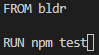
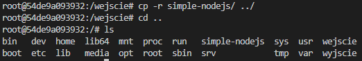

*Maciej Dziura*
*IO 409926*

**CEL PROJEKTU**
Zautomatyzowanie operacji związanych z budową, testowaniem i uruchamianiem aplikacji przy użyciu kontenerów Docker. Ten proces pozwoli nam na skuteczne wdrażanie aplikacji oraz szybką reakcję na zmiany kodu poprzez ciągłe testowanie i wdrażanie.
Pierwszym krokiem jest przeprowadzenie operacji budowy, testowania i uruchamiania aplikacji na lokalnej maszynie. Po upewnieniu się, że aplikacja działa poprawnie, przechodzimy do tworzenia plików Dockerfile, które pozwolą na automatyzację tych procesów w kontenerach.
Pozwala to osiągnąć efekt, w którym po uruchomieniu polecenia `docker run`, obrazy ze zdefiniowanym procesem build lub run tworzą się, ale natychmiastowo kończą swoje wykonanie z kodem exit 0. Kontenery te służą bowiem jedynie do zbudowania i przetestowania aplikacji, a nie do jej uruchomienia.
Dzięki takiemu podejściu uzyskujemy dużą możliwość automatyzacji całego procesu budowania, testowania i wdrażania aplikacji. Możemy łatwo integrować nasz proces CI/CD z systemami zarządzania wersjami kodu oraz narzędziami do monitorowania i zarządzania zasobami.

W drugiej części projektu zapoznajmy się z pojęciem woluminu oraz jego obsługą w kontekście kontenerów Docker. W trakcie tego procesu będziemy tworzyć dwa woluminy:
- pierwszy będzie służył do budowy naszego oprogramowania
- drugi będzie przechowywał skopiowaną zawartość zbudowanego projektu
Dodatkowo, zajmiemy się uruchomieniem serwera iperf, połączeniem z nim kontenera. Na koniec przeprowadzimy instalację Jenkinsa, narzędzia automatyzującego procesy CI/CD.

**WYKONANE KROKI - 3 ZAJĘCIA**
**WYBÓR OPROGRAMOWANIA NA ZAJĘCIA**

**1. Znalezienie repozytorium z kodem dowolnego oprogramowania, które:**
- dysponuje otwartą licencją
- jest umieszczone wraz ze swoimi narzędziami Makefile tak, aby możliwe był uruchomienie w repozytorium czegoś na kształt make build oraz make test. Środowisko Makefile jest dowolne. Może to być automake, meson, npm, maven, nuget, dotnet, msbuild...
- Zawiera zdefiniowane i obecne w repozytorium testy, które można uruchomić np. jako jeden z targetów Makefile'a. Testy muszą jednoznacznie formułować swój raport końcowy (gdy są obecne, zazwyczaj taka jest praktyka)

Do wykonania tego zadania wybrałem poniższe repozytorium (oryginał):

```https://github.com/steve-sienk/simple-nodejs-jest.git```

Program jest napisany z wykorzystaniem Node.js, więc będziemy używać ```npm``` zamiast ```make```. Posiada on kilka prostych testów jednak nie ma skryptu uruchamiającego aplikację ```start```. Repozytorium skopiowałem i odpowiednio uzupełniłem, aby móc uruchomić program poleceniem ```npm start```.


Teraz będziemy korzystać ze zmienionego repozyturium (zaaktualizowana wersja):

```https://github.com/dmaciej409926/simple-nodejs.git```

Teraz komenda ```npm run``` powinna uruchomić program, który wyświetli komunikat, że aplikacja działa i odliczyć od 1 do 10.

**2. Sklonowanie niniejszego repozytorium, przeprowadzenie buildu programu (doinstalowanie wymaganych zależności).**

Najpierw musimy sklonować nasze repozytorium, za pomocą komendy (potrzebujemy do tego git'a, który powinien być na poprzednich zajeciach):

```git clone https://github.com/dmaciej409926/simple-nodejs.git```


Następnie przechodzimy do folderu ```simple-nodejs``` i instalujemy potrzebne zależnośći:

```cd simple-nodejs```

```npm install```


**3. Uruchomienie testów jednostkowych dołączonych do repozytorium**

Jeśli instalacja przebiegła poprawnie możemy wykonać testy jednostkowe:

```npm test```

Jeśli program przeszedł testy powinniśmy otrzymać, taki wydruk:


Spróbujmy także odpalić strypt ```start``, króry dopisałem do repozytorium:

```npm start```

Powinniśmy otrzymać:


**WYKONANE KROKI**
**PRZEPROWADZENIE BUILDU W KONTENERZE**

**1. Wykonanie buildu i testów wewnątrz wybranego kontenera bazowego (Tj. wybór wystarczającego kontenera, np ubuntu dla aplikacji C lub node dla Node.js)**
- Uruchomienie kontenera
- Podłączenie do niego TTY celem rozpoczęcia interaktywnej pracy
- Zaopatrzenie kontenera w wymagania wstępne (jeżeli proces budowania nie robi tego sam)

Uruchommy kontener, w którym będziemy pracować:

```docker run -it --rm node bash```


Obraz został pobrany i utworzył się kontener.

- Sklonowanie repozytorium
- Uruchomienie buildu

Powtarzamy to co robiliśmy lokalnie, więc klonujemy repozytorium i przechodzimy do katalogu ```simple-nodejs``` i instalujemy potrzebne pakiety:

```git clone https://github.com/dmaciej409926/simple-nodejs.git```

```npm install```


- Uruchomienie testów
Jeśli instalacja przebiegła poprawnie możemy wykonać testy jednostkowe:

```npm test```

Jeśli program przeszedł testy powinniśmy otrzymać, taki wydruk:


Spróbujmy także odpalić strypt ```start```:

```npm start```

Powinniśmy otrzymać:

 

**2. Stworzenie dwóch (+ dodatkowy) plików Dockerfile automatyzujących kroki powyżej, z uwzględnieniem następujących kwestii**
- Kontener pierwszy ma przeprowadzać wszystkie kroki aż do builda
BLDR.Dockerfile:


- Kontener drugi ma bazować na pierwszym i wykonywać testy
TSTR.Dockerfile:



- Kontener trzeci ma bazować na pierwszym i uruchamiać program (dodatkowy)
RNR.Dockerfile:


**3. Wykazanie, że kontener wdraża się i pracuje poprawnie. Pamiętając o różnicy między obrazem a kontenerem. Co pracuje w takim kontenerze**

Zbudujmy najpierw obraz buildera, korzystając z polecenia:

```docker build -t bldr -f ./BLDR.Dockerfile .```


Sprawdźmy, czy operacja zakończyła się poprawnie za pomocą komendy:

```docker run bldr```

```echo $?```

Kod powrotu 0 po wykonaniu polecenia ```docker run bldr``` oznacza, że operacja zakończyła się pomyślnie. W systemach Unix/Linux kod powrotu 0 sygnalizuje, że wykonane polecenie zakończyło się bez żadnego błędu. W przypadku `docker run`, kod powrotu 0 oznacza, że kontener został uruchomiony poprawnie i zakończył swoje działanie bez żadnych problemów.


Teraz postąpimy podobnie z obrazem testującym:

```docker build -t tstr -f ./TSTR.Dockerfile .```


Sprawdźmy, czy operacja zakończyła się poprawnie:

```docker run tstr```

```echo $?```

Jeśli otrzymamy 0 wszystko wykonało się prawidłowo:


Uruchomienie powyższych kontenerów nie daje żadnego efektu, ponieważ nie posiadają żadnych poleceń oprócz zbudowania i przetestowania oprogramowania. Na koniec możemy zbudować dodatkowy obraz, który będzie uruchamiał aplikację odliczającą od 1 do 10:

```docker build -t rnr -f ./RNR.Dockerfile .```


Sprawdźmy, czy operacja zakończyła się poprawnie i czy program się uruchomi:

```docker run tstr```

Jeśli otrzymamy informacje o zadziałaniu aplikacji i liczby od 1 do 10 wszystko wykonało się prawidłowo:


Uruchomiony kontener możemy podejrzeć za pomocą polecenia:

```docker ps```


Na sprawdzenie tego mamy ok 10s od startu kontenera, bo po tym czasie aplikacja kończy swoje działanie.

**WYKONANE KROKI - 4 ZAJĘCIA**

**1. Zachowywanie stanu:**

- Przygotowanie woluminu wejściowego i wyjściowego, o dowolnych nazwach

Aby stworzyć nasz volumin wejściowy, który przechowuje dane z Docker'a użyjemy komendy:

```docker volume create wejsciowy```


Przy tworzeniu voluminu wyjściowego postępujemy identycznie:

```docker volume create wyjsciowy```


Możemy upewnić się, czy nasze voluminy zostały stworzone poprawnie:

```docker volume ls```


-  Podłączenie ich do kontenera bazowego, z którego rozpoczynano poprzednio pracę

Podłączając nasze voluminy skorzystamy z ```--mount```, nazwę voluminu podajemy za przy pomocy ```source```, a jego lokalizację za pomocą ```target```:

```docker run -it --rm --name node1 --mount source=wejsciowy,target=/wejscie  --mount source=wyjsciowy,target=/wyjscie node bash```


Powinny powstać dwa foldery o podanych nazwach:


- Uruchomienie konteneru, zainstalowanie niezbędnych wymagań wstępnych (jeżeli istnieją), ale bez gita

Git (nie będziemy po prostu z niego korzystać) jak i nasze wymagania od razu znajdują się w naszy nodzie, więc nie musimy nic doinstalowywać.  

- Sklonowanie repozytorium na wolumin wejściowy

Jako nie możemy korzystać z gita w naszym kontenerze to najprostrzym sposobem na skolowanie repozytorium będzie poprostu stworzenie drugiego tymczasowego kontenera. W nim sklonujemy nasze repozytorium do podłączonego voluminu wejściowego.

Zaczniemy od stworzenia tymczasowego kontenera:

```docker run -it --rm --name tmp_node --mount source=wejsciowy,target=/wejscie node bash```

W nim przechodzimy do naszego voluminu wejściowego i klonujemy repozytorium:

```git clone https://github.com/dmaciej409926/simple-nodejs.git```


- Uruchomienie buildu w kontenerze

W naszym pierwszym kontenerze możemy już wykonać build:

```npm install```


Skopiujmy repozytorium do kontenera z voluminu:

```cp -r simple-nodejs/```



- Zapisanie powstałych/zbudowanych plików na woluminie wyjściowym, tak by były dostępne po wyłączniu kontenera.

Powstałe pliki możemy skopiować do voluminu wyjściowego za pomocą komendy:

```cp -r simple-nodejs/node_modules/ wyjscie/```


Teraz możemy sprawdzić zapisane pliki poza kontenerem. Najpierw musiny sprawdzić ścieżkę naszego voluminu za pomocą komendy:

```docker volume inspect wyjsciowy```


I teraz możemy sprawdzić zawartość:

```sudo ls /var/lib/docker/volumes/wyjsciowy/_data```


Z voluminem wejściowym postępujemy identycznie:

```docker volume inspect wejsciowy```

```sudo ls /var/lib/docker/volumes/wejsciowy/_data```


- Ponowienie operacji, ale klonowanie na wolumin wejściowy przeprowadzone zostanie wewnątrz kontenera (użyj gita w kontenerze)

```git clone https://github.com/dmaciej409926/simple-nodejs.git ./wejscie/drugie_repozytorium```


- Przedyskutowiane możliwość wykonania ww. kroków za pomocą docker build i pliku Dockerfile.

Wszystko co wykonaliśmy powyżej jest możlie także za pomocą pliku Dockerfile. Tak jak na zajęciach 3 musimy odtworzyć wszystkie kroki zapisując je w Dockerfile:


Zbudujmy zapomocą tego Dockerfile'a:

```docker build -f ../test1/VOLUMINE_BLDR.Dockerfile -t v_node .```


Sprawdzmy czy wszystko wykonało się prawidłowo uruchamiając powstały kontener:

```docker run -it --rm --mount source=wejsciowy,target=/wejscie --mount source=wyjsciowy,target=/wyjscie v_node bash```


**2. Eksponowanie portu:**

- Uruchomienie wewnątrz kontenera serwera iperf (iperf3)

Uruchommy kontener ubuntu na którym będziemy pracować:

```docker run -it --rm --name iperf_server ubuntu bash```


Instalujemy na nim iperf3 (narzędzie testujące szybkośc połączenia) i uruchamiamy serwer:

```apt-get update```

```apt-get install -y iperf3```

```iperf3 -s```


- Połączenie się z nim z drugiego kontenera, zbadanie ruchu

W drugim terminalu sprawdzamy ID kontenera i za jego pomocą sprawdzamy adres działającego serwera:

```docker ps -a```


```docker inspect -f'{{range .NetworkSettings.Networks}}{{.IPAddress}}{{end}}' 41774488630c```


Podobnie tworzymy drugi kontener z którego będziemy się łączyć z serwerem:

```docker run -it --rm --name iperf_connect ubuntu bash```

```apt-get update```

```apt-get install -y iperf3```

I łączymy się za pomocą komendy:

```iperf3 -c 172.17.0.2```

Powinniśmy otrzymać:


A od strony serwera:


- Ponowienie tego kroku, ale wykorzystując własną dedykowaną sieć mostkową. Spróbuj użyć rozwiązywania nazw

Zacznijmy od stworzenia naszej sieci mostkowej:

```docker network create my_bridge_network```


Stwórzmy dwa kontenery (serwer i klient), które przyłączymy do naszej sieci.
Serwer:

```docker run -it --rm --name iperf_server --network my_bridge_network ubuntu bash```

```apt-get update```

```apt-get install -y iperf3```

```iperf3 -s```

Klient:

```docker run -it --rm --name iperf_client --network my_bridge_network ubuntu bash```

```apt-get update```

```apt-get install -y iperf3```

I teraz możemy przyłączyć klienta do serwera za pomocą nazwy jaką nadaliśmy naszemy serwerowi:

```iperf3 -c iperf_server```

Powinniśmy otrzymać:


A od strony serwera:


- Połączenie się spoza kontenera (z hosta i spoza hosta)

Do działającego serwera w kontenerze przyłączmy się spoza hosta jako klient. Tworzymy kontener, ale teraz musi nasłuchiwac na określonym porcie:

```docker run -it --rm --network my_bridge_network --name iperf3_server3 -p 5201:5201 --mount source=wyjsciowy,target=/logs ubuntu bash```

```apt-get update```

```apt-get install -y iperf3```

```iperf3 -s```

Sprawdzamy adres ip:

```docker ps -a```

```docker inspect -f'{{range .NetworkSettings.Networks}}{{.IPAddress}}{{end}}' 80e9a2eab3f9```

I łączymy się na hoście za pomocą komendy:

```iperf3 -c 172.17.0.3```

Powinniśmy otrzymać:


A od strony hserwera:


*teraz aby połączyć się spoza hosta instalujemy iperf3 na windowsie i w CDM wchodzimy w folder gdzie zainstalowaliśćy iperf3 (przy próbie połączenie lokalny komoputer nie mógł połączyć się z serwerem)*

- Przedstawienie przepustowości komunikacji

Automatyczna sieć utworzona pomiędzy kontenerami - *38.0 Gbits/sec*
Dedykowana sieć mostkowa - *37.6 Gbits/sec*
Połączenie host/serwer - *12.5 Gbits/sec*
Połączenie spoza hosta - *brak*

**3. Instancja Jenkins:**

- Przeprowadzenie instalacji skonteneryzowanej instancji Jenkinsa z pomocnikiem DIND


Postępujemy zgodnie z instrukcją ze strony https://www.jenkins.io/doc/book/installing/docker/
Najpierw tworzymy sieć mostkową:

```docker network create jenkins```


I uruchamiamy kontener:


- Zainicjalizowanie instacji, wykazanie działających kontenerów, pokazanie ekranu logowania

Tworzymy teraz customowy obraz jenkinsa dzięki dołączonemu w instrukcji Dockerfile'owi:


I uruchamiamy bydowanie komendą:

```docker build -t myjenkins-blueocean:2.440.2-1 -f JENKINS.Dockerfile .```


Możemy teraz uruchomić sam kontener:


Sprawdźmy czy nasz kontener działa:

```docker ps```


Jeśli korzystamy z Virtualbox'a musimy przekierować port, potrzebujemy adresu naszej virtualnej maszyny: 

```ip a```


Powinniśmy otrzymać ```10.0.2.15```. Teraz w ustawienaich zaawansowanych dla sieci wybieramy przekierowywanie portów i odpowiednio dodajemy nowe przekierowanie:


Można teraz pokazać ekran logowania wpisując w przeglądarce:

```host:8080```

