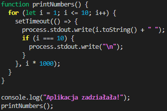
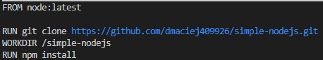

*Maciej Dziura*
*IO 409926*

**CEL PROJEKTU**
Zautomatyzowanie operacji związanych z budową, testowaniem i uruchamianiem aplikacji przy użyciu kontenerów Docker. Ten proces pozwoli nam na skuteczne wdrażanie aplikacji oraz szybką reakcję na zmiany kodu poprzez ciągłe testowanie i wdrażanie.
Pierwszym krokiem jest przeprowadzenie operacji budowy, testowania i uruchamiania aplikacji na lokalnej maszynie. Po upewnieniu się, że aplikacja działa poprawnie, przechodzimy do tworzenia plików Dockerfile, które pozwolą na automatyzację tych procesów w kontenerach.
Pozwala to osiągnąć efekt, w którym po uruchomieniu polecenia `docker run`, obrazy ze zdefiniowanym procesem build lub run tworzą się, ale natychmiastowo kończą swoje wykonanie z kodem exit 0. Kontenery te służą bowiem jedynie do zbudowania i przetestowania aplikacji, a nie do jej uruchomienia.
Dzięki takiemu podejściu uzyskujemy dużą możliwość automatyzacji całego procesu budowania, testowania i wdrażania aplikacji. Możemy łatwo integrować nasz proces CI/CD z systemami zarządzania wersjami kodu oraz narzędziami do monitorowania i zarządzania zasobami.

**WYKONANE KROKI**
**WYBÓR OPROGRAMOWANIA NA ZAJĘCIA**

**1. Znalezienie repozytorium z kodem dowolnego oprogramowania, które:**
- dysponuje otwartą licencją
- jest umieszczone wraz ze swoimi narzędziami Makefile tak, aby możliwe był uruchomienie w repozytorium czegoś na kształt make build oraz make test. Środowisko Makefile jest dowolne. Może to być automake, meson, npm, maven, nuget, dotnet, msbuild...
- Zawiera zdefiniowane i obecne w repozytorium testy, które można uruchomić np. jako jeden z targetów Makefile'a. Testy muszą jednoznacznie formułować swój raport końcowy (gdy są obecne, zazwyczaj taka jest praktyka)

Do wykonania tego zadania wybrałem poniższe repozytorium (oryginał):

```https://github.com/steve-sienk/simple-nodejs-jest.git```

Program jest napisany z wykorzystaniem Node.js, więc będziemy używać ```npm``` zamiast ```make```. Posiada on kilka prostych testów jednak nie ma skryptu uruchamiającego aplikację ```start```. Repozytorium skopiowałem i odpowiednio uzupełniłem, aby móc uruchomić program poleceniem ```npm start```.




Teraz będziemy korzystać ze zmienionego repozyturium (zaaktualizowana wersja):

```https://github.com/dmaciej409926/simple-nodejs.git```

Teraz komenda ```npm run``` powinna uruchomić program, który wyświetli komunikat, że aplikacja działa i odliczyć od 1 do 10.

**2. Sklonowanie niniejszego repozytorium, przeprowadzenie buildu programu (doinstalowanie wymaganych zależności).**
Najpierw musimy sklonować nasze repozytorium, za pomocą komendy (potrzebujemy do tego git'a, który powinien być na poprzednich zajeciach):

```git clone https://github.com/dmaciej409926/simple-nodejs.git```


Następnie przechodzimy do folderu ```simple-nodejs``` i instalujemy potrzebne zależnośći:

```cd simple-nodejs```

```npm install```


**3. Uruchomienie testów jednostkowych dołączonych do repozytorium**
Jeśli instalacja przebiegła poprawnie możemy wykonać testy jednostkowe:

```npm test```

Jeśli program przeszedł testy powinniśmy otrzymać, taki wydruk:


Spróbujmy także odpalić strypt ```start``, króry dopisałem do repozytorium:

```npm start```

Powinniśmy otrzymać:


**WYKONANE KROKI**
**PRZEPROWADZENIE BUILDU W KONTENERZE**

**1. Wykonanie buildu i testów wewnątrz wybranego kontenera bazowego (Tj. wybór wystarczającego kontenera, np ubuntu dla aplikacji C lub node dla Node.js)**
- Uruchomienie kontenera
- Podłączenie do niego TTY celem rozpoczęcia interaktywnej pracy
- Zaopatrzenie kontenera w wymagania wstępne (jeżeli proces budowania nie robi tego sam)

Uruchommy kontener, w którym będziemy pracować:

```docker run -it --rm node bash```


Obraz został pobrany i utworzył się kontener.

- Sklonowanie repozytorium
- Uruchomienie buildu

Powtarzamy to co robiliśmy lokalnie, więc klonujemy repozytorium i przechodzimy do katalogu ```simple-nodejs``` i instalujemy potrzebne pakiety:

```git clone https://github.com/dmaciej409926/simple-nodejs.git```

```npm install```


- Uruchomienie testów
Jeśli instalacja przebiegła poprawnie możemy wykonać testy jednostkowe:

```npm test```

Jeśli program przeszedł testy powinniśmy otrzymać, taki wydruk:


Spróbujmy także odpalić strypt ```start```:

```npm start```

Powinniśmy otrzymać:

 

**2. Stworzenie dwóch (+ dodatkowy) plików Dockerfile automatyzujących kroki powyżej, z uwzględnieniem następujących kwestii**
- Kontener pierwszy ma przeprowadzać wszystkie kroki aż do builda
BLDR.Dockerfile:



- Kontener drugi ma bazować na pierwszym i wykonywać testy
TSTR.Dockerfile:


- Kontener trzeci ma bazować na pierwszym i uruchamiać program (dodatkowy)
RNR.Dockerfile:


**3. Wykazanie, że kontener wdraża się i pracuje poprawnie. Pamiętając o różnicy między obrazem a kontenerem. Co pracuje w takim kontenerze**

Zbudujmy najpierw obraz buildera, korzystając z polecenia:

```docker build -t bldr -f ./BLDR.Dockerfile .```


Sprawdźmy, czy operacja zakończyła się poprawnie za pomocą komendy:

```docker run bldr```

```echo $?```

Kod powrotu 0 po wykonaniu polecenia ```docker run bldr``` oznacza, że operacja zakończyła się pomyślnie. W systemach Unix/Linux kod powrotu 0 sygnalizuje, że wykonane polecenie zakończyło się bez żadnego błędu. W przypadku `docker run`, kod powrotu 0 oznacza, że kontener został uruchomiony poprawnie i zakończył swoje działanie bez żadnych problemów.


Teraz postąpimy podobnie z obrazem testującym:

```docker build -t tstr -f ./TSTR.Dockerfile .```


Sprawdźmy, czy operacja zakończyła się poprawnie:

```docker run tstr```

```echo $?```

Jeśli otrzymamy 0 wszystko wykonało się prawidłowo:


Uruchomienie powyższych kontenerów nie daje żadnego efektu, ponieważ nie posiadają żadnych poleceń oprócz zbudowania i przetestowania oprogramowania. Na koniec możemy zbudować dodatkowy obraz, który będzie uruchamiał aplikację odliczającą od 1 do 10:

```docker build -t rnr -f ./RNR.Dockerfile .```


Sprawdźmy, czy operacja zakończyła się poprawnie i czy program się uruchomi:

```docker run tstr```

Jeśli otrzymamy informacje o zadziałaniu aplikacji i liczby od 1 do 10 wszystko wykonało się prawidłowo:


Uruchomieny kontener możemy podejrzeć za pomocą polecenia:

```docker ps```


Na sprawdzenie tego mamy ok 10s od startu kontenera, bo po tym czasie aplikacja kończy swoje działanie.