*Maciej Dziura*
*IO 409926*

**CEL PROJEKTU**

Przy użyciu Jenkins'a automatyzujemy budowanie -> testowanie -> wdrażanie aplikacji z wybranego repozytorium na Dockerze.

**WYKONANE KROKI**
**ZAJĘCIA 5-7**

**1. Instancja Jenkins oraz sprawdzenie działania kontenerów:**
Instalacja Jenkins'a z poprzedniego sprawozdania:

- Przeprowadzenie instalacji skonteneryzowanej instancji Jenkinsa z pomocnikiem DIND

Postępujemy zgodnie z instrukcją ze strony https://www.jenkins.io/doc/book/installing/docker/
Najpierw tworzymy sieć mostkową:

```docker network create jenkins```

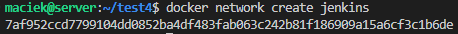

I uruchamiamy kontener:

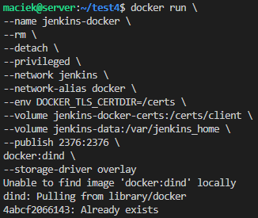

- Zainicjalizowanie instacji, wykazanie działających kontenerów, pokazanie ekranu logowania

Tworzymy teraz customowy obraz jenkinsa dzięki dołączonemu w instrukcji Dockerfile'owi:

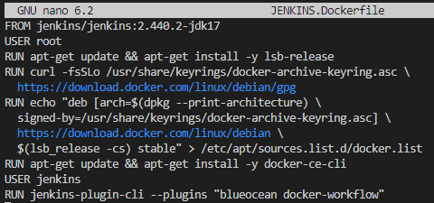

I uruchamiamy bydowanie komendą:

```docker build -t myjenkins-blueocean:2.440.2-1 -f JENKINS.Dockerfile .```

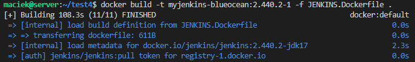

Możemy teraz uruchomić sam kontener:

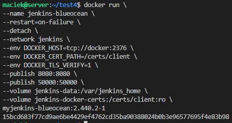

Sprawdźmy czy nasz kontener działa:

```docker ps```

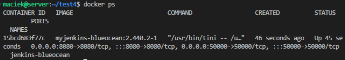

Jeśli korzystamy z Virtualbox'a musimy przekierować port, potrzebujemy adresu naszej virtualnej maszyny: 

```ip a```

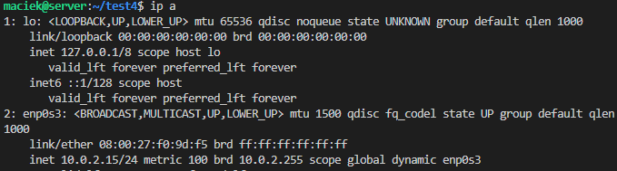

Powinniśmy otrzymać ```10.0.2.15```. Teraz w ustawienaich zaawansowanych dla sieci wybieramy przekierowywanie portów i odpowiednio dodajemy nowe przekierowanie:

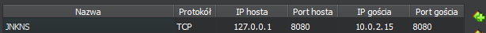

Można teraz pokazać ekran logowania wpisując w przeglądarce:

```localhost:8080```

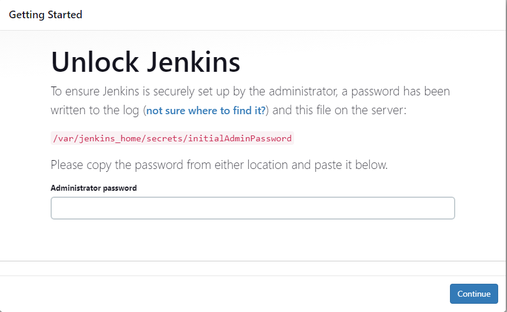

Teraz możemy odczytać nasze hasło za pomocą komendy:

```sudo docker exec ${CONTAINER_ID or CONTAINER_NAME} cat /var/jenkins_home/secrets/initialAdminPassword c68866a17eb8490683727449145e3c0c```

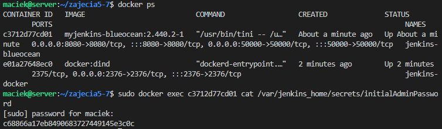

Uzyskanego hasła używamy do zalogowania się. Powinien ukazać się nam ekran początkowy Jenkins'a:

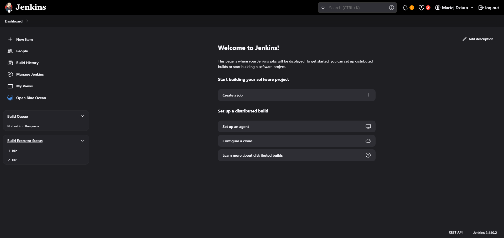

Czym się różni Jenkins Blue Ocean od obrazu Jenkins'a

Obraz Jenkins Blue Ocean zawiera rozszerzenia i dodatki specyficzne dla interfejsu użytkownika Blue Ocean. Blue Ocean to nowoczesny i przejrzysty interfejs użytkownika stworzony dla Jenkinsa, który zapewnia bardziej intuicyjne wrażenia z korzystania z Jenkinsa, zwłaszcza dla osób niebędących specjalistami od DevOps.

Podstawowy obraz Jenkinsa zawiera podstawową instalację serwera Jenkinsa oraz kilka podstawowych wtyczek, które są powszechnie używane. Natomiast obraz Jenkinsa Blue Ocean zawiera te same elementy, ale także dodaje wszystkie niezbędne komponenty, aby uruchomić i skonfigurować interfejs użytkownika Blue Ocean.

Ogólnie rzecz biorąc, różnica między obrazem Jenkinsa a obrazem Jenkinsa Blue Ocean polega na tym, że ten drugi zawiera dodatkowe narzędzia i wtyczki, które są specyficzne dla interfejsu użytkownika Blue Ocean.

 - Spawdzenie działania kontenera budującego orz testującego z poprzedniego sprawozdania

Zbudujmy najpierw obraz buildera, korzystając z polecenia:

```docker build -t bldr -f ./BLDR.Dockerfile .```

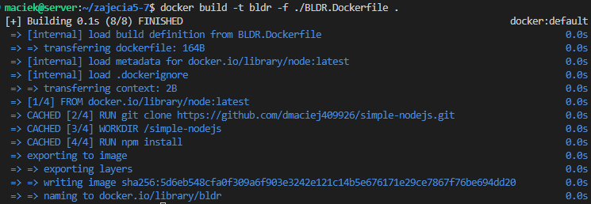

Sprawdźmy, czy operacja zakończyła się poprawnie za pomocą komendy:

```docker run bldr```

```echo $?```

Kod powrotu 0 po wykonaniu polecenia ```docker run bldr``` oznacza, że operacja zakończyła się pomyślnie. W systemach Unix/Linux kod powrotu 0 sygnalizuje, że wykonane polecenie zakończyło się bez żadnego błędu. W przypadku `docker run`, kod powrotu 0 oznacza, że kontener został uruchomiony poprawnie i zakończył swoje działanie bez żadnych problemów.

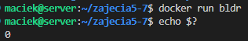

Teraz postąpimy podobnie z obrazem testującym:

```docker build -t tstr -f ./TSTR.Dockerfile .```

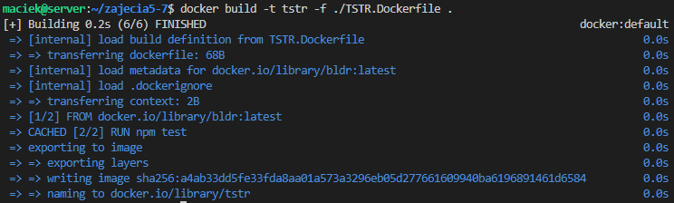

Sprawdźmy, czy operacja zakończyła się poprawnie:

```docker run tstr```

```echo $?```

Jeśli otrzymamy 0 wszystko wykonało się prawidłowo:

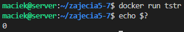


**2. Uruchomienie**

Konfiguracja wstępna i pierwsze uruchomienie:
 - Utwórz projekt, który wyświetla uname

Tworzymy prosty projekt i używamy prostej komendy ```uname -a``` na powłoce:

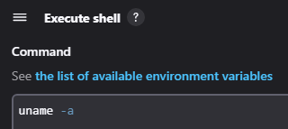

Powinniśmy otrzymać taki wypis w konsoli:

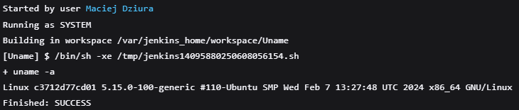

 - Utwórz projekt, który zwraca błąd, gdy... godzina jest nieparzysta

Tworzymy go tak samo jak poprzedni:

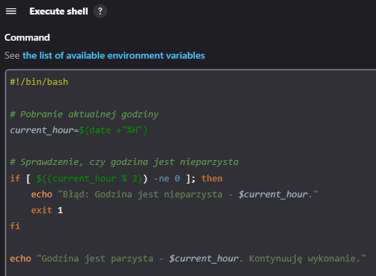

Powinniśmy otrzymać taki wypis w konsoli dla godziny parzystej:

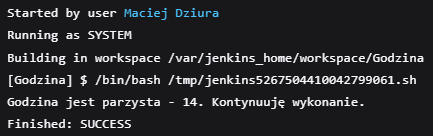

Powinniśmy otrzymać taki wypis w konsoli dla godziny nieparzystj:

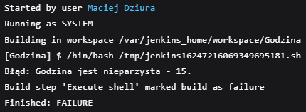

Utwórz "prawdziwy" projekt, który:
 - klonuje nasze repozytorium
 - klonuje nasze repozytorium
 - buduje obrazy z dockerfiles i/lub komponuje via docker-compose

 Tym razem utworzyłem pipeline o nastepującej treści:

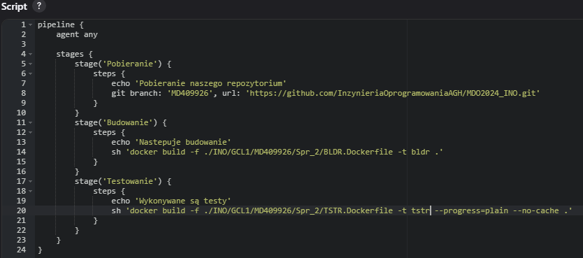

 Po uruchomieniu otrzymujemy:

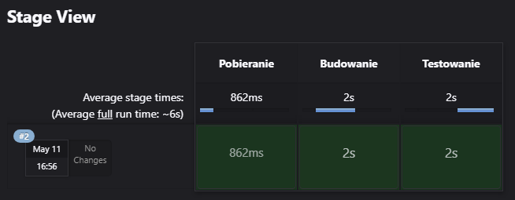
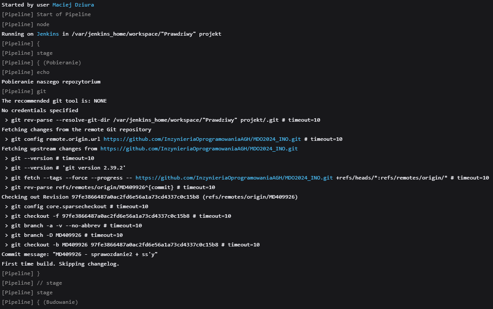

**3. Opracuj dokument z diagramami UML aktywności i wdrożeń**

 - diagram aktywności


 - diagram wdrożeń
