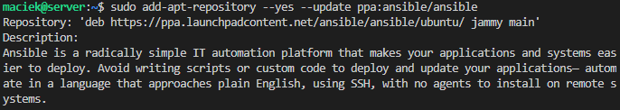
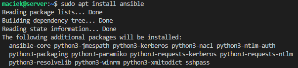
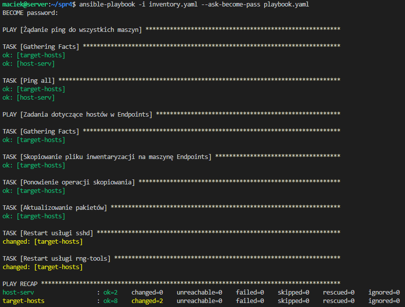
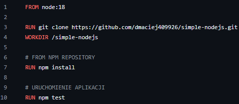

*Maciej Dziura*
*IO 409926*

**CEL PROJEKTU**

Zapoznanie z Ansible, narzędziem przydatnym do automatyzacji izdalnego wykonywania poleceń. Stworzenie pliku dzięki, któremu zainstalujemy system, na którym uruchomimy naszą aplikację.

**WYKONANE KROKI**
**ZAJĘCIA 8-9**

**1. Instalacja Ansible i wymiana kluczy:**
Przygotowanie drugiej maszyny wirtualnej (Ansible - z tym samym systemen co maszyna główna):
- pobranie iso - Ubuntu 24.04
- podczas instalacji wybieramy opcję minimized oraz przydzielamy mniej pamięci RAM
- nadajemy maszynie hostname (Ansible) i tworzymy użytkownika (maciek)
- będziemy potrzebować tar i serweraSSH, tar jest instalowany automatyczne a OpenSSH moża dodać przy instalacji systemu:


- możemy sprawdzić, czy na pewno mamy wszystko zainstalowane:


Zainstalowanie Ansible na maszynie głównej (Server)
- korzystamy z załączonej instrukcji
- najpierw aktualizujemy system

```sudo apt update```


```sudo apt upgrade```


- instalujemy teraz software-properties-common, za pomocą:

```sudo apt install software-properties-common```


- następnie możemy pobrać Ansible:

```sudo add-apt-repository --yes --update ppa:ansible/ansible```



```sudo apt install ansible```



- dla potwierdzenia instalacji sprawdzamy wersję Ansible:

```ansible --version```


Wymiana kluczy SSH między użytkownikami obydwu maszyn, aby logowanie ssh maciek@ansible nie wymagało hasła:
- z racji, że dwie maszyny (w VirtualBox) mają ten sam adres należy stworzyć sieć NAT, którą przypisujemy do maszyn i ustawić przekierowywanie portów:


- sprawdziłem, czy maszyny się komunikują poprzez próbę zalogowania z maszyny głównej na maszynę ```ansible``` i odwrotnie:

```ssh maciek@10.0.2.15```


```ssh maciek@10.0.2.4```


- jak widać maszyny się komunikują, więc teraz musimy dodać nazwę hosta do maszyny głównej w pliku ```etc/hosts```:

```sudo nano /etc/hosts```


- przeprowadzamy test:

```ssh maciek@ansible```


- jak juz możemy połaczyć się przez nazwę hosta to możemy przejśc do generacji kluczy w ich wymiany:

```ssh-keygen -t rsa```


- przekopiowujemy go naszej maszyny ansible:

```ssh-copy-id -i ~/.ssh/id_rsa.pub maciek@ansible```


- sprawdzamy teraz czy zalogujemy się bez podawania hasła:

```ssh maciek@ansible```


Dodatkowo dodałem w identyczny sposób ```server``` na ```ansible``` oraz ```server``` do samego siebie, aby ułatwić przelogowywanie się w drugą stronę oraz pingowanie maszyn w nastepnym zadaniu.

**2. Inwentaryzacja:**
Ustawienie nazw i weryfikacja połączenia:
- nazwy maszyn zostały ustalone przy ich tworzeniu


- za pomocą zpingowania maszyn między sobą sprawdzimy ich połączenie, potwierdzeniem stabilnego połączenia będą poprawnie przesłane i odebrane pakiety:


Tworzenie pliku do inwentaryzacji:
- po przeczytaniu poradnika wybrałem format .yaml ponieważ wydaje się czytelniejszy
- utworzyłem plik inwentarza do zarządzania (```ansible``` jest maszyną docelową, a ```server``` odpowiada za serwer główny):


Zpingowanie maszyn:
- teraz dzięki sekcji network możemy zabrac się za zpingowanie maszyn:

```ansible -i inventory.ini network -m ping```


- i zpingowanie tylko maszyn docelowych

```ansible -i inventory.yaml Endpoints -m ping```


Stworzenie playbooka w fromacie .yaml do automatyzacji i zdalnego wywołania procedur.
Plik playbook.yaml prezentuje się następująco:


- możemy teraz uruchomić nasz playbook komendą:

```ansible-playbook -i inventory.yaml --ask-become-pass playbook.yaml```

- powinniśmy otrzymać następujący wypis:



- można zauważyć, że pierwsze przekopiowanie jest oznaczone jako CHANGED, drugie natomiast jako OK. Wynika to z tego, że za pierwszym razem plik został skopiowany więc została dokonana zmiana, a za drugim razem plik był już w miejscu docelowym.
- teraz przeprowadzimy uruchomienie playbooka ale z wyłączonym ssh:

```sudo systemctl stop ssh```
```ansible-playbook -i inventory.yaml --ask-become-pass playbook.yaml```


- jak widać połączenie z maszyną nie udało się, możemy teraz włączyć z powrotem ssh:

```sudo systemctl start ssh```

Zarządzanie kontenerem:
- zaczniemy od napisania nowego pliku Deploy.Dockerfile. Wynika to z tego, że poprzedni Deploy był bardziej skomplikowany, a teraz wystarczy sklonowanie repozytorium, instalacja npm oraz uruchomienie naszej aplikacji, która typlo przeprowadza testy
- plik Deploy.Dockerfile prezentuje się nastepujaco:



- teraz przechodzimy do napisania naszego drugiego playbooka:


- playbook przeporwadza instalację dockera
- następnie kopiujemy nasz obraz i budujemy go
- na końcu uruchamiamy go w kontenerze gdzie zostaną wykonane testy
- usuwamy nasz kontener po wykonaniu testów
- możemy uruchomić nasz playbook:

```ansible-playbook -i inventory.yaml --ask-become-pass playbook2.yaml```


- sprawdzamy, czy poprawnie zbudowalismy obraz i uruchomiliśmy kontener z aplikacją:

```sudo docker images```


```sudo docker container list --all``


Aby lepiej zorganizować proces, użyjemy roli ze szkieletowaniem ```ansible-galaxy```:
- tworzymy folder:

```mkdir -p ./ansible/roles```

- tworzymy w nim dwie role (prepare i container_handling):

```ansible-galaxy init prepare```
```ansible-galaxy init container_handling```


- dla prepare jak i dla container_handling odpowiednio kopiuje fragmenty z pliku playbook2.yaml do pliku main.yaml, który znajduje się w katalogu tasks:
- prepare:


- container_handling:


- możemy teraz stworzyć playbook w folderze ansible, który będzie dotyczył naszych dwóch stworzonych ról:


- uruchamiamy nasz playbook:

```ansible-playbook -i inventory.yaml --ask-become-pass ./ansible/playbook.yaml```


**3. Wykonanie nienadzorowanej instalacji:**
Naszym zadaniem jest przygotowanie pliku do nienadzorowanej instalacji systemu (wybrałem Fedora 40), który ma hostować naszą aplikację.

Uzyskanie pliku anaconda-ks.cfg:
- zaczynamy od zainstalowania Fedory w sposób nadzorowany, to znaczy instalujemy ją ręcznie. Ustalamy nazwę użytkownika, hosta, wybieramy wersję minimalną i inne potrzebne pakiety (menedżer kontenerów).
- po instalacji powstaje plik ```anaconda-ks.cfg```, który powtarza nasze kroki przy onstalacji i jego uzyjemy jako podstawy do instalacji naszego systemu w sposób nienadzorowany
- możemy go wyświetlić i ręcznie skopiować:

```sudo cat /root/anaconda-ks.cfg```


- do uruchomienia naszej aplikacji dodamy skrypt do naszego repozytorium. Jego zadaniem będzie pobranie plików, wejście do repozytorium, pobranie paczki i wykonanie testów


Teraz możemy przejśc do modyfikacji ```anaconda-ks.cfg``` poprzez dodanie:
- użycia domyślnych repozytoriów fedory
- doinstalowanie ```nodejs```, ```git``` i ```wget``` potrzebnych do naszej aplikacji
- czyszczenie partycji
- zapisanie logów
- zapisanie naszego skryptu i uruchomienie go
- ponowne uruchomienie po instalacji:


Gdy plik jest gotowy możemy zainstalować nasz system w sposób nienadzorowany:
- na początku instalacji wybieramy opcję ```e```, aby otworzyć tryb GRUB, gdzie podajemy link (po wyrazie ```quiet```) w wersji raw do naszego repozytorium gdzie zapisaliśmy nasz plik ```anaconda-ks.cfg```

```inst.ks=https://raw.githubusercontent.com/InzynieriaOprogramowaniaAGH/MDO2024_INO/MD409926/INO/GCL1/MD409926/Spr_4/anaconda-ks.cfg```


- uruchamiamy instalację za pomocą klawisza ```F10```


- ukazuje nam się wypis z wybranymi przez nas opcjami podczas instalacji pierwszego systemu z Fedorą:


- następuje doinstalowywanie pakietów:


- gdy instalacja dobiegnie końca i ujrzymy ponownie ekran z menu instalacji to przechodzimy do opcji ```Troubleshooting```


- następnie ```Boot first drive```


- i ```Fedora Linux```


- możemy zalogować się do naszego systemu i wykonać testy ręcznie:


- lub wyświetlić treść logów i zobaczyć, że testy wykonały się podczas instalacji systemu:

