*Maciej Dziura*
*IO 409926*

**CEL PROJEKTU**

Zapoznanie się z procesem wdrażania aplikacji na zarządzalne kontenery za pomocą Kubernetes.

**WYKONANE KROKI**

**1. Instalacja Kubernetes'a:**

Zapoznałem się z załączoną instrukcją pokazującą jak pobrać minikube. Wybrałem Linux'a x86-64, paczka debian, którą pobrałem i zainstalowałem za pomocą komend:

```curl -LO https://storage.googleapis.com/minikube/releases/latest/minikube_latest_amd64.deb```

```sudo dpkg -i minikube_latest_amd64.deb```

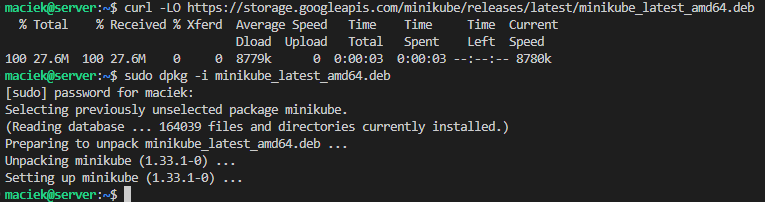

Możemy teraz uruchomić nasz klaster:

```minikube start```

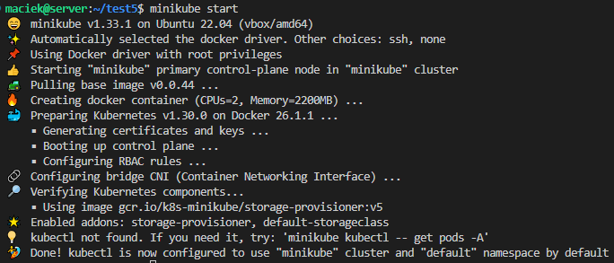

Jak widać zostały sprawdzone parametry naszej wirtualnej maszyny. Dla Kubernetesa minimum to 2GB pamięci RAM i 20GB wolnej pamięci i 2 rdzenie procesora. Przy braku spełnienia wymogów minimalnych Kubernetes nie uruchomiłby się.

Sprawdźmy działający kontener:

```docker ps```

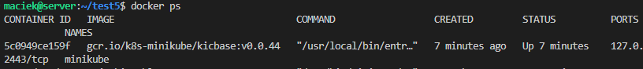

Aby móc sprawdzić status podów, usług i deploymentów będziemy potrzebować polecenia ```kubectl```, które będziemy musieli pobrać w wariancie minikube i alias. Zrobimy to za pomocą:

```minikube kubectl -- get po -A```

```alias kubectl="minikube kubectl --"```

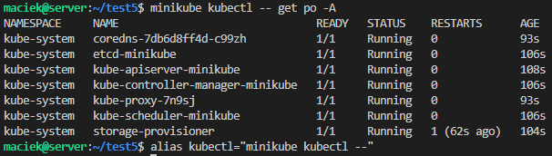

Możemy teraz przejść do uruchomienia Dashboardu i zapoznania się z funkcjami Kubernetesa. Uruchommy Dashboard komendą:

```minikube dashboard```

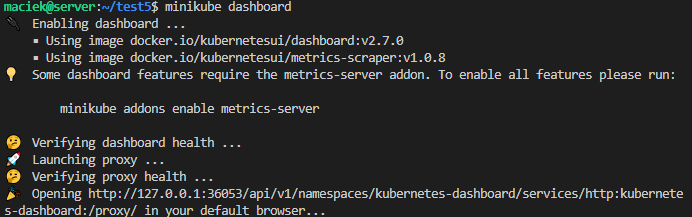

Powinna nam się automatycznie otworzyć przeglądarka z Dashboardem.

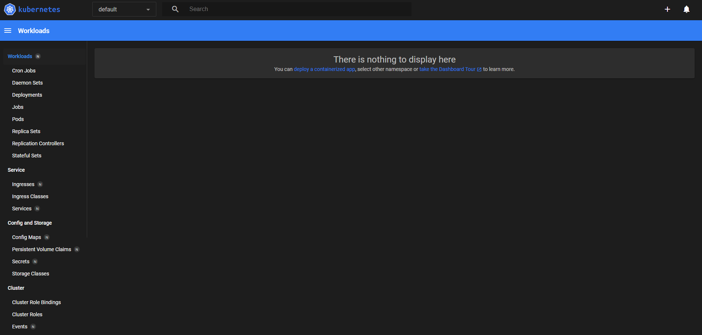

Dashboard pozwala nam m.in. zarządzać podami kubernetesowymi w zakładce Pods. Jeśli chcemy zakończyć prace z kontenerami, minikube'a zatrzymujemy poleceniem:

```minikube stop```

**2. Analiza posiadanego kontenera:**

Z racji, że moja poprzednia aplikacja nie wykonywała nic tylko przeprowadzała testy, wybrałem inną działającą aplikację, którą bedzie zegar działający na nginx w wersji 1.26. Nie posiada ona testów, ale wystarczającym testem będzie to, czy działa wypisując godzinę na ekranie.

Najpierw tworzymy plik Dockerfile:

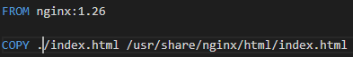

Oraz plik konfiguracyjny index.html:

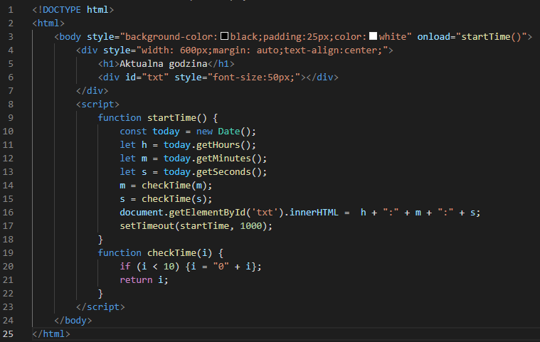

Logujemy się do DockerHub:

```docker login```

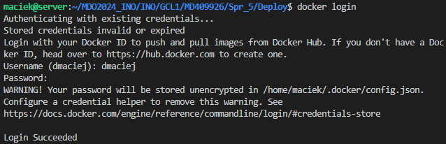

Zbudujmy teraz nasz obraz i sprawdźmy, czy uruchomił się poprawnie i działa:

```docker build -t zegar .```

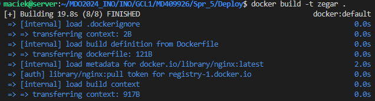

```docker images```

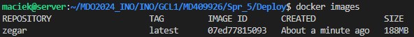

Jak wszystko działa poprawnie otagujmy i opublikjumy nasz kontener:

```docker tag zegar dmaciej/zegar:1.0```

```docker push dmaciej/zegar:1.0```

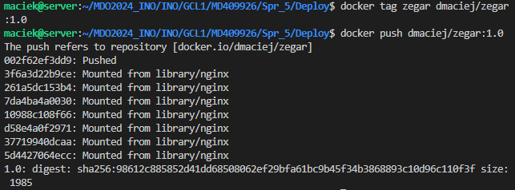

Sprawdźmy, czy pojawił się na naszym profilu na DockerHubie:

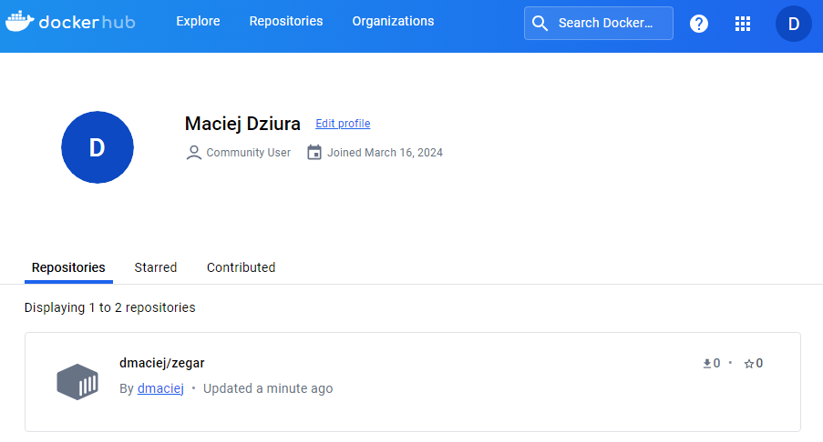

Jeśli wszystko przebiegło poprawnie i mamy nasz kontener na naszym profilu możemy sprawdzić działanaie naszej aplikacji. uruchomimy nasz kontener z rejestru w trybie detached z przekierowaniem portów, aby widzieć naszą aplikację w przeglądarce. Robimy to za pomocą komendy:

```docker run -d --rm -p 8000:8000 --name zegar dmaciej/zegar:1.0```


