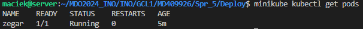
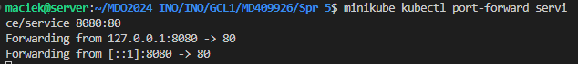

*Maciej Dziura*
*IO 409926*

**CEL PROJEKTU**

Zapoznanie się z procesem wdrażania aplikacji na zarządzalne kontenery za pomocą Kubernetes.

**WYKONANE KROKI**

**1. Instalacja Kubernetes'a:**

Zapoznałem się z załączoną instrukcją pokazującą jak pobrać minikube. Wybrałem Linux'a x86-64, paczka debian, którą pobrałem i zainstalowałem za pomocą komend:

```curl -LO https://storage.googleapis.com/minikube/releases/latest/minikube_latest_amd64.deb```

```sudo dpkg -i minikube_latest_amd64.deb```


Możemy teraz uruchomić nasz klaster:

```minikube start```


Jak widać zostały sprawdzone parametry naszej wirtualnej maszyny. Dla Kubernetesa minimum to 2GB pamięci RAM i 20GB wolnej pamięci i 2 rdzenie procesora. Przy braku spełnienia wymogów minimalnych Kubernetes nie uruchomiłby się.

Sprawdźmy działający kontener:

```docker ps```


Aby móc sprawdzić status podów, usług i deploymentów będziemy potrzebować polecenia ```kubectl```, które będziemy musieli pobrać w wariancie minikube i alias. Zrobimy to za pomocą:

```minikube kubectl -- get po -A```

```alias kubectl="minikube kubectl --"```


Możemy teraz przejść do uruchomienia Dashboardu i zapoznania się z funkcjami Kubernetesa. Uruchommy Dashboard komendą:

```minikube dashboard```


Powinna nam się automatycznie otworzyć przeglądarka z Dashboardem.


Dashboard pozwala nam m.in. zarządzać podami kubernetesowymi w zakładce Pods. Jeśli chcemy zakończyć prace z kontenerami, minikube'a zatrzymujemy poleceniem:

```minikube stop```

**2. Analiza posiadanego kontenera:**

Z racji, że moja poprzednia aplikacja nie wykonywała nic tylko przeprowadzała testy, wybrałem inną działającą aplikację, którą bedzie zegar działający na nginx w wersji 1.26. Nie posiada ona testów, ale wystarczającym testem będzie to, czy działa wypisując godzinę na ekranie.

Najpierw tworzymy plik Dockerfile:


Oraz plik konfiguracyjny index.html:


Logujemy się do DockerHub:

```docker login```


Zbudujmy teraz nasz obraz i sprawdźmy, czy uruchomił się poprawnie i działa:

```docker build -t zegar .```


```docker images```


Jak wszystko działa poprawnie otagujmy i opublikjumy nasz kontener:

```docker tag zegar dmaciej/zegar:1.0```

```docker push dmaciej/zegar:1.0```


Sprawdźmy, czy pojawił się na naszym profilu na DockerHubie:


Jeśli wszystko przebiegło poprawnie i mamy nasz kontener na naszym profilu możemy sprawdzić działanaie naszej aplikacji. uruchomimy nasz kontener z rejestru w trybie detached z przekierowaniem portów, aby widzieć naszą aplikację w przeglądarce. Robimy to za pomocą komendy:

```docker run -d --rm -p 80:80 --name zegar dmaciej/zegar:1.0```


```docker ps```


Musiny dodać także przekierowanie portów w VirtualBoxie:


Tak prezentuje się działająca aplikacja w przegądarce```http://localhost:80`` 


**3. Uruchamianie oprogramowania:**

Przechodzimy do uruchomienia kontenera na stosie k8s, robimy to poleceniem:

```minikube kubectl run -- zegar --image=dmaciej/zegar:1.0 --port=80 --labels app=zegar```


Uruchomiony kontener jest od razu w podzie. Możemy to sprawdzić w dashboardzie:


Nasze pody możemy wyswietlić za pomocą zainstalowanego wcześniej ```kubectl```, pojedynczo lub wszystkie na raz:

```minikube kubectl -- expose pod zegar```


```minikube kubectl get pods```



Wyprowadzimy teraz port, aby dostać się do aplikacji:

```minikube kubectl port-forward pod/zegar 8888:80```


W VSCode przekierowujemy port:


Teraz mogę wyświetlić zegar na poprzez wpisanie adresu ```https://localhost:8888```:


**4. Konwersja wdrożenia ręcznego na wdrożenie deklaratywne YAML:**

Stworzymy tak jak na poprzednich zajęciach plik YAML do wdrożenia deklaratywnego. Podajemy w nim ilośc replik, strategię, nazwę i obraz.


Gdy nasz plik jest gotowy możemy go wprowadzić do ```kubectl`` i uruchomić za pomocą komendy:

```minikube kubectl -- apply -f ./deployment.yaml```


Pobieramy nasze deploymenty:

```minikube kubectl get deployments```


Możemy zobaczyć je w naszym Dashboardzie:


**5. Przygotowanie nowego obrazu:**

Aby dodać nowe 3 wersje naszego programu będziemy modyfikować nasz plik ```index.html```. Dla wersji z błędem dodamy ```CMD ["false"]``` do naszego Doclerfile, zwróci to nam 1 co jest statusem zakończenia. Następnie po każdej modyfikacji będziemy budować obraz, tagować go i publikwać.

```docker build -t zegar .```
```docker tag zegar dmaciej/zegar:1.(nr. wersji)```
```docker push dmaciej/zegar:1.(nr. wersji)```

Możemy podejrzeć nasze wersje w DockerHubie:


Wersja 1.1 zegara:


Wersja 1.2 zegara:


Wersja 1.3 zegara nie uruchomiła się, bo jest z błędem:


**6. Zmiany w deploymencie:**

Będziemy aktualizować nasz plik ```deployment.yaml```, a konkretnie to liczbę replik. Najpierw zwiększymy ich ilość do 10:


```minikube kubectl -- apply -f ./deployment.yaml```
```minikube kubectl get deployments```


Teraz zmniejszymy ich ilość do 1:


```minikube kubectl -- apply -f ./deployment.yaml```
```minikube kubectl get deployments```


Na koniec ustawiamy ilość replik na 0. Ma to sens przy testowaniu aplikacji i czekaniu na wdrożenie aplikacji, pozwala to na szybkie uruchomić i przygotować do czasu decyzji wdrożenia:


```minikube kubectl -- apply -f ./deployment.yaml```
```minikube kubectl get deployments```


Przejdziemy teraz do zastosowania nowej wersji naszego obrazu 1.1. W tym celu modyfikujemy nasz plik ```index.html```:


Powstało 5 (tyle ustawiłem) nowych zaaktualizowanych podów w wersji 1.1:


Teraz wykonujemy to samo tylko postarzamy naszą aplikację wracajac do wersji 1.0:


Przywracanie poprzednich wersji wdrożeń za pomocą poleceń ```kubectl rollout```.

Wyświetlmy historie wdzystkich zmian deploymentu:

```minikube kubectl rollout history deployment/deployment```


Możemy teraz wybrać do jakiej zmiany chcemy powrócić za pomocą komendy:

```minikube kubectl rollout undo deployment/deployment --to-revision=3```

Lub cofnąć się o jedną wersję:

```minikube kubectl rollout undo deployment/deployment```


Możemy sprawdzić, że nasze pody powróciły do wersji 1.1:


**7. Kontrola wdrożenia:**

Przejdźmy do napisania skryptu ```script.sh```, który sprawdza czy nasze wdrożenie wykona się poniżej 60s:


Aktualizacja podów do wersji 1.2 z weryfikacją za pomocą skryptu:

```chmod +x script.sh```
```./script.sh```


Sprawdzenie, czy aktualizacja została wykonana poprawnie:


Teraz wykonamy to samo tylko na błędnej wersji:

```./script.sh```


Sprawdzenie:


**8. Strategie wdrożenia:**

Przygotujemy teraz wersje z różnymi strategiami wdrażania. Najpierw cofam naszą wersję do 1.1, aby móc ją zaaktualizować i zauważyć różnicę pomiędzy strategiami:

Pierwszą strategią będzie Rolling Update:


Aktualizacja podów następuje stopniowo, a starsze są usuwane.

maxUnavailable - to maksymalna ilość podów, które mogą być niedostępne

maxSurge - to maksymalną liczba instancji, które mogą zostać utworzone ponad docelową liczbę, która może być podana jako liczba bezwzględna lub jako procent docelowej liczby podów.

```minikube kubectl -- apply -f ./rolling.yaml```


Strategia aktualizuje pody które są dostępne, następnie przechodzi do następnych, które czekają jednocześnie pracując.

Drugą strategia będzie Recreate:


Teraz wdrażamy i monitorujemy wdrożenie:

```minikube kubectl -- apply -f ./recreate.yaml```


Wcześniej działające kontenery zostały usunięte i w ich miejsce zostały stworzone nowe.

Ostatnia strategia to Canary Deployment:


Strategia ta polega na wdrożeniu jej dla części użytkowników z istniejącą wersją. Jest ona testowana, sprawdza się jej stabolnośc i wydajność przed udostępnieniem jej wszystkom użytkownikom.


Podsumowanie:

Strategia Rolling Update umożliwia płynne przejście z jednej wersji aplikacji na drugą, ponieważ aktualizacja odbywa się stopniowo, replika po replice. Dzięki temu unika się długotrwałej niedostępności, a użytkownicy mogą korzystać z aplikacji podczas aktualizacji.

Strategia Recreate jest najprostszą strategią, ale podczas wdrożenia może wystąpić krótkotrwała niedostępność aplikacji, ponieważ wszystkie repliki są zatrzymywane i usuwane jednocześnie.

Strategia Canary Deployment pozwala na wprowadzenie nowej wersji aplikacji dla części replik, co umożliwia wczesne testowanie i ocenę wpływu nowej wersji na wybraną grupę użytkowników. To pomaga zminimalizować ryzyko wprowadzenia błędnej wersji do produkcji.

**8. Użycie serwisów:**

Serwis jest metodą eksponowania aplikacji sieciowej, która działa na jednym bądź większej liczbie podów. Pozwala to zautomatyzować udostępnianie adresu, np. strony z zegarem w moim przypadku, bez potrzeby znajomości liczby podów.

W Kubernetes, serwisy są kluczowym elementem, który pozwala na komunikację pomiędzy podami oraz na udostępnianie aplikacji na zewnątrz klastra. Serwis zapewnia, że ruch jest kierowany tylko do działających podów, co zwiększa niezawodność aplikacji. Może być on zaaplikowany wewnątrz deploymentu danej aplikacji lub osobno, wybierając konkretną aplikację, jej port oraz port, na którym ma działać.

W tym przypadku utworzono osobny plik `service.yaml`, który wybiera moją aplikację `zegar` i przekierowuje port 80 dostępny wewnątrz klastra na port 80 na podach. Dzięki temu będę mógł sprawdzić działanie mojej aplikacji.


Przekierowanie portu:

```minikube kubectl -- apply -f ./service.yaml```
```minikube kubectl port-forward service/service 8888:80```



Uruchomienie aplikacji po przekierowaniu:


