# Sprawozdanie 3

## Pipeline, Jenkins, izolacja etapów

Poniższa część będzie obejmować laboratoria nr 5.  
Słowem o licencji programu `Redis`:  
29 marca 2024 Redis zmienił licencje na podwójne liencjonowanie, co technicznie nie czyni go już programem w pełni typu open source. Ruch ten został zrobiony ze względu na powszechne wykorzystanie tego programu przez większe korporacje i czerpanie dzięki temu zysków bez uwzględnienia w tym firmy Redis. 

Natomiast licencja ta pozwala nam wykorzystać go mimo tych zmian.

### Przygotowanie

Rozpocząłem zasadnicze laboratoria od sprawdzenia czy ostatnie kontenery *build* oraz *test* się wykonują poprawnie.

Kontener z obrazu `Dockerfile.build` wykonuje się poprawnie co widać poniżej:  


Natomiast kontener z obrazu Dockerfile.test nie wykonuje się za każdym razem poprawnie. Jak to ująłem w poprzednim sprawozdaniu, ten test prawdopodobnie nie jest konieczny w poprawnym działaniu programu, zapewne jest związane ze specyfiką konteneru w jakim działam lub z jakimiś szczegółami infrastruktury z której korzystam.  


Poprzednie sprawozdanie również obejmowało początkową instalację Jenkinsa z [dokumentacji](https://www.jenkins.io/doc/book/installing/docker/), zatem u mnie program ten działa poprawnie w kontenerze:  


Wymagane było dotarcie do hasła do Jenkinsa. Podana ścieżka Znajduje się na kontenerze. Można dostać się tam na kilka sposobów, dwa z nich są następujące:  

```sh
docker logs <id_kontera_jenkinsa>
```
Jak poniżej widać na zrzucie ekranu (bez hasła, które znajduje się niżej):  


Ten zrzut Ekranu też pokazuje działające oba kontenery: docker in docker (*dind*) oraz *jenkins*.

Ta metoda jest dostępna ogólnie, przez co każdy z uprawnieniami administratora może to wykonać. Ostatecznie to nie jest szczególnym problemem, ponieważ hasło potem się zmienia wraz z zakładaniem konta administratora.

Druga komenda wygląda jak poniżej:
```sh
sudo docker exec <container_name> cat /var/jenkins_home/secrets/initialAdminPassword
```

Jak widać, konieczne jest użycie `sudo` by móc wykonać to polecenie, wypisze natomiast w konsoli początkowe hasło.

Następnie po wpisaniu hasła, można ustawić początkowego użytkownika poprzez uzupełnienie formularzu, a później ukaże nam się ekran poącztkowy jak poniżej:  


Jenkinsa można zmienić na ciemny tryb, co zrobiłem przez `Manage Jenkins > Appearance`.  

### Uruchomienie

Pierwsze uruchomienie przedstawia się tak, że należało utworzyć nowy projekt który wyświetla `uname`. Po przejściu procesów jak w [tym poradniku](https://www.jenkins.io/doc/book/pipeline/getting-started/), `New Item > Pipeline`.  
Ukaże nam się wygląd podstrony `/configure`, gdzie możemy uzupełnić takie informacje jak opis, triggery, lub co ważniejsze - **Pipeline**, co nas interesuje. W tym miejscu można wpisać skrypt, który następnie się wykona i nasz pipeline po kolei się wykona.  

Po kilku nieudanych próbach, i początkowym zrozumieniu składni dotarłem do poniższej implementacji:  

```groovy
pipeline {
    agent any

    stages {
        stage('print_uname') {
            steps {
                sh '''#!/bin/bash
                    uname
                '''
            }
        }
    }
}
```

A wynik można sprawdzić na stronie projektu, następnie po najechaniu/kliknięciu na ostatni build przejść na stronę `logs`. Wtedy uruchomi się na tej samej stronie popup:  


Poniżej znajduje się output konsoli:

```
Started by user Michał Jurzak
[Pipeline] Start of Pipeline
[Pipeline] node
Running on Jenkins in /var/jenkins_home/workspace/print_uname
[Pipeline] {
[Pipeline] stage
[Pipeline] { (print_uname)
[Pipeline] sh
Linux
[Pipeline] }
[Pipeline] // stage
[Pipeline] }
[Pipeline] // node
[Pipeline] End of Pipeline
Finished: SUCCESS
```

Kolejne zadanie: stworzenie skryptu sprawdzającego, czy godzina jest parzysta, jeśli nie - zwraca błąd.  
Ja użyję dokładności do sekundy, co można po prostu sprawdzić w ten sposób:  
```sh
date "+%s"
```

Tak natomiast wygląda kod odpowiadający wypisaniu na ekranie:  

```groovy
pipeline {
    agent any

    stages {
        stage('check_if_odd') {
            steps {
                sh '''#!/bin/bash
                    current_time=$(date +%s);
                    remainder=$((current_time % 2));
                    if [ $remainder -eq 1 ];
                        then echo "Blad";
                    fi
                '''
            }
        }
    }
}
```

Z technicznego punktu widzenia, skrypty w bashu zwracają błąd gdy wychodzą ze środowiska z innym kodem niż 0. Natomiast tu, aby nie kończyć programu, zatrzymałem się wyłącznie na wypisaniu na ekranie.  

Wypisanie bez błędu (obecna sekunda jest parzysta)
```
Started by user Michał Jurzak
[Pipeline] Start of Pipeline
[Pipeline] node
Running on Jenkins in /var/jenkins_home/workspace/even_odd_time
[Pipeline] {
[Pipeline] stage
[Pipeline] { (check_if_odd)
[Pipeline] sh
[Pipeline] }
[Pipeline] // stage
[Pipeline] }
[Pipeline] // node
[Pipeline] End of Pipeline
Finished: SUCCESS
```

Wypisanie z błędem (obecna sekunda jest nieparzysta)
```
Started by user Michał Jurzak
[Pipeline] Start of Pipeline
[Pipeline] node
Running on Jenkins in /var/jenkins_home/workspace/even_odd_time
[Pipeline] {
[Pipeline] stage
[Pipeline] { (check_if_odd)
[Pipeline] sh
Blad
[Pipeline] }
[Pipeline] // stage
[Pipeline] }
[Pipeline] // node
[Pipeline] End of Pipeline
Finished: SUCCESS
```

Aby przejść następnie do kolejnego kroku: uruchomienia "prawdziwego" programu - w moim przypadku `Redisa` musiałem nieco zagłębić się w specyfikę testowania tego programu. Aby pipeline poprawnie się uruchomił, konieczne jest, aby wszystkie testy zostały poprawnie wykonane. Nie było to zawsze konsekwentnie wykonywane, natomiast w [źródle programu](https://github.com/redis/redis/blob/unstable/tests/test_helper.tcl) Można znaleźć kilka opcji uruchamiających testy. Trzy z nich uznałem za sensowne w moim przypadku: 
```tcl
--skiptest <test>
--no-latency
--stop
```
Te flagi oznaczają odpowiednio:
- pominięcie jednego testu (w moim przypadku zawsze pojawiał się błąd przy `memefficiency`)
- pominięcie opóźnienia które jest testowane w niektórych testach (prawdopodobna przyczyna błędów na mojej maszynie to właśnie niespełnianie warunków opóźnień)
- zatrzymuje testowanie natychmiast po napotkaniu błędu (nie traci czasu na wykonanie dalszych testów).
  
Pełna komenda wygląda tak:  
```sh
./runtest --skiptest unit/memefficiency --no-latency --stop
```
> NOTE: Początkowo wykonując powyższe polecenie `runtest` z flagą `--skiptest` wykonywało się poprawnie, natomiast w późniejszych etapach pracy okazało się że powodowało to niezrozumiałe i trudne do zdebugowania błędy. Oprócz tego, zmieniłem także początkowe pobieranie repozytorium na dowolne z repozytorium githuba, a nie najnowszą stabliną wersję z oficjalnej strony.

Naniosłem także konieczne poprawki do Dockerfile'ów.

`Dockerfile.build`:
```Dockerfile
FROM fedora

RUN dnf install -y git wget make gcc tcl tcl-devel tk procps which && \
    git clone -b 7.2 --single-branch https://github.com/redis/redis.git
    
WORKDIR /redis

RUN make distclean & make
```

Użyta flaga `-b` wybiera konkretną gałąź, a flaga `--single-branch` zapewnia pobranie wyłącznie wybranej gałęzi.

Powyżej, `make distclean` zapewnia zarówno wyczyszczenie samych plików utworzonych przez `make` jak i plików konfiguracyjnych (środek ostrożności).

`Dockerfile.test`:
```Dockerfile
FROM redis_build

WORKDIR /redis

RUN ./runtest --no-latency --stop
```

Pipeline który użyłem przedstawia się następująco:
```groovy
pipeline {
    agent any
    stages {
        stage('Download') {
            steps {
                script {
                    // Pobieranie repozytorium Git
                    git branch: 'MJ410315', 
                        url: 'https://github.com/InzynieriaOprogramowaniaAGH/MDO2024_INO.git'
                    
                    stash name:'scm', includes:'*'
                }
            }
        }
        
        stage('Build'){
            steps {
                unstash 'scm'
                script {
                    sh "docker system prune -a -f" // Usuwanie wszystkich obrazow
                    try{
                        sh 'docker stop $(docker ps -a -q)'
                    } catch (err) {
                        echo "Caught: ${err}"
                    }
                    sh """docker build -t redis_build \
                            -f INO/GCL1/MJ410315/Sprawozdanie2/dockerfiles/Dockerfile.build INO/GCL1/MJ410315/Sprawozdanie2/dockerfiles/"""

                    docker.image("redis_build").inside(){
                        sh "/redis/src/redis-server & /redis/src/redis-cli --version"
                        sh "tar -cf redis.tar /redis"
                        sh "/redis/src/redis-cli shutdown"
                    }
                }
                
            }
        }
        
        stage('Test'){

            steps {
                unstash 'scm'
                script {
                    sh """docker build -t redis_test \
                            -f INO/GCL1/MJ410315/Sprawozdanie2/dockerfiles/Dockerfile.test INO/GCL1/MJ410315/Sprawozdanie2/dockerfiles/"""
                    sh "docker run -t --rm redis_test sh -c 'src/redis-server & src/redis-cli --version && src/redis-cli shutdown'"
                }
            }
        }
    }
}
```

Ten pipeline składa się z trzech etapów: Pobranie repozytorium, zbudowanie oraz przetestowanie programu. Problematyczne okazało się sięganie do plików wykonawczych, które znajdują się w kontenerze. Ze względu na to, że `jenkins` domyślnie zakłada swój folder `WORKDIR` jako środowisko, to nie jest możliwe proste wykonanie komend w kontenerze, który jedynie "wypożycza" swoje usługi dla jenkinsa. Widać to przy wyniku z konsoli:
```
$ docker run -t -d -u 1000:1000 -w /var/jenkins_home/workspace/prawdziwy_projekt -v /var/jenkins_home/workspace/prawdziwy_projekt:/var/jenkins_home/workspace/prawdziwy_projekt:rw,z -v /var/jenkins_home/workspace/prawdziwy_projekt@tmp:/var/jenkins_home/workspace/prawdziwy_projekt@tmp:rw,z [...]
```
Flaga `-w` ustanawia workspace kontenera.

>NOTE: Pomimo użycia komendy `docker.image(...).inside {...}` problemem jest już w.w. sięganie do plików zawartych w kontenerze. Okazuje się, że wszystkie komendy są wykonywane w ścieżce zawartej w zmiennej środowiskowej `WORKSPACE`. Sprzeczne z intuicją jest więc wykonywanie komend bezpośrednio w bloku bez uwzględnienia tej informacji. W [dokumentacji](https://docs.cloudbees.com/docs/cloudbees-ci/latest/pipelines/docker-workflow#docker-workflow-sect-inside) jest napisane, że Jenkins rozwiązuje to poprzez zamontowanie `Jenkins workspace` w kontenerze przy użyciu tej samej ścieżki (`/var/jenkins_home/workspace`). Dlatego wystarczy się względem katalogu domowego kontenera odnieść do plików (typu `/redis/src/redis-server`) aby uruchomić program uruchamiający serwer, a następnie poprzez `redis-cli` sprawdzić wersję programu która została wypisana.

Jako **artefakt** uznałem po pierwsze obraz wynikowy z budowania redisa, oraz wszystkie pliki które tworzą się podczas budowy, ponieważ uznałem to za najbardziej istotny element pipeline'u. Na samym końcu pipeline'a należy umieścić wtedy specjalną komendę `archiveArtifacts`, która pozwala na zapisanie konkretnych plików, które można pobrać po zakończeniu działania pipeline'u, ale to umieszczę podczas finalnego wykonania pipeline'a.

>NOTE: Prawdopodbnie istotne okazuje się także wyłączenie serwera redisa. Jeśli pozostanie on włączony, samoistne wyłączenie kontenera nie jest deterministyczne, załączenie komendy `redis-cli shutdown` pozwala na uniknięcie błędu w postaci zamrożenia pipeline'a.

Poniżej zrzuty ekranu konsoli na początku i na końcu pipeline'a:  
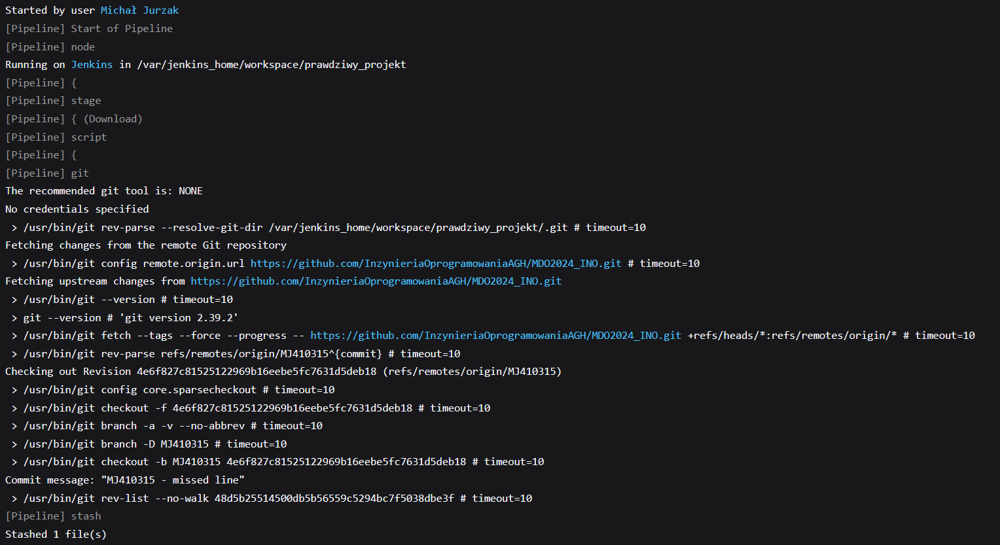
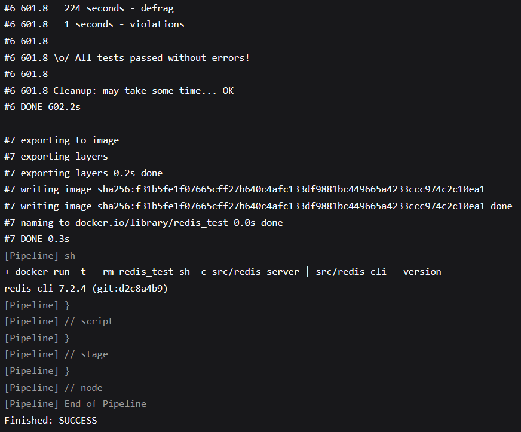

### Publish
Jako, że nawet [publiczny obraz redisa](https://github.com/docker-library/redis/blob/f623bf8a6fef29b1459a29ff9f852c0f88d76b5a/7.0/debian/Dockerfile) wykorzystuje jako obraz bazowy debiana, to uznałem, że może być upubliczniony obraz z zaktualizowanymi bibliotekiami fedory wraz z koniecznymi do zbudowania programu narzędziami. Wzorowałem się na [poradniu z kanału CloudBeesTV](https://youtu.be/alQQ84M4CYU?si=VZFdz2Yr2ULwidhx).  

W moim przypadku prawdopodobnie użycie `Dockerfile.build` będzie miało najwięcej sensu. Projekt jest bardzo złożony a ja nie znam struktury i nie wiem co można wyczyścić z kontenera tak, by zmniejszyć jego rozmiar, a zachować wszystkie funkcjonalności, dlatego zachowam go w niezmienionej formie, lecz nie wykluczam, że istnieje znacznie lepsza forma upubliczniania tego obrazu (np. na lżejszej wersji systemu linuxa).  

Publikowanie obrazu składa się z kilku kroków:  

Utworzenie Access Tokena na dockerhubie:  
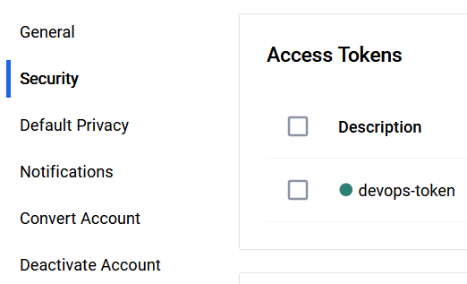

Kolejnym krokiem będzie uzupełnienie jak w w.w. poradniku credentiale:  
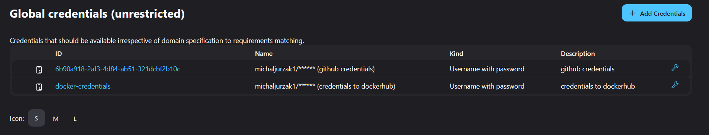

Krok w pipelinie który odpowiada za logowanie można opisać jak poniżej:
```groovy
environment{
    DOCKERHUB_CREDENTIALS = credentials('docker-credentials')
}
stages{
    ...
    stage('Login'){
        steps{
            sh "echo $DOCKERHUB_CREDENTIALS_PSW | docker login -u $DOCKERHUBCREDENTIALS_USR --password-stdin"
        }
    }
    ...
}
```
Jenkins automatycznie nie pozwala wypisać na ekranie w czystym tekście nasze credentiale (będą zagwiazdkowane), jednak istnieje ścieżka w której docker będzie przetrzymywał je w czystym tekście, jak zostało zaznaczone w poradniku, dlatego należy mieć to na uwadze i można skorzystać z innych helperów dot. przechowywania i wczytywania haseł które oferuje docker.

Warto również dodać poniższy kod wylogowujący nas za każdym razem:
```groovy
post {
    always {
        sh "docker logout"
    }
}
```

Następnie, przygotujmy nasz obraz do wysłania na dockerhuba.  

```sh
docker image tag redis_build michaljurzak/redis_build:v1.0
docker push michaljurzak/redis_build:v1.0
```
Powyższa komenda tworzy `TARGET_IMAGE` który się odwołuje do obrazu `redis_build`, a druga komenda wysyła ten obraz na dockerhub. Można wykorzystać zmienną środowiskową BUILD_NUMBER która przy zmianie nazwy także automatycznie przypisuje numer builda, i w ostatecznym pipelinie to podejście zostanie wykorzystane.

Wyjście z konsoli:  
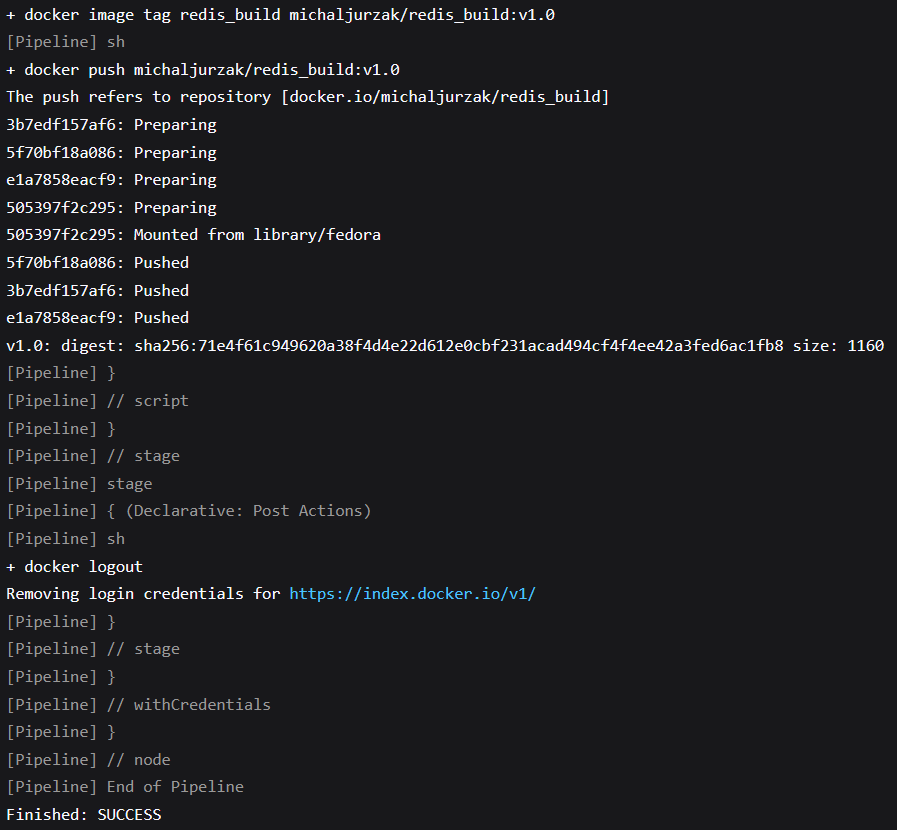


### Deploy
Na tym etapie, możemy pobrać upubliczniony przez nas obraz aby go uruchomić następnie i sprawdzić, czy działa. Redis ma kilka sposobów instalacji, jednym z nich jest [obraz dockera](https://hub.docker.com/_/redis) dostępny publicznie wraz z załączoną instrukcją. W moim przypadku, wystarczającym, aby sprawdzić, czy wszystko działa poprawnie jest uruchomienie kontenera i sprawdzenie wersji. 

Możliwe jest także uruchomienie testów, lecz nie jest to konieczne do uruchomienia programu 
> NOTE: Niejednokrotnie testy nie przechodzą po zbudowaniu pomimo braku zmian i pozornie bez powodu dlaczego nie za każdym razem przechodzą, najczęściej reset maszyny wirtualnej i/lub komputera rozwiązuje problem.

```groovy
stage('Deploy'){
    steps{
        script {
            sh "docker run --rm michaljurzak/redis_build:v1.0 sh -c 'src/redis-server & src/redis-cli --version && src/redis-cli shutdown'"
        }
    }
}
```

Output z konsoli:  

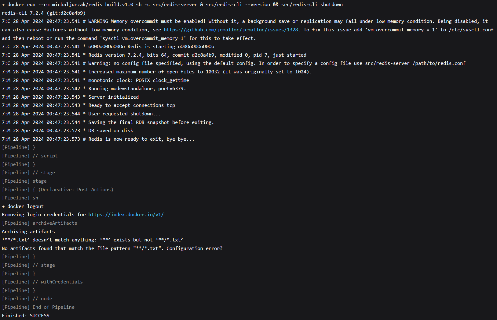

Na powyższym zrzucie ekranu widać jeszcze niepoprawnie zdefiniowany artefakt oraz wersjonowanie (placeholder), ale jest to zmienione w ostatecznym pipelinie na spakowany folder z redisem.

### Ostateczny pipeline:
Poniżej przedstawia się diagram UML z poszczególnymi krokami i wynikami stworzonego pipeline'u.  

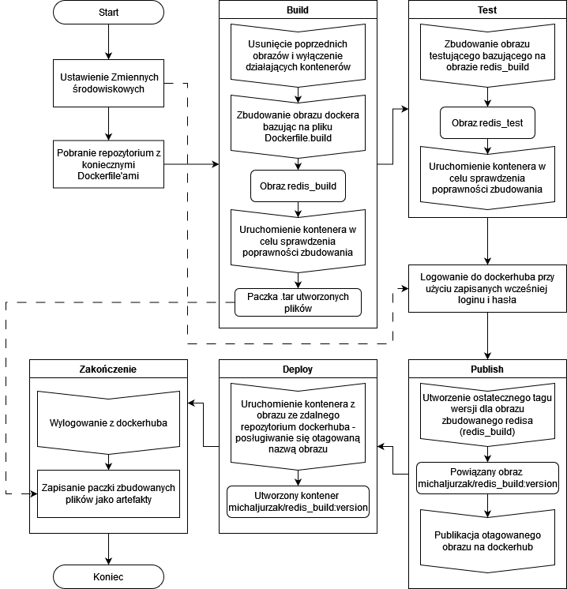

Poniżej się także przedstawia diagram zależności:  

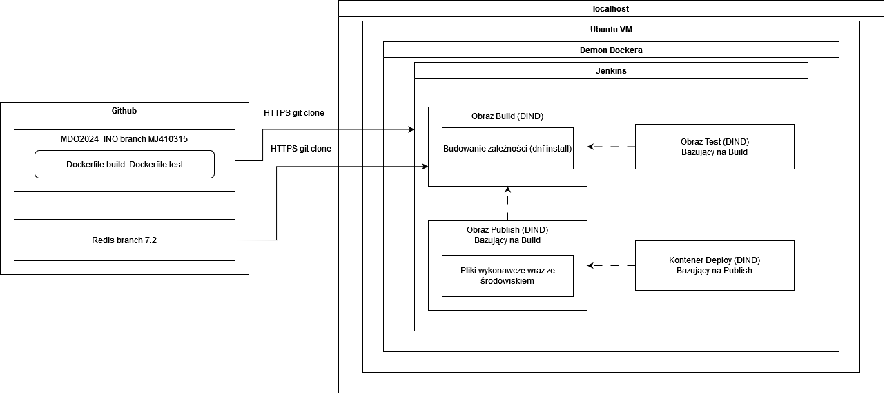


Odpowiadający kod:
```groovy
pipeline {
    agent any
    environment{
        DOCKERHUB_CREDENTIALS = credentials('docker-credentials')
        VERSION = 1
    }
    stages {
        stage('Download') {
            steps {
                script {
                    // Pobieranie repozytorium Git
                    git branch: 'MJ410315', 
                        url: 'https://github.com/InzynieriaOprogramowaniaAGH/MDO2024_INO.git'
                    
                    stash name:'scm', includes:'*'
                }
            }
        }
        
        stage('Build'){
            steps {
                unstash 'scm'
                script {
                    sh "docker system prune -a -f" // Usuwanie wszystkich obrazow
                    try{
                        sh 'docker stop $(docker ps -a -q)'
                    } catch (err) {
                        echo "Caught: ${err}"
                    }
                    sh """docker build -t redis_build \
                            -f INO/GCL1/MJ410315/Sprawozdanie2/dockerfiles/Dockerfile.build INO/GCL1/MJ410315/Sprawozdanie2/dockerfiles/"""

                    docker.image("redis_build").inside(){
                        sh "/redis/src/redis-server & /redis/src/redis-cli --version"
                        sh "tar -cf redis_${env.VERSION}_${BUILD_NUMBER}.tar /redis"
                        sh "/redis/src/redis-cli shutdown"
                    }
                }
                
            }
        }
        
        stage('Test'){
            steps {
                unstash 'scm'
                script {
                    sh """docker build -t redis_test \
                            -f INO/GCL1/MJ410315/Sprawozdanie2/dockerfiles/Dockerfile.test INO/GCL1/MJ410315/Sprawozdanie2/dockerfiles/"""
                    sh "docker run --rm redis_test sh -c 'src/redis-server & src/redis-cli --version && src/redis-cli shutdown'"
                }
            }
        }
        
        stage('Login'){
            steps{
                script{
                    sh "echo $DOCKERHUB_CREDENTIALS_PSW | docker login -u $DOCKERHUB_CREDENTIALS_USR --password-stdin"
                }
            }
        }
        
        stage('Publish'){
            steps{
                script {
                    sh "docker image tag redis_build michaljurzak/redis_build:${BUILD_NUMBER}"
                    sh "docker push michaljurzak/redis_build:${BUILD_NUMBER}"
                }
            }
        }
        
        stage('Deploy'){
            steps{
                script {
                    sh "docker run --rm michaljurzak/redis_build:${env.VERSION}.${BUILD_NUMBER} sh -c 'src/redis-server & src/redis-cli --version && src/redis-cli shutdown'"
                }
            }
        }
        
    }
    post {
        always {
            sh 'docker logout'
            archiveArtifacts artifacts: 'redis_${env.VERSION}_${BUILD_NUMBER}.tar', "$JENKINS_HOME/jobs/$JOB_NAME/builds/$BUILD_NUMBER/log",
                                       allowEmptyArchive: true,
                                       fingerprint: true,
                                       onlyIfSuccessful: true
        }
    }
}
```

Tak przedstawia się wykonany pipeline, wraz z jego artefaktem w postaci obrazu dockera i spakowanych plików:  
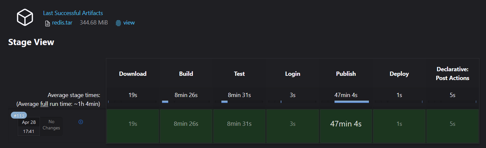

W tym kroku widać, że etap `Deploy` trwa natychmiast. dzieje się tak, ze względu na to, że w obecnym środowisku obraz jest obecny lokalnie. Aby być w 100% pewnym, że wysłany obraz jest ten sam, można najpierw wykonać komendę `docker rmi <obraz>`, następnie albo `docker pull <obraz>` albo od razu `docker run ...`. Krok ten nie jest konieczny, polegamy na prawidłowości działania dockera. Już wcześniej przetestowałem prawidłowe działanie tego mechanizmu na końcu podrozdziału `Deploy` tego sprawozdania.

W tym przypadku wersjonowanie odbywa się przez użycie utworzonej zmiennej `VERSION` w definiowaniu środowiska na początku pipeline'a oraz wbudowaniej zmiennej `BUILD_NUMBER`. Pozwala nam to w systematyczny sposób wersjonować artefakty jako wyniki builda. Jesteśmy w stanie wersjonować nasz pobrany artefakt w postaci obrazu i/lub paczki plików. Nie jest to koniecznie najlepszy sposób, lecz istnieją pluginy rozwiązujące podobny problem, w zależności od tego czy i gdzie publikujemy ten artefakt. Alternatywnie, możemy przesłać numer wersji i/lub wydania (release) przez dockerfile jako argument i wersjonować przez modyfikację kodu, co wydaje się najsensowniejszym sposobem.

Głównym artefaktem jest obraz dockera:  
```sh
michaljurzak/redis_build:${env.VERSION}.${BUILD_NUMBER}
```
Dodatkowym artefaktem jest także log z zapisu konsoli danego wykonania.

Dzięki modyfikacji komendy:  
```groovy
sh "tar -cf redis_${env.VERSION}_${BUILD_NUMBER}.tar /redis"
```

Jako, że deployment trwa długo, niektóre zrzuty ekranu pokazują zły numer wersji artefaktu zapisanego, podobnie jest z upublicznionym obrazem, jednakowoż mogę zapewnić, że powyższe komendy działają po puszczeniu wyłącznie etapu budowania ze zmienioną nazwą, co widać poniżej:

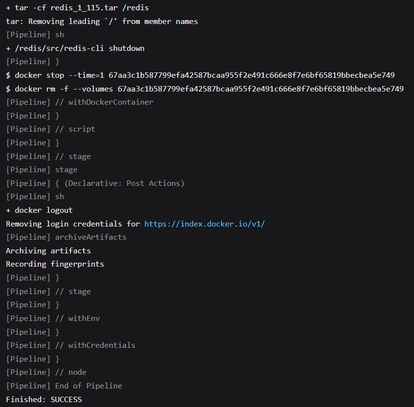

Gdzie 1 to numer wersji na początku, a 115 to numer builda. 

Zakończenie działa pipeline'a w konsoli:  
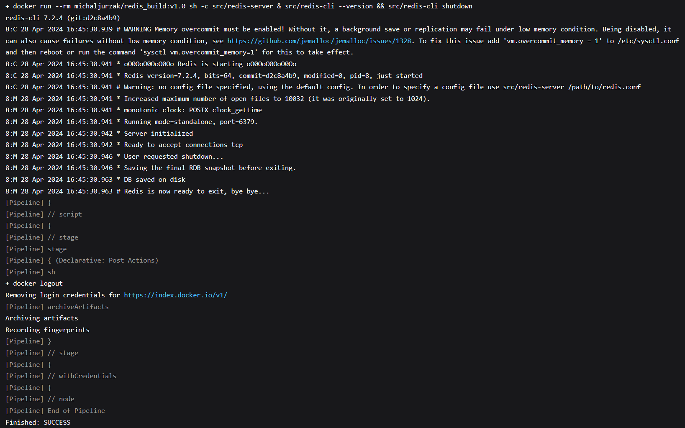

Podsumowując, wybrane artefakty służom dwóm celom: łatwemu deploymentowi w postaci publicznego obrazu dockera oraz w postaci plików: zweryfikowanie samej paczki plików związanych z oprogramowaniem redisa. 

Artefakt w postaci obrazu dockera można łatwo zweryfikować poprzez komendę  
```sh
docker image inspect <obraz>
```

W konsoli ukaże się wiele informacji, ale można potwierdzić pochodzenie obrazu patrząc na informację `"RepoDigests"`:  

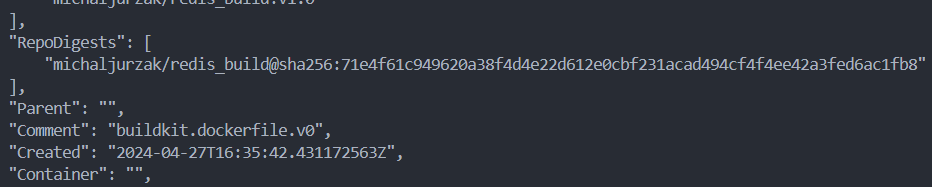

>NOTE: Użyte przeze mnie `Dockerfile.build` oraz `Dockerfile.test` znajdują się w folderze `Sprawozdanie2/dockerfiles`.

Na samym końcu warto jeszcze zaznaczyć, że diagram `UML` przedstawiający pipeline w poszczególnych etapach nie jest opisany w dogłębnych szczegółach, np. nie zawiera informacji o tym co się dzieje w poszczególnych Dockerfile'ach. Oprócz tego, nie bierze pod uwagę komend jakie się wykonują po uruchomieniu kontenerów i osoba, która widzi diagram pierwszy raz może go jedynie traktować jako wskazówkę, natomiast nie szczegółowo opisaną instrukcję, jednak umieszczony został także kod pipeline'u, także nie powinno to stanowić problemu.

Ostatecznie, według diagramu UML wynikowo powstaje nam kontener przy użyciu obrazu Publish. Jako, że obraz utworzony lokalnie i w chmurze jest ten sam, wykorzystuję ten otagowany obraz do stworzenia kontenera.

Tak się również przedstawia ścieżka krytyczna:

☑️ commit (lub manual trigger @ Jenkins)  
☑️ clone  
☑️ build  
☑️ test  
☑️ deploy  
☑️ publish  

Lista kontrolna:

☑️ Aplikacja została wybrana  
☑️ Licencja potwierdza możliwość swobodnego obrotu kodem na potrzeby zadania  
☑️ Wybrany program buduje się  
☑️ Przechodzą dołączone do niego testy  
☑️ Zdecydowano, czy jest potrzebny fork własnej kopii repozytorium  
☑️ Stworzono diagram UML zawierający planowany pomysł na proces CI/CD  
☑️ Wybrano kontener bazowy lub stworzono odpowiedni kontener wstepny (runtime dependencies)  
☑️ Build został wykonany wewnątrz kontenera  
☑️ Testy zostały wykonane wewnątrz kontenera  
☑️ Kontener testowy jest oparty o kontener build  
☑️ Logi z procesu są odkładane jako numerowany artefakt  
☑️ Zdefiniowano kontener 'deploy' służący zbudowanej aplikacji do pracy  
☑️ Uzasadniono czy kontener buildowy nadaje się do tej roli/opisano proces stworzenia nowego  
☑️ Wersjonowany kontener 'deploy' ze zbudowaną aplikacją jest wdrażany na instancję Dockera  
☑️ Następuje weryfikacja, że aplikacja pracuje poprawnie (smoke test)  
☑️ Zdefiniowano, jaki element ma być publikowany jako artefakt  
☑️ Uzasadniono wybór: kontener z programem, plik binarny, flatpak, archiwum tar.gz, pakiet RPM/DEB  
☑️ Opisano proces wersjonowania artefaktu (można użyć semantic versioning)  
☑️ Dostępność artefaktu: publikacja do Rejestru online, artefakt załączony jako rezultat builda w Jenkinsie  
☑️ Przedstawiono sposób na zidentyfikowanie pochodzenia artefaktu  
☑️ Pliki Dockerfile i Jenkinsfile dostępne w sprawozdaniu w kopiowalnej postaci oraz obok sprawozdania, jako osobne pliki  
☑️ Zweryfikowano potencjalną rozbieżność między zaplanowanym UML a otrzymanym efektem  
☑️ Sprawozdanie pozwala zidentyfikować cel podjętych kroków  
☑️ Forma sprawozdania umożliwia wykonanie opisanych kroków w jednoznaczny sposób  

## Definition of done:
**Czy opublikowany obraz może być pobrany z Rejestru i uruchomiony w Dockerze bez modyfikacji (acz potencjalnie z szeregiem wymaganych parametrów, jak obraz DIND)?**

Tak, może być pobrany bez problemu, wystarczy załączyć numer wersji do nazwy użytkownika i repozytorium. Aby kontener funkcjonował tak, by program `Redis` działał prawidłowo, trzeba go uruchomić z opcjami tak jak DIND, ponieważ najczęściej chcemy, aby to narzędzie działąło w tle jako serwer.

**Czy dołączony do jenkinsowego przejścia artefakt, gdy pobrany, ma szansę zadziałać od razu na maszynie o oczekiwanej konfiguracji docelowej?**

Tak, jest to możliwe, artefakt posiada pliki binarne oraz związane z projektem. Jedynie nie jest możliwe korzystanie z pełni narzędzi jeśli niektóre narzędzia nie są zainstalowane, takie jak `make` lub `tcl`, które są konieczne aby móc przetestować ten program, lecz nie są konieczne aby program działał prawidłowo.

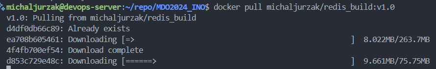
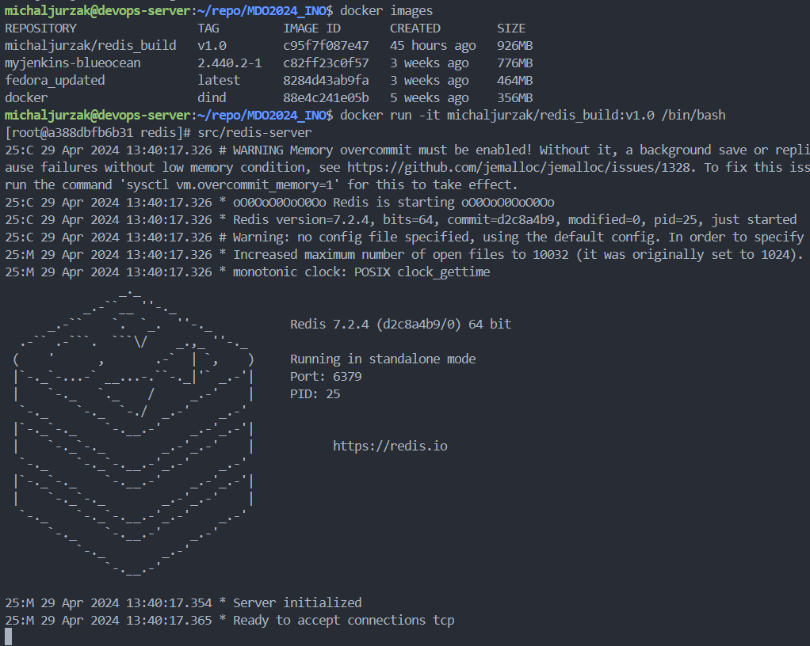