# Sprawozdanie 4

## Automatyzacja i zdalne wykonywanie poleceń za pomocą Ansible

### Instalacja zarządcy Ansible
Aby poprawnie wykonać to zadanie konieczne było stworzenie drugiej maszyny wirtualnej na moim komputerze przy użyciu VirtualBoxa. Zainstalowałem drugi raz ubuntu w wersji 22.04 - jest to identyczny system jak w przypadku głównej maszyny.

Podczas tworzenia maszyny wirtualnej zapewniłem, że użytkownik nazywa się `ansible`, hostname to `ansible-target` oraz na końcu zrobiłem migawkę maszyny.

Oprogramowanie tar już było obecne na tej wersji, natomiast OpenSSH należało zainstalować komendą
```sh
sudo apt install openssh-client
```

Połączenie obu maszyn tak, by się widziały należało wykonać z niewielkimi przeszkodami. Pierwszym krokiem była zamiana typu sieci w jakiej te maszyny się znajdowały - NAT na NAT Network. To pozwala zapewnić, że obie te maszyny są w jednej sieci i możliwe jest ustanowienie połączenia między nimi.

Po tym kroku, sprawdzenie komendą ifconfig pozwala sprawdzić IP konkretnej maszyny. Maszyna o nazwie `ansible-target` w moim przypadku posiada IP 10.0.2.15, a główna maszyna: `10.0.2.4`.

Aby móc utworzyć połączenie ssh bez konieczności użycia klucza, konieczne jest wykonanie komendy:

```sh
ssh-keygen -t rsa -f ~/.ssh/ansible
```

gdzie flaga `-t` oznacza sposób szyfrowania, natomiast `-f` nazwę pliku do jakiego klucz ma być zapisany.

Przez to, że korzystamy z niedomyślnego klucza ssh należy do pliku `~/.ssh/config` dopisać:
```sh
Host ansible-target
    HostName 10.0.2.15 //ip ansible-target
    User ansible
    IdentityFile ~/.ssh/ansible
```

Potem konieczne jest skopiowanie klucza publicznego do pliku ~/.ssh/known_hosts:
```sh
ssh-copy-id -i ~/.ssh/ansible ansible@ansible-target
```

Dzięki temu, po wpisaniu:
```sh
ssh ansible@ansible-target
```

można bez podania klucza się połączyć z maszyną docelową, co widać na poniższym zrzucie ekranu:

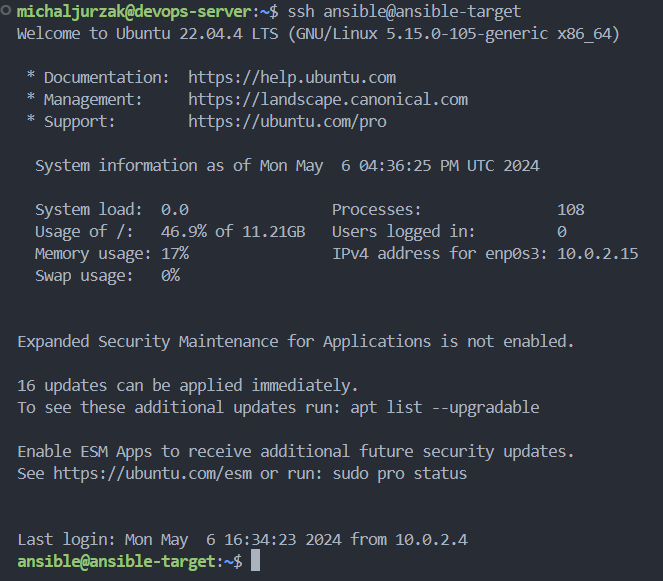

### Inwentaryzacja

Dzięki komendzie `hostnamectl` jesteśmy w stanie wyciągnać potencjalne nazwy komputerów. Aby nie musieć wywoływać maszyn jedynie poprzez ich adres IP należy wprowadzić nazwy DNS. W pliku /etc/hosts wystarczy dodać linijkę z adresem IP i po spacji nazwę do jakiej chcemy się odwoływać:

```
10.0.2.15 ansible-target
```

Mechanizm działa co widać na poniższym zrzucie ekranu:  

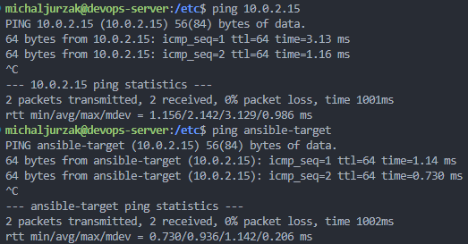


Następnym krokiem jest stworzenie pliku inwentaryzacji. Istnieją dwa sposoby: *inventory.ini* lub *inventory.yml*. W [dokumentacji ansible](https://docs.ansible.com/ansible/latest/getting_started/get_started_inventory.html#get-started-inventory) na początku proponują użycie tej pierwszej metody, ale drugi sposób staje się rozsądniejszym, kiedy ilość węzłów wzrasta. Jako, że posiadamy jedynie jeden, to format `.ini` jest lepszym w tym przypadku.

Poniżej przedstawia się stworzona treść pliku:  
```
[Orchestrators]
devops-server

[Endpoints]
ansible-target
```

Następnie jesteśmy w stanie zweryfikować inwentarz po wykonaniu komendy:
```sh
ansible-inventory -i inventory.ini --list
```

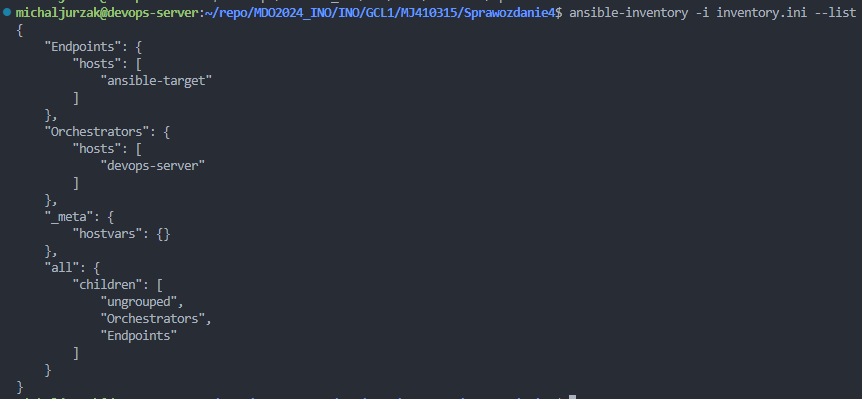

Jeśli plik posiada błędy, zostanie to zwrócone w ostrzeżeniach lub błędach.

Wysłanie żądania `ping` do wszystkich maszyn odbywa się poprzez połączenie ssh. Najwięcej ma sensu wysłanie pingu wyłącznie do maszyn z grupy `Endpoints`, jednakowoż, aby wysłać do *każdej* maszyny w naszym inwentarzu, konieczne jest dodanie kolejnego klucza do "samego siebie", czyli do IP 127.0.1.1, w przeciwnym wypadku konieczne będzie podanie hasła, a ansible zwróci błąd, dlatego też dodałem klucz jak wcześniej, ale dodałem go do pliku authorized_keys na tej samej maszynie.

Poniżej przedstawia się komenda wysłania pingu do grupy `Endpoints`:
```sh
ansible Endpoints -m ping -i inventory.ini
```

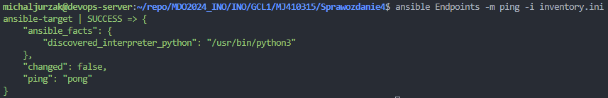


Poniżej w przypadku wysłania do wszystkich maszyn (włącznie z orkiestratorem):  

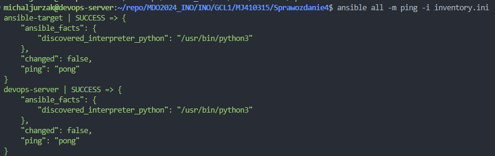

Łączność między maszynami (endpointem a orkiestratorem) została zapewniona.

### Zdalne wywoływanie procedur

Rozpocząłem ten podpunkt od stworzenia pliku `playbook.yml` (alternatywnie: *.yaml*) według [oficjalnej dokumentacji](https://docs.ansible.com/ansible/latest/getting_started/get_started_playbook.html)  

Playbooki to projekt automatyzacji w formacie `YAML`, dzięki któremu użytkownicy Ansible mogą wdrażać i konfigurować węzły na których działają.

Zadaniem playbooka jest wysłanie żądania `ping` do wszystkich maszyn, skopiowanie pliku inwentaryzacji na maszynę `Endpoints`, ponowienie operacji a następnie zaktualizowanie pakietów systemowych i restart usług `sshd` i `rngd`.

Usługa rngd nie istniała wcześniej na moim systemie ubuntu, co trzeba było zainstalować.
  
Treść tego pliku przedstawia się jak poniżej:
```yml
- name: Ping all machines
  hosts: all
  tasks:
  - name: Ping machines
    ping:
    
- name: Copy inventory
  hosts: Endpoints
  tasks:
  - name: Copy
    copy:
      src: ~/repo/MDO2024_INO/INO/GCL1/MJ410315/Sprawozdanie4/inventory.ini
      dest: ~/copied_inventory/inventory.ini

  - name: Copy (again)
    copy:
      src: ~/repo/MDO2024_INO/INO/GCL1/MJ410315/Sprawozdanie4/inventory.ini
      dest: ~/copied_inventory/inventory.ini

- name: Update package
  hosts: Endpoints
  vars:
    ansible_become_pass: ansible # Password is ansible in this case
  tasks:
  - name: update
    become: yes
    apt:
      name: "*"
      state: latest
  
- name: Restart sshd and rngd
  hosts: Endpoints
  vars:
    ansible_become_pass: ansible
  tasks:
  - name: Restart sshd
    become: yes
    service:
      name: sshd
      state: restarted
      
  - name: Restart rngd
    become: yes
    service:
      name: rngd
      state: restarted
```

Aby uruchomić takie polecenia takiego jak `sudo apt update` konieczne okazało się użycie słowa kluczowego `become=yes` i podania hasła do admina: `ansible_become_pass`, w przeciwnym wypadku ansible nie jest w stanie wykonać tego polecenia. Ostatecznie, uruchomienie odbywa się przy pomocy komendy:  

```sh
ansible-playbook -i inventory.ini playbook.yaml
```

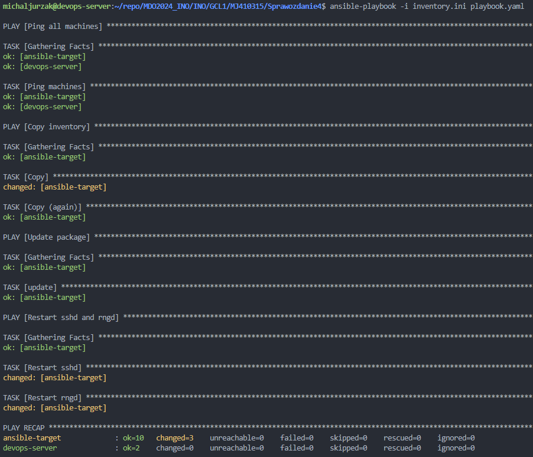

Jak widać, po ponownym uruchomieniu polecenia skopiowania, okazało się, że flaga `changed` zmieniła się na `ok`, co znaczy, że nie była wykonana zmiana na systemie. Sumarycznie, 3 zmiany zostały zarejestrowane na systemie `ansible-target`: pierwsze kopiowanie oraz restart dwóch usług.

Jak natomiast zachowa się ten sam playbook, kiedy maszyny są niedostępne? Aby to sprawdzić, można wyłączyć kartę sieciową i serwer ssh:  

```sh
sudo ifconfig enp0s3 down
sudo systemctl stop ssh
```
Gdzie `enp0s3` to jest nazwa naszego urządzenia ubuntu. Wykonałem te komendy prosto na serwerze (bez użycia ssh):  

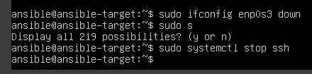


Wykonanie playbooka odbywa się za pomocą identycznego polecenia jak wcześniej i wynik jest następujący:  

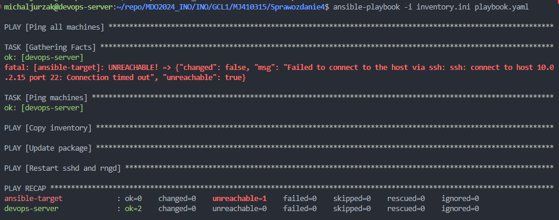

Błąd jaki wyskakuje oznacza, że ansible nie jest w stanie połączyć się z maszyną i kończy działanie playbooka. Ostatecznie, aby móc się znów połączyć do serwera, włączyłem ponownie sieć i ssh.

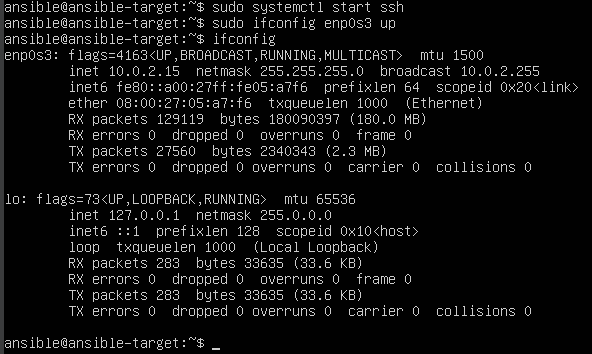


### Zarządzanie kontenerem

W tym kroku należy użyć obrazów z poprzednich laboratoriów w celu uruchomienia ich kontenerów (naszej zbudowanej aplikacji). W moim przypadku, jest to `Redis`, którego udostępniłem na dockerhubie jako obraz `michaljurzak/redis_build:v1.0`. To jest taki sam obraz, jak w etapie `Build` a także `Publish`, dlatego ograniczyłem się wyłącznie do pobrania tego obrazu i uruchomienia go na drugiej maszynie wirtualnej.

Na samym początku chciałem przetestować czy się kontener uruchamia. Poniżej załączony kod playbooka:

```yaml
- name: Install docker
  hosts: Endpoints
  vars:
    ansible_become_pass: ansible
  tasks:
  - name: Install / ensure installation
    become: yes
    apt:
      name: docker.io
      state: latest
  
  - name: start on boot
    become: yes
    command: systemctl enable --now docker
  
- name: Download Redis Image
  hosts: Endpoints
  vars:
    ansible_become_pass: ansible
  tasks:
  - name: check if volume exists
    become: yes
    command: docker volume inspect vol
    register: vol_exists_result
    failed_when: false
    
  - name: create vol
    when: vol_exists_result is failed
    command: docker volume create vol
  
  - name: download and run
    become: yes
    community.docker.docker_container:
      name: ansible_redis
      image: michaljurzak/redis_build:v1.0
      command: ./src/redis-server
      state: started
      recreate: true
      volumes:
      - vol:/redis
      exposed_ports:
      - 6379
```

Wyniki w konsolach są następujące:

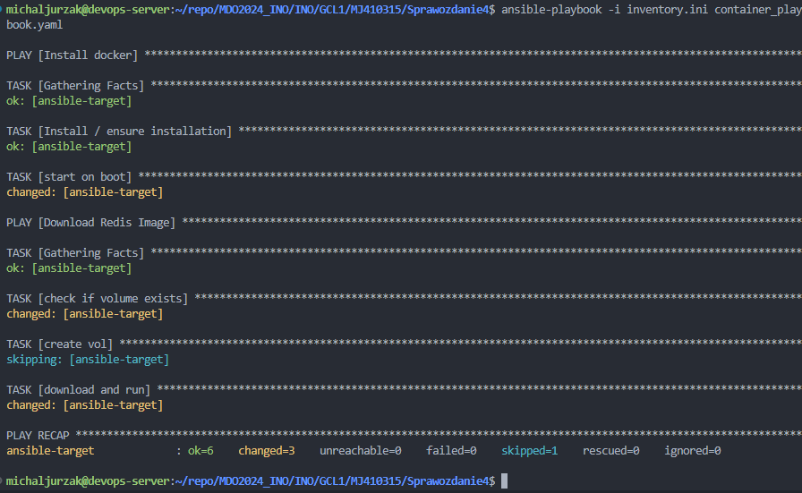
 
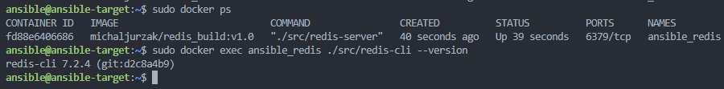

Jak widać, poprawnie zostało zaimplementowane pobranie dockera i utworzenie wolumenu (jeśli nie istnieje już taki). Dzięki modułowi `community.docker.docker_container` jesteśmy w stanie utworzyć nowy kontener bazując na danym obrazie. W tym przypadku, domyślnie ustawione jest, aby brakujący obraz pobrać z repozytorium dockerhuba. Dodatkowo istnieją takie opcje jak: `state`, który oznacza w tym przypadku uruchomienie, ale może być np. `present`, który wyłącznie tworzy kontener. `recreate` zapewnia ponowne utworzenie kontenera, `command` wykonuje daną komendę, w tym przypadku uruchomienie usługi redisa. Można także załączyć woluminy i wyeksponować porty, tu: domyślny port redisa `6379`.

Można zatem przejść do automatycznego zatrzymania i usuwania kontenera.

Do wyżej załączonego kodu, aby usunąć kontener, należy dołączyć poniższy fragment:

```yaml
- name: Stop and remove container
  hosts: Endpoints
  vars:
    ansible_become_pass: ansible
  tasks:
  - name: stop and remove container
    become: yes
    community.docker.docker_container:
      name: ansible_redis
      state: absent
```

Zasadniczo, usunięcie polega na zmianie stanu na `absent`. Według [dokumentacji](https://docs.ansible.com/ansible/latest/collections/community/docker/docker_container_module.html#parameter-state), oznacza to zatrzymanie i usunięcie.

Ustatecznie w konsoli wygląda to następująco:

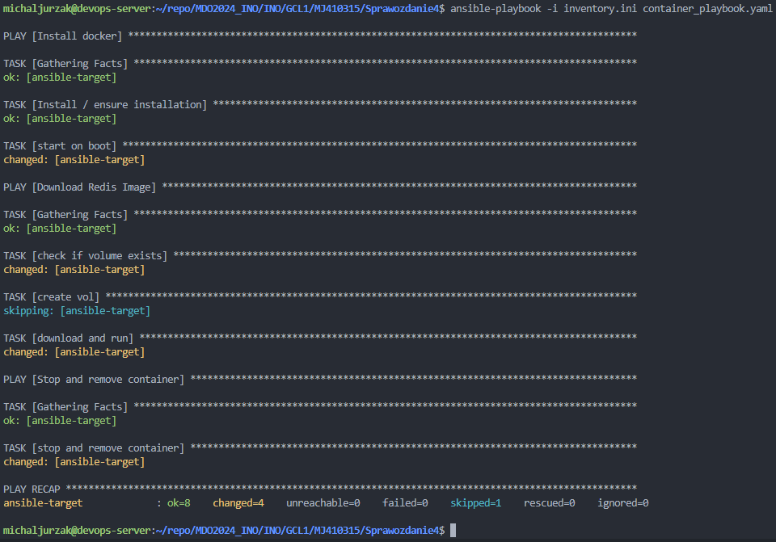


Poniżej także można zauważyć, że na drugiej maszynie nie ma żadnego kontenera, natomiast pozostał wolumin którego nie usuwaliśmy ręcznie:
  
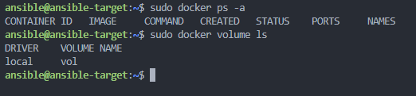

Ostatni punkt tego laboratorium polegał na ubraniu tych kroków w rolę używając szkieletowania `ansible-galaxy`.

Nie jest oczywiste jak do tego zagadnienia podejść, natomiast wykorzystałem jedno z [tego poradnika](https://www.cherryservers.com/blog/ansible-roles-tutorial), które przedstawia generalny zarys i proste zagadnienie, dlatego zmieniłem analogicznie do mojego problemu.

Rozpoczynamy poprzez stworzenie folderu `~/ansible/roles` w którym będziemy przetrzymywać role. Następnie, aby stworzyć pierwszą rolę skorzystamy z komendy:  

```sh
ansible-galaxy init redis_container
```

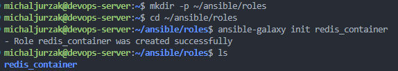

Wewnątrz tej roli stworzone zostały kolejne foldery a ich struktura jest następująca:

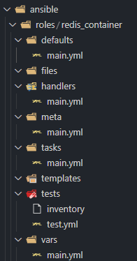

W poradniku jest napisane, że w `default/main.yml` znajdują się zmienne niskiego priorytetu, dlatego w tym przykładzie możemy to pominąć, tak samo jak utworzenie templatki w kroku 4 poradnika.

Główna zmiana nastąpiła w kroku 5 poradnika, gdzie należało zmienić w lokalizacji `tasks/main.yml` nieco zawartość playbooka tak, by to były wyłącznie taski. Zmieniona zawartość u mnie wygląda jak poniżej:

```yaml
---
# tasks file for redis_container
- name: Install docker
  become: yes
  vars:
    ansible_become_pass: ansible
  apt:
    name: docker.io
    state: latest

- name: start on boot
  vars:
    ansible_become_pass: ansible
  become: yes
  command: systemctl enable --now docker

- name: check if volume exists
  vars:
    ansible_become_pass: ansible
  become: yes
  command: docker volume inspect vol
  register: vol_exists_result
  failed_when: false

- name: create vol
  vars:
    ansible_become_pass: ansible
  become: yes
  when: vol_exists_result is failed
  command: docker volume create vol

- name: download and run
  vars:
    ansible_become_pass: ansible
  become: yes
  community.docker.docker_container:
    name: ansible_redis
    image: michaljurzak/redis_build:v1.0
    command: ./src/redis-server
    state: started
    recreate: true
    volumes:
    - vol:/redis
    exposed_ports:
    - 6379

- name: stop and remove container
  vars:
    ansible_become_pass: ansible
  become: yes
  community.docker.docker_container:
    name: ansible_redis
    state: absent
```

I to wszystko w kwestii modyfikacji istniejących plików. Dla wygody, skopiowałem plik inwentaryzacji `inventory.ini` do folderu `ansible`, a w nim utworzyłem także nowy playbook `role_playbook.yaml`, którego zawartość jest niezwykle prosta:

```yaml
- name: Run redis
  hosts: Endpoints
  roles:
  - redis_container
```

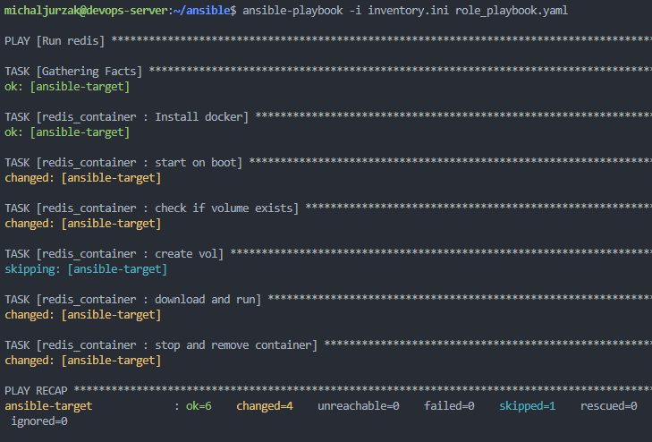

Jak widać, wynik jest ten sam, a role pozwalają na znaczne uproszczenie ostatecznego playbooka. Warto jedynie udokumentować role, ponieważ dodajemy kolejny poziom abstrakcji.

Na sam koniec, skopiowałem folder `ansible` zawierający ostatni playbook i wszystkie role do folderu ze sprawozdaniem.