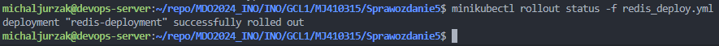
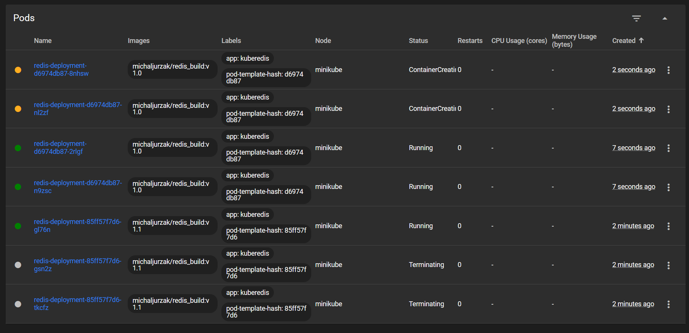

# Sprawozdanie 5

## Wdrażanie na zarządzalne kontenery: Kubernetes (1)

### Instalacja klastra kubernetes

Zajęcia te skupiają się na *kubernetesie* który jest rozbudowanym narzędziem używającym dockera i kontenery w celu wdrażania, zarządzania i skalowania aplikacji.

Pracę z `K8s` zaczynamy poporzez otwarcie [dokumentacji minikube](https://minikube.sigs.k8s.io/docs/start/). Wybrałem dla swojego systemu `ubuntu` instalator dla `Debiana`, aby to zrobić wystarczy poniższe komendy wykonać:

```sh
curl -LO https://storage.googleapis.com/minikube/releases/latest/minikube_latest_amd64.deb
sudo dpkg -i minikube_latest_amd64.deb
```

Po pobraniu następną komendą jest `minikube start` aby rozpocząć działanie clustera. W moim przypadku nie napotkałem na żadne błędy, ale w przypadku ich zaistnienia warto odnieść się do dokumentacji.


W przypadku braku błędów, kubernetes uruchamia się w kontenerze, co można zauważyć przez `docker ps`:


Następnie, minikube może pobrać odpowiednią wersję kubectl, można zobaczyć uruchomiony cluster komendą:

```sh
minikube kubectl -- get po -A
```


W dokumentacji jest też rekomendacja ułatwienia pracy komendą:

```sh
alias kubectl="minikube kubectl --"
```
Lub też
```sh
alias minikubectl="minikube kubectl --"
```


Konieczne jest natomiast uruchamianie tej komendy za każdym razem gdy uruchamiamy nowy terminal.

Ostatecznie, łatwiej jest korzystać z tego programu w interfejsie graficznym, co można zrobić przez uruchomienie panelu:

```sh
minikube dashboard
```


Warto też mieć na uwadze:
- Za pierwszym razem uruchomienie może trwać nieco dłużej
- Łącząc się poprzez Vscode z maszyną wirtualną, środowisko automatycznie ustawia dla nas na niej serwer, a wraz z nim automatyczne przekazywanie portów
- W przypadku innego edytora, lub posiadania błędów w uruchomieniu w przeglądarce, konieczne może okazać się skorzystanie z dodatkowych programów umożliwiających uruchomienie programu na maszynie wirtualnej, ale wyświetlanie w przeglądarce na hoście.


Poniżej widać rezultat w przeglądarce. Port przy uruchamianiu dashboarda jest dobierany losowo, lecz można go także ustalić przy dobraniu odpowiedniej opcji.


## Koncepcje funkcji wprowadzonych przez kubernetesa (pod, deployment itd)

### Analiza posiadanego kontenera

Niemal od początku zajęć z Metodyki DevOps wybrałem program `Redis`. Rozwiązanie jest niejednokrotnie stosowane i przygotowane do działania w kubernetesie, jak widać w ich [oficjalnej dokumentacji](https://redis.io/docs/latest/integrate/redis-data-integration/installation/install-k8s/), dlatego jest to całkiem dobry wybór. Przygotowany przeze mnie obraz jest już w dockerhubie w repozytorium `michaljurzak/redis_build:v1.0`. Jest to wynik pipeline'u Jenkinsa. 


Program oczywiście działa w kontenerze, co było wykazywane w poprzednich laboratoriach.

### Uruchamianie oprogramowania

Początkowe uruchomienie przeze mnie tworzyło `deployment` o nazwie `kuberedis`:
```sh
minikubectl create deployment kuberedis --image=michaljurzak/redis_build:v1.0
```


Uruchomienie na stronie wygląda jak poniżej:


Ale po chwili da się zauważyć błąd:


`CrashLoopBackOff`. Ten błąd nie jest bezpośrednim błędem. Warto przyjrzeć się [temu poradnikowi](https://kodekloud.com/blog/what-is-kubernetes-back-off-restarting-failed-container-error/), który wyjaśnia krok po kroku jak podejść do rozwiązania. W moim przypadku skuteczne okazało się sprawdzenie dokładniejsze tego poda:

```sh
minikubectl describe pod kuberedis
```


Okazuje się że kontener zakończył swoje działanie. Należy zatem dodać komendę uruchomienia. Dla kontenera redisa jest to `redis-server`, aby uruchomić aplikację. W laboratoriach jest natomiast komenda:

```sh
minikubectl run kuberedis --image=michaljurzak/redis_build:v1.0 --port=6379 --labels=app=kuberedis --restart=Never --command -- ./src/redis-server 
```


Gdzie `kuberedis` to nazwa wdrożenia, `--port` eksponuje konkretny port, domyślny dla `redisa` jest `6379`, `restart` oznacza zachowanie poda po zakończeniu jego działania i na końcu `command` ustawia customową komendę do wykonania na podzie.

W tym przypadku już się uruchamia poprawnie i zostaje uruchomiony program:


Ostatecznie, komendą

```sh
minikubectl port-forward pod/kuberedis 6379:6379
```

Ustawiamy przekierowanie portów. Aby się połączyć z redisem, najlepszy i rekomendowany sposób polega na użyciu [`RDI`](https://redis.io/docs/latest/integrate/redis-data-integration/installation/install-rdi-cli/) (Redis Data Integration). 

W tym przypadku, żeby jednak pokazać że program działa, wystarczy na uruchomionym podzie wykonać jakąś komendę, np. `redis-cli --version`:


Gdzie wykonana komenda:

```sh
minikubectl exec kuberedis -- ./src/redis-cli --version
```

Zwraca wynik:


Co jest oczekiwane.

## Wdrażanie na zarządzalne kontenery: Kubernetes (2)

Druga część tych laboratoriów skupia się na etapie wdrażania - istnieją różnie rodzaje wdrożeń, sposoby ich i skalowalność. W tym sprawozdaniu przedstawię niektóre informacje z tym związane.

Ze względu na ograniczenia sprzętowe postanowiłem nieco ograniczyć skalowanie.

### Konwersja wdrożenia ręcznego na wdrożenie deklaratywne YAML

Pierwszym krokiem było wzbogacenie naszego obrazu o 4 repliki. Ja na początku użyłem 3 replik (w sumie 5 podów), co widać na poniższym kodzie - zawartości pliku konfiguracyjnego *redis_deploy.yml*:

```yml
apiVersion: apps/v1
kind: Deployment
metadata:
  name: redis-deployment
  labels:
    app: kuberedis
spec:
  replicas: 4
  selector:
    matchLabels:
      app: kuberedis
  template:
    metadata:
      labels:
        app: kuberedis
    spec:
      containers:
      - name: kuberedis
        image: michaljurzak/redis_build:v1.0
        ports:
        - containerPort: 6379
        command: ["./src/redis-server"]
```

Wzorowałem się na przykładowym pliku z [dokumentacji kubernetesa](https://kubernetes.io/docs/concepts/overview/working-with-objects/).

Aby plik można było zastosować jako wdrożenie, konieczne było uruchomienie poprzez komendę:
```sh
minikubectl apply -f redis_deploy.yml
```


Sprawdzenie statusu deploymentu można sprawdzić na kilka sposobów. Jednym z nich jest bezpośrednie odwołanie się do pliku odpowiadającego za wdrożenie za pomocą flagi `-f`:

```sh
minikubectl rollout status -f redis_deploy.yml
```



Zamiennie można używać także sprawdzenia poprzez odniesienie się do typu `deployment`:

```sh
minikubectl rollout status deployment redis-deployment
```

Wynik wdrożenia na stronie głównej przedstawia się następująco na stronie głównej, gdzie widać działające 4 pody w ramach jednego deploymentu:


A także w sekcji `Pods`:


### Przygotowanie nowego obrazu

Aby móc pracować na nowych wersjach można sztucznie wykreować nową wersję obrazu (praktycznie nic oprócz tagu nie zmieniając) poprzez uruchomienie kontenera i użycie komendy `docker commit`. W moim przypadku najpierw uruchomiłem kontener `michaljurzak/redis_build:v1.0` który miałem już lokalnie, a następnie po sprawdzeniu jego ID w uruchomionych kontenerach (`docker ps`) zrobiłem commita. Komenda była według wzoru:

```sh
docker commit <id kontenera> michaljurzak/redis_build:v1.1
```

To pozwoliło na utworzenie nowego obrazu ze zmienionym tagiem, ale nie nazwą, co pozwoli znaleźć go w tym samym repozytorium dockerhuba zdalnie później. Konieczne jest jednak na początku przesłanie do dockerhuba, na co pozwala nam komenda 
```sh
docker push michaljurzak/redis_build:v1.1
```

Jeśli wyskakuje nam błąd braku dostępu, należy się zalogować do dockerhuba lokalnie przez:

```sh
docker login
```

W ten sposób stworzona została nowa wersja tego samego obrazu. Jednak aby stworzyć obraz który po uruchomieniu kończy się błędem, należy wrócić do Dockerfile'a i go zmodyfikować. Stworzyłem nowy `Dockerfile.error` który kończy działanie z kodem 1:

```Dockerfile
FROM fedora

RUN dnf install -y git wget make gcc tcl tcl-devel tk procps which zip && \
    git clone -b 7.2 --single-branch https://github.com/redis/redis.git
    
WORKDIR /redis

RUN make distclean & make

CMD ["false"]
``` 

Nie byłem pewien czy mam stworzony obraz lokalnie w dalszym ciągu ze względu na spory rozmiar (pomiędzy laboratoriami zwalniałem miejsce), dlatego zamiast bazować jak `FROM redis_build`, po prostu dodałem lijkę `CMD ["false"]`. Budowanie odbywa się jak poniżej:


Następnie, jako że stworzyłem inną nazwę obrazu, należy ten obraz otagować odpowiednio:


Postanowiłem przetestować jeszcze ten obraz aby sprawdzić, czy tak jak jest oczekiwane - zwraca błąd po zakończeniu działania. Jest to możliwe do zauważenia dzięki Visual Studio Code, które pokazuje akcje związane z daną wykonaną linijką kodu - widoczny jest kod 1, co oznacza błąd:


Ostatecznie, obrazy jakie są nam potrzebne widnieją w obrazach `docker images`.


A także w repozytorium zdalnym dockerhuba:


### Zmiany w deploymencie

Zaktualizowanie pliku YAML z wdrożeniem było niezwykle proste i szybkie, co pozwala na sprawną zmianę w ilości replik lub wersji obrazu. Rozpocząłem od zwiększenia liczby replik do 5:


Jak widać powyżej na dashboardzie, nowa replika została poprawnie wdrożona, a w terminalu zamiast początkowego komunikatu o stworzeniu deploymentu, jest informacja o zmianie konfiguracji:


Zmniejszenie do 1 poda:


A także zmniejszenie do 0 podów:


Utrzymanie deploymentu pomimo braków podów może być użyteczne jak np. debuggowanie, testowanie lub zwalnianie zasobów. 

Następnym krokiem jest przejście do zastosowania nowej wersji wystemu (w moim przypadku obraz `michaljurzak/redis_build:v1.1`):


W k8s domyślnym trybem aktualizacji jest `Rolling Updates` którego działanie zostanie omówione w późniejszym etapie sprawozdania, ale zasadniczo kubernetes tworzy nowe pody (z nową wersją) i podmienia stare na nowe zapewniając ciągłość działania. Widać to wyraźnie podczas zamiany z nowej na starą wersję obrazu:



Widać tu więcej kontenerów niż jest to potrzebne, a ich status się zmienia, by ostatecznie być aktywnym, a stare pody są usuwane. Szczegółowo można zauważyć, że nazwa starych kontenerów się nie potwarza (zostały zakończone):


W treści zadania tego nie ma, lecz przetestowałem także działanie kontenera który powinien zakończyć się błędem. Wcześniej jednak, zmieniłem ilość replik do 2.

> Note: Kontener nie zakończy działania, tym bardziej nie wyrzuci błędu, jeżeli zostanie na nim uruchomiona komenda (ostatnia linijka w pliku `YAML` - należy ją w tym przypadku usunąć, aby zasymulować wyrzucenie błędu)


Zrzut Ekranu przedstawia próbę uruchomienia przez Pod obrazu, który kończy działanie z błędem. Status to `Error`, a uruchomił ponownie kontener 2 razy. Domyślna polityka kubernetesa dotycząca błędów jest taka, że jeśli nie jest określone inaczej, z co raz większymi interwałami czasowymi (aby umożliwić naprawę błędu) będzie próbował uruchomić je ponownie. (*Patrz: `CrashLoopBackOff` podsekcja tego sprawozdania `Uruchamianie Oprogramowania`*)

Z tego wniosek płynie taki, że jeśli Pod nie jest w stanie wdrożyć kontenera, to tego nie zrobi, a Pody z obecną wersją będą dalej w produkcji.

Aby sprawdzić historię deploymentu użyjmy komendy:
```sh
minikubectl rollout history deployment redis-deployment
```

Przywrócenie poprzedniej wersji wdrożenia może się odbywać jak poniżej:

```sh
minikubectl rollout undo deployment redis-deployment
```

Domyślnie, kubernetes przyjmuję opcję `--to-revision=0`, co oznacza ostatni rollout deploymentu. Argument ten jest możliwy do zmiany.


### Kontrola wdrożenia

Aby uzyskać większą kontrolę wdrożenia, możemy komendę aplikowania pliku do deploymentu owrapować w skrypcie basha, a następnie skorzystać z dodatkowych narzędzi by osiągnąć zamierzone cele. W naszych laboratoriach konieczne było sprawdzenie, czy deployment wdraża się w przeciągu minuty. Stworzyłem prosty skrypt basha:

```sh
#!/bin/bash

MAX_WAIT_TIME=60
DEPLOYMENT_NAME="redis-deployment"
DEPLOYMENT_FILE="/home/michaljurzak/repo/MDO2024_INO/INO/GCL1/MJ410315/Sprawozdanie5/redis_deploy.yml"

minikube kubectl -- apply -f $DEPLOYMENT_FILE

minikube kubectl -- rollout status deployment/$DEPLOYMENT_NAME --timeout=${MAX_WAIT_TIME}s
ROLLOUT_STATUS=$?

START_TIME=$(date +%s)
END_TIME=$(date +%s)
ELAPSED_TIME=$((END_TIME - START_TIME))

if [[ $ROLLOUT_STATUS -eq 0 ]]; then
  echo "Deployment successfully rolled out in $ELAPSED_TIME seconds."
  exit 0
else
  echo "Deployment did not roll out within $MAX_WAIT_TIME seconds."
  exit 1
fi
```

Korzystam w nich z komend które już są znane, ale warto wyjaśnić poszczególne kroki:
- deklaracja zmiennych koniecznych w skrypcie
- wdrożenie pliku konfiguracyjnego wczytanego przez basha
- uruchomienie `rollout status` z flagą `--timeout`, która wyrzuca błąd po określonym czasu w przypadku braku sukcesu
- zapisanie wyniku komendy do zmiennej `ROLLOUT_STATUS`
- wypisanie wiadomości o wyniku wraz z czasem wdrożenia, lub w jakim czasie nie zostało zrealizowane uruchomienie.


W tym przypadku wdrożenie przebiegło pomyślnie.

### Strategie wdrożenia

Kubernetes stosuje różne formy wdrożenia: jest to kluczowa część działania tego programu i po stronie specjalistów DevOps leży zadbanie o prawidłowe wdrożenie. Domyślną strategią jest `RollingUpdate`, co zostało wcześniej krótko omówione. Strategia ta przyjmuje domyślnie argumenty `maxUnavailable` oraz `maxSurge`. Pierwszy z nich oznacza ile kontenerów może być wyłączonych z użytku, natomiast drugi, ile nowych kontenerów może stworzyć ponad to ile obecnie jest (aby móc sprawnie wykonać podmianę).

Strategię określa się w części `spec` pliku wdrożeniowego `yaml`. W przypadku pierwszej strategii: `Recreate`, deployment można stworzyć zarówno o osobnej nazwie jak i tej samej co poprzednie wdrożenie ze względu na brak konfliktu api:

```yml
apiVersion: apps/v1
kind: Deployment
metadata:
  name: redis-deployment #-recreate
  labels:
    app: kuberedis
spec:
  replicas: 5
  selector:
    matchLabels:
      app: kuberedis
  strategy:
    type: Recreate
  template:
    metadata:
      labels:
        app: kuberedis
    spec:
      containers:
      - name: kuberedis
        image: michaljurzak/redis_build:v1.0
        ports:
        - containerPort: 6379
        command: ["./src/redis-server"]
```
Powyższa strategia usuwa wszystkie działające kontenery i na ich miejsce dopiero tworzy nowe. Wadą tego podejścia jest pewien downtime, lecz wdrożenie to na pewno jest najszybsze i wymagające najmniejszej ilości alokowania dodatkowej pamięci, jednak nie każda usługa może sobie pozwolić na wyłączenie.

Stworzyłem dla tego wdrożenia także `Service`, który omówię w końcowej części tego sprawozdania, a także uruchomiłem je zaraz po uruchomieniu wdrożenia.

Omówiona wcześniej strategia `RollingUpdate` przedstawia się następująco:
```yml
apiVersion: apps/v1
kind: Deployment
metadata:
  name: redis-deployment #-rolling-update
  labels:
    app: kuberedis
spec:
  replicas: 5
  selector:
    matchLabels:
      app: kuberedis
  strategy:
    type: RollingUpdate
    rollingUpdate:
      maxUnavailable: 2
      maxSurge: 25%
  template:
    metadata:
      labels:
        app: kuberedis
    spec:
      containers:
      - name: kuberedis
        image: michaljurzak/redis_build:v1.1
        ports:
        - containerPort: 6379
        command: ["./src/redis-server"]
```

> Note: Pomiędzy poszczególnymi krokami eksperymentowałem z plikiem yaml, co oznacza, że wersje obrazu mogą się nie zawsze zgadzać. W przypadku braku zauważalnych zmian w deploymencie należy zmienić wersję obrazu.

Jak już zostało wspomniane wcześniej, strategia `RollingUpdate` stopniowo wyłącza z działania kontenery, a na ich miejsce wstawia nowo zaalokowane.


Ostatnim typem wdrożenia omawianym w tych laboratoriach jest Canary Deployment Workload. W tym przypadku, wdrożenie jest częściowe z założenia: Dla każdej wersji aplikacji jest ustawiane nowe wdrożenie - jedynie dla części użytkowników lub usług. Często stosowane w przypadku testowania (np. A/B). Aby rozróżnić dwie wersje można i stosuje się etykiety `track`, np dla testowanej `canary`, a dla stabilnej `stable`. Ja w moim przypadku zastosowałem wersjonowanie api `v2` dla testowej, ale konwencja może być różna.


Poniżej przedstawia się deployment obu wersji:


Kluczowe różnice pomiędzy powyższymi strategiami:

- `Recreate` - Zatrzymuje i wymienia wszystkie pody jednocześnie, powodując przestój aplikacji. Prosta implementacja, brak problemów z kompatybilnością, ale aplikacja jest niedostępna podczas aktualizacji.
- `RollingUpdate` - Stopniowa wymiana podów, utrzymując dostępność aplikacji. Minimalizuje przestoje i zapewnia ciągłą dostępność, ale może powodować problemy z synchronizacją danych i wymaga zgodności starych i nowych wersji.
- `Canary` - Nowa wersja aplikacji jest wdrażana dla części użytkowników. Umożliwia testowanie nowej wersji w ograniczonym zakresie przed pełnym wdrożeniem, pozwala na wczesne wykrywanie problemów, ale wymaga dodatkowej konfiguracji i zarządzania ruchem użytkowników.

#### Użycie serwisów:

W Kubernetesie, Service to abstrakcja, która definiuje logiczny zestaw podów i politykę dostępu do nich. Serwisy umożliwiają komunikację między różnymi komponentami aplikacji w klastrze, a także z aplikacjami spoza klastra lub wdrożenia.

Utworzyłem dwa pliki service, dla wdrożenia `Recreate` oraz `Canary` w wersji `v1`. Oba są niemal identyczne i są zamieszczone w folderze `deployments` w tym sprawozdaniu. Dla wdrożenia `Canary` przedstawia się jak poniżej:

```yml
apiVersion: v1
kind: Service
metadata:
  name: redis-service-canary
  labels:
    app: kuberedis
spec:
  selector:
    app: kuberedis
  ports:
  - protocol: TCP
    port: 6379
    targetPort: 6379
```

W obrębie tej samej aplikacji wszystkie porty będą weksponowane. Konieczne jest jeszcze przekierowanie portu:

```sh
minikubectl port-forward service/redis-service-canary 6379:6379
```

6379 to domyślny port dla `redisa`. 

Aby sprawdzić działanie przekierowania, najlepiej jest uruchomić `redis-cli` na maszynie innej niż na podzie. W tym przypadku nie jest automatycznie tworzone przekierowanie portu w Visual Studio Code (w przypadku użycia innego edytora może być konieczne użycie narzędzia które przekierowuje porty), dlatego jeśli nie działa program, warto ręcznie to zrobić (np. otwarcie palety komend `ctrl+shift+p`, wpisanie `Ports: Focus on Port View` w wersji angielskiej i następnie dodanie portu `6379`).

Ostatecznie, na mojej maszynie głównej znajduje się już narzędzie `redis-cli` (W przypadku jego braku warto skorzystać z [tego poradnika](https://redis.io/blog/get-redis-cli-without-installing-redis-server/)), a następnie by się połączyć z serwerem użyć komendy:

```sh
./redis-cli -h localhost -p 6479 # to są domyślne wartości
```

Potwierdzenie działania:


I po stronie serwera:


Ostateczne potwierdzenie to po wyłączeniu wszystkich podów/deploymentów/serwisów obsługujących naszej aplikacji, już nie będziemy w stanie się połączyć:

