# Sprawozdanie 1
Natalia Borysowska-Ślęczka, IO

## Cel projektu

## Streszczenie projektu

## Wykonane kroki

### 1. Instalacja klienta Git i obsługę kluczy SSH

Przygotowanie środowiska pracy należy rozpocząć od instalcji systemu operacyjnego Ubuntu(Linux) bez środowiska graficznego na maszynie wirtualnej.

Do zainstalowania klienta Git i obsługi kluczy na systemie Ubuntu używamy wbudowanego menedżera pakietów APT (Advanced Package Tool). Najpierw aktualizujemy listę dostępnych pakietów za pomocą komendy:

```sudo apt update```

Kolejnym krokiem jest instalacja klienta Git:

```sudo apt install git```

Aby upewnić się czy wszystko działa prawidłowo warto skorzystać z komendy git --version, która wyświetli aktualną wersję zainstalowanego gita.


Obsługę SSH instalujemy poleceniem:

```sudo apt install openssh-client```

Poprawność instalacji można sprawdzić komendą ssh -V, która wyświetli bieżącą wersję OpenSSH.

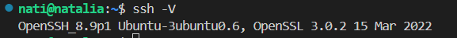


### 2. Klonowanie repozytorium przedmiotowego 

## 2.1 za pomocą HTTPS i personal access token
Do klonowania rezpozytorium za pomocą HTTPS użyjemy personal access tokenu, który jest alternatywą dla tradycyjnego uwierzytelniania poprzez hasło.
Token wygenerujemy na Githubie. Należy wejść w ustawienia konta na Githubie --> Developer settings --> Personal access tokens.

Oprócz tego potrzebujemy również link do repozytorium. Znajdziemy go na Githubie na stronie repozytorium (należy rozwinąć zielony przycisk code i skopiować link z zakładki HTTPS).

Teraz możemy sklonować repozytorium przedmiotowe.

Do tego użyjemy komendy:

```git clone https://wygenerowany_token@dalsza_część_linka_klonowanego_repozytorium```

Wygenerowanie personal access tokena pozwoliło nam na dostęp do klonowanego repozytorium bez konieczności użycia hasła.

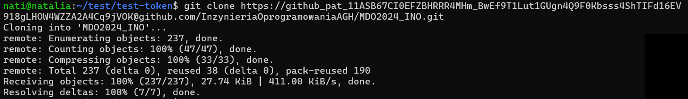

## 2.2 za pomocą klucza SSH

Klonowanie repozytorium przy użyciu SSH jest szybsze, wygodniejsze (nie trzeba podawać hasła ani tokenu przy każdej komendzie) oraz bardziej bezpieczne (klucz prywatny jest przechowywany lokalnie i nigdy nie jest przesyłany przez sieć).

Do tworzenia nowego klucza użyjemy polecenia:

```ssh-keygen -t typ_klucza```

Utworzyłam klucze: ed25519 oraz ecdsa.

Pierwszy klucz ed25519 to klucz bez hasła. Podczas generowania, gdy pojawił się komunikat: *Enter passphrase(empty for no passphrase)*, kliknęłam Enter, a klucz został utworzony bez hasła.

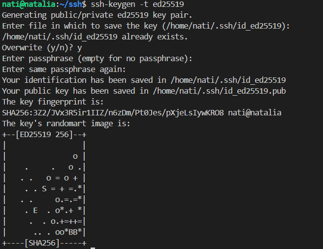

Drugi klucz ecdsa to klucz już z hasłem.

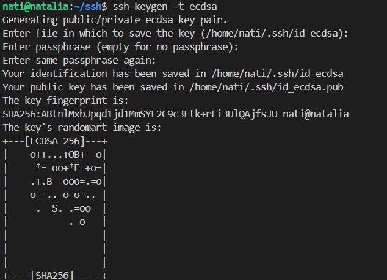

Klucze powstały w wersji publicznej, jak i prywatnej. Aby wyświetlić zawartość klucza publicznego użyjemy komendy:

```cat ~/.ssh/id_ed25519.pub```

```cat ~/.ssh/id_ecdsa.pub```

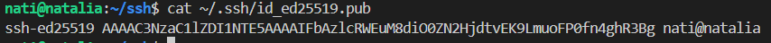

Wygenerowane klucze należy dodać do swojego konta GitHub (ustawienia konta na GitHubie --> SSH and GPG keys) -  w tym miejscu wklejamy zawartość klucza publicznego.

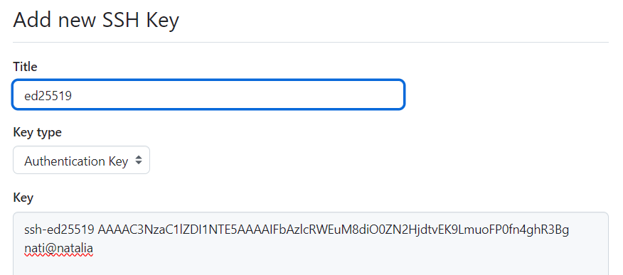
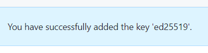
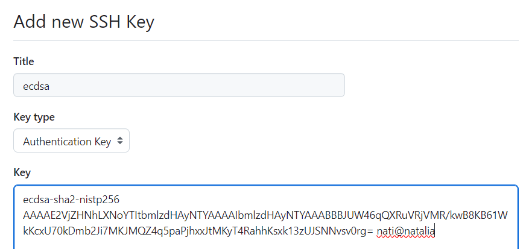
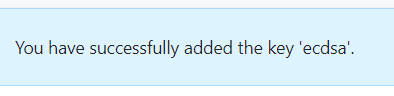

Teraz możemy sklonować repozytorium przy użyciu protokołu SSH. Użyjemy do tego komendy:

```git clone git@github.com:InzynieriaOprogramowaniaAGH/MDO2024_INO.git```

Link znajdziemy na Githubie na stronie repozytorium (należy rozwinąć zielony przycisk code i skopiować link z zakładki SSH).
Klonowanie przebiegło pomyślnie. 

Przed użyciem komendy git clone folder był pusty, natomiast po, pojawił się tam folder repozytorium przedmiotowego.

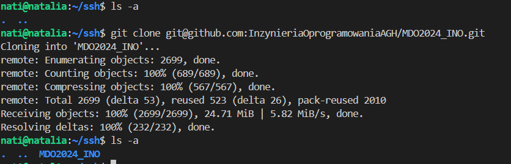

### 3. Przełączenie się na gałąź main oraz gałąź swojej grupy.

Gałęzie umożliwiają poruszanie się po repozytorium. Wchodzimy do folderu repozytorium komendą:

```cd MDO2024_INO/```

Domyślnie znajdujemy się na gałęzi main. Obecne położenie sprawdzamy za pomocą komendy: 

```git branch```

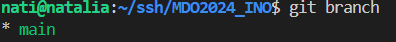

Jeśli chcemy zobaczyć wszystkie istniejące gałęzie możemy użyć polecenia: 

```git branch --all```

Dzięki temu zobaczymy, że istnieje tam gałąź GCL1 (gałąź grupy), do której się przenisiemy komendą:

```git checkout GCL1```

### 4. Utworzenie gałęzi o nazwie "NBS411634"

Po upewnieniu się, że jestem na gałęzi grupy (a nie na mainie), tworze swoją gałąź o nazwie złożonej z moich inicjałów oraz numeru indeksu.
Służy do tego komenda:

```git checkout -b NBS411634```

Użycie git checkout z opcją -b powoduje stworzenie gałęzi jeżeli taka jeszcze nie istnieje oraz od razu przejście na nią.

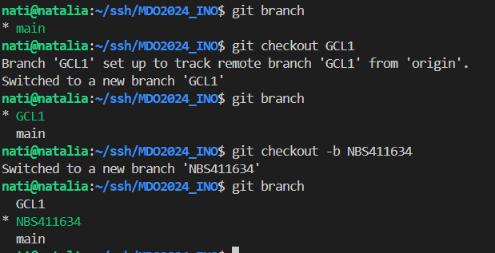

### 5. Pracę na nowej gałęzi

Po upewnieniu się, że znajduje się na swojej gałęzi przechodzę do folderu grupy (~/MDO2024_INO/INO/GCL1), gdzie tworze swój folder NBS411634 poleceniem:

```mkdir NBS411634```

Korzystając z przykładowych git hooków (czyli skryptów weryfikujących) zawartych w *.git/hooks* utworzyłam własny sprawdzający czy każdy commit zaczyna się od NBS411634 (inicjały oraz numer indeksu). Wykorzystuje do tego komendę:

```nano commit-msg```

Aby git hook działał, należy go skopiować do folderu .git/hooks komendą:

```cp ~/MDO2024_INO/INO/GCL1/MD409926/commit-msg ~/MDO2024_INO/.git/hooks```

Należy zmienić uprawnienie i git hookowi:

```chmod +x ~/MDO2024_INO/.git/hooks/commit-msg```

dzięki temu będzie on mógł być wykonywany. 

Teraz nasz git hook będzie uruchamiany przy każdym commicie.

Treść git hooke'a:

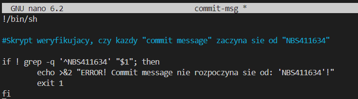

Będąc na swojej gałęzi możemy przetestować czy utworzony git hooke działa prawidłowo.

Błędny commit:

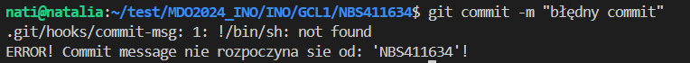

Prawidłowy commit:

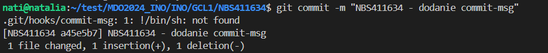

W katalogu NBS411634 tworzę katalog Sprawozdanie1:

```mkdir Sprawozdanie1```

Będąc w nowo utworzonym katalogu tworzę katalog o nazwie ss:

```mkdir ss```

w którym zostaną umieszczone zrzuty ekranu wykorzystywane przy tworzeniu sprawozdania.

Sprawozdanie w formacie "Markdown" tworzę poleceniem:

```nano Spr1.md```

Do sprawozdania zrzuty ekranu dodajemy (jako inline), po przez:

``````

## Wysłanie do zdalnego źródła

Aby przekazać zmiany do zdalnego repozytorium, wykonujemy trzy główne kroki:
* dodanie zmian

```git add```

dodajemy nowe/zmodyfikowane pliki do kolejki oczekujących na zatwierdzenie

* zatwierdzenie zmian

```git commit```

opisuje dodane lub zmienione elementy

* przesłanie zmian

```git push```

przesyłamy zatwierdzone zmiany z lokalnego urządzeni do repozytorium zdalnego

Aby kontrolować wprowadzone zmiany warto używać:

```git status```

Przykład:

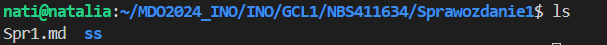

Wciągnięcie naszej gałęzi do gałęzi grupowej zczniemy od przejścia na gałęź grupy poleceniem:

```git checkout GCL1```

Następnie:

```git push```

aby przesłać nasze lokalne zmiany do zdalnego repozytorium (pozwala to na przykład na synchronizacje naszych zmian z resztą zespołu)

Na koniec:

```git merge NBS411634```

spowoduje złączenie zmian z gałęzi NBS411634 do bieżącej gałęzi GCL1 (umożliwia to np. zespołowi pracę nad wspólnym kodem)

*Zaktualizuj sprawozdanie i zrzuty o ten krok i wyślij aktualizację do zdalnego źródła (na swojej gałęzi)