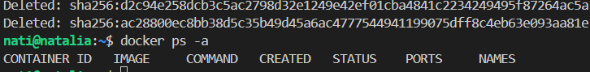

# Sprawozdanie 1
Natalia Borysowska-Ślęczka, IO

## Cel projektu

## Streszczenie projektu

## Wykonane kroki - laboratorium nr 1

### 1. Instalacja klienta Git i obsługę kluczy SSH

Przygotowanie środowiska pracy należy rozpocząć od instalcji systemu operacyjnego Ubuntu(Linux) bez środowiska graficznego na maszynie wirtualnej.

Do zainstalowania klienta Git i obsługi kluczy na systemie Ubuntu używamy wbudowanego menedżera pakietów APT (Advanced Package Tool). Najpierw aktualizujemy listę dostępnych pakietów za pomocą komendy:

```sudo apt update```

Kolejnym krokiem jest instalacja klienta Git:

```sudo apt install git```

Aby upewnić się czy wszystko działa prawidłowo warto skorzystać z komendy git --version, która wyświetli aktualną wersję zainstalowanego gita.


Obsługę SSH instalujemy poleceniem:

```sudo apt install openssh-client```

Poprawność instalacji można sprawdzić komendą ssh -V, która wyświetli bieżącą wersję OpenSSH.


### 2. Klonowanie repozytorium przedmiotowego 

# 2.1 za pomocą HTTPS i personal access token
Do klonowania rezpozytorium za pomocą HTTPS użyjemy personal access tokenu, który jest alternatywą dla tradycyjnego uwierzytelniania poprzez hasło.
Token wygenerujemy na Githubie. Należy wejść w ustawienia konta na Githubie --> Developer settings --> Personal access tokens.

Oprócz tego potrzebujemy również link do repozytorium. Znajdziemy go na Githubie na stronie repozytorium (należy rozwinąć zielony przycisk code i skopiować link z zakładki HTTPS).

Teraz możemy sklonować repozytorium przedmiotowe.

Do tego użyjemy komendy:

```git clone https://wygenerowany_token@dalsza_część_linka_klonowanego_repozytorium```

Wygenerowanie personal access tokena pozwoliło nam na dostęp do klonowanego repozytorium bez konieczności użycia hasła.


# 2.2 za pomocą klucza SSH

Klonowanie repozytorium przy użyciu SSH jest szybsze, wygodniejsze (nie trzeba podawać hasła ani tokenu przy każdej komendzie) oraz bardziej bezpieczne (klucz prywatny jest przechowywany lokalnie i nigdy nie jest przesyłany przez sieć).

Do tworzenia nowego klucza użyjemy polecenia:

```ssh-keygen -t typ_klucza```

Utworzyłam klucze: ed25519 oraz ecdsa.

Pierwszy klucz ed25519 to klucz bez hasła. Podczas generowania, gdy pojawił się komunikat: *Enter passphrase(empty for no passphrase)*, kliknęłam Enter, a klucz został utworzony bez hasła.


Drugi klucz ecdsa to klucz już z hasłem.


Klucze powstały w wersji publicznej, jak i prywatnej. Aby wyświetlić zawartość klucza publicznego użyjemy komendy:

```cat ~/.ssh/id_ed25519.pub```

```cat ~/.ssh/id_ecdsa.pub```


Wygenerowane klucze należy dodać do swojego konta GitHub (ustawienia konta na GitHubie --> SSH and GPG keys) -  w tym miejscu wklejamy zawartość klucza publicznego.


Teraz możemy sklonować repozytorium przy użyciu protokołu SSH. Użyjemy do tego komendy:

```git clone git@github.com:InzynieriaOprogramowaniaAGH/MDO2024_INO.git```

Link znajdziemy na Githubie na stronie repozytorium (należy rozwinąć zielony przycisk code i skopiować link z zakładki SSH).

Klonowanie przebiegło pomyślnie. 
Przed użyciem komendy git clone folder był pusty, natomiast po, pojawił się tam folder repozytorium przedmiotowego.


### 3. Przełączenie się na gałąź main oraz gałąź swojej grupy.

Gałęzie umożliwiają poruszanie się po repozytorium. Wchodzimy do folderu repozytorium komendą:

```cd MDO2024_INO/```

Domyślnie znajdujemy się na gałęzi main. Obecne położenie sprawdzamy za pomocą komendy: 

```git branch```


Jeśli chcemy zobaczyć wszystkie istniejące gałęzie możemy użyć polecenia: 

```git branch --all```

Dzięki temu zobaczymy, że istnieje tam gałąź GCL1 (gałąź grupy), do której się przenisiemy komendą:

```git checkout GCL1```

### 4. Utworzenie gałęzi o nazwie "NBS411634"

Po upewnieniu się, że jestem na gałęzi grupy (a nie na mainie), tworze swoją gałąź o nazwie złożonej z moich inicjałów oraz numeru indeksu.
Służy do tego komenda:

```git checkout -b NBS411634```

Użycie git checkout z opcją -b powoduje stworzenie gałęzi jeżeli taka jeszcze nie istnieje oraz od razu przejście na nią.


### 5. Pracę na nowej gałęzi

Po upewnieniu się, że znajduje się na swojej gałęzi przechodzę do folderu grupy (~/MDO2024_INO/INO/GCL1), gdzie tworze swój folder NBS411634 poleceniem:

```mkdir NBS411634```

Korzystając z przykładowych git hooków (czyli skryptów weryfikujących) zawartych w *.git/hooks* utworzyłam własny sprawdzający czy każdy commit zaczyna się od NBS411634 (inicjały oraz numer indeksu). Wykorzystuje do tego komendę:

```nano commit-msg```

Aby git hook działał, należy go skopiować do folderu .git/hooks komendą:

```cp ~/MDO2024_INO/INO/GCL1/MD409926/commit-msg ~/MDO2024_INO/.git/hooks```

Należy zmienić uprawnienie i git hookowi:

```chmod +x ~/MDO2024_INO/.git/hooks/commit-msg```

dzięki temu będzie on mógł być wykonywany. 

Teraz nasz git hook będzie uruchamiany przy każdym commicie.

Treść git hooke'a:


Będąc na swojej gałęzi możemy przetestować czy utworzony git hooke działa prawidłowo.

Błędny commit:


Prawidłowy commit:


W katalogu NBS411634 tworzę katalog Sprawozdanie1:

```mkdir Sprawozdanie1```

Będąc w nowo utworzonym katalogu tworzę katalog o nazwie ss:

```mkdir ss```

w którym zostaną umieszczone zrzuty ekranu wykorzystywane przy tworzeniu sprawozdania.

Sprawozdanie w formacie "Markdown" tworzę poleceniem:

```nano Spr1.md```

Do sprawozdania zrzuty ekranu dodajemy (jako inline), po przez:

``````

## Wysłanie do zdalnego źródła

Aby przekazać zmiany do zdalnego repozytorium, wykonujemy trzy główne kroki:
* dodanie zmian

```git add``` - dodajemy nowe/zmodyfikowane pliki do kolejki oczekujących na zatwierdzenie

* zatwierdzenie zmian

```git commit``` - opisuje dodane lub zmienione elementy

* przesłanie zmian

```git push``` - przesyłamy zatwierdzone zmiany z lokalnego urządzeni do repozytorium zdalnego

Aby kontrolować wprowadzone zmiany warto używać:

```git status```

Przykład:


Wciągnięcie naszej gałęzi do gałęzi grupowej zczniemy od przejścia na gałęź grupy poleceniem:

```git checkout GCL1```

Następnie:

```git push```

aby przesłać nasze lokalne zmiany do zdalnego repozytorium (pozwala to na przykład na synchronizacje naszych zmian z resztą zespołu)

Na koniec:

```git merge NBS411634```

spowoduje złączenie zmian z gałęzi NBS411634 do bieżącej gałęzi GCL1 (umożliwia to np. zespołowi pracę nad wspólnym kodem)

Zaktualizowane sprawozdanie i zrzuty ekranu wysłam (będąc na swojej gałęzi):

```git add .```

```git commit```

```git push```


## Wykonane kroki - laboratorium nr 2

### 1. Instalacja Dockers w systemie linuksowym

Po zaaktualizowaniu pakietów APT możemy przejść do instalacji Dockera:
```sudo apt update```


Instalujemy niezbędne pakiety i narzędzia, takie jak apt-transport-https, ca-certificates, curl oraz software-properties-common, które umożliwiają bezpieczne pobieranie i zarządzanie pakietami na systemie Ubuntu przez protokół HTTPS.


Dodajemy klucz GPG:

```curl -fsSL https://download.docker.com/linux/ubuntu/gpg | sudo apt-key add -```

Tą komendą pobieramy klucz publiczny z repozytorium Docker'a i dodajemy go do systemu Ubuntu, co umożliwia uwierzytelnienie i pobieranie pakietów z tego repozytorium za pomocą menedżera pakietów apt.


Następnie dodajemy nowe repozytorium Docker'a do systemu Ubuntu:

```sudo add-apt-repository "deb [arch=amd64] https://download.docker.com/linux/ubuntu focal stable"```


Przechodzimy do instalacji poleceniem:

```sudo apt install docker-ce```

System Ubuntu automatycznie pobiera najnowszą dostępną wersję pakietu Docker CE z repozytorium, instaluje go i konfiguruje do użycia. 


Aby sprawdzić poprawność instalacji warto wykorzystać komendę:

```sudo systemctl status docker```


Dodanie użytkownika ("nati") do grypu ("docker") daje możliwość wykonywania poleceń związanych z Dockerem bez konieczności posiadania uprawnień administratora, dlatego warto wykorzystać tą komendę:

```sudo usermod -aG docker nati```


### 2. Rejestracja w Docker Hub

Wchodzimy na stronę DockerHub i klikamy przycisk SignUp (znajdujący się w prawym górnym rogu). Postępujemy zgodnie z wyświetlającymi się komunikatami. Po potwierdzeniu swojego konta na mailu możemy przejść do pracy.


Logujemy się do sowjego konta na Dockerze, wpisując w terminalu polecenie:

```docker login```


### 3. Pobranie obrazów hello-world, busybox, ubuntu lub fedora, mysql

Obrazy pobieramy komendą:

```docker pull <nazwa_obrazu>```

Zatem u nas po kolei należy wprowadzić w terminalu:

```docker pull hello-world```

```docker pull busybox```

```docker pull mysql```

```docker pull fedora``` - wybrałam fedorę, gdyż mój system jest dystrybucją *Ubuntu*

Pobrane obrazy można wyświetlić poleceniem:

```docker images```


### 4. Uruchomienie kontenera z obrazu busybox

* Efekt uruchomienia kontenera

Uruchamiamy nowy kontener Docker z obrazem BusyBox, który będzie działał w tle (demon) i będzie miał nazwę "busybox-container".

```docker run -d --name busybox-container busybox```

gdzie:

    *docker run* - komenda do uruchamiania nowego kontenera na podstawie obrazu

    *-d* - opcja, która oznacza tryb działania w tle (demon)

    *--name busybox-container* - nadaje kontenerowi nazwę *"busybox-container"*

    *busybox* - nazwa obrazu, na podstawie którego zostanie uruchomiony kontener


Kontener nie dostał żadnego zadania do wykonania, zatem zakończył od razu swoje działanie:


* Podłącz się do kontenera interaktywnie i wywołaj numer wersji

Aby uruchomić kontener interaktywnie użyjemy polecenia:

```docker run -it busybox```

Komenda uruchamia nowy kontener Docker z obrazem BusyBox i otwiera interaktywną sesję w jego terminalu, pozwalając użytkownikowi na bezpośrednie komunikowanie się z kontenerem.


Otworzył nam się terminal, do którego możemy wprowadzać polecenia.

W celu sprawdzenia numeru wersji użyjemy:

```busybox | grep "BusyBox"``` - polecenie należy wprowadzić w terminalu kontenera


Odczytujemy wersję: *BusyBox v1.36.1* 

Komendą: ```exit``` wychodzimy z kontenera.

### 5. Uruchomienie "systemu w kontenerze" (czyli kontener z obrazu fedora)

* Zaprezentuj PID1 w kontenerze i procesy dockera na hoście

Uruchamiam system poleceniem

```docker run -it --name container_fedora fedora```


Działanie nowoutworzonego kontenera sprawdzam otwierając nowy terminal i wpisując polecenie:

```docker container list```


Polecenie:

```ps```

umożliwi mi wyświetlenie PID działających procesów.


Gdyby interesowało nas wyświetlenie wszystkich działających procesów w systemie wraz z bardziej szczegółowymi infrmacjami, to można użyć polecenia:

```ps -aux```


* Wyjście

Z kontenera wychodzimy poleceniem: ```exit```.

### 6. Stworzenie własnoręcznie, zbudowanie i uruchomienie prostego pliku Dockerfile bazujący na wybranym systemie oraz sklonowanie nasze repozytorium.

Tworzę plik Dockerfile poleceniem:

```nano Dockerfile```

Zawartość pliku:


plik powstał zgodnie z dobrymi praktykami gdzie:
    
    *FROM fedora* -  określa, że nasz nowy obraz Docker będziemy budować na podstawie systemu operacyjnego Fedora

    *RUN dnf -y update && \ dnf install -y git* - aktualizuje listę pakietów w systemie i instaluje Git'a (opcja *-y* automatycznie potwierdza wszystkie pytania o potwierdzenie - przyspiesza pracę)

    *RUN git clone* - klonuje repozytorium za pomocą Git'a

    *WORKDIR /repo* - ustawia katalog roboczy w kontenerze na /repo. Wszystkie kolejne polecenia będą wykonywane w tym katalogu, co pomaga utrzymać porządek i zorganizować strukturę plików w kontenerze.

    *ENTRYPOINT ["/bin/bash"]* - określa domyślne polecenie dla kontenera. Jeśli nie zostanie podane inne polecenie podczas uruchamiania kontenera, automatycznie zostanie uruchomiony interaktywny terminal Bash. Jest to przydatne do debugowania i interaktywnego eksplorowania kontenera.

Konieczna była zmiana nazwy pliku, na taką która zaczyna się małą literą:


także zmieniłam nazwę pliku z *Dockerfile* na * dockerfile* i wszystko zadziałało poprawnie.

Budujemy obraz za pomocą nowoutworzonego pliku *dockerfile*:

```docker build -t nazwa_pliku .```


Obraz zbudował się poprawnie, sprawdzamy to poleceniem:

```docker images```


Uruchamiamy w trybie interaktywnym obraz oraz sprawdzamy czy repozytorium zostało prawidłowo sklonowane:


### 7. Pokazanie uruchomionych kontenerów.

Urchomione kontenery (te działający jak i nie działające) wyświetlimy poleceniem:

```docker ps -a```


### 8. Czyszczenie obrazów

Zatrzymujemy działanie kontenerów:

```docker stop $(docker ps -a -q)```

Usuwamy kontenery:

```docker rm $(docker ps -a -q)```

Czyścimy obrazy:

```docker rmi $(docker images -a -q)```




### 9. Dodanie stworzonego pliku Dockefile do folderu swojego Sprawozdanie1 w repozytorium.

Upewniłam się czy jestem na swojej gałęzi, a następnie do skopiownanie użyłam komendy: ```cp```

```cp ~/Dockerfile ~/test/MDO2024_INO/INO/GCL1/NBS411634/Sprawozdanie1/```


### 10. Wystaw Pull Request do gałęzi grupowej jako zgłoszenie wykonanego zadania.