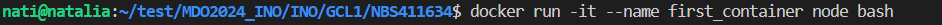

# Sprawozdanie 2
Natalia Borysowska-Ślęczka, IO

## Streszczenie projektu


## Wykonane kroki - laboratorium nr 3

### Wybór oprogramowania

1. Znajdź repozytorium z kodem dowolnego oprogramowania, które:
* dysponuje otwartą licencją

Wybranym przeze mnie oprogramowaniem jest:

```https://github.com/codeclown/tesseract.js-node.git```

Repozytorium zawiera generator projektów dla frameworka Express.js. Umożliwia na szybkie tworzenie struktury i konfiguracji nowych aplikacji internetowych w JavaScript.

Repozytorium dysponuje otwartą licencją (Apache 2.0 - zatem możliwe jest swobodne korzystanie, modyfikowanie oraz rozpowszechnianie kodu źródłowego)


* jest umieszczone wraz ze swoimi narzędziami Makefile tak, aby możliwe był uruchomienie w repozytorium czegoś na kształt make build oraz make test. Środowisko Makefile jest dowolne. Może to być automake, meson, npm, maven, nuget, dotnet, msbuild...

w wybranym repozytorium do budowania aplikacji używa się komendy:

```npm install```

...

* zawiera zdefiniowane i obecne w repozytorium testy, które można uruchomić np. jako jeden z "targetów" Makefile'a. Testy muszą jednoznacznie formułować swój raport końcowy (gdy są obecne, zazwyczaj taka jest praktyka)

...

2. Sklonuj niniejsze repozytorium, przeprowadź build programu (doinstaluj wymagane zależności)

W nowo utworzonym folderze *lab3* klonuje wybrane przeze mnie repozytorium


Następnie przechodzę do folderu *tesseract.js-node* (który utworzył się automatycznie po sklonowaniu repozytorium)


i instaluje potrzebne zależności poleceniem:

```npm install```


3. Uruchom testy jednostkowe dołączone do repozytorium

Po zainstalowaniu zależności przechodzimy do uruchomienia testów jednostkowych za pomocą polecenia:

```npm test```

Wszystkie testy przebiegły pomyślnie:


### Przeprowadzenie buildu w kontenerze

1. Wykonaj kroki `build` i `test` wewnątrz wybranego kontenera bazowego (```node``` dla Node.js)
	* uruchom kontener
	* podłącz do niego TTY celem rozpoczęcia interaktywnej pracy
	* zaopatrz kontener w wymagania wstępne (jeżeli proces budowania nie robi tego sam)

Uruchamiam kontener poleceniem:

```docker run -it nazwa_obrazu_kontenera node bash```

gdzie:

*-i* - umożliwia interaktywne wejście do kontenera (opzwala na wprowadzanie poleceń)

*-t* - umożliwia interaktywną pracę z konsolą

*--name* - opcją *name* nadaje nazwę nowoutworzonemu kontenerowi



	* sklonuj repozytorium

Analogicznie jak wyżej kolnuje repoytorium poleceniem:

```git clone https://github.com/codeclown/tesseract.js-node.git```


	* uruchom *build*

Przechodzę do folderu sklonowanego repozytorium:

```cd tesseract.js-node```


gdzie uruchamiam proces budowania:

```npm install```


.png)

	* uruchom testy

Używam ```npm test``` aby uruchomić testy


Wszystkie testy przeszły pomyślnie.

2. Stwórz dwa pliki `Dockerfile` automatyzujące kroki powyżej, z uwzględnieniem następujących kwestii:
	* Kontener pierwszy ma przeprowadzać wszystkie kroki aż do *builda*
	* Kontener drugi ma bazować na pierwszym i wykonywać testy
3. Wykaż, że kontener wdraża się i pracuje poprawnie. Pamiętaj o różnicy między obrazem a kontenerem. Co pracuje w takim kontenerze?