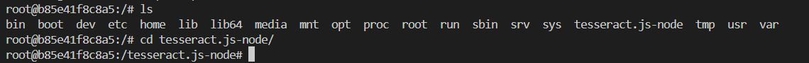
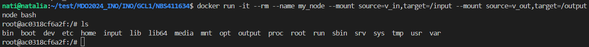
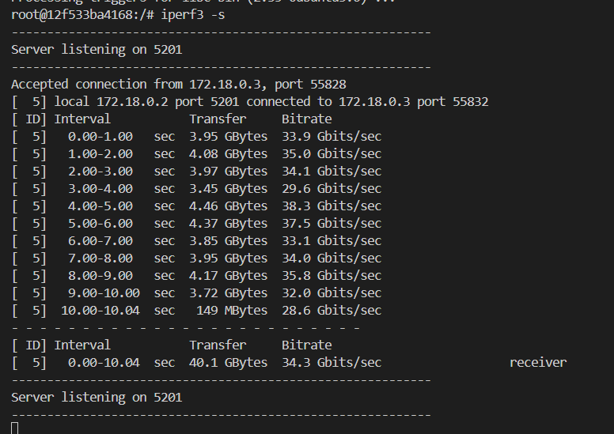
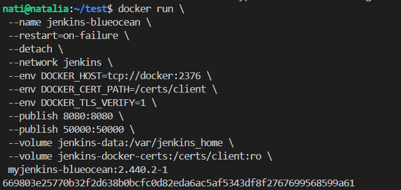

# Sprawozdanie 2
Natalia Borysowska-Ślęczka, IO

## Streszczenie projektu

Na zajęciach sklonowano repozytorium z otwartą licencją, które zawierało pliki tworzące oprogramowanie oraz testy jednostkowe. Po udanej budowie programu oraz uruchomieniu testów, przeszliśmy do kroków w kontenerze, gdzie stworzyliśmy dwa pliki Dockerfile dla różnych etapów procesu.

Podczas zajęć przygotowaliśmy i podłączyliśmy woluminy do kontenera bazowego, co umożliwiło nam operacje na danych. Sklonowaliśmy repozytorium i zapisaliśmy wyniki na woluminach. Dodatkowo, uruchomiliśmy serwer iperf3 w kontenerze, aby zbadać jego zachowanie. Następnie zainstalowaliśmy i skonfigurowaliśmy instancję Jenkinsa z pomocą DIND, prezentując działające kontenery i proces logowania.

## Wykonane kroki - laboratorium nr 3

### Wybór oprogramowania

1. Znajdź repozytorium z kodem dowolnego oprogramowania, które:
* dysponuje otwartą licencją

Wybranym przeze mnie oprogramowaniem jest:

```https://github.com/codeclown/tesseract.js-node.git```

Repozytorium zawiera implementację biblioteki Tesseract.js która umożliwia rozpoznawanie tekstu w obrazach przy użyciu technologii (OCR - Optical Character Recognition).

Repozytorium dysponuje otwartą licencją (Apache 2.0 - zatem możliwe jest swobodne korzystanie, modyfikowanie oraz rozpowszechnianie kodu źródłowego)


* jest umieszczone wraz ze swoimi narzędziami Makefile tak, aby możliwe był uruchomienie w repozytorium czegoś na kształt make build oraz make test. Środowisko Makefile jest dowolne. Może to być automake, meson, npm, maven, nuget, dotnet, msbuild...

W wybranym repozytorium do budowania aplikacji używa się komendy:

```npm install```

 Jest ona używana w środowisku *Node.js* do instalacji zależności zdefiniowanych w pliku *package.json* projektu. 

* zawiera zdefiniowane i obecne w repozytorium testy, które można uruchomić np. jako jeden z "targetów" Makefile'a. Testy muszą jednoznacznie formułować swój raport końcowy (gdy są obecne, zazwyczaj taka jest praktyka)

Testy uruchamiane są poleceniem:

```npm test```

W wybranym repozytorium umieszczone zostały w osobnym folderze *test*

2. Sklonuj niniejsze repozytorium, przeprowadź build programu (doinstaluj wymagane zależności)

W nowo utworzonym folderze *lab3* klonuje wybrane przeze mnie repozytorium


Następnie przechodzę do folderu *tesseract.js-node* (który utworzył się automatycznie po sklonowaniu repozytorium)


i instaluje potrzebne zależności poleceniem:

```npm install```


3. Uruchom testy jednostkowe dołączone do repozytorium

Po zainstalowaniu zależności przechodzimy do uruchomienia testów jednostkowych za pomocą polecenia:

```npm test```

Wszystkie testy przebiegły pomyślnie:


### Przeprowadzenie buildu w kontenerze

1. Wykonaj kroki `build` i `test` wewnątrz wybranego kontenera bazowego (```node``` dla Node.js)
	* uruchom kontener
	* podłącz do niego TTY celem rozpoczęcia interaktywnej pracy
	* zaopatrz kontener w wymagania wstępne (jeżeli proces budowania nie robi tego sam)

Uruchamiam kontener poleceniem:

```docker run -it nazwa_obrazu_kontenera node bash```

gdzie:

*-i* - umożliwia interaktywne wejście do kontenera (opzwala na wprowadzanie poleceń)

*-t* - umożliwia interaktywną pracę z konsolą

*--name* - opcją *name* nadaje nazwę nowoutworzonemu kontenerowi


* sklonuj repozytorium

Analogicznie jak wyżej kolnuje repoytorium poleceniem:

```git clone https://github.com/codeclown/tesseract.js-node.git```


* uruchom *build*

Przechodzę do folderu sklonowanego repozytorium:

```cd tesseract.js-node```



gdzie uruchamiam proces budowania:

```npm install```


.png)

* uruchom testy

Używam ```npm test``` aby uruchomić testy


Wszystkie testy przeszły pomyślnie.

2. Stwórz dwa pliki `Dockerfile` automatyzujące kroki powyżej, z uwzględnieniem następujących kwestii:
* Kontener pierwszy ma przeprowadzać wszystkie kroki aż do *builda*

Utworzyłam plik DOckerfilea, który wykonuje wszystkie powyższe kroki:


Obraz buduej komendą:

```docker build -f ./builder.Dockerfile -t builder .```


Wszystko przebiegło prawidłowo (otrzymałam wartość 0).
Zwrócenie wartości 0 oznacza, że proces budowania zakończył się bez problemów, wszystkie instrukcje w Dockerfilu zostały wykonane poprawnie, a obraz został pomyślnie zbudowany.


* Kontener drugi ma bazować na pierwszym i wykonywać testy

Drugi plik Dockerfilea bazuje na pierwszym - wykorzystując wcześniej zbudowane już oprogramowanie:


Budujemy analogicznie jak wyżej komendą:

```docker build -f ./tester.Dockerfile -t tester .```


Wszystko przebiegło prawidłowo (otrzymałam wartość 0).


3. Wykaż, że kontener wdraża się i pracuje poprawnie. Pamiętaj o różnicy między obrazem a kontenerem. Co pracuje w takim kontenerze?

Uruchomiłam kontenery na podstawie wcześniej utworzonych obrazów poleceniem:

 ```docker run```


a ich status i poprawność działania sprawdziłam poleceniem: 

```docker container list --all```


## Wykonane kroki - laboratorium nr 4

### Zachowywanie stanu
* Zapoznaj się z dokumentacją https://docs.docker.com/storage/volumes/
* Przygotuj woluminy wejściowy i wyjściowy, o dowolnych nazwach, i podłącz je do kontenera bazowego, z którego rozpoczynano poprzednio pracę

Woluminy wejściowy tworzę poleceniem:

```docker volume create input_volume```


Analogicznie tworzę woluminy wyjściowy:

```docker volume create output_volume```


Wylistować utworzone woluminy można poprzez użycie:

```docker volume ls```


Do podłączenia woluminów do kontenera bazowego używam polecenia:

```docker run -it --rm --name my_node --mount source=v_in,target=/input --mount source=v_out,target=/output node bash```

Po uruchomieniu kontenera nowoutworzone woluminy *input* oraz *output* są widoczne po wylistowaniu, także wszystko przebiegło pomyślnie



* Uruchom kontener, zainstaluj niezbędne wymagania wstępne (jeżeli istnieją), ale *bez gita*

W przypadku *nodea* nie ma potrzeby konfiguracji dodatkowych wymagań

* Sklonuj repozytorium na wolumin wejściowy (opisz dokładnie, jak zostało to zrobione)

Przechodzę do folderu woluminu *input*

```cd input/```


Tam klonuje repozytorium (to samo co przy lab3):

```git clone https://github.com/codeclown/tesseract.js-node.git```


* Uruchom build w kontenerze - rozważ skopiowanie repozytorium do wewnątrz kontenera

Przechodzę do folderu sklonowanego repozytorium:

```cd tesseract.js-node```

Następnie uruchamiam *builda* w kontenerze poleceniem:

```npm install```


Kopiuje zbudowane pliki do wolumina wyjściowego poleceniem:

```cp -r node_modules/ ../../output/```


* Zapisz powstałe/zbudowane pliki na woluminie wyjściowym, tak by były dostępne po wyłączniu kontenera.
* Pamiętaj udokumentować wyniki.

Poprawność wykonania można łatwo sprawdzić poleceniem:

```sudo ls /var/snap/docker/common/var-lib-docker/volumes/input_volume/_data```

* Ponów operację, ale klonowanie na wolumin wejściowy przeprowadź wewnątrz kontenera (użyj gita w kontenerze)
* Przedyskutuj możliwość wykonania ww. kroków za pomocą `docker build` i pliku `Dockerfile`. (podpowiedź: `RUN --mount`)

Wszystkie powyższe kroki da się wykonać używając pliku Dockerfile, należy zebrać wszystkie użyte komendy i wprowadzić je do pliku np. *volumen_builder.Dockerfile*


### Eksponowanie portu
* Zapoznaj się z dokumentacją https://iperf.fr/
* Uruchom wewnątrz kontenera serwer iperf (iperf3)

Tworzę plik Dockerfilea

W katalogu, w którym znajduje się plik Dockerfilea, buduje obraz:

```docker build -t iperf3_server -f iperf3_server.Dockerfile ~/test/MDO2024_INO/INO/GCL1/NBS411634/Sprawozdanie2/```


Uruchamiam kontener z serwerem iperf3:

```docker run -d --name iperf3_server -p 5201:5201 iperf3_server```


Po uruchomieniu kontenera, serwer iperf3 będzie dostępny na porcie 5201 na moim hoście 


* Połącz się z nim z drugiego kontenera, zbadaj ruch

Pobieram IP serwera poleceniem:

```docker inspect -f '{{range .NetworkSettings.Networks}}{{.IPAddress}}{{end}}' iperf3_server```


Odczytuje IP serwera. Jest to: *172.17.0.4*

Uruchamiam kontener dla klienta poleceniem:

```docker run -it --name iperf-client ubuntu /bin/bash```


Konieczne jest doinstalowanie potrzebnych zależności:

```apt-get update```

```apt-get install -y iperf3```

Następnie możemy pobrać ipref3 i połączyć się z serwerem poprzez wykorzystanie jego IP:

```iperf3 -c <adres_IP_serwera>```


* Zapoznaj się z dokumentacją `network create` : https://docs.docker.com/engine/reference/commandline/network_create/
* Ponów ten krok, ale wykorzystaj własną dedykowaną sieć mostkową. Spróbuj użyć rozwiązywania nazw

Zaczynam od utworzenia sieci mostkowej:

```docker network create my_bridge_network```


Następnie tworzę dwa kontenery - serwer oraz klient

Najpierw tworzę serwer:

```docker run -it --rm --name iperf_server --network my_bridge_network ubuntu bash```

```apt-get update```

```apt-get install -y iperf3```

```iperf3 -s```

Tworzę klienta:

```docker run -it --rm --name iperf_client --network my_bridge_network ubuntu bash```

```apt-get update```

```apt-get install -y iperf3```

Uzyskaliśmy możliwość połączenia klienta do serwera komendą:

```iperf3 -c iperf_server```

Mając jednocześnie otwarte dwa terminale mam możliwość obserwowania połączeń zarówno ze strony klienta jak i serwera.

Serwer:



Klient:


* Połącz się spoza kontenera (z hosta i spoza hosta)

```docker run -it --rm --network my_bridge_network --name iperf3_server3 -p 5201:5201 --mount source=output,target=/logs ubuntu bash```

* Przedstaw przepustowość komunikacji lub problem z jej zmierzeniem (wyciągnij log z kontenera, woluminy mogą pomóc)

### Instancja Jenkins
* Zapoznaj się z dokumentacją  https://www.jenkins.io/doc/book/installing/docker/
* Przeprowadź instalację skonteneryzowanej instancji Jenkinsa z pomocnikiem DIND

Instaluje Jenkinsa poleceniem:

```docker network create jenkins```


Następnie uruchamiam kontener z DND


* Zainicjalizuj instację, wykaż działające kontenery, pokaż ekran logowania

Wykorzystując plik *jenkins.Dockerfile* buduje nowy obraz:

```docker build -t myjenkins-blueocean:2.440.2-1 -f jenkins.Dockerfile .```

Uruchamiam kontener:



Działanie kontenera sprawdzam poleceniem:

```docker ps```


Korzystam z maszyny wirtualnem zatem muszę przekiwerować port, robie to komendą:

```ip a```

Odczytuje IP, jest to: *10.0.2.15*


Modyfikuje ustawienia w maszynie wirtualnej zgodnie z poniższym zrzutem ekranu:


Wpisując w przeglądarce:

```localhost:8080```

Uzyskujemy poniższy efekt:


