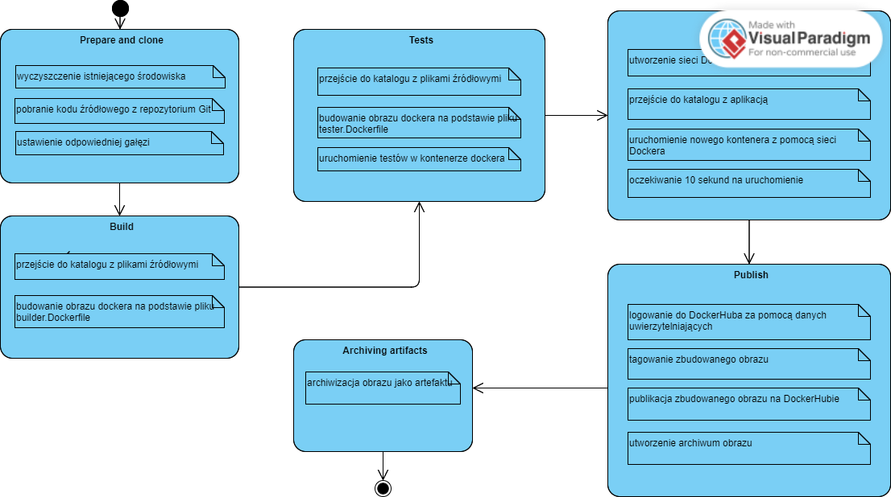
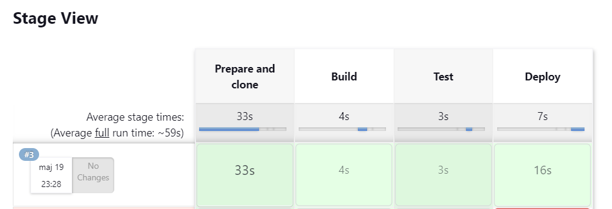
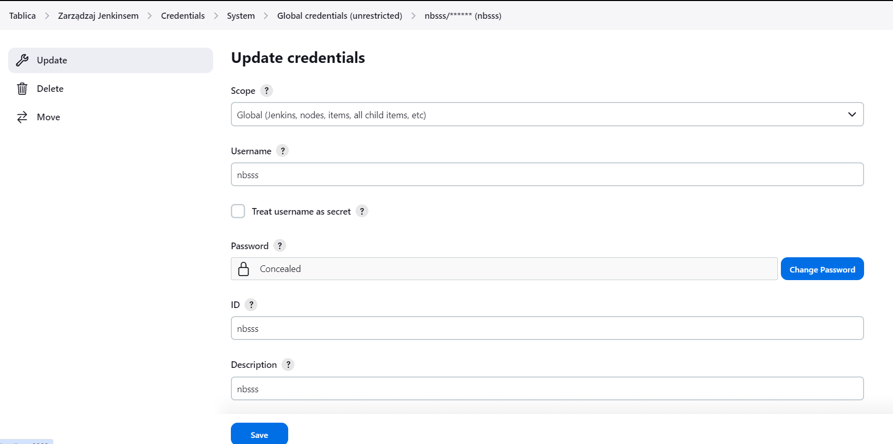
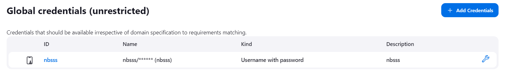
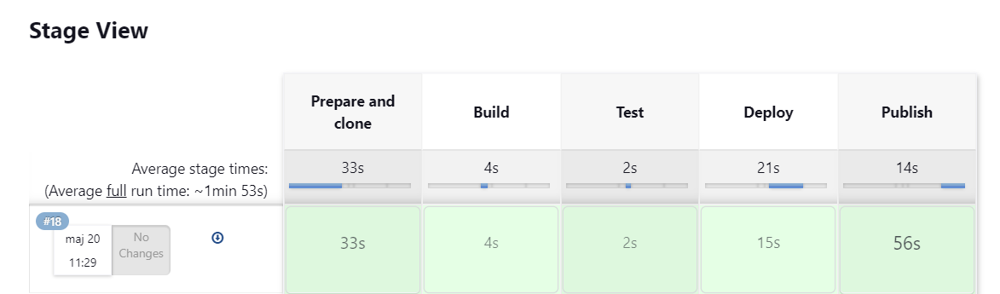
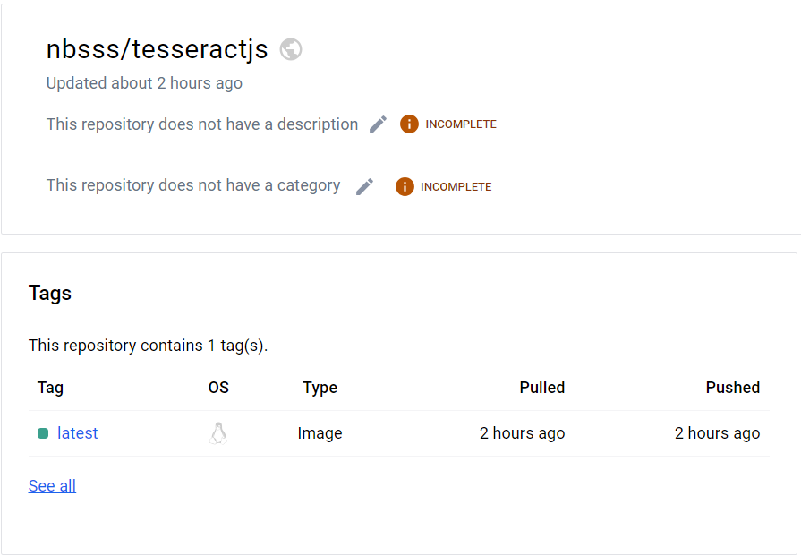
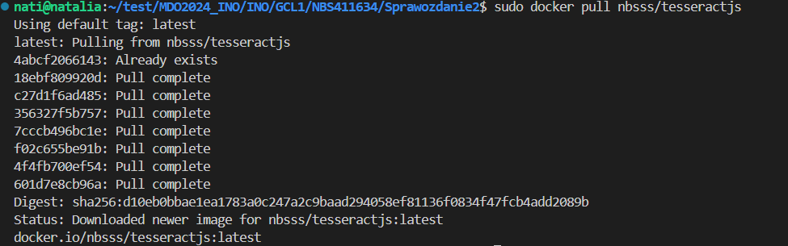

# Sprawozdanie 3
Natalia Borysowska-Ślęczka, IO

## Streszczenie projektu

W ramach tych laboratoriów skonfigurowano Jenkinsa oraz obrazy Dockera. Stworzono pipeline w Jenkinsie, który automatyzuje procesy budowania, testowania i publikowania aplikacji. Skrypt Jenkinsa został rozbudowany o kroki deploy i publish, aby umożliwić automatyczne uruchamianie aplikacji oraz publikowanie jej na Docker Hubie.

## Wykonane kroki - laboratorium nr 5, 6 oraz 7

### Przygotowanie
  * Obraz blueocean oraz obraz Jenkinsa (czym się różnią?)

    Jenkins Blue Ocean to nowsza wersja interfejsu użytkownika Jenkinsa, która została wprowadzona, aby poprawić i ułatwić doświadczenie użytkownika w pracy z Jenkinsem. Jenkins Blue Ocean oferuje bardziej intuicyjny interfejs graficzny, który ułatwia wizualizację i analizę procesów ciągłej integracji i dostarczania (CI/CD). Dodatkowo, Jenkins Blue Ocean zawiera zestaw preinstalowanych wtyczek, które są zoptymalizowane do pracy z tym interfejsem.

    Instalacji Jenkinsa dokonałam w Sprawozdaniu numer 2, dlatego jedynie upewniam się że wcześniej utworzone kontenry DinD oraz Blueocean działają poprawnie  

    
  
  * Zaloguj się i skonfiguruj Jenkins

    Loguje się do Jenkinsa i konfiguruje archiwizację oraz zabezpieczenie logów

    


### Uruchomienie 
* Konfiguracja wstępna i pierwsze uruchomienie

  * Utwórz projekt, który wyświetla uname

    Dodaje nowy projekt. Następnie wybieram typ projektu - *Projket Ogólny*.

    

    W sekcji *Kroki Budowania* wybieram - *Uruchom powłokę*, gdzie wprowadzam swój skrypt.

    

    Skrypt działa poprawnie.

    

  * Utwórz projekt, który zwraca błąd, gdy godzina jest nieparzysta

    Ponownie tworzę nowy projekt. Wybieram *Projekt Ogólny*. W sekcji *Kroki Budowania* tworzę skrypt, który będzie zwracał błąd w przypadku godziny nieparzystej.

    

* Utwórz "prawdziwy" projekt, który:

  * klonuje nasze repozytorium

    Analogicznie jak wyżej tworzę nowy projekt. Wybieram *Projekt Ogólny*. Klonowane repozytorium jest publiczne, zatem w sekcji *Credentials* zostawiamy opcję *none*

    

  * przechodzi na osobistą gałąź

    W sekcji *Branches to build* wpisujemy nazwę swojej gałęzi, na którą chcemy przejść.

    

    Skrypt poprawnie pobiera repozytorium oraz przełącza się na moją gałąź.

    
    
  * buduje obrazy z dockerfiles i/lub komponuje via docker-compose

    Zeedytowałam projekt. W sekcji *Kroki Budowania*.

        

    Podczas próby budowania obrazu z dockerfile napotkałam problem - zbyt mała ilość miejsca na dysku.

       

    Konieczne było rozszerzenie miejsca.

    Użyłam poniższych poleceń do rozszerzania partycji oraz do dostosowywania rozmiaru systemu plików do nowego rozmiaru partycji:

    ```df -h```

    ```sudo vgdisplay```

    ```sudo lvdisplay```

    ```sudo lvextend -l +100%FREE /dev/ubuntu-vg/ubuntu-lv```

    ```sudo lvdisplay```

    ```sudo resize2fs /dev/mapper/ubuntu--vg-ubuntu--lv```

    ```df -h```

    Przed:
    
       

    Po:

       

    Okazało się to jednak nie wystarczające, gdyż otrzymałam kolejny błąd - dalej problem z pamięcią

       

    Konieczna była zmiana wartości progów w ustawieniach Jenkinsa (zmieniłam progi na małe wartości, u mnie przykładowo 100MB)

     

    Rozwiązanie problemów z pamięcią pomogło. Skrypt prawidłowo pobiera repozytorium oraz przełącza się na moją gałąź, a następnie buduje obraz z Dockerfilea, który wcześniej znajdował się w moim repozytorium.

     

### Sprawozdanie (wstęp)
* Opracuj dokument z diagramami UML, opisującymi proces CI. Opisz:
  * Wymagania wstępne środowiska

    * Node.js:

      Repozytorium tesseract.js-node jest projektem opartym na JavaScript, więc wymagane będzie środowisko uruchomieniowe Node.js.

    * npm (Node Package Manager):

      npm jest menedżerem pakietów dla środowiska Node.js i jest wykorzystywany do zarządzania zależnościami projektu oraz uruchamiania skryptów budowania i testowania.

  * Diagram aktywności, pokazujący kolejne etapy (collect, build, test, report)

     

  * Diagram wdrożeniowy, opisujący relacje między składnikami, zasobami i artefaktami
  
### Pipeline
* Definiuj pipeline korzystający z kontenerów celem realizacji kroków `build -> test`

  Tworzę skrypt Jenkinsa, który składa się z trzech etapów: przygotowania i klonowania, budowania oraz testowania. W etapie "Prepare and clone" repozytorium Git jest usuwane i klonowane, a następnie sprawdzana jest określona gałąź. W etapie "Build" i "Test" są budowane obrazy Docker, odpowiednio z plików builder.Dockerfile i tester.Dockerfile, znajdujących się w odpowiednim katalogu.

  ```
    pipeline
    {
      agent any
        stages {
            stage('Prepare and clone') {
                steps {
                    sh "rm -rf MDO2024_INO/"
                    sh "git clone https://github.com/InzynieriaOprogramowaniaAGH/MDO2024_INO.git"
                    dir ("MDO2024_INO") {
                        sh "git checkout NBS411634"
                    }
                }
            }
            stage('Build'){
                steps {
                    dir("MDO2024_INO/INO/GCL1/NBS411634/Sprawozdanie2/") {
                        sh "docker build -t builder -f builder.Dockerfile ."
                    }
                }
            }
            
            stage('Test'){
                steps {
                    dir("MDO2024_INO/INO/GCL1/NBS411634/Sprawozdanie2/") {
                        sh "docker build -t tester -f tester.Dockerfile ."
                    }
                }
            }
        }
    }
    ```

   

* Może, ale nie musi, budować się na dedykowanym DIND, ale może się to dziać od razu na kontenerze CI. Należy udokumentować funkcjonalną różnicę między niniejszymi podejściami

  Docker-in-Docker (DinD):
  * Jenkins uruchamia kontener Docker wewnątrz innego kontenera Docker. To podejście zapewnia izolowane środowisko dla każdego builda, co minimalizuje ryzyko konfliktów z innymi procesami Dockera na hoście.

  * Kontener Docker wewnątrz innego kontenera Docker jest izolowany od środowiska hosta Jenkinsa. Pozwala to na większą kontrolę nad środowiskiem, w którym są wykonywane buildy, co jest szczególnie przydatne w środowiskach z wieloma użytkownikami.

  * Konfiguracja DinD jest bardziej złożona i może prowadzić do większego zużycia zasobów. DinD wymaga dodatkowych zasobów, ponieważ uruchamia Dockera wewnątrz kontenera, co może wpłynąć na wydajność.

  Budowanie na dedykowanym kontenerze CI:
  * Jenkins wykonuje operacje budowania i testowania bezpośrednio na kontenerze CI. To podejście jest bardziej efektywne pod względem zużycia zasobów, ponieważ unika narzutu związanego z uruchamianiem Dockera wewnątrz kontenera Docker.

  * Wykonując operacje bezpośrednio na kontenerze CI, skrypt jest mniej skomplikowany i łatwiejszy do zarządzania. Nie wymaga konfiguracji Docker-in-Docker, co upraszcza pipeline i zmniejsza ryzyko problemów związanych z izolacją i konfiguracją.

  * Kontener CI ma bezpośredni dostęp do zasobów hosta, co może być korzystne w przypadku, gdy buildy wymagają specyficznych zasobów lub narzędzi dostępnych na hoście.

Modyfikuje skrypt Jenkinsa o krok deploy oraz publish. 

Krok Deploy w pipeline wykonuje wszystkie niezbędne działania, aby zbudować i uruchomić kontener z aplikacją w środowisku Docker, dbając o odpowiednie sieciowanie i usuwanie starych instancji kontenera. W kolejnym etapie Publish obraz jest publikowany do Docker Hub i archiwizowany jako artefakt.

Tworzenie sieci Docker:

```sh 'docker network create my_network || true'```

Tworzy sieć Docker o nazwie my_network, aby umożliwić komunikację między różnymi kontenerami. Komenda || true zapewnia, że pipeline nie zakończy się niepowodzeniem, jeśli sieć już istnieje.

Budowanie obrazu Docker dla aplikacji:

```
dir("MDO2024_INO/INO/GCL1/NBS411634/Sprawozdanie2") {
    sh "docker build -t app-deploy -f deploy.Dockerfile ."
}
```
Opis: Wchodzi do katalogu MDO2024_INO/INO/GCL1/NBS411634/Sprawozdanie2 i buduje obraz Docker z użyciem pliku deploy.Dockerfile, tagując go jako app-deploy.
Dlaczego: Obraz Docker musi zostać zbudowany z odpowiednim kontekstem i Dockerfile, aby zawierał wszystkie zależności i kod aplikacji potrzebny do jej uruchomienia.

Usuwanie istniejącego kontenera aplikacji:

```sh 'docker rm -f app || true'```

Zapobiega konfliktowi nazw oraz problemom z portami przed uruchomieniem nowego kontenera.

Uruchamianie nowego kontenera aplikacji:

```sh 'docker run -d -p 8081:8080 --name app --network my_network app-deploy'```

Uruchamia nowy kontener z obrazu app-deploy, mapując porty 8080 wewnątrz kontenera na port 8081 hosta, nadając mu nazwę app i dołączając go do sieci my_network. Kontener musi zostać uruchomiony, aby aplikacja była dostępna na określonym porcie, a przypisanie do sieci umożliwia komunikację między innymi kontenerami.

Czas oczekiwania (sleep):

```sleep 10```

Wstrzymuje wykonanie pipeline na 10 sekund, aby zapewnić czas na pełne uruchomienie i stabilizację nowego kontenera przed przejściem do następnego etapu.

```
        stage('Deploy') {
            steps {
                sh 'docker network create my_network || true'
                
                dir("MDO2024_INO/INO/GCL1/NBS411634/Sprawozdanie2") {
                    sh "docker build -t app-deploy -f deploy.Dockerfile ."
                }
                
                sh 'docker rm -f app || true'
                sh 'docker run -d -p 8081:8080 --name app --network my_network app-deploy'
                sleep 10
            }
        }
```
 

Przed modyfikacją skrytpu o krok publish, konfiguruje w Jenkinsie Crredentials, umożliwi to lączenie się z DockerHubem za pomocą zmiennych globalnych. 

W Jenkinsie tworzę Credentials zabezpieczone hasłem:



 

Na początku skryptu dodaje:

```    environment {     
        DOCKERHUB_CREDENTIALS = credentials('nbsss')     
    } 
```
Modyfikuje skrypt o krok publish.

Logowanie do Docker Hub: 

```sh 'echo $DOCKERHUB_CREDENTIALS_PSW | docker login -u $DOCKERHUB_CREDENTIALS_USR --password-stdin'```

Skrypt wykonuje logowanie do Docker Hub, używając danych uwierzytelniających pobranych z danych Jenkinsa (Credentials).

Tagowanie obrazu: 

``` sh 'docker tag app-deploy:latest $DOCKERHUB_CREDENTIALS_USR/tesseractjs:latest'```

Następnie skrypt taguje zbudowany obraz Docker. Wykorzystuje polecenie docker tag, aby przypisać odpowiednią etykietę obrazowi. W tym przypadku, obraz zostaje oznaczony jako $DOCKERHUB_CREDENTIALS_USR/tesseractjs:latest, gdzie $DOCKERHUB_CREDENTIALS_USR to nazwa użytkownika na Docker Hub.

Publikacja obrazu do Docker Hub: 

```sh 'docker push $DOCKERHUB_CREDENTIALS_USR/tesseractjs:latest'```

Po udanym zalogowaniu i oznaczeniu obrazu, skrypt wykonuje polecenie docker push, które przesyła zbudowany obraz do Docker Hub.

Tworzenie archiwum obrazu Docker: 

``` sh "docker save $DOCKERHUB_CREDENTIALS_USR/tesseractjs:latest | gzip > tesseractjs_image.tar.gz"```

Skrypt następnie tworzy archiwum obrazu Docker w formacie .tar.gz. Wykorzystuje do tego polecenie docker save, które zapisuje obraz w formacie tar, a następnie gzip, aby skompresować go.

Archiwizacja obrazu jako artefaktu: 

``` archiveArtifacts artifacts: 'tesseractjs_image.tar.gz'  ```

Ostatnim krokiem jest archiwizacja utworzonego archiwum obrazu Docker jako artefaktu. Używam funkcji Jenkinsa archiveArtifacts, która umożliwia przechowywanie wybranych plików lub archiwów.

 

```
        stage('Publish') {
            steps {
                script {
                    sh 'echo $DOCKERHUB_CREDENTIALS_PSW | docker login -u $DOCKERHUB_CREDENTIALS_USR --password-stdin'
                    sh 'docker tag app-deploy:latest $DOCKERHUB_CREDENTIALS_USR/tesseractjs:latest'
                    sh 'docker push $DOCKERHUB_CREDENTIALS_USR/tesseractjs:latest'
                    sh "docker save $DOCKERHUB_CREDENTIALS_USR/tesseractjs:latest | gzip > tesseractjs_image.tar.gz"
                    archiveArtifacts artifacts: 'tesseractjs_image.tar.gz'       
                }            
            }     
        }
```
Repozytorium na DockerHubie

 

### "Definition of done"
Proces jest skuteczny, gdy "na końcu rurociągu" powstaje możliwy do wdrożenia artefakt (*deployable*).
* Czy opublikowany obraz może być pobrany z Rejestru i uruchomiony w Dockerze **bez modyfikacji** (acz potencjalnie z szeregiem wymaganych parametrów, jak obraz DIND)?

Sprawdzenia dokonuje poprzez pobranie obrazu na maszynie lokalnej - ```docker pull```

 

Obraz został pobrany bez problemów, to znaczy, że jest dostępny i możliwy do wdrożenia.
