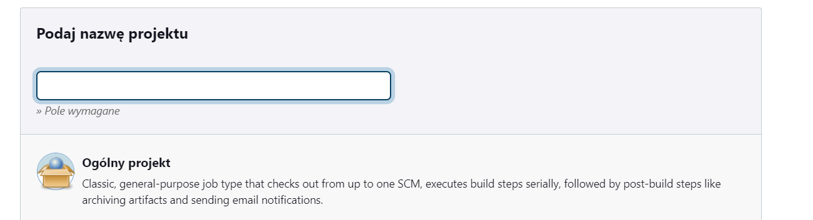
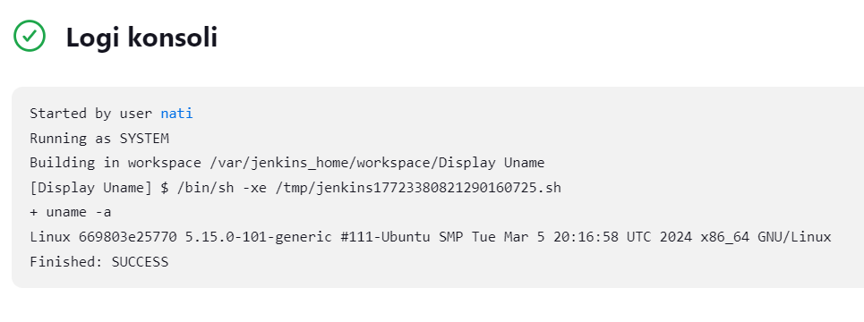

# Sprawozdanie 3
Natalia Borysowska-Ślęczka, IO

## Streszczenie projektu

...

## Wykonane kroki - laboratorium nr 5

### Przygotowanie
  * Obraz blueocean oraz obraz Jenkinsa (czym się różnią?)

    Jenkins Blue Ocean to nowsza wersja interfejsu użytkownika Jenkinsa, która została wprowadzona, aby poprawić i ułatwić doświadczenie użytkownika w pracy z Jenkinsem. Jenkins Blue Ocean oferuje bardziej intuicyjny interfejs graficzny, który ułatwia wizualizację i analizę procesów ciągłej integracji i dostarczania (CI/CD). Dodatkowo, Jenkins Blue Ocean zawiera zestaw preinstalowanych wtyczek, które są zoptymalizowane do pracy z tym interfejsem.

    Instalacji Jenkinsa dokonałam w Sprawozdaniu numer 2, dlatego jedynie upewniam się że wcześniej utworzone kontenry DinD oraz Blueocean działają poprawnie  

    
  
  * Zaloguj się i skonfiguruj Jenkins

    Loguje się do Jenkinsa i konfiguruje archiwizację oraz zabezpieczenie logów

    


### Uruchomienie 
* Konfiguracja wstępna i pierwsze uruchomienie

  * Utwórz projekt, który wyświetla uname

    Dodaje nowy projekt. Następnie wybieram typ projektu - *Projket Ogólny*.

    

    W sekcji *Kroki Budowania* wybieram - *Uruchom powłokę*, gdzie wprowadzam swój skrypt.

    

    Skrypt działa poprawnie.

    

  * Utwórz projekt, który zwraca błąd, gdy godzina jest nieparzysta

    Ponownie tworzę nowy projekt. Wybieram *Projekt Ogólny*. W sekcji *Kroki Budowania* tworzę skrypt, który będzie zwracał błąd w przypadku godziny nieparzystej.

    

* Utwórz "prawdziwy" projekt, który:

  * klonuje nasze repozytorium

    Analogicznie jak wyżej tworzę nowy projekt. Wybieram *Projekt Ogólny*. Klonowane repozytorium jest publiczne, zatem w sekcji *Credentials* zostawiamy opcję *none*

    

  * przechodzi na osobistą gałąź

    W sekcji *Branches to build* wpisujemy nazwę swojej gałęzi, na którą chcemy przejść.

    

    Skrypt poprawnie pobiera repozytorium oraz przełącza się na moją gałąź.

    
    
  * buduje obrazy z dockerfiles i/lub komponuje via docker-compose

    Zeedytowałam projekt. W sekcji *Kroki Budowania*.

        

    Podczas próby budowania obrazu z dockerfile napotkałam problem - zbyt mała ilość miejsca na dysku.

       

    Konieczne było rozszerzenie miejsca.

    Użyłam poniższych poleceń do rozszerzania partycji oraz do dostosowywania rozmiaru systemu plików do nowego rozmiaru partycji:

    ```df -h```

    ```sudo vgdisplay```

    ```sudo lvdisplay```

    ```sudo lvextend -l +100%FREE /dev/ubuntu-vg/ubuntu-lv```

    ```sudo lvdisplay```

    ```sudo resize2fs /dev/mapper/ubuntu--vg-ubuntu--lv```

    ```df -h```

    Przed:
    
       

    Po:

       

    Okazało się to jednak nie wystarczające, gdyż otrzymałam kolejny błąd - dalej problem z pamięcią

       

    Konieczna była zmiana wartości progów w ustawieniach Jenkinsa (zmieniłam progi na małe wartości, u mnie przykładowo 100MB)

     

    Rozwiązanie problemów z pamięcią pomogło. Skrypt prawidłowo pobiera repozytorium oraz przełącza się na moją gałąź, a następnie buduje obraz z Dockerfilea, który wcześniej znajdował się w moim repozytorium.

     

### Sprawozdanie (wstęp)
* Opracuj dokument z diagramami UML, opisującymi proces CI. Opisz:
  * Wymagania wstępne środowiska
  * Diagram aktywności, pokazujący kolejne etapy (collect, build, test, report)
  * Diagram wdrożeniowy, opisujący relacje między składnikami, zasobami i artefaktami
* Diagram będzie naszym wzrocem do porównania w przyszłości
  
### Pipeline

Przed wykonaniem Pipeline'u tworzę *fork* wybranego repozytorium (czyli kopię tego repozytorium na moim koncie GitHub)


* Definiuj pipeline korzystający z kontenerów celem realizacji kroków `build -> test`
* Może, ale nie musi, budować się na dedykowanym DIND, ale może się to dziać od razu na kontenerze CI. Należy udokumentować funkcjonalną różnicę między niniejszymi podejściami
* Docelowo, `Jenkinsfile` definiujący *pipeline* powinien być umieszczony w repozytorium. Optymalnie: w *sforkowanym* repozytorium wybranego oprogramowania

