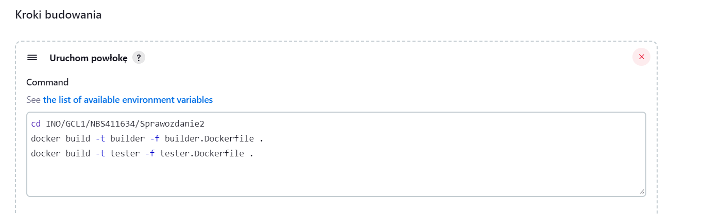

# Sprawozdanie 3
Natalia Borysowska-Ślęczka, IO

## Streszczenie projektu

...

## Wykonane kroki - laboratorium nr 5

### Przygotowanie
  * Obraz blueocean oraz obraz Jenkinsa (czym się różnią?)

    Jenkins Blue Ocean to nowsza wersja interfejsu użytkownika Jenkinsa, która została wprowadzona, aby poprawić i ułatwić doświadczenie użytkownika w pracy z Jenkinsem. Jenkins Blue Ocean oferuje bardziej intuicyjny interfejs graficzny, który ułatwia wizualizację i analizę procesów ciągłej integracji i dostarczania (CI/CD). Dodatkowo, Jenkins Blue Ocean zawiera zestaw preinstalowanych wtyczek, które są zoptymalizowane do pracy z tym interfejsem.

    Instalacji Jenkinsa dokonałam w Sprawozdaniu numer 2, dlatego jedynie upewniam się że wcześniej utworzone kontenry DinD oraz Blueocean działają poprawnie  

    
  
  * Zaloguj się i skonfiguruj Jenkins

    Loguje się do Jenkinsa i konfiguruje archiwizację oraz zabezpieczenie logów

    


### Uruchomienie 
* Konfiguracja wstępna i pierwsze uruchomienie

  * Utwórz projekt, który wyświetla uname

  

  * Utwórz projekt, który zwraca błąd, gdy... godzina jest nieparzysta

    

* Utwórz "prawdziwy" projekt, który:

  * klonuje nasze repozytorium

  Repozytorium jest publiczne, zatem w sekcji *Credentials* zostawiamy opcję *none*

    

  * przechodzi na osobistą gałąź

    W sekcji *Branches to build* wpisujemy nazwę swojej gałęzi, na którą chcemy przejść

    

    Skrypt poprawnie pobiera repozytorium oraz przełącza się na moją gałąź

    
    
  * buduje obrazy z dockerfiles i/lub komponuje via docker-compose

    Zeedytowałam projekt. W sekcji *kroki budowania*

        

    Podczas próby budowania obrazu z dockerfile napotkałam problem - zbyt mała ilość miejsca na dysku.

       

    Konieczne było rozszerzenie miejsca.

    Użyłam kolejno komend

    ```df -h```

    ```sudo vgdisplay```

    ```sudo lvdisplay```

    ```sudo lvextend -l +100%FREE /dev/ubuntu-vg/ubuntu-lv```

    ```sudo lvdisplay```

    ```sudo resize2fs /dev/mapper/ubuntu--vg-ubuntu--lv```

    ```df -h```

    Przed:
    
       

    Po:

       

    Okazało się to jednak nie wystarczające, gdyż otrzymałam kolejny błąd - dalej problem z pamięcią

       

    Konieczna była zmiana wartości progów w ustawieniach Jenkinsa (zmieniłam progi na małe wartości, u mnie przykładowo 100MB)

     


### Sprawozdanie (wstęp)
* Opracuj dokument z diagramami UML, opisującymi proces CI. Opisz:
  * Wymagania wstępne środowiska
  * Diagram aktywności, pokazujący kolejne etapy (collect, build, test, report)
  * Diagram wdrożeniowy, opisujący relacje między składnikami, zasobami i artefaktami
* Diagram będzie naszym wzrocem do porównania w przyszłości
  
### Pipeline
* Definiuj pipeline korzystający z kontenerów celem realizacji kroków `build -> test`


* Może, ale nie musi, budować się na dedykowanym DIND, ale może się to dziać od razu na kontenerze CI. Należy udokumentować funkcjonalną różnicę między niniejszymi podejściami
* Docelowo, `Jenkinsfile` definiujący *pipeline* powinien być umieszczony w repozytorium. Optymalnie: w *sforkowanym* repozytorium wybranego oprogramowania

### Szczegóły
Ciąg dalszy sprawozdania
#### Wymagane składniki
*  Kontener Jenkins i DIND skonfigurowany według instrukcji dostawcy oprogramowania
*  Pliki `Dockerfile` wdrażające instancję Jenkinsa załączone w repozytorium przedmiotowym pod ścieżką i na gałęzi według opisu z poleceń README
*  Zdefiniowany wewnątrz Jenkinsa obiekt projektowy „pipeline”, realizujący następujące kroki:
  * Kontener `Builder`, który powinien bazować na obrazie zawierającym dependencje (`Dependencies`), o ile stworzenie takiego kontenera miało uzasadnienie. Obrazem tym może być np. baza pobrana z Docker Hub (jak obraz node lub 
dotnet) lub obraz stworzony samodzielnie i zarejestrowany/widoczny w DIND (jak np. obraz oparty o Fedorę, doinstalowujący niezbędne zależności, nazwany Dependencies). Jeżeli, jak często w przypadku Node, nie ma różnicy między runtimowym obrazem a obrazem z dependencjami, proszę budować się w oparciu nie o latest, ale o **świadomie wybrany tag z konkretną wersją**
  * Obraz testujący, w ramach kontenera `Tester`
    * budowany przy użyciu ww. kontenera kod, wykorzystujący w tym celu testy obecne w repozytorium programu
    * Zadbaj o dostępność logów i możliwość wnioskowania jakie testy nie przechodzą
  * `Deploy`
    *  Krok uruchamiający aplikację na kontenerze docelowym
    *  Jeżeli kontener buildowy i docelowy **wydają się być te same** - być może warto zacząć od kroku `Publish` poniżej
    *  Jeżeli to kontener buildowy ma być wdrażany - czy na pewno nie trzeba go przypadkiem posprzątać?
      *  Przeprowadź dyskusję dotyczącą tego, jak powinno wyglądać wdrożenie docelowe wybranej aplikacji. Odpowiedz (z uzasadnieniem i dowodem) na następujące kwestie:
        * czy program powinien zostać *„zapakowany”* do jakiegoś przenośnego pliku-formatu (DEB/RPM/TAR/JAR/ZIP/NUPKG)
        * czy program powinien być dystrybuowany jako obraz Docker? Jeżeli tak – czy powinien zawierać zawartość sklonowanego repozytorium, logi i artefakty z *builda*?
    *  Proszę opisać szczegółowo proces który zostanie opisany jako `Deploy`, ze względu na mnogość podejść
  * `Publish`
    * Przygotowanie wersjonowanego artefaktu, na przykład:
      * Instalator
      * NuGet/Maven/NPM/JAR
      * ZIP ze zbudowanym runtimem
    * Opracuj odpowiednią postać redystrybucyjną swojego artefaktu i/lub obrazu (przygotuj instalator i/lub pakiet, ewentualnie odpowiednio uporządkowany obraz kontenera Docker)
      * Musi powstać co najmniej jeden z tych elementów
      * Jeżeli ma powstać artefakt, dodaj go jako pobieralny obiekt do rezultatów „przejścia” *pipeline’u* Jenkins.
    * Opcjonalnie, krok `Publish` (w przypadku podania parametru) może dokonywać promocji artefaktu na zewnętrzne *registry*

