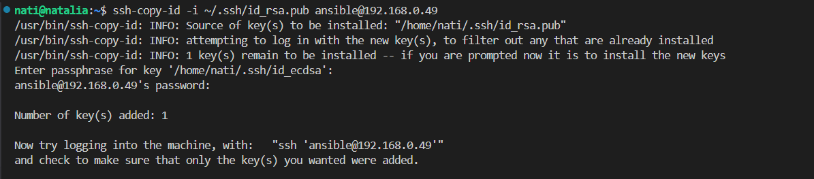
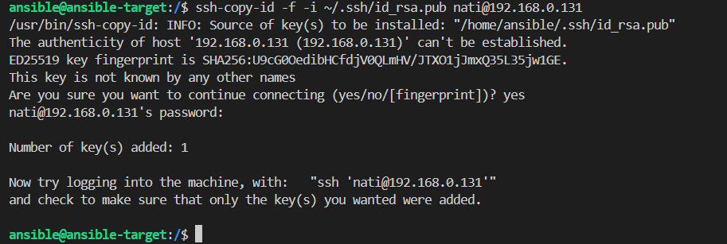
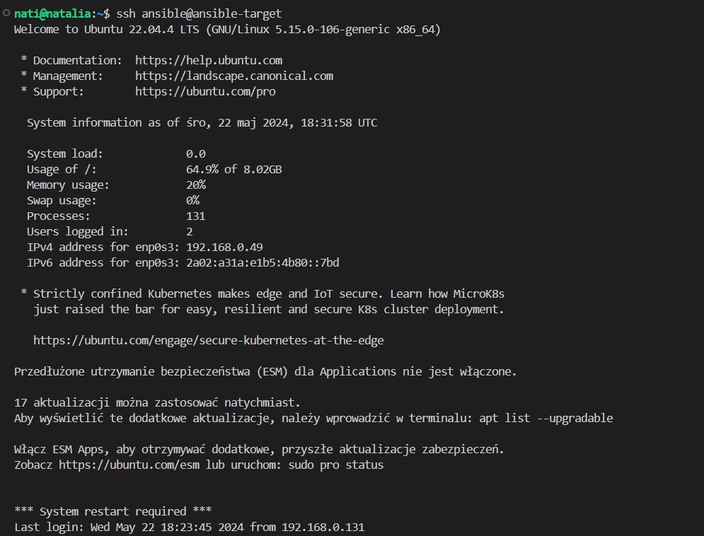
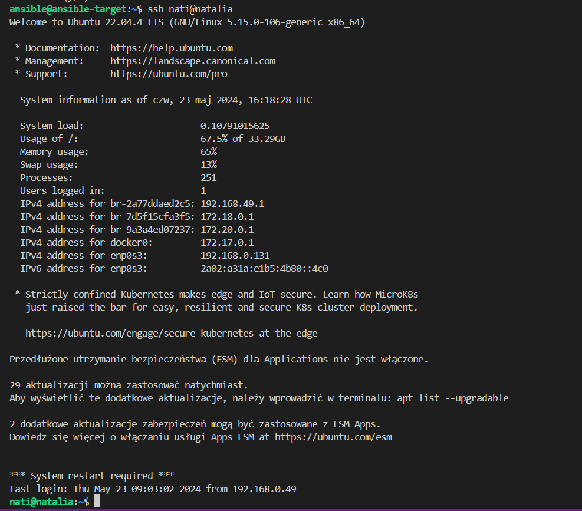
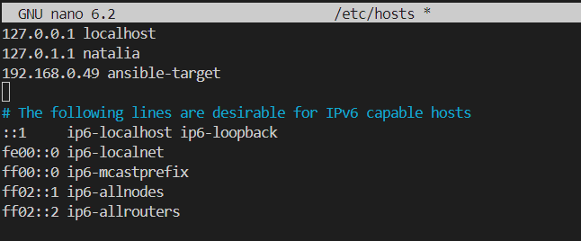
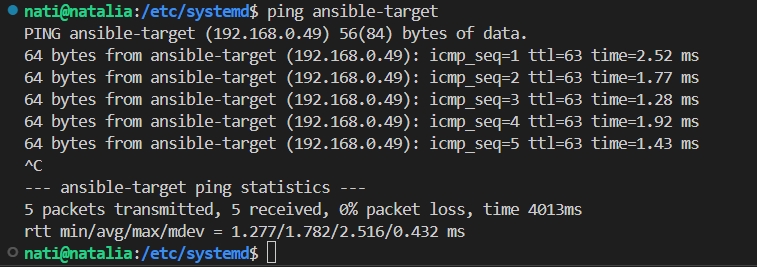
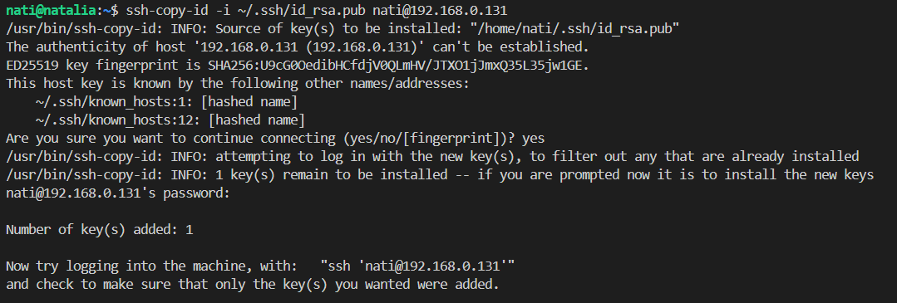

# Sprawozdanie 4
Natalia Borysowska-Ślęczka, IO

## Streszczenie projektu

...

## Wykonane kroki - laboratorium nr 

## Zadania do wykonania
### Instalacja zarządcy Ansible

Tworzę maszynę wirtualną o tym samym systemie operacyjnym co maszyna "główna" (u mnie ubuntu)


W ustawieniach nowej maszyny wirtualnej zmieniam połączenie sieciowe NAT na mostkowaną kartę sieciową (bridged). Pozwoli to maszynie na bezpośredni dostęp do sieci lokalnej, a zatem maszyna wirtualna będzie miała własny adres IP w sieci lokalnej.


Taki sam krok wykonuje dla maszyny "głównej"


Ansible jest napisany w języku Python, więc na hoście musi być zainstalowany interpreter Pythona.

W tym celu na nowej maszynie wirtuanej:

```sudo apt update``` aktualizuje repozytoria pakietów

```sudo apt install python3``` instaluje Pythona

```python3 --version``` sprawdzam czy Python 3 został poprawnie zainstalowany


Ansible wymaga również *tar* oraz *sshd*

Komendą ```sudo systemctl status ssh``` sprawdzam czy na mojej maszynie jest zainstalowany serwer ssh oraz czy działa on poprawnie.


Pozostała jeszcze instalacja *tar'a*.

Używam do tego komendy ```sudo apt install tar```  

A następnie upewniam się czy wszystko przebiegło pomyślnie wykorzystując ```tar --version```


Ustawiam nowy *hostname* maszyny

Do tego będę potrzebować adresów IP obu maszyn, używam do tego polecenia ```hostname -I```

Maszyna "główna":


Maszyna ansible-target:


Ustawiam hostname za pomocą polecenia

```sudo hostname ansible-target```

Następnie aktualizuje plik */etc/hostname*

```sudo nano /etc/hostname```


Aktualizuje plik */etc/hosts*

```sudo nano /etc/hosts```

aktualizuje tylko wiersz z nową nazwą hostname'a    

Na maszynie "głównej":


Na maszynie ansible-target:


Aktualizuje hostname

Na maszynie głównej:

```sudo hostnamectl set-hostname natalia```

Na maszynie ansible-target:

```sudo hostnamectl set-hostname ansible-target```

Sprawdzam czy hostname został ustawiony poprawnie poleceniem

```hostname```

Na maszynie "głównej":


Na maszynie ansible-target:


Następnie na maszynie ansible-target tworzę nowego użytkownika (o nazwie ansible) poleceniem:

```sudo adduser ansible```

Podczas wykonywania tego polecenia konieczne będzie wprowadzenie hasła dla nowego użytkownika i uzupełnienie jego dodatkowych informacji (jest to opcjonalne - można pominąć enterem).


Nadaje nowe użytkownikowi uprawnienia administratora

``` sudo usermod -aG sudo ansible```

A następnie upewniam się czy uprawnienia zostały poprawnie nadane

```groups ansible```


Zapisuje stan maszyny i wykonuje migawkę


Na głównej maszynie wirtualnej instaluje [oprogramowanie Ansible](https://docs.ansible.com/ansible/latest/installation_guide/index.html) korzystając z repozytorium dystrybucji.

W tym celu upewniam się, że lista pakietów jest aktualna

```sudo apt install```

Natsępnie instaluje oprogramowanie Ansible z repozytorium dystrybucji

```sudo apt install ansible```


Po zakońćzeniu instalcji sprawdzam wersję zainstalowanego oprogramowanie

```ansible --version```


Aby wymienić klucze SSH między użytkownikiem na głównej maszynie wirtualnej a użytkownikiem `ansible` na nowej maszynie tak, aby logowanie SSH jako `ansible` na `ansible-target` nie wymagało podawania hasła, wykonałam następujące kroki:

Generuje parę kluczy SSH dla użytkownika, którym chcę się zalogować na nową maszynę wirtualną

```ssh-keygen```

Na maszynie "głównej":


Na maszynie ansible-target:


Kopiuje klucze publiczne między maszynami 

```ssh-copy-id -i ~/.ssh/id_rsa.pub nazwa_użytkownika@adres_IP_maszyny```

U mnie IP "głównej" maszyny to: 192.168.0.131, a mszyny ansible-target to: 192.168.0.49 (można to sprawdzić komendą ```hostname -I``` jak wyżej)

Na "głównej" maszynie:



Na maszynie ansible-target:



Dzięki temu, jesteśmy w stanie logować się pomiędzy maszynami, tak by logowanie ssh nie wymagało podawania hasła.

Na maszynie "głównej":



Na mszynie ansible-target:



### Inwentaryzacja
* Dokonaj inwentaryzacji systemów
  * Ustal przewidywalne nazwy komputerów stosując `hostnamectl`

  Na każdej z maszyn używam polecenia ```hostnemctl``` w celu ustalenia bieżącej nazwy hosta

  

  

  Każda z maszyn ma swoją unikalną nazwę, umożliwia to identyfikację i zarządzanie maszynami.

  * Wprowadź nazwy DNS dla maszyn wirtualnych, stosując `systemd-resolved` lub `resolv.conf` i `/etc/hosts` - tak, aby możliwe było wywoływanie komputerów za pomocą nazw, a nie tylko adresów IP

  Na OBU maszynach!
  
  Otwieram plik konfiguracyjny *system-resolved.conf*

  ```sudo nano /etc/systemd/resolved.conf```

  

  W sekcji *[Resolve]* usuwam komenatrze przy *DNS* i ustalam serwery DNS

  

  Zapisuje zmiany, zamykam edytor, a następnie restartuje *systemd-resolved*

  ```sudo systemctl restart systemd-resolved```

  Te same kroki wykonuje na maszynie "głównej" oraz na *ansible-target*

  Następnie na głównej maszynie wirtualnej przechodzę do edycji pliku */etc/hosts*

  ```sudo nano /etc/hosts```

  W nowej linii dodaje adres IP maszyny *ansible-target* oraz nazwę hosta 

  

  * Zweryfikuj łączność

  Weryfikuje łączność poleceniem ```ping``` z nazwą hosta, aby sprawdzić, czy moja maszyna może komunikować się z innymi hostami w sieci

  

  Otrzymuje odpowiedzi na ping od *ansible-target* także połączenie zostało wykonane prawidłowo

  * Stwórz [plik inwentaryzacji](https://docs.ansible.com/ansible/latest/getting_started/get_started_inventory.html)

  Tworzę folder *ansible_quickstart*

  ```mkdir ansible_quickstart```

  Tworzę nowy plik inwentaryzacji *inventory.ini*. Plik inwentaryzacji zawiera informacje o hostach, z którymi Ansible ma się komunikować.

  

  * W pliku *inventory.ini* tworzę dwie sekcje`Orchestrators` oraz `Endpoints`, umieszczam nazwy maszyn wirtualnych w odpowiednich sekcjach

   

  Sprawdzam poprawność połączeń i definicji pliku

  ```ansible-inventory -i inventory.ini --list```

   

  * Wyślij żądanie `ping` 

  ```ansible Endpoints -m ping -i inventory.ini```

   

  Następnie wysyłam żądanie `ping` do wszystkich maszyn

  ```ansible all -m ping -i inventory.ini```

  Otrzymałam błąd - ​​uwierzytelnienie SSH nie powiodło się dla hosta *natalia*. Było to spowodowane problemami z uwierzytelnieniem klucza SSH.

   
  
  Klucz SSH nie był dodany do agenta SSH. Dodałam klucz maszyny na której pracuje do niej samej. aby rozwiązać problem

  ```ssh-copy-id -i ~/.ssh/id_rsa.pub nati@192.168.0.131```

    
  
  Tym razem ping zakończył się pomyślnie

   
   
* Zapewnij łączność między maszynami
  * Użyj co najmniej dwóch maszyn wirtualnych (optymalnie: trzech)
  * Dokonaj wymiany kluczy między maszyną-dyrygentem, a końcówkami (`ssh-copy-id`)
  * Upewnij się, że łączność SSH między maszynami jest możliwa i nie potrzebuje haseł
  
### Zdalne wywoływanie procedur
Za pomocą [*playbooka*](https://docs.ansible.com/ansible/latest/getting_started/get_started_playbook.html) Ansible:
  * Wyślij żądanie `ping` do wszystkich maszyn

  Tworzę plik *.yml* który wysyła żądanie ping do wszystkich maszyn 


  * Skopiuj plik inwentaryzacji na maszyny/ę `Endpoints`
  * Ponów operację, porównaj różnice w wyjściu
  * Zaktualizuj pakiety w systemie
  * Zrestartuj usługi `sshd` i `rngd`
  * Przeprowadź operacje względem maszyny z wyłączonym serwerem SSH, odpiętą kartą sieciową
  
### Zarządzanie kontenerem
Za pomocą [*playbooka*](https://docs.ansible.com/ansible/latest/getting_started/get_started_playbook.html) Ansible:
* Wykonaj, w zależności od dostępności obrazów:
  * Uruchom kontener sekcji `Deploy` z poprzednich zajęć
  * Pobierz z Docker Hub aplikację "opublikowaną" w ramach kroku `Publish`
  * Opcjonalnie: zaimportuj obrazy `Builder` i `Tester` (z pliku, nie z Docker Hub)
  * Uruchom aplikację dostarczaną kontenerem Deploy/Publish, podłącz *storage* oraz wyprowadź port
    * W przypadku aplikacji działającej poza kontenerem:
      * Wyślij plik aplikacji na zdalną maszynę
      * Stwórz kontener przeznaczony do uruchomienia aplikacji (zaopatrzony w zależności)
      * Umieść/udostępnij plik w kontenerze, uruchom w nim aplikację
  * Zatrzymaj i usuń kontener
* Ubierz powyższe kroki w [*rolę*](https://docs.ansible.com/ansible/latest/playbook_guide/playbooks_reuse_roles.html), za pomocą szkieletowania `ansible-galaxy`
  