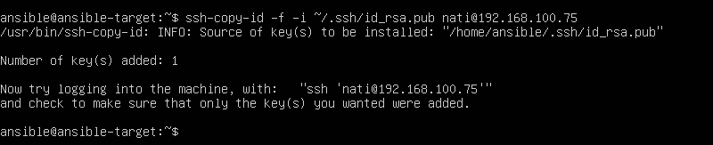
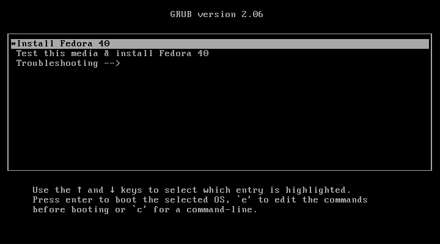

# Sprawozdanie 4
Natalia Borysowska-Ślęczka, IO

## Streszczenie projektu

Projekt polegał na skonfigurowaniu środowiska do zarządzania systemami za pomocą Ansible, zainstalowaniu oprogramowania oraz skonfigurowaniu komunikacji między maszynami wirtualnymi. Kluczowymi zadaniami były instalacja i konfiguracja Ansible, zarządzanie kontenerami Docker, oraz przygotowanie pliku odpowiedzi do przeprowadzenia nienadzorowanej instalacji systemu Fedora. Efektem końcowym było uruchomienie aplikacji w kontenerze Docker na skonfigurowanym systemie operacyjnym.

## Wykonane kroki - laboratorium nr 8

## Zadania do wykonania
### Instalacja zarządcy Ansible

Tworzę maszynę wirtualną o tym samym systemie operacyjnym co maszyna "główna" (u mnie ubuntu)


W ustawieniach nowej maszyny wirtualnej zmieniam połączenie sieciowe NAT na mostkowaną kartę sieciową (bridged). Pozwoli to maszynie na bezpośredni dostęp do sieci lokalnej, a zatem maszyna wirtualna będzie miała własny adres IP w sieci lokalnej.


Taki sam krok wykonuje dla maszyny "głównej"


Ansible jest napisany w języku Python, więc na hoście musi być zainstalowany interpreter Pythona.

W tym celu na nowej maszynie wirtuanej:

```sudo apt update``` aktualizuje repozytoria pakietów

```sudo apt install python3``` instaluje Pythona

```python3 --version``` sprawdzam czy Python 3 został poprawnie zainstalowany


Ansible wymaga również *tar* oraz *sshd*

Komendą ```sudo systemctl status ssh``` sprawdzam czy na mojej maszynie jest zainstalowany serwer ssh oraz czy działa on poprawnie.


Pozostała jeszcze instalacja *tar'a*.

Używam do tego komendy ```sudo apt install tar```  

A następnie upewniam się czy wszystko przebiegło pomyślnie wykorzystując ```tar --version```


Ustawiam nowy *hostname* maszyny

Do tego będę potrzebować adresów IP obu maszyn, używam do tego polecenia ```hostname -I```

Maszyna "główna":


Maszyna ansible-target:


Ustawiam hostname za pomocą polecenia

```sudo hostname ansible-target```

Następnie aktualizuje plik */etc/hostname*

```sudo nano /etc/hostname```


Aktualizuje plik */etc/hosts*

```sudo nano /etc/hosts```

aktualizuje tylko wiersz z nową nazwą hostname'a    

Na maszynie "głównej":


Na maszynie ansible-target:


Aktualizuje hostname

Na maszynie głównej:

```sudo hostnamectl set-hostname natalia```

Na maszynie ansible-target:

```sudo hostnamectl set-hostname ansible-target```

Sprawdzam czy hostname został ustawiony poprawnie poleceniem

```hostname```

Następnie na głównej maszynie wirtualnej przechodzę do edycji pliku */etc/hosts*

```sudo nano /etc/hosts```

W nowej linii dodaje adres IP maszyny *ansible-target* oraz nazwę hosta (*ansible-target*). 

Na maszynie "głównej":


Analogicznie postępuje w przypadku maszyny ansible-target. Tam w nowej linii dodaje adres IP maszyny "głównej" oraz nazwę hosta (*natalia*).

Na maszynie ansible-target:


Następnie na maszynie ansible-target tworzę nowego użytkownika (o nazwie ansible) poleceniem:

```sudo adduser ansible```

Podczas wykonywania tego polecenia konieczne będzie wprowadzenie hasła dla nowego użytkownika i uzupełnienie jego dodatkowych informacji (jest to opcjonalne - można pominąć enterem).


Nadaje nowe użytkownikowi uprawnienia administratora

``` sudo usermod -aG sudo ansible```

A następnie upewniam się czy uprawnienia zostały poprawnie nadane

```groups ansible```


Zapisuje stan maszyny i wykonuje migawkę


Na głównej maszynie wirtualnej instaluje [oprogramowanie Ansible](https://docs.ansible.com/ansible/latest/installation_guide/index.html) korzystając z repozytorium dystrybucji.

W tym celu upewniam się, że lista pakietów jest aktualna

```sudo apt install```

Natsępnie instaluje oprogramowanie Ansible z repozytorium dystrybucji

```sudo apt install ansible```


Po zakońćzeniu instalcji sprawdzam wersję zainstalowanego oprogramowanie

```ansible --version```


Aby wymienić klucze SSH między użytkownikiem na głównej maszynie wirtualnej a użytkownikiem `ansible` na nowej maszynie tak, aby logowanie SSH jako `ansible` na `ansible-target` nie wymagało podawania hasła, wykonałam następujące kroki:

Generuje parę kluczy SSH dla użytkownika, którym chcę się zalogować na nową maszynę wirtualną

```ssh-keygen```

Na maszynie "głównej":


Na maszynie ansible-target:


Kopiuje klucze publiczne między maszynami 

```ssh-copy-id -i ~/.ssh/id_rsa.pub nazwa_użytkownika@adres_IP_maszyny```

U mnie IP "głównej" maszyny to: 192.168.100.75, a mszyny ansible-target to: 192.168.100.74 (można to sprawdzić komendą ```hostname -I``` jak wyżej)

Na "głównej" maszynie:


Na maszynie ansible-target:



Dzięki temu, jesteśmy w stanie logować się pomiędzy maszynami, tak by logowanie ssh nie wymagało podawania hasła.

### Inwentaryzacja
* Dokonaj inwentaryzacji systemów
  * Ustal przewidywalne nazwy komputerów stosując `hostnamectl`

  Na każdej z maszyn używam polecenia ```hostnemctl``` w celu ustalenia bieżącej nazwy hosta

  

  

  Każda z maszyn ma swoją unikalną nazwę, umożliwia to identyfikację i zarządzanie maszynami.

  * Wprowadź nazwy DNS dla maszyn wirtualnych, stosując `systemd-resolved` lub `resolv.conf` i `/etc/hosts` - tak, aby możliwe było wywoływanie komputerów za pomocą nazw, a nie tylko adresów IP

  Na OBU maszynach!
  
  Otwieram plik konfiguracyjny *system-resolved.conf*

  ```sudo nano /etc/systemd/resolved.conf```
  
  

  W sekcji *[Resolve]* usuwam komenatrze przy *DNS* i ustalam serwery DNS

  

  Zapisuje zmiany, zamykam edytor, a następnie restartuje *systemd-resolved*

  ```sudo systemctl restart systemd-resolved```

  Te same kroki wykonuje na maszynie "głównej" oraz na *ansible-target*

  

  

  * Zweryfikuj łączność

  Weryfikuje łączność poleceniem ```ping``` z nazwą hosta, aby sprawdzić, czy moja maszyna może komunikować się z innymi hostami w sieci

  Na maszynie "głównej":

  

  Na maszynie ansible-target:

  

  Możliwe jest teraz logowanie się między maszynami za pomocą:

  ```ssh nati@natalia```

  

  oraz

  ```ssh ansible@ansible-target```

  

  * Stwórz plik inwentaryzacji

  Tworzę folder *ansible_quickstart*

  ```mkdir ansible_quickstart```

  Tworzę nowy plik inwentaryzacji *inventory.ini*. Plik inwentaryzacji zawiera informacje o hostach, z którymi Ansible ma się komunikować.

  

  * W pliku *inventory.ini* tworzę dwie sekcje`Orchestrators` oraz `Endpoints`, umieszczam nazwy maszyn wirtualnych w odpowiednich sekcjach

   

  Sprawdzam poprawność połączeń i definicji pliku

  ```ansible-inventory -i inventory.ini --list```

   

  * Wyślij żądanie `ping` 

  ```ansible Endpoints -m ping -i inventory.ini```

   

  Następnie wysyłam żądanie `ping` do wszystkich maszyn

  ```ansible all -m ping -i inventory.ini```

  Otrzymałam błąd - ​​uwierzytelnienie SSH nie powiodło się dla hosta *natalia*. Było to spowodowane problemami z uwierzytelnieniem klucza SSH.

   
  
  Klucz SSH nie był dodany do agenta SSH. Dodałam klucz maszyny na której pracuje do niej samej

  ```ssh-copy-id -f -i ~/.ssh/id_rsa.pub nati@192.168.100.75```

    
  
  Tym razem ping zakończył się pomyślnie.

   
   
### Zdalne wywoływanie procedur
Za pomocą [*playbooka*](https://docs.ansible.com/ansible/latest/getting_started/get_started_playbook.html) Ansible:
  * Wyślij żądanie `ping` do wszystkich maszyn

  Tworzę plik *.yml* który wysyła żądanie ping do wszystkich maszyn 

   

   

  * Skopiuj plik inwentaryzacji na maszyny/ę `Endpoints`

   

  * Ponów operację, porównaj różnice w wyjściu

   

  * Zaktualizuj pakiety w systemie

   

  * Zrestartuj usługi `sshd` i `rngd`
  
   
  
   

  * Przeprowadź operacje względem maszyny z wyłączonym serwerem SSH, odpiętą kartą sieciową

   

   

  ```systemctl start sshd```
  ```systemctl status ssh```

  Wynik z wyłączonym serwerem ssh:

   

  Wynik z odłączoną kartą sieciową:

   

  Timed out.
  
### Zarządzanie kontenerem

  Ponownie podłączam kartę sieciową i przechodzę do wykonywania kolejnych kroków

  Instaluje dockera na maszynie ansible-target

  ```sudo snap install docker```

   

  Instaluje również pythona

  ```sudo apt update```

  ```sudo apt install python3-pip```

  ```sudo apt install python3```

   

   

  Na "głownej" maszynie tworzę nowy plik 

  ```nano playbook2.yml```
  
  Playbook ma na celu zainstalowanie Dockera oraz SDK Docker dla Pythona, uruchomienie usługi Docker, a następnie zalogowanie się do Docker Hub, pobranie obrazu Tesseract.js (jest to aplikacja opublikowana przeze mnie w ramach poprzednich zajęć) i uruchomienie kontenera. 

  Playbook używa uprawnień superużytkownika *(become: yes)*, aby mieć dostęp do zarządzania pakietami i usługami systemowymi.

  Uruchamiam playbooka poleceniem:

  ```ansible-playbook -i inventory.ini playbook2.yaml ```

  Niestety pojawia się błąd

   

  Dodanie do komendy *--ask-become-pass* rozwiązuje problem braku dostępu do hasła. Po wpisaniu komendy:

  ```ansible-playbook -i inventory.ini playbook2.yaml --ask-become-pass```

  w miejscu *BECOME password:* podaję hasło do maszyny ansible-target. 

   

  Pojawił się kolejny błąd związany z brakiem dostępu do docker huba, aby go rozwiązać na maszynie ansible-target używam komendy 

  ```sudo docker login```

   

  Ponownie uruchamiam playbooka. Tym razem wszystko przebiegło pomyślnie.

   


## Wykonane kroki - laboratorium nr 9

## Zadania do wykonania
* Pobieram [system Fedora](https://download.fedoraproject.org/pub/fedora/linux/releases/), stosując instalator sieciowy (*netinst*)

  Wybieram Fedorę 40 i przechodzę do instalcji

   

  Wybieram język polski

  

  Tworzę nowego użytkownika (*nati*)

  

  Wybieram *Fedora Server Edition*, oraz dodatkowo potrzebne składniki przy instalacji - *zarządzanie konetenerami*

  

  Wybieram automatyczne partycjonowanie (*Miejsce docelowe instalacji -> Automatycznie*, zaznaczam również opcję: *Zwolnienie miejsca przez usunięcie lub zmniejszenie instniejących partycji*)

  Później zaznaczam dysk i klikam *usuń wszystko* (dzięki temu zwalniamy miejsce dla tej instalcaji)

  

  Edytuje źródło instalcji tak jak na screenie poniżej

  

  Podumowanie konfiguracji fedory prezentuje się następująco

  

  Fedora została zainstalowana pomyślnie

  

  

  Kopiuje pllik odpowiedzi do katalogu domowego, aby mieć do niego prsotszy dostęp

  

  Następnie na swoim komputerze lokalnie pobieram z serweru plik *anaconda-ks.cfg*, umożliwi mi to prostsze modyfikowanie pliku

  

  Edytuje plik *anaconda-ks.cfg*

    * Dodaje potrzebne repozytoria

    ```url --mirrorlist="http://mirrors.fedoraproject.org/mirrorlist?repo=fedora-40&arch=x86_64"```

    ```repo --name=updates-released --mirrorlist=http://mirrors.fedoraproject.org/mirrorlist?repo=updates-released-f40&arch=x86_64```

    * Ustawiam hostname

    ```network --hostname=fedora-server```

    * Plik odpowiedzi może zakładać pusty dysk, dlatego zapewniam, że zawsze będzie formatowana całość, stosując 
    
    ```clearpart --all```

    * Dodaje pakiety do instalacji (*docker*, *wget* do sekcji *%packages*)

    ```
    %packages
    @^server-product-environment
    @container-management
    docker
    wget

    %end
    ```

    * Tworzę sekcję *%post*, która zawiera polecenia do uruchomienia Dockera, zalogowania do Docker Hub i uruchomienia kontenera

    ```
    %post
    # Start Docker service
    systemctl enable docker
    systemctl start docker

    # Log in to Docker Hub
    echo "{DOCKER_PASSWORD}" | docker login --username {DOCKER_USERNAME} --password-stdin

    # Pull and run the Docker container
    docker pull nbsss/tesseractjs:latest
    docker run -d --name tesseractjs nbsss/tesseractjs:latest

    %end
    ```

    * Aby system ponownie się uruchomił dodaje

    ```reboot```

    Zeedytowany plik odpowiedzi dodaje do swojego repozytorium.

    Plik konfiguracji do urcuhomienia instalacji nienadzorowanej jest już gotowy. Należy w VirtualBoxie utworzyć nową maszynę, jednak wraz z początkie instalacji należy przenieść się do trybu *GRUB* klikając *e* na klawiaturze.

    Dodajemy linię:

    ```inst.ks=https://raw.githubusercontent.com/InzynieriaOprogramowaniaAGH/MDO2024_INO/NBS411634/INO/GCL1/NBS411634/Sprawozdanie4/anaconda-ks.cfg```

    I uzyskujemy efekt jak niżej

    

    Edytcję zatwierdzam *Ctrl + x* 

    

    Czekam aż instalacja się zakończy

    

    Instalacja przebiegła pomyślnie