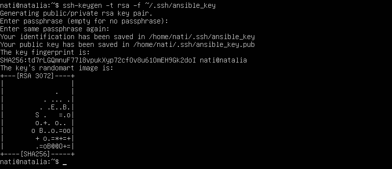

# Sprawozdanie 4
Natalia Borysowska-Ślęczka, IO

## Streszczenie projektu

...

## Wykonane kroki - laboratorium nr 

## Zadania do wykonania
### Instalacja zarządcy Ansible

Tworzę maszynę wirtualną o tym samym systemie operacyjnym co maszyna "główna" (u mnie ubuntu)


Ansible jest napisany w języku Python, więc na hoście musi być zainstalowany interpreter Pythona.

W tym celu na nowej maszynie wirtuanej:

```sudo apt update``` aktualizuje repozytoria pakietów

```sudo apt install python3``` instaluje Pythona

```python3 --version``` sprawdzam czy Python 3 został poprawnie zainstalowany


Ansible wymaga również *tar* oraz *sshd*

Komendą ```sudo systemctl status ssh``` sprawdzam czy na mojej maszynie jest zainstalowany serwer ssh oraz czy działa on poprawnie.


Pozostała jeszcze instalacja *tar'a*.

Używam do tego komendy ```sudo apt install tar```  

A następnie upewniam się czy wszystko przebiegło pomyślnie wykorzystując ```tar --version```


Ustawiam nowy *hostname* maszyny

Ustawiam hostname za pomocą polecenia

```sudo hostname ansible-target```

Następnie aktualizuje plik */etc/hostname*

```sudo nano /etc/hostname```


Aktualizuje plik */etc/hosts*

```sudo nano /etc/hosts```

aktualizuje tylko wiersz z nową nazwą hostname'a    *(127.0.1.1 ansible-taget)*


Aktualizuje hostname

```sudo hostnamectl set-hostname ansible-target```

Sprawdzam czy hostname został ustawiony poprawnie poleceniem

```hostname```


Następnie tworzę nowego użytkownika (o nazwie ansible) poleceniem:

```sudo adduser ansible```

Podczas wykonywania tego polecenia konieczne będzie wprowadzenie hasła dla nowego użytkownika i uzupełnienie jego dodatkowych informacji (jest to opcjonalne - można pominąć enterem).


Nadaje nowe użytkownikowi uprawnienia administratora

``` sudo usermod -aG sudo ansible```

A następnie upewniam się czy uprawnienia zostały poprawnie nadane

```groups ansible```


Zapisuje stan maszyny i wykonuje migawkę


Na głównej maszynie wirtualnej instaluje [oprogramowanie Ansible](https://docs.ansible.com/ansible/latest/installation_guide/index.html) korzystając z repozytorium dystrybucji.

W tym celu upewniam się, że lista pakietów jest aktualna

```sudo apt install```

Natsępnie instaluje oprogramowanie Ansible z repozytorium dystrybucji

```sudo apt install ansible```


Po zakońćzeniu instalcji sprawdzam wersję zainstalowanego oprogramowanie

```ansible --version```


Aby wymienić klucze SSH między użytkownikiem na głównej maszynie wirtualnej a użytkownikiem `ansible` na nowej maszynie tak, aby logowanie SSH jako `ansible` na `ansible-target` nie wymagało podawania hasła, wykonałam następujące kroki:

NA GŁÓWNEJ MASZYNIE WIRTUALNEJ

Generuje parę kluczy SSH dla użytkownika, którym chcę się zalogować na nową maszynę wirtualną

```ssh-keygen -t rsa -f ~/.ssh/key_to_ansible```

gdzie: 

*-t* oznacza typ klucza, w tym przypadku jest to koucz RSA

*-f* określa nazwę pliku klucza, jako *key_to_ansible*



NA NOWEJ MASZYNIE WIRTUALNEJ

W ustawieniach nowej maszyny wirtualnej zmieniam połączenie sieciowe NAT na mostkowaną kartę sieciową (bridged). Pozwoli to maszynie na bezpośredni dostęp do sieci lokalnej, a zatem maszyna wirtualna będzie miała własny adres IP w sieci lokalnej.


Po wcześniejszym wykonaniu migawki uruchamiam nową maszynę. Loguję się na wcześniej nowoutworzonego użytkownika

```su - ansible```


Następnie odczytuje IP maszyny wirtualnej (będzie mi to potrzebne do wykonania kolejnego kroku)

```ifconfig```

U mnie jest to: 192.168.0.49


NA GŁÓWNEJ MASZYNIE WIRTUALNEJ

Kopiuje klucz publiczny na nową maszynę wirtualną do katalogu *.ssh* użytkownika *ansible*

```ssh-copy-id ansible@adres_IP_nowej_maszyny```


Następnie loguje się na nową maszynę wirtualną bez podawania hasła

```ssh ansible@adres_IP_nowej_maszyny```


### Inwentaryzacja
* Dokonaj inwentaryzacji systemów
  * Ustal przewidywalne nazwy komputerów stosując `hostnamectl`

  Na każdej z maszyn używam polecenia ```hostnemctl``` w celu ustalenia bieżącej nazwy hosta

  

  

  Każda z maszyn ma swoją unikalną nazwę, umożliwia to identyfikację i zarządzanie maszynami.

  * Wprowadź nazwy DNS dla maszyn wirtualnych, stosując `systemd-resolved` lub `resolv.conf` i `/etc/hosts` - tak, aby możliwe było wywoływanie komputerów za pomocą nazw, a nie tylko adresów IP

  Otwieram plik konfiguracyjny *system-resolved.conf*

  ```sudo nano /etc/systemd/resolved.conf```

  

  W sekcji *[Resolve]* usuwam komenatrze przy *DNS* oraz *FallbackDNS* i ustalam serwery DNS

  

  Zapisuje zmiany, zamykam edytor, a następnie restartuje *systemd-resolved*

  ```sudo systemctl restart systemd-resolved```

  Te same kroki wykonuje na maszynie *ansible-target*

  Następnie na głównej maszynie wirtualnej przechodzę do edycji pliku */etc/hosts*

  ```sudo nano /etc/hosts```

  W nowej linii dodaje adres IP maszyny *ansible-target* oraz nazwę hosta 

  

  * Zweryfikuj łączność

  Weryfikuje łączność poleceniem ```ping``` z nazwą hosta, aby sprawdzić, czy moja maszyna może komunikować się z innymi hostami w sieci

  

  Otrzymuje odpowiedzi na ping od *ansible-target* także połączenie zostało wykonane prawidłowo

  * Stwórz [plik inwentaryzacji](https://docs.ansible.com/ansible/latest/getting_started/get_started_inventory.html)
  * Umieść w nim sekcje `Orchestrators` oraz `Endpoints`. Umieść nazwy maszyn wirtualnych w odpowiednich sekcjach
  * Wyślij żądanie `ping` do wszystkich maszyn
* Zapewnij łączność między maszynami
  * Użyj co najmniej dwóch maszyn wirtualnych (optymalnie: trzech)
  * Dokonaj wymiany kluczy między maszyną-dyrygentem, a końcówkami (`ssh-copy-id`)
  * Upewnij się, że łączność SSH między maszynami jest możliwa i nie potrzebuje haseł
  
### Zdalne wywoływanie procedur
Za pomocą [*playbooka*](https://docs.ansible.com/ansible/latest/getting_started/get_started_playbook.html) Ansible:
  * Wyślij żądanie `ping` do wszystkich maszyn
  * Skopiuj plik inwentaryzacji na maszyny/ę `Endpoints`
  * Ponów operację, porównaj różnice w wyjściu
  * Zaktualizuj pakiety w systemie
  * Zrestartuj usługi `sshd` i `rngd`
  * Przeprowadź operacje względem maszyny z wyłączonym serwerem SSH, odpiętą kartą sieciową
  
### Zarządzanie kontenerem
Za pomocą [*playbooka*](https://docs.ansible.com/ansible/latest/getting_started/get_started_playbook.html) Ansible:
* Wykonaj, w zależności od dostępności obrazów:
  * Uruchom kontener sekcji `Deploy` z poprzednich zajęć
  * Pobierz z Docker Hub aplikację "opublikowaną" w ramach kroku `Publish`
  * Opcjonalnie: zaimportuj obrazy `Builder` i `Tester` (z pliku, nie z Docker Hub)
  * Uruchom aplikację dostarczaną kontenerem Deploy/Publish, podłącz *storage* oraz wyprowadź port
    * W przypadku aplikacji działającej poza kontenerem:
      * Wyślij plik aplikacji na zdalną maszynę
      * Stwórz kontener przeznaczony do uruchomienia aplikacji (zaopatrzony w zależności)
      * Umieść/udostępnij plik w kontenerze, uruchom w nim aplikację
  * Zatrzymaj i usuń kontener
* Ubierz powyższe kroki w [*rolę*](https://docs.ansible.com/ansible/latest/playbook_guide/playbooks_reuse_roles.html), za pomocą szkieletowania `ansible-galaxy`
  