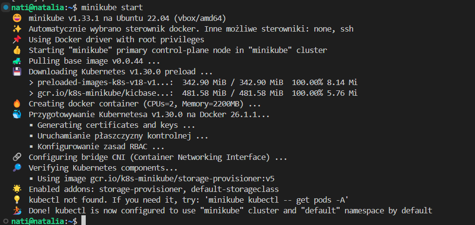
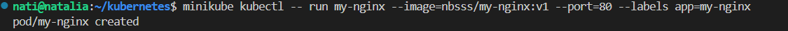

# Sprawozdanie 5
Natalia Borysowska-Ślęczka, IO

## Streszczenie projektu

Podczas wykonywania projektu zapoznano się z podstawowymi koncepcjami, strategiami wdrażania oraz narzędziami do monitorowania i kontrolowania procesu wdrożenia w klastrze Kubernetes. Dodatkowo, przetestowano skrypty automatyzujące procesy kontroli i wdrożeń, co pozwoliło na lepsze zrozumienie mechanizmów działania klastra Kubernetes.

## Wykonane kroki - laboratorium nr 10

## Zadania do wykonania

### Instalacja klastra Kubernetes
 * Pobieram [minikube](https://minikube.sigs.k8s.io/docs/start/)
 * Przeprowadź instalację, wykaż poziom bezpieczeństwa instalacji

 Pobieram paczkę komendą

 ```curl -LO https://storage.googleapis.com/minikube/releases/latest/minikube_latest_amd64.deb```

 

 Następnie przechodzę do instalacji

 ```sudo dpkg -i minikube_latest_amd64.deb```

 

 * Zaopatrz się w polecenie `kubectl` w wariancie minikube, może być alias `minikubctl`, jeżeli masz już "prawdziwy" `kubectl`

 Pobieram `kubectl`

 ```minikube kubectl -- get po -A```

 

 Wprowadzam alias 

 ```alias kubectl="minikube kubectl --"```

 

 * Uruchom Kubernetes, pokaż działający kontener/worker

 Uruchamiam minikube

 ```minikube start```

 

 Poprawnie działający kontener

 ```sudo docker ps```

 

 Działający klaster

 ```kubectl get nodes```

 

 * Zmityguj problemy wynikające z wymagań sprzętowych lub odnieś się do nich (względem dokumentacji)

    Minikube wymaga:
    * 2 CPU
    * 2GB RAM
    * 20GB wolnego miejsca na dysku

 Tworząc maszynę wirtualną spełniłam wszystkie powyższe wymagania, zatem nie było konieczne wprowadzać żadnych zmian. 
 Jeżeli wymagania sprzętowe okazałyby się nie wystarczające należy odpowiednio skonfigurować Minikube, zwiększając ilość przydzielonej pamięci RAM pamięci na dysku lub procesorów

 ```minikube config set memory 2048```

 ```minikube config set disk-size 20g```
 
 ```minikube config set cpus 2```

 Aby zastosować zmiany należy ponownie uruchomić Minikube

 ```minikube stop```

 ```minikube start```

 * Uruchom Dashboard, otwórz w przeglądarce, przedstaw łączność

 ```minikube dashboard```

 

 Korzystam z VisualStudio Code, zatem nastąpiło przekierowanie do przeglądarki (vs code zapewnia automatyczne wbudowane przekierowanie portów)

 

 * Zapoznaj się z koncepcjami funkcji wyprowadzanych przez Kubernetesa (*pod*, *deployment* itp)
    1. *Pod* - jest najmniejszą i najbardziej podstawową jednostką przetwarzania w Kubernetesie
        * Może zawierać jeden lub więcej kontenerów
        * Kontenery w podzie dzielą ten sam adres IP, przestrzeń nazw i woluminy
        * Żywotność podó jest krótka, są zastępowane w przypadku awarii
    2. *Deployment* - zarządza zestawem Podów
        * Dba o utrzymanie określonej liczby działających Podów
        * Automatyzuje proces aktualizacji aplikacji, skalowania i odzyskiwania awarii
        * Umożliwia zarządzanie wersjonowaniem aplikacji
        * Umożliwia automatyczne skalowanie i samonaprawianie się aplikacji
    3. *Service* - definiuje sposób uzyskiwania dostępu do Podów
        * Zapewnia stały adres IP i nazwę DNS dla zestawu Podów
        * Umożliwia zrównoważenie obciążenia ruchu sieciowego do zestawu Podów

 Do poprawnego wyłączenia Kubernetesa używam komendy

 ```minikube stop```

 Zapobiegam pojawieniu się ewentualnych błędów

### Analiza posiadanego kontenera

 Do wykonania tej części zadania użyję aplikacji `nginx`zmodyfikowanej o własną konfigurację.

 Pracę rozpoczynam od pobrania `nginx'a` na swoją maszynę

 ```sudo apt update```

 

 ```sudo apt install nginx```

 

 Po aktualizacji listy pakietów oraz pobraniu, sprawdzam status `nginx'a`

 

 Widać, że `nginx` jest uruchomiony, zatem instalacja przebiegła poprawnie.

 Dodatkowo, aby upewnić się czy `nginx` działa, otwieram przeglądarkę internetową i wchodzę na stronę:

 ```http://your_vm_ip_address``` *(IP maszyny wirtualnej można psrawdzić poleceniem `hostname -I`)*

 Powinna pojawić się powitalna strona `nginx'a`

 

 Strona uruchamia się poprawnie, zatem obraz `nginx'a` jest prawidłowy

 Kolejnym krokiem będzie własna konfiguracja `nginx`. Modyfikacji dokonam w pliku `index.html`

 Tworzę plik Dockerfile

 ```nano Dockerfile```

 

 ```
 FROM nginx
 COPY index.html /usr/share/nginx/html/index.html
 ```
 Tworzę plik `index.html`, w nim dokonam modyfikacji jeśli chodzi o działanie `nginx'a`. Moja strona będzie wyświetlać napis powitalny.

 ```
 <!DOCTYPE html>
 <html>
 <head>
     <title>Moja Strona NGINX</title>
 </head>
 <body>
     <h1>Witaj w mojej stronie na NGINX!</h1>
 </body>
 </html>
 ```

 Buduję obraz `nginx` w katalogu zawierającym Dockerfile i index.html (u mnie folder *kubernetes*)

 ```docker build -t my-nginx .```

 

 

 Uruchamiam skonfigurowanego `nginx`

 ```docker run -d -p 8070:80 my-nginx``` (używam portu 8070, gdyż port domyślny - 8080 był u mnie zajęty) 

 *-d* - opcja działania kontenera w trybie *detached*, co pozwala mu działać w tle

 

 Efekt konfiguracji `nginx'a'

 

 Kolejnym krokiem będzie publikacja na DockerHubie. W tym celu loguje się na DockerHuba'a poleceniem

 ```docker login```

 

 Nadaje odpowiedni tag na swój kontener

 ```docker tag my-nginx nbsss/my-nginx:v1```

 

 Publikuje

 ```docker push nbsss/my-nginx:v1```

 

 Obraz po opublikowaniu jest widoczny na DockerHUbie

    

### Uruchamianie oprogramowania
 * Uruchom kontener na stosie k8s

 Zaczynam od załadowania obrazu pobranego z DockerHuba do minikube
 
 ```minikube image load nbsss/my-nginx:v1```

 Uruchamiam kontener na stosie k8s

 * ```minikube kubectl run -- <nazwa-wdrożenia> --image=<obraz-docker> --port=<wyprowadzany port> --labels app=<nazwa-wdrożenia>```

    

 * Przedstaw że pod działa (via Dashboard oraz kubectl)

 Widok prawidłowo działającego poda - *kubectl*

    

 Widok prawidłowo działającego poda - *dashboard*

    

 * Wyprowadź port celem dotarcia do eksponowanej funkcjonalności
 
 ```kubectl port-forward pod/<nazwa-wdrożenia> <LO_PORT>:<PODMAIN_CNTNR_PORT> ```

 Ruch na porcie 8071 na moim komputerze zostanie przekierowany do poda my-nginx na porcie 80 (wybrałam port 8071, gdyż był on wolny)
 Dzięki przekierowaniu portów uzyskam dostęp do aplikacji działającej wewnątrz klastra Kubernetes, za pomocą lokalnego interfejsu użytkownika

    

 * Przedstaw komunikację z eskponowaną funkcjonalnością

 Po wprowadzeniu komendy z powyższego punktu, otwieram przeglądarkę, gdzie wprowadzam adres ` https://localhost:8071` pod któym znajduje się moja aplikacja. 

    

 Dodatkowo w terminalu obserwujemy, że połączenie przebiega pomyślnie

    

    
 
## Wykonane kroki - laboratorium nr 11
 
## Zadania do wykonania
### Konwersja wdrożenia ręcznego na wdrożenie deklaratywne YAML

 Kolejnym etapem jest automatyzacja wdrożenia poprzez definicje etapu *Deployment*

 * Upewnij się, że posiadasz wdrożenie z poprzednich zajęć zapisane jako plik

 Tworzę plik o rozszerzeniu *.yaml*. 
 
    
 
 Plik definiuje obiekt Deployment, który zarządza 4 replikami aplikacji Nginx, używając obrazu Docker nbsss/my-nginx:v1, który nasłuchuje na porcie 80. Etykiety są używane do identyfikowania i zarządzania tym Deploymentem oraz powiązanych z nim podów.

 ```
 apiVersion: apps/v1
 kind: Deployment
 metadata:
   name: deployment
   labels:
     app: nginx-deploy1
 spec:
   replicas: 4
   selector:
     matchLabels:
       app: nginx-deploy1
   template:
     metadata:
       labels:
         app: nginx-deploy1
     spec:
       containers:
       - name: mynginx
         image: nbsss/my-nginx:v1
         ports:
         - containerPort: 80
 ```

 * Wzbogać swój obraz o 4 repliki

 Ilośc replik zdefiniowałam w sekcji

 ```
 spec:
  replicas: 4
 ```
 * Rozpocznij wdrożenie za pomocą ```kubectl apply```

 ``` minikube kubectl -- apply -f ~/kubernetes/deployment.yaml```

 *-f* - określa ścieżkę pliku *deployment.yaml*

   

 Sprawdzam czy deployment działa prawidłowo 

 ```minikube kubectl get deployments```

  

 * Zbadaj stan za pomocą ```kubectl rollout status```

 Status deploymentu badam poleceniem

 ```kubectl rollout status```

  

 Działanie kontroluje również korzystając z ```minikube dashboard```

  

 Uruchomione zostały 4 pody, czyli tyle ile zdefiniowaliśmy replik, zatem wszystko działa prawidłowo

### Przygotowanie nowego obrazu

 Tworzę nową wersję mojej aplikacji, w tym celu zedytuje plik *index.html* i wprowadzę do niego informację o wyświetlanej wersji.

  ```
 <!DOCTYPE html>
 <html>
 <head>
     <title>Moja Strona NGINX</title>
 </head>
 <body>
     <h1>Witaj w mojej stronie na NGINX! </h1>
     <h2>Wersja DRUGA<h2>
 </body>
 </html>
 ```
 Buduje nową wersję nginxa, wykorzystując *Dockerfil'a* stworzonego dla wersji pierwszej

 ```docker build -t my-nginx .```

  

 Nadaje tag (*v2*) nowemu obrazowi

 ```docker tag my-nginx nbsss/my-nginx:v2```

  

 Publikuje nową wersję aplikacji

 ```docker push nbsss/my-nginx:v2```

  

 Na DockerHubie pojawiła się teraz druga otagowana wersja nginx'a

  

 Nowa wersja po uruchomieniu prezentuje się następująco

 

 Kolejnym etapem będzie stworzenie wersji obrazu, którego uruchomienie kończy się błędem

 Aby sztucznie wywołać błąd w działaniu obrazu modyfikuje plik *Dockerfile*. Wprowadzam linię

 ```CMD ["false"]```

 Powyższa komenda w pliku Dockerfile powoduje, że kontener uruchamia się i natychmiast kończy z błędem. Jestto standardowe polecenie systemu Unix, które zawsze kończy się z kodem wyjścia 1, co oznacza błąd.

 Buduje obraz nowej zbugowanej wersji

 ```docker build -t nbsss/my-nginx:v3 .```

 

 Ładuje nowozbudowany obraz do minikube'a

 ```minikube image load nbsss/my-nginx:v3```

 

 Tworzę plik *deployment-broken.yaml*, z konfiguracją deploymentu, który używa błędnego obrazu (plik jest stworzony analogicznie jak w wersji pierwszej mojej aplikacji nginx)

 

 ```
 apiVersion: apps/v1
 kind: Deployment
 metadata:
   name: deployment-broken
   labels:
     app: nginx-deploy-broken
 spec:
   replicas: 1
   selector:
     matchLabels:
       app: nginx-deploy-broken
   template:
     metadata:
       labels:
         app: nginx-deploy-broken
     spec:
       containers:
       - name: mynginx
         image: nbsss/my-nginx:v3
         ports:
         - containerPort: 80
  ```
  Stosuje konfiguracje deploymentu

  ```minikube kubectl -- apply -f deployment-broken.yaml```

 

 Sprawdzam status poda, aby upewnić się, że zakończył się błędem

 ```minikube kubectl -- get pods```

 Przy podzie o nazwie *deployment-broken* widzimy status *CrashLoopBackOff*, co jest informacją że otrzymaliśmy błąd

 

 Status poda w dashboardzie prezentuje się następująco

 

 

### Zmiany w deploymencie
 * Aktualizuj plik YAML z wdrożeniem i przeprowadzaj je ponownie po zastosowaniu następujących zmian:
   * zwiększenie replik do 8

   Edycji będę dokonywać dla pliku *deployment.yaml*, czyli dla wersji pierwszej swojej aplikacji

   Liczbę replik zmieniam w tej częsci pliku

   ```
   spec:
     replicas: 8
   ```

   Po edycji pliku, zastosowuje zmiany

   ``` minikube kubectl -- apply -f deployment.yaml```

   

   Sprawdzamy status poleceniem

   ```minikube kubectl get deployments```

   Liczba działających podów zwiększyła się z 4 do 8

   

   W dashboardie wygląda to następująco

   

   * zmniejszenie liczby replik do 1

   Analogiczne kroki jak dla 8 replik wykonuje dla liczby replik równej 1

   Oto efekty

   
   
   

   * zmniejszenie liczby replik do 0

   Również postępuje analogicznie jak w dwóch poprzednich podpunktach

   Efekt

   

   

   * Zastosowanie nowej wersji obrazu

   Wersję zmieniampobierając nowy obraz (wersja druga aplikacji)
   Zmiany w pliku *deployment.yaml* wprowadzam w *image:*, gdzie używam tagu odpowiadającego drugiej wersji zbudowanego obrazu

   ```
     containers:
      - name: mynginx
        image: nbsss/my-nginx:v2
        ports:
        - containerPort: 80
   ```
   Widok z dashboardu

   

   * Zastosowanie starszej wersji obrazu

   Poleceniem ```kubectl rollout history``` możemy wyświetlić listę wszystkich wersji wdrożeń

   

   Chcąc cofnąć się do poprzedniej wersji wdrożenia możemy użyć polecenia
   
   ```kubectl rollout undo```

   

   

   W widoku dashboarda możemy zaobserwować, że po użyciu powyższej komendy używanym obrazem deploymentu jest *nbsss/my-nginx:v1* czyli obraz dla wersji pierwszej aplikacji
   
   

### Kontrola wdrożenia
 * Napisz skrypt weryfikujący, czy wdrożenie "zdążyło" się wdrożyć (60 sekund)

 Tworzę skrypt *check_deployment.sh*

 Skrypt weryfikuje, czy wdrożenie zakończyło się pomyślnie w ciągu 60 sekund, sprawdzając co 5 sekund, czy liczba gotowych replik jest równa liczbie pożądanych replik. Jeśli wdrożenie zakończy się sukcesem przed upływem 60 sekund, skrypt wyświetla komunikat o sukcesie; w przeciwnym razie wyświetla komunikat o błędzie i kończy się niepowodzeniem. W ten sposób skrypt automatycznie monitoruje stan wdrożenia, informując, czy zakończyło się ono poprawnie w zadanym czasie.

 ```
 #!/bin/bash

 DEPLOYMENT_NAME="deployment"
 NAMESPACE="default"
 TIMEOUT=60
 INTERVAL=5

 check_deployment() {
   READY=$(minikube kubectl -- get deployment "$DEPLOYMENT_NAME" -n "$NAMESPACE" -o jsonpath='{.status.readyReplicas}')
   DESIRED=$(minikube kubectl -- get deployment "$DEPLOYMENT_NAME" -n "$NAMESPACE" -o jsonpath='{.status.replicas}')
  
   if [ "$READY" == "$DESIRED" ]; then
    return 0
   else
    return 1
   fi
 }

 elapsed=0
 while [ $elapsed -lt $TIMEOUT ]; do
   if check_deployment; then
     echo "Deployment $DEPLOYMENT_NAME successfully deployed."
     exit 0
   fi
   sleep $INTERVAL
   elapsed=$((elapsed + INTERVAL))
 done

 echo "Deployment $DEPLOYMENT_NAME did not complete within $TIMEOUT seconds."
 exit 1
```

 Nadaje skryptowi uprawnienia do wykonywania

 ```chmod +x check_deployment.sh```

 Uruchamiam skrypt

 ```./check_deployment.sh```

 

 Aby pokazać działanie skryptu, gdy czas budowania przekroczy 60 sekund w pliku *deployment.yaml*. Użyje obrazu, któy nie istnieje

 ```
 containers:
      - name: mynginx
        image: non_existance_image:latest
        ports:
        - containerPort: 80
 ```

 Stosuje błędne wdrożenie

 ```minikube kubectl -- apply -f deployment.yaml```

 Otrzymuje komunikat o przekroczeniu czasu

 

 Zatem skrypt działa poprawnie w każdym przypadku

### Strategie wdrożenia
 1. Recreate
  * Podczas aktualizacji, wszystkie istniejące pody są usuwane, zanim nowe zostaną utworzone
  * Przerwa w dostępności aplikacji

  ```
  apiVersion: apps/v1
  kind: Deployment
  metadata:
    name: nginx-recreate
    labels:
      app: nginx
  spec:
    replicas: 3
    strategy:
      type: Recreate
    selector:
      matchLabels:
        app: nginx
    template:
      metadata:
        labels:
          app: nginx
      spec:
        containers:
        - name: nginx
          image: nbsss/my-nginx:v1
          ports:
          - containerPort: 80
  ```
 

  2. Rolling Update
  * Nowe pody są stopniowo dodawane, a stare usuwane
  * Minimalna przerwa w dostępności aplikacji

  ```
  apiVersion: apps/v1
  kind: Deployment
  metadata:
    name: nginx-rolling
    labels:
      app: nginx
  spec:
    replicas: 3
    strategy:
      type: RollingUpdate
      rollingUpdate:
        maxUnavailable: 2
        maxSurge: 20%
    selector:
      matchLabels:
        app: nginx
    template:
      metadata:
        labels:
          app: nginx
      spec:
        containers:
        - name: nginx
          image: nbsss/my-nginx:v1
          ports:
          - containerPort: 80
  ```
  Pody wdrażane są po kolei, dlatego z początku widzimy tylko jeden z trzech pracujących podów

  

  3. Canary Deployment
  * Nowa wersja jest wdrażana tylko na jednym podzie
  * Testowanie nowej wersji w małej skali przed pełnym wdrożeniem

  ```
  apiVersion: apps/v1
  kind: Deployment
  metadata:
    name: nginx-canary
    labels:
      app: nginx
      version: canary
  spec:
    replicas: 1
    selector:
      matchLabels:
        app: nginx
        version: canary
    template:
      metadata:
        labels:
          app: nginx
          version: canary
      spec:
        containers:
        - name: nginx
          image: nbsss/my-nginx:v1
          ports:
          - containerPort: 80
  ```
  

  Widok dashboarda po uruchomieniu wszystkich strategii wdrożenia

  

  Etykiety i serwisy:

  Etykiety to oznaczenia, które przypisuje się różnym zasobom w Kubernetesie, takim jak pody czy serwisy. Dzięki nim, deploymenty i serwisy wiedzą, które pody mają być obsługiwane przez dany serwis. 
  Serwisy działają jak punkt wejścia dla aplikacji, równoważąc ruch między różnymi podami, aby zapewnić ciągłą dostępność aplikacji.

  Podsumowanie strategii wdrożeń:

  * Recreate: 
  Całe stare pods są zamykane, a nowe pods są uruchamiane, co może spowodować krótką przerwę w dostępności aplikacji.

  * Rolling Update: 
  Stare pods są stopniowo zastępowane nowymi według określonych parametrów, co pozwala na ciągłą dostępność aplikacji.

  * Canary Deployment: 
  Nowa wersja aplikacji jest stopniowo wprowadzana z jedną repliką, a następnie liczba replik jest stopniowo zwiększana. To pozwala na testowanie nowej wersji przed pełnym wdrożeniem, przy jednoczesnej dostępności aplikacji.