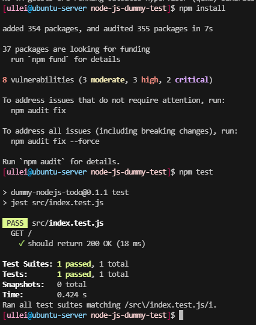
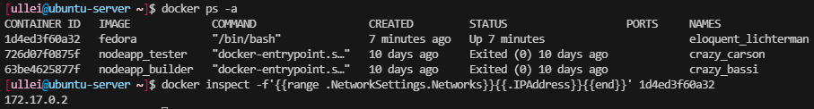

# Zajęcia 03
---
# Dockerfiles, kontener jako definicja etapu
Celem zadania było przygotowanie zkontenerowanego procesu budowy i testowania aplikacji.

Na początek należało znaleźć repozytorium z odpowiednim oprogramowaniem (liczyła się licencja, możliwość zbudowania i przetestowania aplikacji). Następnie 

# Zadania do wykonania
## Wybór oprogramowania na zajęcia
### Znajdź repozytorium z kodem dowolnego oprogramowania:

Wybrałem oprogramowanie realizującę listę TODO oparte o Node.js na licencji apache.


Licencja pozwala na uruchamianie, dystrybujcę i modyfikację oprogramowania.

### Sklonuj niniejsze repozytorium, przeprowadź build programu (doinstaluj wymagane zależności), uruchom testy

Sklonowałem repozytorium poleceniem `git clone https://github.com/devenes/node-js-dummy-test.git`

Musiałem doinstalować Npm poleceniem `sudo apt-install npm`


Następnie zbudowałem aplikację wywołując polecenie `npm install` i zainicjowałem testy poleceniem `npm test`.



### Przeprowadzenie buildu w kontenerze

Wykorzystałem obraz node, który oprócz node ma również zainstalowanego gita.
Uruchomilem go z parametrem `-it` i skierowałem na powłokę bash.


Po sklonowaniu repozytorium powtórzyłem kroki wykonane wcześniej poza kontenerem.


---
Kolejnym krokiem laboratorium było napisanie dwóch plików Dockerfile, które miały automatyzować wykonywane polecenia.

Pierwszy plik miał utworzyć obraz, wewnątrz którego wykonywany byłby build.


Zbudowałem obraz docker builderem wskazująć mu Dockerfile'a parametrem -f:

```docker build -f ./builder.Dockerfile -t nodeapp_builder .```


Drugi plik, wykorzystując obraz utworzony dzieki poprzedniemu plikowi, miał uruchamiać testy jednostkowe.


Testy w tym przypadku będą uruchamiane podczas budowania obrazu (ze względu na użycie dyrektywy RUN).


### Wykaż, że kontener wdraża się i pracuje poprawnie. Pamiętaj o różnicy między obrazem a kontenerem. Co pracuje w takim kontenerze?

Sam obraz nie jest kontenerem - uruchomienie kontenera wiąże się w wywołanie polecenia `docker run`.

Wynik wdrożenia można sprawdzić wywołująć polecenie `docker ps -a`, które wypisze wszystkie kontenery. Przed wywołaniem polecenia należy jednak uruchomić kontenery z utworzonych obrazów.


# Zajęcia 04

## Zachowywanie stanu
### Przygotuj woluminy wejściowy i wyjściowy, o dowolnych nazwach, i podłącz je do kontenera bazowego, z którego rozpoczynano poprzednio pracę

Woluminy to zarządzane przez dockera przestrzenie na dysku. Jest możliwe mountowanie katalogu bezpośrednio do kontenera, ale jest to praktyka odradzana ze względu na zależność od struktury plików i systemu operacyjnego.

Tworzenie woluminu wejściowego i wyjściowego można zrealizować poleceniami:
```
docker volume create wolumIN
docker volume create wolumOUT
```
Listing woluminów wykonywany jest poleceniem:
```
docker volume ls
```


### Uruchom kontener, zainstaluj niezbędne wymagania wstępne (jeżeli istnieją), ale *bez gita*

Uruchomiłem kontener z podłączonymi woluminami. Nie musiałem niczego instalować bo obraz node zawiera wszystko czego potrzebowałem.


Parametr `--mount` pozwala na przyłączanie woluminów/katalogów do kontenera. Należy doprecyzować źródło (co podłączyć) oraz ścieżkę docelową wewnątrz kontenera.

### Sklonuj repozytorium na wolumin wejściowy (opisz dokładnie, jak zostało to zrobione)

W tym celu uruchomiłem tymczasowy kontener z podpiętym woluminem wejściowym, za pomocą którego zklonowałem repozytorium. Zrealizowałem to za pomocą drugiego terminala.


Po uruchomieniu kontenera przeszedłem do miejsca, w którym podłączyłem wolumin, a następnie za pomocą gita pobrałem konieczne pliki. Kontener następnie zamknąłem.

Klonowanie bezpośrednio na wolumin może nie być najlepszym pomysłem - dostęp kontenerów do woluminów nie jest przez dockera regulowany co może prowadzić do wyścigu kontenerów o dostęp.

### Uruchom build w kontenerze - rozważ skopiowanie repozytorium do wewnątrz kontenera

Wewnątrz woluminu wejściowego znajdowały się pliki przekopiowane za pomocą kontenera pomocniczego. Przekopiowałem je do katalogu głównego.


Motywuje tę decyzję potencjalnym problemem wyścigu kilku kontenerów o dostęp do plików znajdujących się na woluminie. Kopia pozwoli na lokalne zbudowanie i uniknięcie niechcianych interakcji (chociaż w moim przypadku o wyścig było trudno).


### Zapisz powstałe/zbudowane pliki na woluminie wyjściowym, tak by były dostępne po wyłączniu kontenera.

Po zbudowaniu projektu przeniosłem katalog na wolumin wyjściowy.


### Ponów operację, ale klonowanie na wolumin wejściowy przeprowadź wewnątrz kontenera (użyj gita w kontenerze)

Zrobiłem to w drugim punkcie zagadnienia. Krótko wtedy omówiłem wady takiego rozwiązania.


### Przedyskutuj możliwość wykonania ww. kroków za pomocą `docker build` i pliku `Dockerfile`. (podpowiedź: `RUN --mount`)

Wydawałoby się, że istnieje możliwość mountowania folderu, ale wygląda na to, że podłączanie woluminów nie jest łatwo wykonalne.

Przykład wykonania powyższych kroków za pomocą nowoutworzonych folderów `IN` i `OUT`:


Problem polega na tym, że po wykonaniu builda, zawartość folderów pozostaje niezmieniona.

## Eksponowanie portu
### Uruchom wewnątrz kontenera serwer iperf (iperf3)

Uruchamiam kontener z fedorą i instaluje na nim iperf3


Następnie włączam serwer za pomocą instrukcji `iperf3 -s`


Serwer nasłuchuje na porcie 5201. 

### Połącz się z nim z drugiego kontenera, zbadaj ruch

Połączenie z serwerem wykonam w drugim konenerze poleceniem `iperf3 -c <adres_serwera>`

Adres ip kontenera serwerowego można otrzymać wykonując
```
docker inspect -f'{{range .NetworkSettings.Networks}}{{.IPAddress}}{{end}}' <id_kontenera>
```



W drugim kontenerze z fedorą uruchamiam zatem iperf3 z celem `172.17.0.2`


Wynik testu na serwerze:


### Ponów ten krok, ale wykorzystaj własną dedykowaną sieć mostkową. Spróbuj użyć rozwiązywania nazw

Tworzenie sieci mostkowej w dockerze można zrealizować za pomocą `docker network create`. Stworzyłem sieć `iperf_network`.


W celu podłączenia kontenera do sieci, można wykorzystać flagę `--network`. Kontenery znajdujące się w jednej sieci mogą się komunikować za pomocą nazw domenowych - nazwy nadanej kontenerowi flagą `--name`.

W tym przypadku polecenie uruchamiające kontener może wyglądać tak:
```
docker run -it --rm --name <nazwa_kontenera> --network <nazwa_sieci> <obraz_kontenera>
```
Uruchomienie kontenerów serwerowego i clienta:


Wynik połączenia z serwerem iperf3 wewnątrz sieci:


### Połącz się spoza kontenera (z hosta i spoza hosta)

Kontenery w dockerze podłączane są automatycznie do sieci wspólnej z hostem, dlatego połączenie między hostem a serwerem odbędzie się bez problemów:


W celu połączenia się spoza hosta zastosowałem flagę `--publish` która publikuje wskazany port kontenera na port hosta. Następnie mogłem połączyć się z serwerem iperf3 z innego komputera w sieci lokalnej.

```
docker run -it --rm --publish 5201:5201 fedora
```


Połączenie otwieram na nazwę domenową `ubuntu-server.lan`, dlatego że stosuję taką nazwę domenową w mojej lokalnej sieci.

### Zestawienie prędkości połaczeń

* kontener - kontener (sieć domyślna): 38.7Gb/s
* kontener - kontener (siec iperf_network): 35.1Gb/s
* host - kontener (domyslna siec host-docker): 41.1Gb/s
* maszyna zewnętrzna - kontener (publish): 21.1Gb/s

Można zauważyć znaczny spadek prędkości w komunikacji z maszyną zewnętrzną. Powodem jest prawdopodobnie trasowanie ruchu sieciowego przez pozostałe urządzenia w sieci (pc->switch->router->switch->pc->vm->container).

## Instancja Jenkins
### Przeprowadź instalację skonteneryzowanej instancji Jenkinsa z pomocnikiem DIND

Podąrzając za instrukcjami w dokumentacji zaczynam od swtorzenia sieci mostkowej dla jenkinsa:
```
docker network create jenkins
```

Następnie przeklejam polecenie, które pobierze obraz DIND (docker in docker) i uruchomi kontener z odpowiednimi parametrami:
```
docker run \
--name jenkins-docker \
--rm \
--detach \
--privileged \
--network jenkins \
--network-alias docker \
--env DOCKER_TLS_CERTDIR=/certs \
--volume jenkins-docker-certs:/certs/client \
--volume jenkins-data:/var/jenkins_home \
--publish 2376:2376 \
docker:dind \
--storage-driver overlay
```

### Zainicjalizuj instację, wykaż działające kontenery, pokaż ekran logowania

Następnie należy zbudować nowy obraz na podstawie dockerfile'a zawartego w instrukcji:
```
FROM jenkins/jenkins:2.440.2-jdk17
USER root
RUN apt-get update && apt-get install -y lsb-release
RUN curl -fsSLo /usr/share/keyrings/docker-archive-keyring.asc \
https://download.docker.com/linux/debian/gpg
RUN echo "deb [arch=$(dpkg --print-architecture) \
signed-by=/usr/share/keyrings/docker-archive-keyring.asc] \
https://download.docker.com/linux/debian \
$(lsb_release -cs) stable" > /etc/apt/sources.list.d/docker.list
RUN apt-get update && apt-get install -y docker-ce-cli
USER jenkins
RUN jenkins-plugin-cli --plugins "blueocean docker-workflow"
```

Kolejnym ruchem jest zbudowanie obrazu wywołując:
```
docker build -t myjenkins-blueocean:2.440.2-1 -f jenkins.Dockerfile .
```

Po zbudowaniu można uruchomić kontener wywołując:
```
docker run \
--name jenkins-blueocean \
--restart=on-failure \
--detach \
--network jenkins \
--env DOCKER_HOST=tcp://docker:2376 \
--env DOCKER_CERT_PATH=/certs/client \
--env DOCKER_TLS_VERIFY=1 \
--publish 8080:8080 \
--publish 50000:50000 \
--volume jenkins-data:/var/jenkins_home \
--volume jenkins-docker-certs:/certs/client:ro \
myjenkins-blueocean:2.440.2-1 
```

Kontener uruchamia się w tle i publishuje na port 8080 - jest to port pod którym znajdę ekran logowania jenkinsa.

