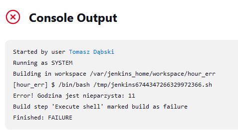
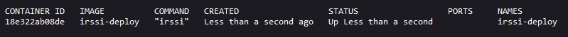

# Sprawozdanie 3
---
## Pipeline, Jenkins, izolacja etapów

Celem projektu jest zapoznanie się z automatyzacją procesów budowania i wdrażania aplikacji za pomocą Jenkinsa. Wykorzystane zostaną kontenery oraz Docker in Docker. Będzie należało rozwiązać problem archiwizacji kolejnych wersji/instancji zbudowanej aplikacji.

Pipeline'y mają na celu usprawnienie życia osobom zajmującym się utrzymywaniem aplikacji, gdzie nierzadko pojawiają się setki commitów dziennie, a nigdy nie wiadomo kiedy pojawi się niepozorny konflikt, który wyłączy aplikację ze sprawnego działania.

## Przygotowanie
### Instancja Jenkins

Podąrzając za instrukcjami w dokumentacji zaczynam od stworzenia sieci mostkowej dla jenkinsa:
```
docker network create jenkins
```

Następnie przeklejam polecenie, które pobierze obraz DIND (docker in docker) i uruchomi kontener z odpowiednimi parametrami:
```
docker run \
--name jenkins-docker \
--rm \
--detach \
--privileged \
--network jenkins \
--network-alias docker \
--env DOCKER_TLS_CERTDIR=/certs \
--volume jenkins-docker-certs:/certs/client \
--volume jenkins-data:/var/jenkins_home \
--publish 2376:2376 \
docker:dind \
--storage-driver overlay
```

Następnie należy zbudować nowy obraz na podstawie dockerfile'a zawartego w instrukcji:
```
FROM jenkins/jenkins:2.440.2-jdk17
USER root
RUN apt-get update && apt-get install -y lsb-release
RUN curl -fsSLo /usr/share/keyrings/docker-archive-keyring.asc \
https://download.docker.com/linux/debian/gpg
RUN echo "deb [arch=$(dpkg --print-architecture) \
signed-by=/usr/share/keyrings/docker-archive-keyring.asc] \
https://download.docker.com/linux/debian \
$(lsb_release -cs) stable" > /etc/apt/sources.list.d/docker.list
RUN apt-get update && apt-get install -y docker-ce-cli
USER jenkins
RUN jenkins-plugin-cli --plugins "blueocean docker-workflow"
```

Kolejnym ruchem jest zbudowanie obrazu wywołując:
```
docker build -t myjenkins-blueocean:2.440.2-1 -f jenkins.Dockerfile .
```

Po zbudowaniu można uruchomić kontener wywołując:
```
docker run \
--name jenkins-blueocean \
--restart=on-failure \
--detach \
--network jenkins \
--env DOCKER_HOST=tcp://docker:2376 \
--env DOCKER_CERT_PATH=/certs/client \
--env DOCKER_TLS_VERIFY=1 \
--publish 8080:8080 \
--publish 50000:50000 \
--volume jenkins-data:/var/jenkins_home \
--volume jenkins-docker-certs:/certs/client:ro \
myjenkins-blueocean:2.440.2-1 
```

Kontener uruchamia się w tle i publishuje na port 8080 - jest to port pod którym znajdę ekran logowania jenkinsa.


Obraz blueocean oferuje nowoczesny interfejs użytkownika, który ułatwia proces budowy, testowania i wdrażania aplikacji. Praca z blueocean jest bardziej zrozumiała dla użytkownika niż praca z jenkinsem.

### Wybrana aplikacja

Wybrałem aplikację [Irssi]("https://github.com/irssi/irssi") - modularny klient czatu do komunikacji poprzez np. IRC. Zbuduję go przy pomocy narzędzia meson.
Aplikacja jest na licencji GNU GPL.
  
### Uruchomienie 
**Projekt wyświetlający uname:**

Utworzyłem nowy freestyle project, w którym dodałem build step uruchamiający polecenia w powłoce. Uname odczytałem poleceniem `uname -a`.


**projekt, który zwraca błąd, gdy... godzina jest nieparzysta:**

Utowrzyłem kolejny projekt - tym razem w build stepie wykonałem sekwencję poleceń, która sprawdzała czy godzina jest parzysta (`exit 1` oznacza build jako failure).





### Prawdziwy projekt:
Utworzyłem nowy projekt z szablonu pipeline, a pipeline podzieliłem na 3 kroki:
```
Preparation - zaciągnięcie danych z mojej gałęzi repozytorium
Build - zbudowaniu aplikacji za pomocą dockerfile
Test - przetestowanie aplikacji za pomocą dockerfile
```

Plugin gita w jenkinsie pozwala na wygodne pobranie repozytorium poleceniem:
```
git branch: 'TD412544', url: 'https://github.com/InzynieriaOprogramowaniaAGH/MDO2024_INO.git'
```

Sugerując się pipeline scriptem Hello World napisałem własny, który realizował wymienione trzy kroki:
```
pipeline {
    agent any

    stages {
        stage('Preparation') {
            steps {
                echo 'Preparation'
                sh 'docker rmi irssi-builder irssi-test || true'
                sh 'rm -rf MDO2024_INO'
                
                sh 'mkdir MDO2024_INO'
                dir('./MDO2024_INO'){
                    git branch: 'TD412544', url: 'https://github.com/InzynieriaOprogramowaniaAGH/MDO2024_INO.git'
                }
                sh 'docker build -f ./MDO2024_INO/INO/GCL1/TD412544/Sprawozdanie3/IRSSI_DOCKERFILES/dependencies.Dockerfile -t irssi-dependencies .'
            }
        }
        stage('Build') {
            steps {
                echo 'Build'
                dir ('./MDO2024_INO/INO/GCL1/TD412544/Sprawozdanie3/IRSSI_DOCKERFILES') {
                    sh 'docker build -f ./build.Dockerfile -t irssi-builder .'
                }
            }
        }
        stage('Test') {
            steps {
                echo 'Test'
                sh 'docker build -f ./MDO2024_INO/INO/GCL1/TD412544/Sprawozdanie3/IRSSI_DOCKERFILES/test.Dockerfile -t irssi-test --progress=plain --no-cache .'
            }
        }
    }
}

```

Postanowiłem nie forkować repozytorium z aplikacją, dlatego że nie planuje dokonywać w aplikacji żadnych zmian i nie czuję specjalnej potrzeby dodawania kolejnego repozytorium do swojego githuba.


### Diagramy

Diagram aktywności:


Diagram wdrożeniowy:


Diagramy pomogły przemyśleć projekt na samym początku - doprowadziło to do wczesnych zmian w implementacji kroków pileline'u.

## Omówienie kroków pipelineu
### Preparation
W pierwszym kroku usuwam repozytorium i klonuje na nowo żeby zagwarantować że jego zawartość będzie czysta. Usuwam też zbudowane wcześniej obrazy żeby zapewnić pracę na nowych oraz folder z logami poprzedniego builda, dlatego że są archiwizowane jako artefakty.

```
stage('Preparation') {
  steps {
    echo 'Preparation'
    sh 'docker rmi irssi-dependencies irssi-builder irssi-test || true'
                
    sh 'rm -rf MDO2024_INO'
    sh 'rm -rf LOGS'
    
    sh 'mkdir MDO2024_INO'            
    sh 'mkdir LOGS'
                
    dir('./MDO2024_INO'){
      git branch: 'TD412544', url: 'https://github.com/InzynieriaOprogramowaniaAGH/MDO2024_INO.git'
    }
    sh 'docker build -f ./MDO2024_INO/INO/GCL1/TD412544/Sprawozdanie3/IRSSI_DOCKERFILES/dependencies.Dockerfile -t irssi-dependencies .'
  }
}
```

Pierwsze polecenie powłoki usuwa obrazy (stosuje `|| true` żeby nie przerwać działania pipelineu gdy docker nie znajduje obrazu), następnie usuwane są foldery repozytorium i logów, po czym są na nowo tworzone żeby przygotować pipeline do dalszej pracy.

Używam plugina gita żeby Jenkins zklonował repozytorium i od razu przełączył się na moją gałąź.

Na koniec buduje kontener zawierający dependencje.
```
FROM fedora:40

RUN dnf -y update
RUN dnf -y install git gcc meson ninja* glib2-devel utf8proc-devel ncurses* perl-Ext* openssl-devel
```
Zdecydowałem się na wersję fedora:40, dlatego że jest to nowa wersja fedory, a aplikacja zarówno się na niej buduje jak i uruchamia.

### Build
Ten krok polega na uruchomieniu buildera za pomocą DIND i zarchiwizowaniu logów z procesu budowania. Następnie kopiowany jest zbudowany plik binarny na zewnątrz kontenera celem archiwizacji i deploymentu.
```
stage('Build') {
  steps {
    echo 'Build'
    sh 'docker build -f ./MDO2024_INO/INO/GCL1/TD412544/Sprawozdanie3/IRSSI_DOCKERFILES/build.Dockerfile -t irssi-builder . 2>&1 | tee ./LOGS/build_${BUILD_NUMBER}.txt'
    archiveArtifacts artifacts: "LOGS/build_${BUILD_NUMBER}.txt", onlyIfSuccessful: false
    
    sh 'docker run --rm -t -d --name irssi-builder irssi-builder'
    sh 'docker cp irssi-builder:/usr/local/bin/irssi ./irssi-${VERSION}_${BUILD_NUMBER}' // get binary file
    sh 'docker stop irssi-builder'
    sh 'cp irssi-${VERSION}_${BUILD_NUMBER} irssi'
    
    archiveArtifacts artifacts: "irssi-${VERSION}_${BUILD_NUMBER}", onlyIfSuccessful: false
  }
}
```
Przekierowuje stderr na stdout za pomocą `2>&1`, a następnie przepycham output do wersjonowanego pliku. Zmienna środowiskowa Jenkinsa `BUILD_NUMBER` oznacza który raz w tym pipelinie jest przeprowadzany build. Następnie zlecam archiwizację powstałych logów w postaci artefaktów z doprecyzowaniem, że chcę zapisac również w przypadku wystąpienia błędów.

Uruchamiam kontener w trybie `detached`, żeby uruchomił się "w tle", a następnie kopiuje zbudowany plik binarny poza kontener i zamykam kontener (flaga `--rm` usuwa kontener po zamknięciu).

### Test
Testowanie odbywa się w kontenerze bazującym na obrazie zbudowanym przez builder. Kontener ten wywyłuje polecenie `ninja test` w katalogu ze zbudowana aplikacją.
```
stage('Test') {
  steps {
    echo 'Test'
    sh 'docker build -f ./MDO2024_INO/INO/GCL1/TD412544/Sprawozdanie3/IRSSI_DOCKERFILES/test.Dockerfile -t irssi-test --no-cache . 2>&1 | tee ./LOGS/test_${BUILD_NUMBER}.txt'
    archiveArtifacts artifacts: "LOGS/test_${BUILD_NUMBER}.txt", onlyIfSuccessful: false
  }
}
```
Logi przeprowadzanej operacji, podobnie jak w przypadku builda, zapisywane są w pliku tekstowym i archiwizowane w postaci artefkatów.

Wynik builda:


Wynik testów odczytany z artefaktu:


### Deploy
Deployment rozumiem jako uruchomienie aplikacji w kontenerze, co zamierzam zrealizować poprzez zbudowanie nowego kontenera z zainstalowanymi dependencjami i przekopiowanie na niego pliku binarnego. Mógłbym skorzystać z gotowego obrazu builder, ale skutkowałoby to wdrażaniem niepotrzebnych plików (t.j. kod źródłowy, biblioteki i aplikacje konieczne tylko do zbudowania pliku binarnego). Nie ma też powodów dołączania do releasa logów z kompilacji czy testów, bo użytkownikom końcowym nie są do niczego potrzebne.
```
FROM fedora:40

RUN dnf -y update
RUN dnf -y install utf8proc
RUN dnf clean all

COPY irssi /usr/local/bin/irssi
ENTRYPOINT [ "irssi" ]
```
Powyższy dockerfile instaluje irssi, a jego entrypoint jest ustawiony na samą aplikację co znaczy, że uruchomienie kontenera "na sucho" będzie skutkowało w przejściu do irssi.

Krok ten zrealizowałem w pipelinie w ten sposób:
```
stage('Deploy'){
  steps{
    echo 'Deploy'
    sh 'docker build -f ./MDO2024_INO/INO/GCL1/TD412544/Sprawozdanie3/IRSSI_DOCKERFILES/deploy.Dockerfile -t irssi-deploy .'
    sh 'docker run --rm --name irssi-deploy -t -d -e TERM=xterm irssi-deploy'
    sh 'docker ps > LOGS/deploy_docker_ps_${BUILD_NUMBER}.txt'
    sh 'docker stop irssi-deploy'
    archiveArtifacts artifacts: "LOGS/deploy_docker_ps_${BUILD_NUMBER}.txt", onlyIfSuccessful: false
  }
}
```
Jako sposób weryfikacji działania obrałem sprawdzenie, czy po uruchomieniu kontenera pozostaje on uruchomiony (aplikacji irssi utrzymuje go przy życiu (i czy istnieje - flaga `--rm`)). Próbowałem zapisać interfejs aplikacji jako log (`docker logs irssi-deploy > log.txt`), ale wewnątrz Jenkinsa otrzymywałem plik o rozmarze 0B - poza Jenkinsem działało normalnie.

Zapisuje output `docker ps` w postaci logu z deploymentu jako artefakt.


Zawartość logu (listing `docker ps`):



### Publish
Biorąc pod uwagę, że sam plik wykonalny irssi może wymaga określonych depenencji, zdecydowałem się krok publish zrealizować poprzez opublikowanie obrazu fedory z zainstalowanym irssi i jego dependencjami. Alternatywą byłby pakiet instalacyjny RPM, który doinstalowałby dependencje, ale postanowiłem sprawdzić jak wygląda praca z DockerHubem.

W tym celu dodałem w Jenkinsie do zakładki credentials dane logowania do mojego konta w DockerHubie - logowanie będzie konieczne do opublikowania obrazu.


Pozostałe kroki opisuje w Jenkinsfile krok publish:
```
stage('Publish'){
    steps{
      echo 'Publish'
      withCredentials([usernamePassword(credentialsId: '4ddabc3f-9261-4b8d-bf5c-72eb0f0a42bb', usernameVariable: 'USERNAME', passwordVariable: 'EL_PASSWORD')]){
        sh 'docker login -u $USERNAME -p $EL_PASSWORD'
        sh 'docker tag irssi-deploy $USERNAME/irssi:${VERSION}'
        sh 'docker push $USERNAME/irssi:${VERSION}'
      }
    }
}
```
`WithCredentials` deklaruje stosowanie zapisanych w Jenkisie danych, następnie doprecyzowane są kolejno:
  * typ credentiali
  * ich id
  * nazwa zmiennej której będę używał w miejscu nazwy użytkownika
  * nazwa zmiennej której będę używaj w miejscu hasła

Polecenie `docker tag` oczekuje przekazania nazwy obrazu, który chcę upublicznić, oraz repozytorium wraz z tagiem, które pozwolą pobrać dokładnie tę wersję z DockerHuba.


Podana wersja (tag) zczytywana jest ze zmiennej środowiskowej ustalonej w Jenkinsfilu pipeline'a. Obrałem schemat Semantic Versioning, który jest popularnym systemem wersjonowania, i nadałem numer wersji `1.0.0`, która najprawdopodobniej będzie jego ostateczną formą.

Sam plik binarny można również pobrać osobno jako wynik pracy pipeline'u - jest zapisywany jako artefakt wraz z logami.

### Test działania opublikowanego obrazu
Zaciągam i uruchamiam obraz poleceniem:
```
docker run --rm -it ullei/irssi:1.0.0
```
Drobna uwaga: tag `1.0.0` jest tutaj konieczny, dlatego że domyślnie docker pobiera wersję o tagu `latest` - biorąc pod uwagę, że w moim przypadku tak otagowana wersja nie istnieje, docker niemógłby odnaleźć obrazu.

Uruchomiony kontener:


Bezpośrednio uruchomiło się irssi, dlatego że jest entrypointem obrazu.

## "Definition of done"
### Czy opublikowany obraz może być pobrany z Rejestru i uruchomiony w Dockerze bez modyfikacji (acz potencjalnie z szeregiem wymaganych parametrów, jak obraz DIND)?
Obraz można pobrać i uruchomić z DockerHuba bez konieczności modyfikacji
### Czy dołączony do jenkinsowego przejścia artefakt, gdy pobrany, ma szansę zadziałać od razu na maszynie o oczekiwanej konfiguracji docelowej?
Ma szansę, ale maszyna musi być odpowiednio przygotowana - dependencies.

### Jenkinsfile
Ostatecznie Jenkinsfile prezentuje się tak:
```
pipeline {
    agent any
    
    environment {
        VERSION = '1.0.0'
    }

    stages {
        stage('Preparation') {
            steps {
                echo 'Preparation'
                sh 'docker rmi irssi-dependencies irssi-builder irssi-test irssi-deploy || true'
                
                sh 'rm irssi* || true'
                
                sh 'rm -rf MDO2024_INO'
                sh 'mkdir MDO2024_INO'
                
                sh 'rm -rf LOGS'
                sh 'mkdir LOGS'
                
                dir('./MDO2024_INO'){
                    git branch: 'TD412544', url: 'https://github.com/InzynieriaOprogramowaniaAGH/MDO2024_INO.git'
                }
                sh 'docker build -f ./MDO2024_INO/INO/GCL1/TD412544/Sprawozdanie3/IRSSI_DOCKERFILES/dependencies.Dockerfile -t irssi-dependencies .'
            }
        }
        stage('Build') {
            steps {
                echo 'Build'
                sh 'docker build -f ./MDO2024_INO/INO/GCL1/TD412544/Sprawozdanie3/IRSSI_DOCKERFILES/build.Dockerfile -t irssi-builder . 2>&1 | tee ./LOGS/build_${BUILD_NUMBER}.txt'
                archiveArtifacts artifacts: "LOGS/build_${BUILD_NUMBER}.txt", onlyIfSuccessful: false
                
                sh 'docker run --rm -t -d --name irssi-builder irssi-builder'
                sh 'docker cp irssi-builder:/usr/local/bin/irssi ./irssi-${VERSION}_${BUILD_NUMBER}' // get binary file
                sh 'docker stop irssi-builder'
                sh 'cp irssi-${VERSION}_${BUILD_NUMBER} irssi'
                
                archiveArtifacts artifacts: "irssi-${VERSION}_${BUILD_NUMBER}", onlyIfSuccessful: false
                
            }
        }
        stage('Test') {
            steps {
                echo 'Test'
                sh 'docker build -f ./MDO2024_INO/INO/GCL1/TD412544/Sprawozdanie3/IRSSI_DOCKERFILES/test.Dockerfile -t irssi-test --no-cache . 2>&1 | tee ./LOGS/test_${BUILD_NUMBER}.txt'
                archiveArtifacts artifacts: "LOGS/test_${BUILD_NUMBER}.txt", onlyIfSuccessful: false
            }
        }
        stage('Deploy'){
            steps{
                echo 'Deploy'
                sh 'docker build -f ./MDO2024_INO/INO/GCL1/TD412544/Sprawozdanie3/IRSSI_DOCKERFILES/deploy.Dockerfile -t irssi-deploy .'
                sh 'docker run --rm --name irssi-deploy -t -d -e TERM=xterm irssi-deploy'
                sh 'docker ps > LOGS/deploy_docker_ps_${BUILD_NUMBER}.txt'
                sh 'docker stop irssi-deploy'
                archiveArtifacts artifacts: "LOGS/deploy_docker_ps_${BUILD_NUMBER}.txt", onlyIfSuccessful: false
            }
        }
        stage('Publish'){
            steps{
                echo 'Publish'
                withCredentials([usernamePassword(credentialsId: '4ddabc3f-9261-4b8d-bf5c-72eb0f0a42bb', usernameVariable: 'USERNAME', passwordVariable: 'EL_PASSWORD')]){
                    sh 'docker login -u $USERNAME -p $EL_PASSWORD'
                    sh 'docker tag irssi-deploy $USERNAME/irssi:${VERSION}'
                    sh 'docker push $USERNAME/irssi:${VERSION}'
                }
            }
        }
    }
}
```

### Source Control Management Jenkinsfile
Pobranie Jenkinsfile z gita można zrealizować zanzaczając w ustawieniach pipeline'u `Pipeline script from SCM` i podaniu dokładnej ścieżki do pliku - Repozytorium, Gałąź, Ścieżka.


### Lista kontrolna

- [x] Aplikacja została wybrana
- [x] Licencja potwierdza możliwość swobodnego obrotu kodem na potrzeby zadania
- [x] Wybrany program buduje się
- [x] Przechodzą dołączone do niego testy
- [x] Zdecydowano, czy jest potrzebny fork własnej kopii repozytorium
- [x] Stworzono diagram UML zawierający planowany pomysł na proces CI/CD
- [x] Wybrano kontener bazowy lub stworzono odpowiedni kontener wstepny (runtime dependencies)
- [x] Build został wykonany wewnątrz kontenera
- [x] Testy zostały wykonane wewnątrz kontenera
- [x] Kontener testowy jest oparty o kontener build
- [x] Logi z procesu są odkładane jako numerowany artefakt
- [x] Zdefiniowano kontener 'deploy' służący zbudowanej aplikacji do pracy
- [x] Uzasadniono czy kontener buildowy nadaje się do tej roli/opisano proces stworzenia nowego
- [x] Wersjonowany kontener 'deploy' ze zbudowaną aplikacją jest wdrażany na instancję Dockera
- [x] Następuje weryfikacja, że aplikacja pracuje poprawnie (*smoke test*)
- [x] Zdefiniowano, jaki element ma być publikowany jako artefakt
- [x] Uzasadniono wybór: kontener z programem, plik binarny, flatpak, archiwum tar.gz, pakiet RPM/DEB
- [x] Opisano proces wersjonowania artefaktu (można użyć *semantic versioning*)
- [x] Dostępność artefaktu: publikacja do Rejestru online, artefakt załączony jako rezultat builda w Jenkinsie
- [x] Przedstawiono sposób na zidentyfikowanie pochodzenia artefaktu
  * W przypadku logów i pliku binarnego - źródło można określić na podstawie nazwy pliku (numer wersji i builda)
  * W przypadku obrazu docelowego z DockerHuba, można określić autora i numer wersji (tag) po danych obrazu.
- [x] Pliki Dockerfile i Jenkinsfile dostępne w sprawozdaniu w kopiowalnej postaci oraz obok sprawozdania, jako osobne pliki
- [x] Zweryfikowano potencjalną rozbieżność między zaplanowanym UML a otrzymanym efektem
  * Diagramy nie do końca uwzględniają przeniesienie zbudowanego pliku wykonywalnego z buildera do deployera czy archiwum Jenkinsa. Podobnie nie spodziewałem się że uwzględnie pobieranie jenkinsfile'a z githuba.
- [x] Sprawozdanie pozwala zidentyfikować cel podjętych kroków
- [x] Forma sprawozdania umożliwia wykonanie opisanych kroków w jednoznaczny sposób