# Sprawozdanie 4
---
# Cel ćwiczenia
Celem ćwiczenia było zapoznanie się z narzędziem do automatyzacji ansible oraz przygotowanie pliku konfiguracyjnego służącego do nienadzorowanej instalacji wybranego programu.

# Automatyzacja i zdalne wykonywanie poleceń za pomocą Ansible

## Zadania do wykonania
## Instalacja zarządcy Ansible
### Utwórz drugą maszynę wirtualną o **jak najmniejszym** zbiorze zainstalowanego oprogramowania
Zainstalowałem system operacyjny **ubuntu server 24.04**, najnowszy LTS ubuntu, który zarazem pokrywa się z systemem głównej maszyny. Podczas instalacji wybrałem opcję minimized installation.

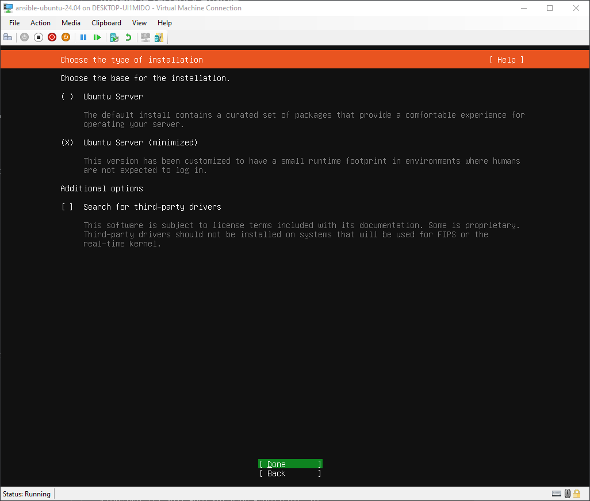

Zaznaczyłem także instalację serwera openssh.

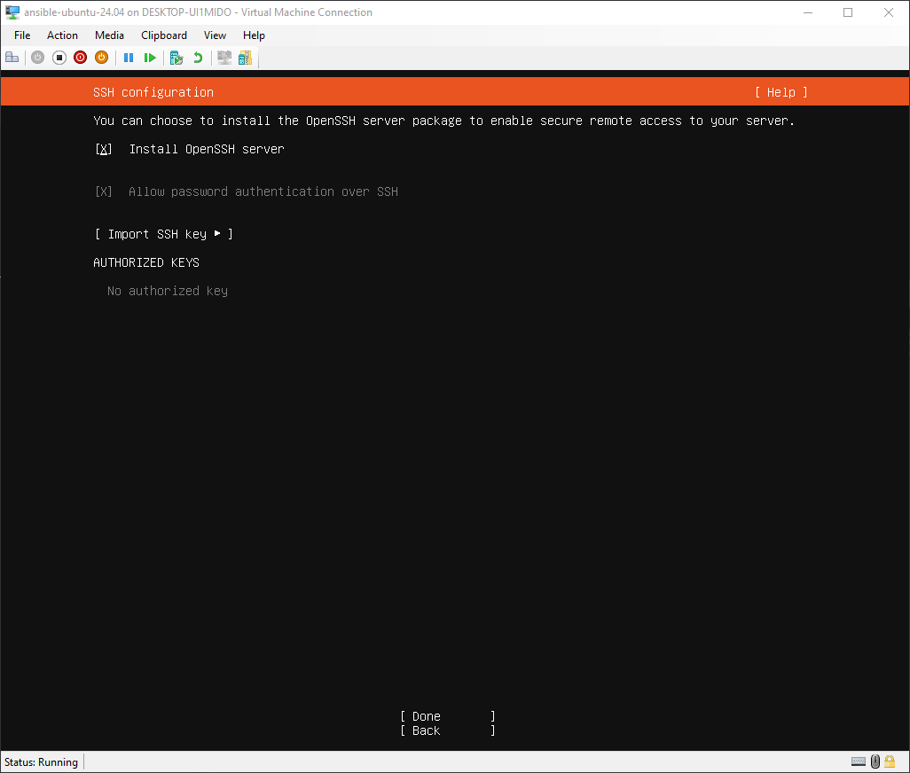

Następnie upewniłem się, że oprogramowanie `tar` oraz `ssh` są zainstalowane.

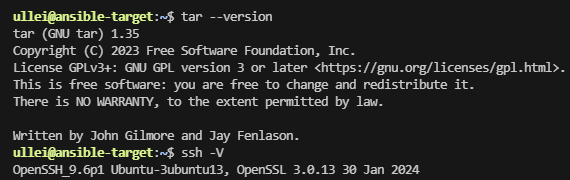

Na koniec utworzyłem użytkownika **ansible** i nadałem mu hasło.

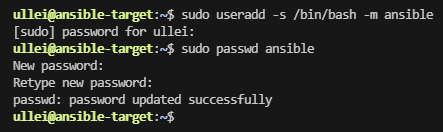

Dodatkowo dodałem użytkownika do grupy `sudo`, żeby mógł wykonywać polecenia takie jak restart usługi.
```
sudo usermod -G sudo ansible
```

---
### Zainstalowałem oprogramowanie Ansible na głównej maszynie
Instalacje rozpocząłem od aktualizacji systemu:
```
sudo apt update
sudo apt upgrade
```
Kolejnym krokiem była instalacja pakietu *software-properties-common*:
```
sudo apt install software-properties-common
```
Następnie dodałem repozytorium Ansible stosująć polecenie:
```
sudo add-apt-repository --yes --update ppa:ansible/ansible
```
I ostatecznie zainstalowałem oprogramowanie poprzez:
```
sudo apt install ansible
```

Dowód, że instalacja przeszła prawidłowo:
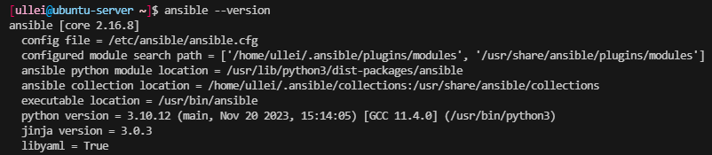

---
### Połączenie poprzez DNS
Następnie chciałem ułatwić komunikację miedzy maszynami poprzez zastosowanie nazw domenowych w miejscu adresów ip.

Można to łatwo zrealizować proprzez dopisanie do pliku `/etc/hosts`:
```
<adres_ip> <nazwa_hosta>
```
Pozwoliłoby to na odnoszenie się do maszyny poprzez nazwę hosta (np. `ssh user@nazwahosta`).

Ja postanowiłem tego nie robić, ze względu na zmienność adresu IP w ustawieniu ExternalLink w HyperV - adres był narzucany przez mój lokalny serwer DHCP, który zarazem przypisywał każdej maszynie adres domenowy `<nazwa_hosta>.lan`.

Biorąc pod uwagę, że hostname maszyny docelowej ustawiłem na `ansible-target`, mogę się do niej odnosić poprzez adres `ansible-target.lan`.

Żeby uniknąć podawania hasła przy każdej próbie polączenia z maszyną poprzez ssh, utworzyłem klucz, za pomocą którego odbywać się bedzie logowanie.

```
ssh-keygen -t ecdsa
```
Klucz pozostawiłem bez hasła.

Następnie skopiowałem klucz publiczny na maszynę docelową stosując polecenie:
```
ssh-copy-id -i ansible-key.pub ansible@ansible-target.lan
```
Pozwala ono skopiować zadany klucz na maszynę o podanym adresie.

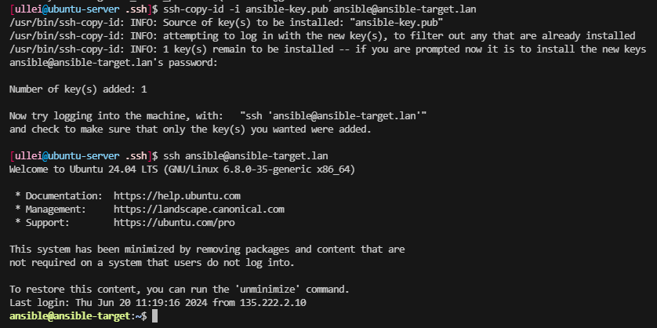

Powyższy zrzut ekranu prezentuje logowanie z użyciem klucza, bez podwania hasła.

## Inwentaryzacja

W punkcie wyżej opisałem komunikację poprzez DNS, zapewniony przez ustawienia mojej sieci lokalnej. Wskazałem również alternatywę w postaci modyfikacji pliku `/etc/hosts`.

Hostname maszyn jest ustawiony na kolejno **ubuntu-sever** dla maszyny głównej i **ansible-target** dla maszyny docelowej. Prostym sposobem na jego zmianę jest modyfikacja pliku `/etc/hostname`.

W celu potwierdzenia komunikacji poprzez nazwę domenowa `target->maszyna glowna` zastosowałem polecenie ping.

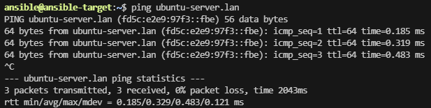

### Utworzenie pliku inwentaryzacji
Następnie utworzyłem [plik inwentaryzacji](https://docs.ansible.com/ansible/latest/getting_started/get_started_inventory.html) w formacie YAML, ze względu na jego czytelność.

Gotowy plik prezentował się tak:
```
all:
  children:
    Orchestrators:
        hosts:
            ubuntu-server:
              ansible_host: ubuntu-server.lan
              ansible_user: ullei

    Endpoints:
        hosts:
            ansible-target:
              ansible_host: ansible-target.lan
              ansible_user: ansible
```
### Wysłanie żadania ping do wyszystkich maszyn
Dzięki plikowi inwentaryzacyjnemu, można sprawnie wysyłac żadania do wielu maszyn. Wystarczy doprecyzować, które maszyny zawarte w pliku nas interesują:

Wyjściowo jako wszystkie maszyny obrałem maszyny docelowe, czyli uruchomiłem ansible z inventory doprecyzowanym na `Endpoints`:

```
ansible -i inventory.yaml Endpoints -m ping
```

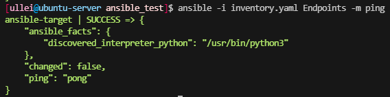

Kominikacja przebiegła bezproblemowo, ze względu na wcześciejszą wymianę kluczy.

Następnie postanowiłem przetestowac uruchomienie ansible dla wszystkich maszyn (w tym orchestratorów)
```
ansible -i inventory.yaml all -m ping
```

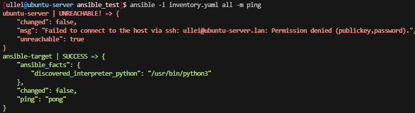

Można zauważyć błąd komunikacji ssh dla orchestratora - maszyna główna próbuje połączyć się sama ze sobą poprzez ssh, nie autoryzuje odpowiedniego klucza i tym samym uniemożliwia połączenie. Można rozwiązac problem dopisując klucz do `authorized-keys` lub zastosowac `ssh-copy-id`, które zrobi to półautomatycznie.

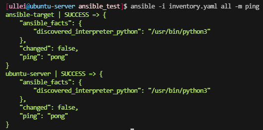

Po dodaniu klucza żadanie ping przechodzi bezproblemowo, jednakowoż uważam, że orchestrator powinien pracować na maszynach docelowych, zatem powyższe połączenie nie jest do końca konieczne (chociaż w przypadku żądania ping pozwala zdiagnozować czy maszyna pracuje, co może być porządane).

## Zdalne wywoływanie procedur za pomocą [*playbooka*](https://docs.ansible.com/ansible/latest/getting_started/get_started_playbook.html)

Zadaniem playbooka jest wykonanie sekwencji poleceń na wskazanych maszynach z pliku inwentaryzacyjnego.

W moim przypadku playbook został podzielony na 2 części: **wszystkie maszyny** oraz **endpointy (maszyny docelowe)**.

Do wszystkich maszyn powinno zostać wysłane żadanie ping.

A następnie do endpointów wysłana zostanie sekwencja:
```
- Zapewnij istnienie katalogu ~/inventory
- Skopiuj inventory z ochestratora na hosta docelowego
- Skopiuj inventory drugi raz (w celu porównania odpowiedzi)
- Zaktualizuj pakiety
- Zrestartuj usługę ssh (serwer ssh na ubuntu pracuje pod nazwą ssh, a nie sshd)
- Zrestartruj usługę rng-tools (ze względu na brak usługi rngd wykorzystałem tę usługę)
```

Gotowy playbook wygląda nastepująco:
```
- name: All machines
  hosts: all
  tasks:
   - name: Ping all machines
     ansible.builtin.ping:


- name: Endpoints
  hosts: Endpoints  
  tasks:
    - name: Create inventory folder
      file:
        path: ~/inventory
        state: directory

    - name: Initial inventory copy
      copy:
        src: ~/MDO2024_INO/INO/GCL1/TD412544/Sprawozdanie4/ansible_test/inventory.yaml
        dest: ~/inventory/inventory.yaml

    - name: Second inventory copy
      copy:
        src: ~/MDO2024_INO/INO/GCL1/TD412544/Sprawozdanie4/ansible_test/inventory.yaml
        dest: ~/inventory/inventory.yaml

    - name: Update packages
      become: true         # become skutkuje przyjęciem uprawnień roota (wywołaniem polecenia przez sudo)
      ansible.builtin.apt: # builtin apt pozwala na prace z zainstalowanymi pakietami
          name: "*"        # wskazuje pakiety
          state: latest    # latest gwaratuje ze stan wskazanych pakietów to najnowsza wersja 

    - name: Restart ssh
      become: true
      ansible.builtin.service: # builtin service pozwala na pracę z uruchomionymi usługami
          name: ssh
          state: restarted     # oczekujemy na stan restarted - wymuszamy wyłączenie i włączenie

    - name: Restart rng-tools
      become: true
      ansible.builtin.service:
          name: rng-tools
          state: restarted 
```
Playbook można uruchomić za pomocą polecenia (wskazujemy plik z inventory):
```
ansible-playbook -i inventory.yaml --ask-become-pass playbook.yaml
```
`--ask-become-pass` prosi o wskazanie hasla uzytkownika przed uruchomieniem playbooka, żeby ansible mogło przejąc uprawnienia administracyjne.

Uruchomienie playbooka:

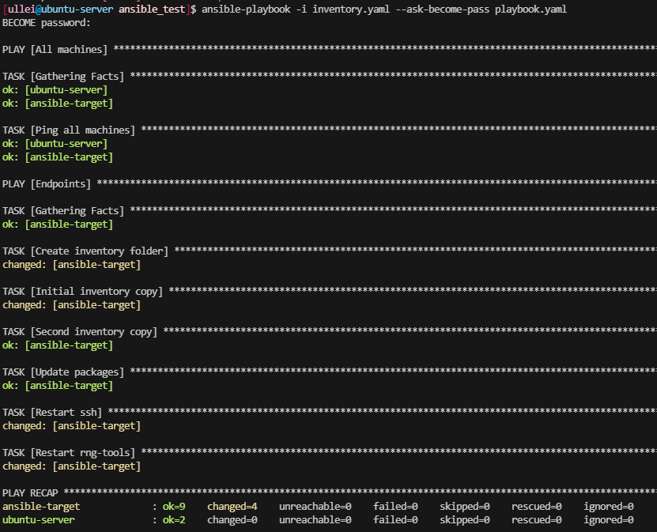

Można zauważyć różnicę miedzy pierwszą próbą kopiowania, a drugą. W drugim przypadku statusem nie jest `changed`, dlatego że plik jest identyczny => brak zmian do odnotowania.

Następnie przeprowadziłem test playbooka dla wyłączonego serwera SSH (w moim przypadku wyłączonej maszyny).

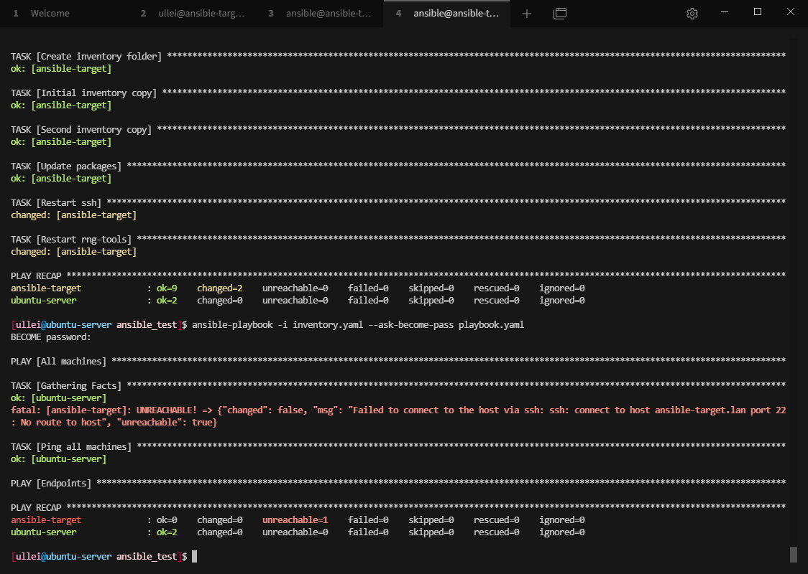

## Zarządzanie kontenerem

Utworzyłem nowy playbook i wyznaczyłem w nim dwie części: **instalacja dockera** oraz **uruchamianie kontenera**

Instalację dockera przeprowadzam dzieki builtinom ansible apt oraz service:
```
- name: Install docker
  become: true
  ansible.builtin.apt:
    name: docker.io
    state: latest

- name: Enable and run docker
  become: true
  ansible.builtin.service:
    name: docker
    enabled: yes
    state: started
```

Następnie zaciągam obraz kontenera z dockerhuba, tworze kontener i finalnie go usuwam.
```
- name: Pull Image
  become: true
  community.docker.docker_image:
    name: ullei/irssi:1.0.0
    source: pull

- name: Create Container
  become: true
  community.docker.docker_container:
    name: irssi
    image: ullei/irssi:1.0.0
    state: started

- name: Remove Container
  become: true
  community.docker.docker_container:
    name: irssi
    state: absent
```

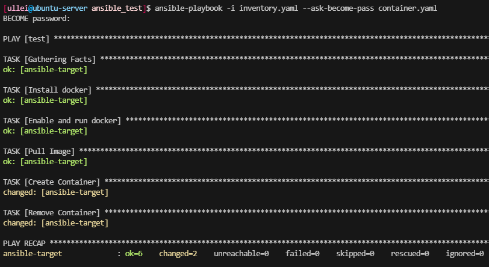

Następnie ubrałem powyższy playbook w role ze szkieletowaniem `ansible-galaxy`. Podział przeprowadziłem zgodnie z powyższymi sekcjami na odpowiednio **docker_setup** oraz **container_shenanigans**.

Na początku przeszedłem do folderu `~/.ansible` i wykonałem polecenia:
```
ansible-galaxy init docker_setup
ansible-galaxy init container_shenanigans
```
Wygenerowały one szkielet docelowych ról.

Następnie umieściłem powyszcze sekcje w plikach `main.yaml` znajdujących się w folderach `.ansible/roles/<role>/tasks`

Przykład pliku `main.yaml` dla roli **docker_setup**:
```
---
# tasks file for docker_setup
- name: Install docker
  become: true
  ansible.builtin.apt:
    name: docker.io
    state: latest

- name: Enable and run docker
  become: true
  ansible.builtin.service:
    name: docker
    enabled: yes
    state: started
```

Następnie zmodyfikowałem playbook tak, żeby pracował z rolami.
```
- name: Run Roles
  hosts: Endpoints
  roles:
    - docker_setup
    - container_shenaningans
```
Jako rezultat otrzymałem podobne podsumowanie, z krokami podzielonymi na role:

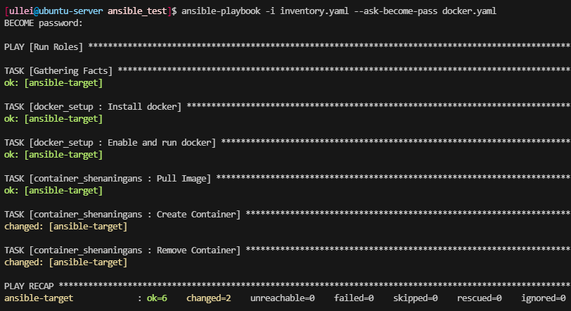

# Nienadzorowana instalacja

Na początku zainstallowałem system fedora 40 w sposób nadzorowany. Ustaliłem w ten sposób nazwę użytkownika, hasło oraz ustawienia lokalizacji. Po zainstalowaniu powstał plik `/root/anaconda-ks.cfg`, który po drobnych modyfikacjach posłuży do instalacji w sposób nienazdorowany.

Wyeksportowałem plik z maszyny za pomocą filezilli poprzez ssh (port 22, `ip addr` w celu uzyskania adresu).

Plik nie zawierał wzmianek na temat repozytoriów, wiec doprecyzowałem te z których zamierzałem korzystać - domyślne repozytoria fedory.
```
url --mirrorlist="http://mirrors.fedoraproject.org/mirrorlist?repo=fedora-40&arch=x86_64"
repo --name=updates-released --mirrorlist=http://mirrors.fedoraproject.org/mirrorlist?repo=updates-released-f40&arch=x86_64
```
Następnie nadałem hostname za pomocą:
```
network --hostname=jorjor-wel
```
Do pakietów dopisałem pakiet docker
```
%packages
@^server-product-environment
docker
%end
```
Później zapewniłem formatowanie dysku za dopisując:
```
clearpart --all
```
---
Następnie rozszerzyłem plik kickstartowy o sekcję `%post`, w której zorganizowałem instalację kontenera z aplikacją irssi.

Jako rozwiązanie przyjąłem utworzenie nowej usługi, która pobierze obraz i utworzy kontener.

```
[Unit]
Description=Download and run Irssi container
Requires=docker.service
After=docker.service

[Service]
Type=oneshot
ExecStart=/usr/bin/docker pull ullei/irssi:1.0.0
ExecStart=/usr/bin/docker run -d -it --name irssi ullei/irssi:1.0.0
```

Plik kickstart wrzuciłem na github, i będę stosował jego surową postać do instalacji dopisująć link do tego pliku w GRUBie w postaci:
```
inst.ks=https://raw.githubusercontent.com/InzynieriaOprogramowaniaAGH/MDO2024_INO/TD412544/INO/GCL1/TD412544/Sprawozdanie4/kickstart.cfg
```

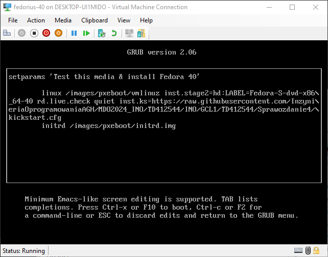

Powyższe okno edycji otworzyłem wciskając klawisz `e` podczas wyboru opcji instalacji w GRUB. Po wprowadzeniu zmian nacisnąłem klawisz `F10` w celu rozpoczęcia instalacji.

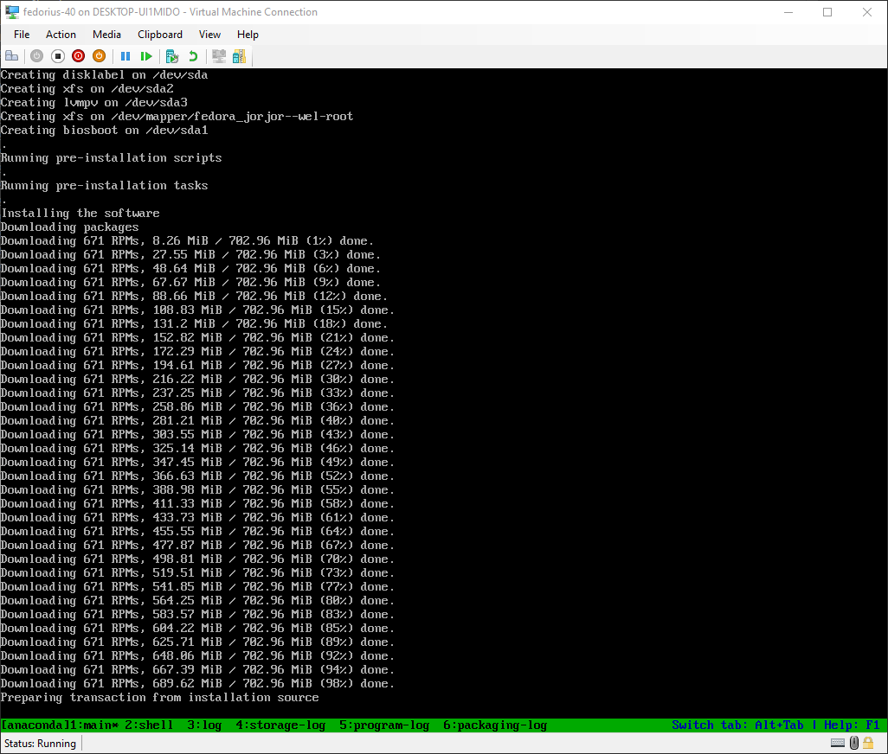

Po zalogowaniu do systemu można zobaczyć kontener w `docker ps` i podłączyć się do niego stosując `docker attach irssi`.

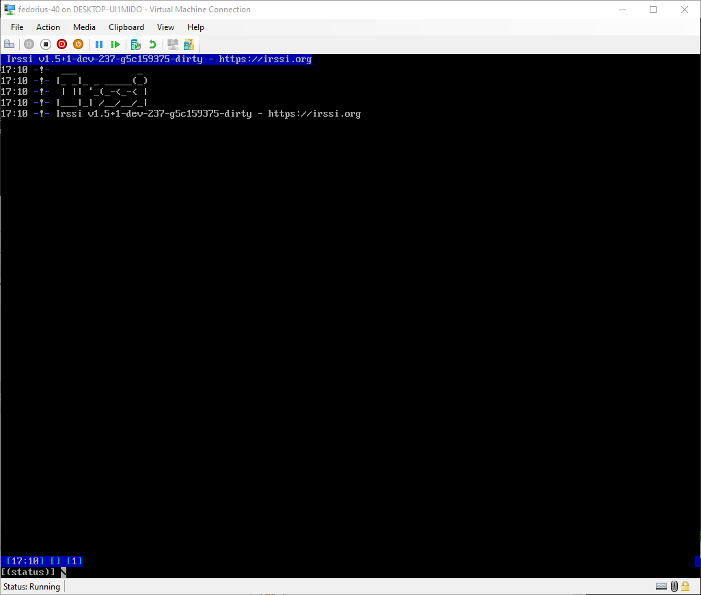
