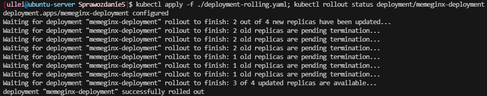

# Sprawozdanie 5

# Wdrażanie na zarządzalne kontenery: Kubernetes (1)

## Zadania do wykonania
## Instalacja klastra Kubernetes
### Zaopatrz się w implementację stosu k8s: [minikube](https://minikube.sigs.k8s.io/docs/start/)
Korzystając z dokumentacji pobrałem minikube dla systemu linux x86-64 w postaci instalatora dpkg.

Pobranie paczki:
```
curl -LO https://storage.googleapis.com/minikube/releases/latest/minikube_latest_amd64.deb
```
Instalacja:
```
sudo dpkg -i minikube_latest_amd64.deb
```
### Zaopatrz się w polecenie `kubectl` w wariancie minikube, może być alias `minikubctl`, jeżeli masz już "prawdziwy" `kubectl`
Utworzyłem alias dla polecenia `minikube kubectl`:
```
alias kubectl="minikube kubectl --"
```
Pozwoli on w większości przypadków ominąć pisanie `minikube` podczas wywoływania poleceń.
### Uruchom Kubernetes, pokaż działający kontener/worker
Kubernetes uruchamiam za pomocą:
```
minikube start
```


Poprawne uruchomienie wskazuje na spełnienie wymagań aplikacji przez hardware (maszynę wirtualną). Minimalnymi wymaganiami są 2GB ramu, 20GB wolnej przestrzeni na dysku oraz conajmniej 2 rdzenie procesora.

Kubernetes uruchamia się w kontenerze co można sprawdzić wywołująć `docker ps`


### Uruchom Dashboard, otwórz w przeglądarce, przedstaw łączność
Dashboard uruchamiam za pomocą **visual studio code**, co skutkuje automatycznym przekierowaniem portu i umożliwieniem dostania się do niego poza maszyną wirtualną. Uruchamiam go poleceniem:
```
minikube dashboard
```


Dashboard został uruchomiony, a jego adres wyświetla się w konsoli. Pozostaje uruchomić przeglądarkę:


### Zapoznaj się z koncepcjami funkcji wyprowadzanych przez Kubernetesa (*pod*, *deployment* itp)
```
Pod - podstawowa jednostka wdrażania w Kubernetes skladajaca sie na jeden lub wiecej kontenerów. Dzieli zasoby komputera z innymi podami.
Deployment - Zestaw identycznych podów. Zmiany w deploymencie wpływają na zmiany w ilości, wersji lub metadanych podów.
Service - definiuje logikę odkrywania usług i równoważenia obciążenia. Zapewnia stały punkt dostępu (adres IP i port), pod którym usługa jest dostępna, niezależnie od tego, które Pody ją realizują
ReplicaSet - zapewnia utrzymanie określonej liczby replik danego Podu w systemie. Jest często używany przez Deploymenty do zarządzania liczbą Podów. Deploymenty automatycznie tworzą ReplicaSety.
```
## Analiza posiadanego kontenera
Projekt wynikowy jenkins pipeline'u nie nadaje się do realizowanego zagadnienia. Obrałem w takim razie ścieżkę modyfikacji obrazu nginx.

Obraz stworzyłem poprzez zamianę domyślej strony **Welcome to nginx!** na własną poprzez podmianę pliku `index.html`. W tym celu stworzyłem poniższy dockerfile:
```
FROM nginx:1.27
COPY ./index.html /usr/share/nginx/html/index.html
```
Zawartość podmienionego pliku to słowa inne niż dotychczas zawarte w nagłówkach i paragrafach.
Zbudowałem obraz poleceniem:
```
docker build . -t mynginx
```


Obraz otagowałem i opublikowałem w DockerHubie:


Następnie uruchomiłem kontener na jego podstawie:
```
docker run -d --rm -p 7272:80 --name memeginx ullei/memeginx:1.0.0
```


W celu zweryfikowania działania przeszedłem na adres serwera w przeglądarce:


   
## Uruchamianie oprogramowania
### Uruchom kontener na stosie k8s
Uruchomiłem kontener stosująć polecenie o poniższej składni:
```
minikube kubectl run -- <nazwa-wdrożenia> --image=<obraz-docker> --port=<wyprowadzany port> --labels app=<nazwa-wdrożenia>
```


### Przedstaw że pod działa (via Dashboard oraz kubectl)

Uruchomiony kontener został autoamtycznie zamknięty w podzie, co widać na dashboardzie:


Aktywne pody można wylistować poleceniem
```
kubectl get pods
```


### Wyprowadź port celem dotarcia do eksponowanej funkcjonalności

Najpierw przekierowuje port w **visual studio code**:


Następnie stosuje polecenie:
```
kubectl port-forward pod/memeginx 7727:80
```
Skutkuje to wyprowadzeniem wewnętrznego portu 80 poda na port 7727.


### Przedstaw komunikację z eskponowaną funkcjonalnością
Powyższe operacje pozwalają dostać się do serwera nginx pod adresem `localhost:7727`


# Wdrażanie na zarządzalne kontenery: Kubernetes (2)
## Przekucie wdrożenia manualnego w plik wdrożenia (wprowadzenie)
### Zapisanie [wdrożenia](https://kubernetes.io/docs/concepts/workloads/controllers/deployment/) jako plik YML
Przekształcenie ręcznego wdrożenia na plik wdrożenia dokonuje się za pomocą pliku **YAML**. Wewnątrz pliku określamy rodzaj, nazwę deploymentu, nazwę aplikacji, ilość replik i obraz bazowy. 

Utworzyłem plik w postaci:
```
apiVersion: apps/v1
kind: Deployment
metadata:
  name: memeginx-deployment
  labels:
    app: memeginx
spec:
  replicas: 4
  selector:
    matchLabels:
      app: memeginx
  template:
    metadata:
      labels:
        app: memeginx
    spec:
      containers:
      - name: memeginx
        image: ullei/memeginx:1.0.1_err
        ports:
        - containerPort: 80
```
Jego zadaniem było wdrożenie 4 podów z aplikacją.

### Przeprowadź próbne wdrożenie przykładowego *deploymentu* `nginx`
Wdrożenie odbywa się poprzez zastosowanie polecenia `kubectl apply`. Kubernetes przyjmie deployment z pliku i postara się go zrealizować. Zastosowałem więc komendę:
```
kubectl apply -f ./deployment-memeginx.yaml
```


### Zbadaj stan za pomocą ```kubectl rollout status```

Powyższe polecenie pozwala sprawdzić status wdrażania wskazanego deploymentu. Wykonanie polecenia:


## Przygotowanie nowego obrazu
### Zarejestruj nowe wersje swojego obrazu `Deploy` (w Docker Hub lub lokalnie)

Przygotowałem nową wersję obrazu poprzez za pomocą tego samego dockerfile. Zmiana polegała jedynie na modyfikacji zawartości pliku `index.html`.
Zbudowałem obraz i przepchnąłem na DockerHub z tagiem *1.0.1*:


Następnie przygotowałem obraz, którego uruchomienie zakończy się błędem. Zrealizowałem to poprzez modyfikację dockerfile - dodałem linijkę wykonującą polecenie `exit 1`
```
FROM nginx:1.27
COPY ./index.html /usr/share/nginx/html/index.html
CMD exit 1
```
Zbudowałem obraz i przepchnąłem na DockerHub:


Uruchomiłem dedykowany pod dla tej wersji aplikacji w celu sprawdzenia czy wystąpi błąd:


Otrzymujemy błąd - kubernetes próbuje uruchomić poda ponownie (restarts 1). Status wskazuje na error.
  
## Zmiany w deploymencie
## Aktualizuj plik YAML z wdrożeniem i przeprowadzaj je ponownie po zastosowaniu następujących zmian:
### zwiększenie replik np. do 8
Zwiększam ilość replik modyfikująć plik YAML:
```
spec:
  replicas: 16
```
Zmiany aplikuję za pomocą `kubectl apply`


### zmniejszenie liczby replik do 1
W identyczny sposób zmieniam ilość replik do 1 i zlecam wprowadzenie zmian.


### zmniejszenie liczby replik do 0
Tak samo redukuje ilość replik do 0.


Brak replik nie jest głupim pomysłem w przypadku gdy chcemy mieć gotowy deployment oczekujący jedynie na przydzielenie wiekszej ilości zasobów. Bardzo szybko można w ten sposób uruchomić aplikację.

### Zastosowanie nowej wersji obrazu
Postanowiłem przygotować 8 replik nowszej wersji aplikacji. Wersję aplikacji zmieniam w pliku modyfikując tag obrazu:
```
containers:
      - name: memeginx
        image: ullei/memeginx:1.0.1
        ports:
        - containerPort: 80
```
Domyślną strategią aktualizacji jest **Rolling Update**, która wprowadza nowe pody w miejsce starych zapewniając zarówno, że aplikacja będzie cały czas dostępna. Może tworzyć pody powyżej ustalonej ilości replik - pody z poprzednią wersją i tak zostaną usunięte.


`rollout status` prezentuje proces aktualizacji podów jeden po drugim.

Wynikowo w dashboardzie można zobaczyć 8/8 podów z nową wersją obrazu (1.0.1).


### Zastosowanie starszej wersji obrazu

Downgrade wersji obrazu wykonuje w identyczny sposób - podaję wersję 1.0.0.


Na powyższym zrzucie widac, że pody aktualizowane są po kolei, a w miedzyczasie kasowane są repliki z poprzedniego deploymentu.


## Przywracaj poprzednie wersje wdrożeń za pomocą poleceń
### ```kubectl rollout history``` oraz ```kubectl rollout undo```
`rollout history` pozwala przejrzeć historię rewizji - zmian w deploymencie.

Wykonanie polecenia `kubectl rollout undo` pozwala na cofnięcie jednej rewizji, lub doprecyzowania konkretnej rewizji do której chcemy wrócić:
```
minikube kubectl rollout undo deployment/<deployment> --to-revision=<REVISION>
```


## Kontrola wdrożenia
### Napisz skrypt weryfikujący, czy wdrożenie "zdążyło" się wdrożyć (60 sekund)
Polecenie `kubectl rollout status` przyjmuję flagę `--timeout`, która pozwala doprecyzować maksymalny czas trwania deploymentu. W przypadku przekroczenia podanego czasu otrzymamy error.

W poniższym skrypcie określam timeout na 60 sekund stosując zmienną `timeout`:
```
#!/bin/bash
timeout=60

minikube kubectl -- apply -f ./deployment-memeginx.yaml
minikube kubectl -- get deployments 

if minikube kubectl -- rollout status deployment/memeginx-deployment --timeout=${timeout}s > /dev/null 2>&1; then
echo "Deployment rolled out within the time limit."
exit 0
else
echo "Deployment did not complete within the time limit."
exit 1
fi
```
Skryptowi należy nadać uprawnienia do wykonywania `chmod +x`.

Wykonanie skryptu (depoyment success):


Wykonanie skryptu (deployment trwał za długo):


Dashboard wyświetla 5/4 pody, dlatego że **Rolling Update** pozostawia jeden działający pod na poprzedniej wersji. Warto zauważyć, że wprowadzone zmiany pozostały. W przypadku błędu można wrócić do poprzedniej wersji poleceniem `rollout undo`.


## Strategie wdrożenia
## Przygotuj wersje [wdrożeń](https://kubernetes.io/docs/concepts/workloads/controllers/deployment/) stosujące następujące strategie wdrożeń
Strategie można doprecyzowac w części `spec` podając typ strategii. Przed testowaniem ustaliłem deployment na 4 repliki w wersji 1.0.0.
### Recreate
Plik wdrożeniowy:
```
apiVersion: apps/v1
kind: Deployment
metadata:
  name: memeginx-deployment
  labels:
    app: memeginx
    track: stable
spec:
  replicas: 4
  strategy:
    type: Recreate
  selector:
    matchLabels:
      app: memeginx
      track: stable
  template:
    metadata:
      labels:
        app: memeginx
        track: stable
    spec:
      containers:
      - name: memeginx
        image: ullei/memeginx:1.0.1
        ports:
        - containerPort: 80
```
Stosuję etkietę wskazującą, że jest to wersja `stable` - wersja przetestowana i sprawna.

Wykonuję polecenia `kubectl apply` oraz `kubectl rollout status` do wprowadzenia deploymentu i monitorowania jego statusu.


Strategia usuwa pody, a następnie w ich miejsce wdraża nowe. Jest to przydatna strategia w przypadku gdy nie może dojść do sytuacji, w której działają równocześnie wersja stara i nowa.

### Rolling Update (z parametrami `maxUnavailable` > 1, `maxSurge` > 20%)
Ta strategia pozwala na wprowadzenie parametrów:
```
maxUnavailable - ile podów podczas wdrażania moze być niedostępnych na raz
maxSurge - w jakim stopniu (lub ile podów) strategia może utworzyć podów ponad limit replik
```
Wprowadziłem poniższe zmiany w plkiku YAML:
```
strategy:
    type: RollingUpdate
    rollingUpdate:
      maxUnavailable: 2
      maxSurge: 50%
```
Zaaplikowanie deploymentu:



Dwa pody zostały zaktualizowane, a ich stare wersje czekały na terminację (limit niedostepnych podów to 2). Następnie zaktualizowane zostały pod 3 i 4.
### Canary Deployment workload
Strategia Canary odpowiada wdrażaniu jednocześnie starej, stabilnej wersji oprogramowania i nowej, testowej, dla części ruchu lub użytkowników. Pozwala na testowania działania aplikacji w warunkach produkcyjnych, zarazem nienarażając dużej ilości użytkowników na potencjalne niedogodności.

Dla wersji testowej przyjmuje się etykietę
```
labels:
    track: canary
```
Poniższy plik wdraża poda z nową wersją na osobnym deploymencie:
```
apiVersion: apps/v1
kind: Deployment
metadata:
  name: memeginx-deployment-canary
  labels:
    app: memeginx
    track: canary
spec:
  replicas: 1
  selector:
    matchLabels:
      app: memeginx
      track: canary
  template:
    metadata:
      labels:
        app: memeginx
        track: canary
    spec:
      containers:
      - name: memeginx
        image: ullei/memeginx:1.0.1
        ports:
        - containerPort: 80
```


W dashboardzie można zauważyć wygodny podział podów po wersji - `stable`/`canary`.


### Dla wdrożeń z wieloma replikami, użyj [serwisów](https://kubernetes.io/docs/concepts/services-networking/service/)

Serwisy stosuje się do eksponowania aplikacji sieciowej. Zapewniają dostęp do aplikacji bez względu na ilośc podów.

Zdefiniowałem serwis w pliky YAML w ten sposób:
```
apiVersion: v1
kind: Service
metadata:
  name: memeginx-service
spec:
  selector:
    app: memeginx
  ports:
  - protocol: TCP
    port: 80
    targetPort: 80
```
Można od razu zauważyć różnicę w typie pliku `Deployment`/`Service`.

Selector jest wskazany na etykietę `app`, co oznacza, że serwis będzie eksponował aplikację bez względu na wersję `stable` czy `canary`.

Tworzę serwis na podstawie pliku stosując polecenie `kubectl create -f service.yaml`:


Następnie uruchamiam przekierowanie portów wskazująć serwis:


W tym momencie aplikacja jest dostępna w przeglądarce (po przekierowaniu portu w **visual studio code**):


