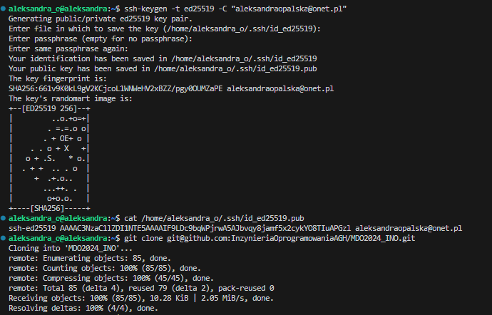
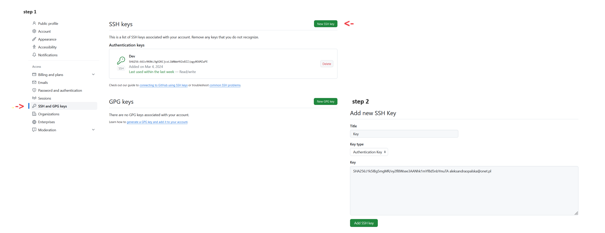
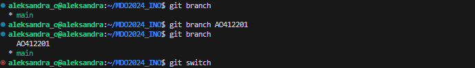
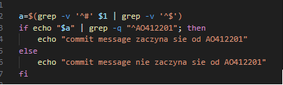
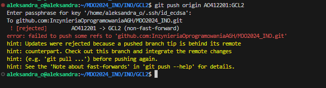

# Sprawozdanie 1

## Opis celu i streszczenie projektu:

Celem zajęć było zapoznanie się z Git'em i jego podstawowymi funkcjami oraz wykorzystanie SSH poprzez wykonanie następujących czynności:

- sklonowanie repozytorium przy użyciu nowo utworzonych kluczy SSH,
- utworzenie własnej gałęzi,
- przesłanie nowych plików do repozytorium źródłowego.
## Wykonane kroki
Do wykonania zadania potrzebne jest użycie systemu operacyjnego opartego na Linux pracujący na maszynie wirtualnej Oracle VirtualBox oraz systemu Ubuntu 22.04.4.LTS. Link do pobrania maszyny: https://www.virtualbox.org/wiki/Downloads oraz Ubuntu: https://ubuntu.com/download/server. Poradnik krok po kroku instalacji znajduje się pod lnkiem: https://www.youtube.com/watch?v=wqm_DXh0PlQ. 
Ważne informacje:
- podczas instalacji zalecane jest zwiększenie ilości CPU do 2,
- przydzielenie 4GB pamięci RAM
- 36GB miejsca na dysku

Nałożenie środowiska Visual Studio Code (https://code.visualstudio.com/download) za pomocą wtyczki SSH można zrealizować w następujących krokach:
- instalacja openssh-client:
```bash
sudo apt install openssh-client
```
- instalacja net-tools i uzyskanie adresu IP:
```bash
sudo apt install net-tools
ifconfig
```

## 1. Instalacja klienta Git i obsługi kluczy ssh:
- instalacja kluenta Git za pomocą komendy:
```bash
apt-get install git
```
- sprawdzenie czy Git został poprawnie zainstalowany komendą:
```bash
git --version
```
- wygenerowanie kluczy ssh komentą:
```bash
ssh-keygen
```


## 2. Sklonowanie repozytorium przedmiotowego za pomocą HTTPS i personal access token
- skopiowanie linku do repozytorium GitHub
- użycie komendy: git clone https://github.com/InzynieriaOprogramowaniaAGH/MDO2024_INO.git

## 3. Dostęp do repozytorium jako uczestnik i skonowanie za pomocą utworzonego klucza SSH:
- zapoznanie się z dokumentacją, gdzie są pokazane kroki: https://docs.github.com/en/authentication/connecting-to-github-with-ssh/generating-a-new-ssh-key-and-adding-it-to-the-ssh-agent
- użycie komendy:
```bash
  ssh-keygen ed25519 -C "your_email@example.com"
```
- podanie pliku, w którym ma być zapisany klucz, ENTER gdy miejsce zapisu ma być domyślne
- w przypadku wcześniejszego utworzenia klucza pojawi się pytanie o nadpisaniu klucza

- wyświetlenie klucza komendą:
```bash
  cat miejsce_gdzie_został_zapisany_klucz
```
- umieszczenie wygenerowanego klucza na swoim koncie GitHub: Access -> SSH and GPG keys -> New SSH key
 
- analogicznie utworzyć klucz zabezpieczony hasłem:
```bash
  ssh-keygen ecdsa -C "twój_email@example.com"
```
- pobranie repozytorium z wykorzystaniem protokołu SSH: git clone git@github.com:InzynieriaOprogramowaniaAGH/MDO2024_INO.git

## 4. Przełączenie na gałąź main, a następnie na gałąź grupy
- użycie komendy: git branch, która wyświetla listy gałęzi w repozytorium
 

## 5. utworzenie własnej gałęzi komendą: git branch nazwa_gałęzi (inicjały&nr indeksu)
- przełączanie się na wybraną gałęź:
 ```bash git switch -c nowa_gałąź (w przypadku tylko dwóch gałęzi wystarczy samo 
polecenie git_switch)
```

## 6. Praca na nowej gałęzi
- utworzenie pustego pustego pliku: touch INO/GCL2/AO412201/Sprawozdanie1/README.md
- napisanie Git hooka, który weryfikuje czy "commit message" zaczyna się od "twoje inicjały & nr indexu", można wzorować się z przykładowych githook'ów używając polecenia .git/hooks
 
- nadanie uprawnień poprzez komendę:
```bash
  chmod +x .git/hooks/commit-msg
```
- plik można edytować za pomocą komendy nano:
```bash
 nano .git/hooks/commit-msg
```
- dodanie skrytpu do stworzonego wcześniej katalogu: cp .git/hooks/commit-msg INO/GCL2/AO412201/Sprawozdanie1/
- zrzuty ekranu są umieszczane jako inline:

  a) stworzenie folderu img w katalogu GCL2 za pomocą komendy:
```bash
mkdir img
```
 - dołączenie do folderu zdjęć, które są wykorzystywane w sprawozdaniu przy wykorzystaniu składni
```bash 
   
```
- wysłane do zdalnego źródła
```bash
git add .
git commit 
git push
```
  
  
- podjęcie próby wciągnięcia swojej gałęzi do gałęzi grupowej:
  - użycie komendy
  ```bash
   git push origin AO412201:GCL2
   ```
- otrzymanie następującego błędu
  
   


