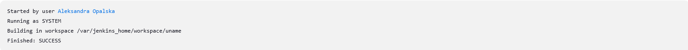
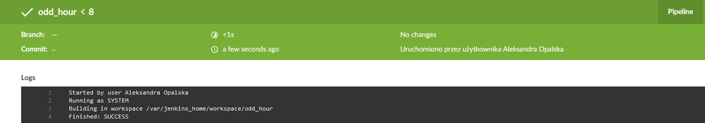
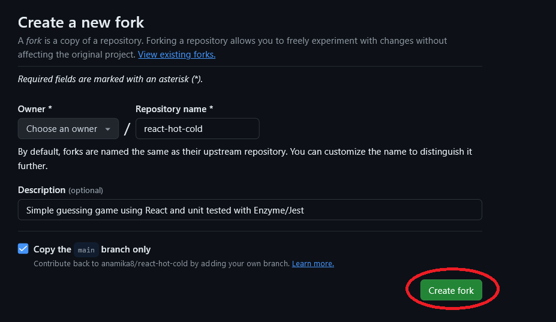

## Sprawozdanie 1
Zajęcia 005
# Uruchomienie
1) Konfiguracja wstępna i pierwsze uruchomienie
- Utworzenie pierwszego prostego projektu, który wyświetla uname

  - utowrzenie projektu, który zwraca błąd, gdy godzina jest nieparzysta
```bash
    #!/bin/bash
hour=$(date +%H)
if [ $((hour % 2)) -ne 0 ]; then
    echo "Hour is odd"
    exit 1
else
    echo "Hour is even"
fi
```
a) uruchomienie o godzinie 19


uruchomienie o godzinie 20


2) Utworzenie prawdziwego projektu, który:
a) klonuje repozytorium
- wygenerowanie tokenu, jeżeli nie istnieje:
  Github -> Settings -> Developer settings -> Personal access tokens -> Generate new token -> skopiowanie tokenu

- skonfigurowanie sekretów przechowujących mój token dostępu do GitHuba
  Tablica -> Zarządzaj Jenkinsem -> Credentials -> System -> Global Credentials -> +Add Credential

- skonfigurowanie dostępu projektu Jenkinsowego do repozytorium:
W zakładce 'Repozytorium kodu' należy zazaczyć zakładkę 'Git' i uzupełnić ją następującymi informacjami:
   - Repository URL: link do repozytorium, z którego Jenkins będzie pobierał kod.
   - Credentials: dane, których Jenkins będzie używać do autoryzacji dostępu do repozytorium Git.
   - Branches to build: dla jakich branch'y Jenkins ma budować zadania i uruchamiać

- ustawienie zmiennej środowiskowej przechowującej GitHub token, korzystając z sekretu

b) buduje obrazy z dockerfiles i/lub komponuje via docker-compose
```bash
docker build --build-arg TOKEN=$GITHUB_TOKEN -t my_docker_build -f MDO2024/INO/GCL2/AO412201/Sprawozdanie2/Dockerfile .
cd MDO2024/INO/GCL2/AO412201/Sprawozdanie3/
docker compose build
```
- uruchomienie build'a

- uruchomienie projektu w Jenkinsie oraz zakończenie się sukcesem


3) Fork własnego repozytorium
Przeprowadzenie forka repozytorium z kodem, który jest wykorzystywany w poprzednim labolatorium oraz w teraźniejszym. Jest to sprawdzony program, w którym program działa oraz przechodzą testy. Fork pozwala nam na wprowadzenie zmian do kodu źródłowego, które nie będą ingerować do głównego repozytorium. W tym celu:
- należy wejść do repozytorium klonowanego repozytorium : https://github.com/anamika8/react-hot-cold
- w prawym górym rogu nacisnąć na przycisk 'fork' -> create a new fork -> create fork

->

W tym przypadku stworzenie obrazu zawierającego dependecję nie jest konieczne, ponieważ program zawiera tylko dwie zależności: Node.js oraz npm.
- Stworzenie pliku Dockerfile do budowy programu (folder Build/Dockerfile)
```bash
FROM node:latest
RUN apt-get update && apt-get install git -y
RUN git clone https://github.com/alexssandrr/react-hot-cold.git
WORKDIR /react-hot-cold
RUN npm i
RUN npm run-script build
```
- Stworzenie pliku Dockerfile do testowania programu (folder Test/Dockerfile)
```bash
GNU nano 6.2                                                                                                                                                            
RUN CI=TRUE npm test a
```
- Napisanie docker-compose, który automatyzuje proces uruchomiania wielu kontenerów jednocześnie
```bash
GNU nano 6.2                                                                                                                                                                    
services:
   builder:
      build:
         context: Build
         dockerfile: Dockerfile
      image: app_builder
   tester:
      build:
         context: Test
         dockerfile: Dockerfile
      image: app_tester
      depends_on:
         - builder
```
- W celu sprawdzenia działania programu podczas budowania i testowania należy stworzyć nowego pipeline'a, który:
  - klonuje repozytorium
  - buduje aplikację w kontenerze
  - testuje aplikację w kontenerze
  - buduje i testuje aplikacje za pomocą komendy ```bash docker compose build ```
  - zwraca artefakty
 Treść pipline:
```bash
pipeline {
    agent any
    environment {
        GIT_REPO = 'https://github.com/alexssandrr/react-hot-cold.git'
        GIT_BRANCH = 'main'
    }
    triggers {
        pollSCM('* * * * *')
    }
    stages {
        stage('Collect') {
            steps {
                git branch: "${GIT_BRANCH}", url: "${GIT_REPO}"
            }
        }
        stage('Build') {
            steps {
                sh '''
                cd CI/Build
                docker info
                docker build -t app_builder .
                '''
            }
        }
        stage('Test') {
            steps {
                sh '''
                cd CI/Test
                docker build -t app_tester .
                '''
            }
        }
        stage('Deploy') {
            steps {
                sh '''
                cd CI
                docker compose build
                docker compose logs builder > log.txt
                docker compose logs tester >> log.txt
                '''
            }
        }
        stage('Publish') {
            steps {
                sh '''
                TIMESTAMP=$(date +%Y%m%d%H%M%S)
                tar -czf Artifact_$TIMESTAMP.tar.gz CI/docker-compose.yml CI/Test CI/Build CI/log.txt
                ls -l
                '''
                archiveArtifacts artifacts: 'Artifact_*.tar.gz', fingerprint: true
            }
        }
    }
}
```


## Błędy
Podczas uruchomienia pipline napotkałam na kilka błędów:
1) Aktualizacja wtyczek build pipline


Powtarzający się błąd:


Początkowo podejrzewałam, że może mieć problem ze znaleziem pliku ca.pem dlatego znalazłam jego lokalizację 


Po znalezieniu jego lokalizacji czyli /etc/docker znalazłam, że tylko użytkownik root ma prawo do odczytu i zapisu dlatego ustawiłam prawo odczytu dla użytkownika Jenkins


Jednak błąd się nadal powtarzał spróbowałam znaleźć pomocy na forach internetowych. Próbowałam użyć polecenia ```bash until docker info; do sleep 1; done ``` który zapewnia, że skrypt będzie czekać na gotowość Dockera, jednak to również nie pomogło. Zauważyłam, że problme polegał w woluminach, dlatego usunęłam Jenkinsa i ponownie go zainstalowałam i uruchomiłam. Był to prawidłowy krok jednak ponownie zabrakło pamięci na dysku. Po zwolnieniu miejsca kolejne kroki zostały wykonane bez większych błędów.


