# Sprawozdanie 4
# Cel sprawozdania: Automatyzacja i zdalne wykonywanie poleceń za pomocą Ansible

## Instalacja zarządcy Ansible
Ansible jest narzędziem wykorzystywanym do automatyzacji procesów administracyjnych, orkiestracji oraz zarządzania konfiguracją. 
1. Utowrzenie nowej maszyny wirtualnej o takim samym systemie operacyjnym jak maszyna, na której do tej pory pracowano - Ubuntu 22.04
   - zgodnie z instrukcją nadanie nazwy użytkownika ```bash ansible``` oraz hostname na ``` bash ansible-target```
     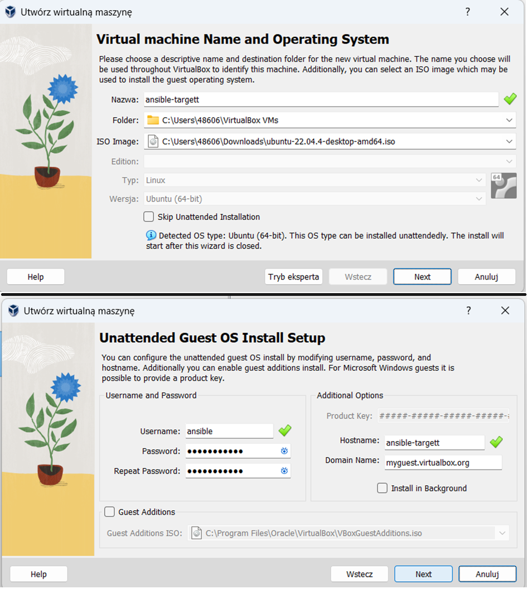
   - stworzona maszyna oraz jej właściwości
     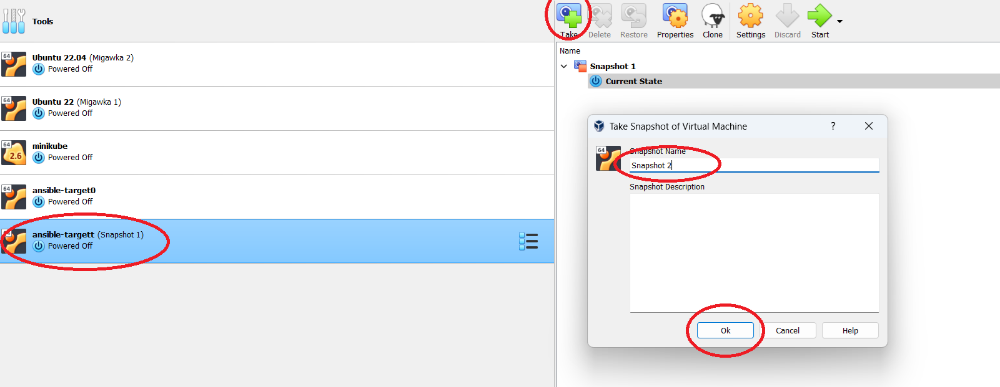
     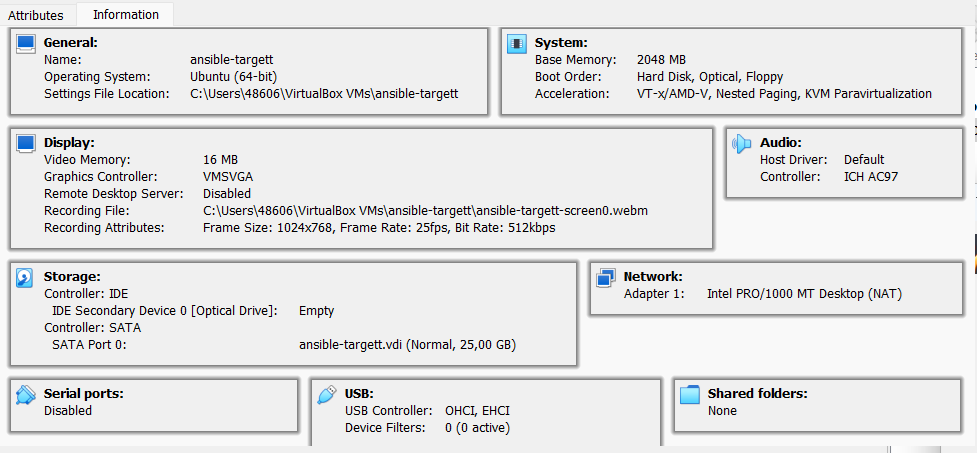
   - zrobienie migawki maszyny
      
2. Zainstalowanie oprogramowania Ansible ze strony ```bash https://docs.ansible.com/ansible/latest/installation_guide/installation_distros.html#installing-ansible-on-ubuntu ``` 
   na głównej maszynie (nie nowo utworzonej)
   ```bash
   $ sudo apt update
   $ sudo apt install software-properties-common
   $ sudo add-apt-repository --yes --update ppa:ansible/ansible
   $ sudo apt install ansible
   ```
  - sprawdzenie czy dobrze zainstalowało się oprogramowanie
    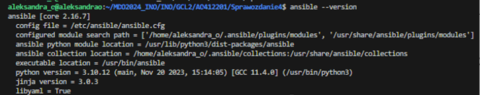
3. Zainstalowanie programu tar oraz serwera OpenSSH (sshd)
  - Użycie poniższych komend:
    ``` bash
    sudo apt install openssh-server
    sudo apt install tar
    ```
  - Sprawdzenie poprawności instalacji:
    ``` bash
    which tar
    dpkg -l | grep openssh-server
    ```
  - Sprawdzenie czy SSH jest włączone
    ``` bash
    sudo systemctl status ssh
    ```
    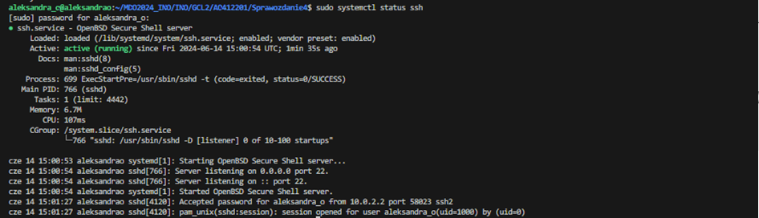
4. Wymiana kluczy SSH między dwoma maszynami, tak aby logowanie ssh ansible@ansible-target nie wymagało podania hasła.
  - Wygenerowanie nowych kluczy
    ```bash
    ssh-keygen
    ```
  - sprawdzenie IP nowej maszyny za pomocą polecenia ```bash ifconfig ``` 
  - Wymiana kluczy
      
    ```bash
    ssh-copy-id -i ~/.ssh/id_rsa.pub ansible@10.0.2.15
    ```
    ```bash -i ``` ścieżka do klucza publicznego + docelowy adres użytkownika i ip docelowe
    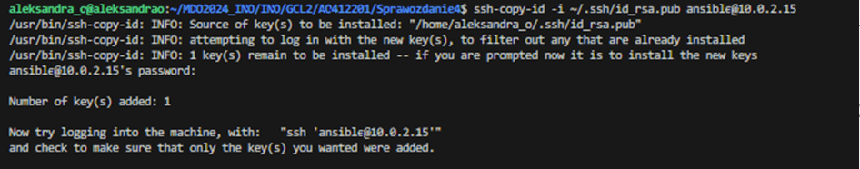
    - Sprawdzenie, czy można połączyć się z maszyną bez konieczności podawania hasła
      `` bash shh ansible@10.0.2.2 ``
    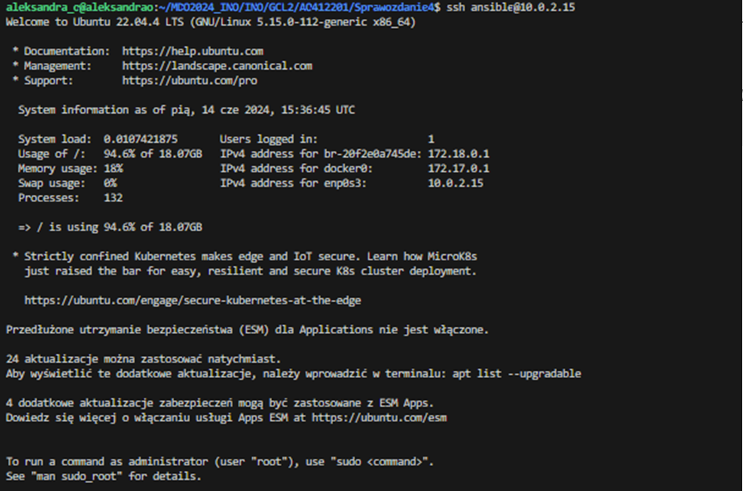
  - Ponowienie dwóch poprzednich kroków, jednak z inną nazwą użytkownika oraz IP
    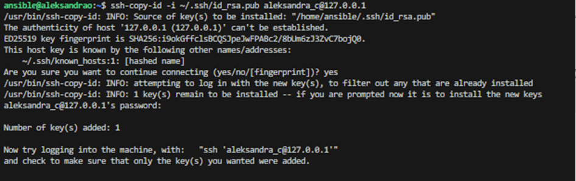

## Inwentaryzacja
1. Zmiana haseł na przewidywane nazwy, jeżeli są one inne niż powinny
      ``` bash hostnamectl set-hostname nazwa-hosta ```
      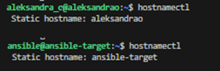
2. Wprowadzenie nazwy DNS tak aby było możliwe wywoływaniie maszyn za pomocą nazw, a nie tylko adresów IP
        - Wejście do folderu /etc/hosts
        - ustawienie nazwy maszyny dla danego adresu IP
      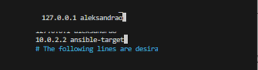
3. Sprawdzenie czy maszyny łączą się po nazwie
      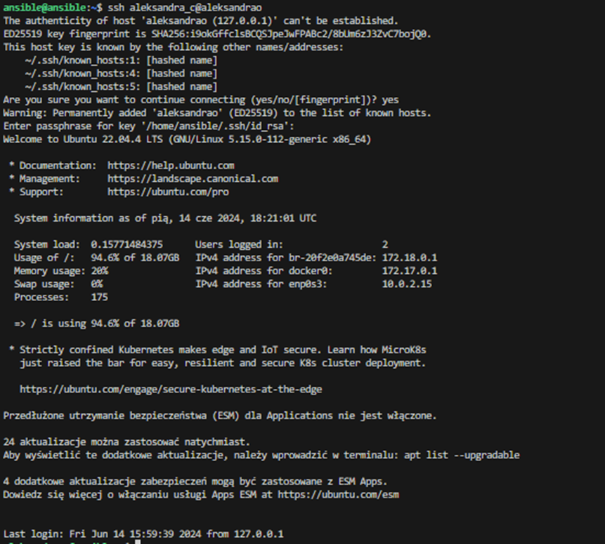
       - można również użyć polecenie ```bash ping ``` co również pokazuje prawidłowe połączenie
      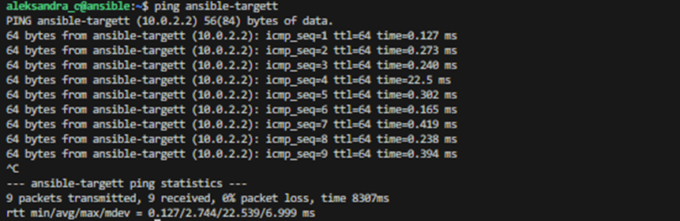
4. Stworzenie pliku inwentaryzacji
   - Stworzenie pliku inwentaryzacji na podstawie dokumentacji https://docs.ansible.com/ansible/latest/getting_started/get_started_inventory.html
     - stworzenie folderu ansible_quickstart ```bash mkdir ansible_quickstart```
      - w stworzonym folderze stworzenie pliku inventory.ini
        ```bash
        cd ansible_quickstart
        touch inventory.ini
        nano inventory.ini
        ```
      - dodanie nowej grupy hostów [myhosts]
        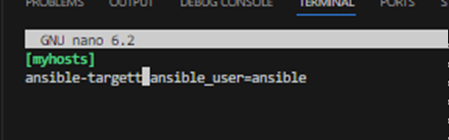
      - wyświetlenie maszyn zdefioniowanych w pliku (sprawdzenie)
        ```bash
        ansible-inventory -i inventory.ini --list
        ```
        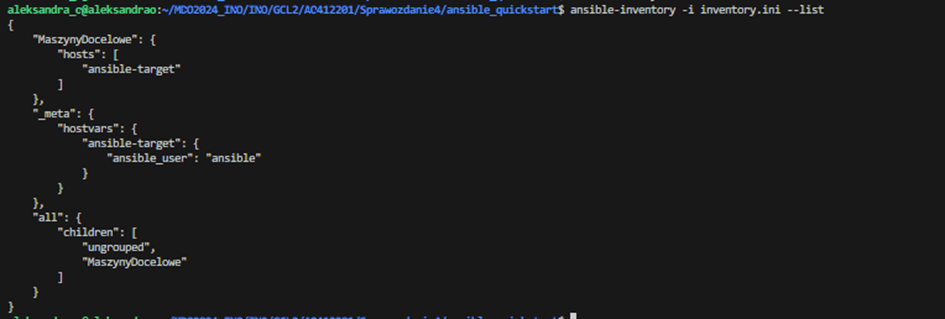
      - weryfikacja
        ```bash
        ansible MaszynyDocelowe -m ping inventory.ini
        ```
        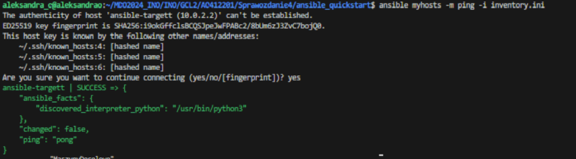
5. Umieszczenie w pliku inwentaryzacji sekcji Orchestrators oraz Endpoints
   - treść pliku
     ```bash
     [Orchestrators]
     orchestrator ansible_host=127.0.0.1 ansible_user=aleksandra_o ansible_ssh_private_key_file=/home/aleksandra_o/.ssh/id_rsa

     [Endpoints]
     01 ansible_host=10.0.2.2 ansible_user=ansible ansible_ssh_private_key_file=/home/aleksandra_o/.ssh/id_rsa

     [all:children]
     Orchestrators
     Endpoints
     ```
6. Wysłanie żądania ```bash ping``` do wszytskich maszyn
    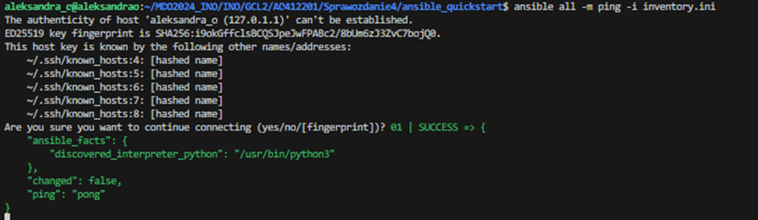

# Zdalne wywołanie procedur

Stworzenie playbooka Ansible na podstawie dokumentacji https://docs.ansible.com/ansible/latest/getting_started/get_started_playbook.html
1. Wysłanie żądania ```bash ping ``` do wszystkich maszyn
   ```bash
   - name: Ping all hosts
     hosts: all
     become: false
     tasks:
    - name: Ping all hosts
      ping:
      ```
2. Skopiowanie pliku inwentaryzacji na maszynę ```bash Endpoints ``` + ponowienie operacji
   ``` bash
   - name: Copy inventory file to endpoints and compare
     hosts: Endpoints
     become: false
     tasks:
    - name: Copy inventory file to endpoints - first run
      copy:
        src: inventory.ini
        dest: /home/ansible/inventory_first.ini

    - name: Copy inventory file to endpoints - second run
      copy:
        src: inventory.ini
        dest: /home/ansible/inventory_second.ini

    - name: Check differences after second copy
      shell: diff /home/ansible/inventory_first.ini /home/ansible/inventory_second.ini || true
      register: diff_output

    - name: Display diff output
      debug:
        var: diff_output.stdout_lines
   ```
      - skopiowanie pliku 'inventory.ini' do ścieżki '/home/ansible/inventory_first.ini' z maszyny Orchestratora na maszynę Endpoint
      - skopiowanie pliku inwentaryzacji, nadanie nazwy inventory_second.ini i porównanie poleceniem ```bash diff ``` , ```bash || true``` zapewnia, że playbook nie zakończy się niepowodzeniem, jeśli zostaną znalezione różnice, wynik z diff przechowywany         w zmiennej 'diff_output'
   3. Aktualizacja pakietów w systemie
      ```bash
      - name: Update packages and restart services
        hosts: Endpoints
        become: true
        tasks:
       - name: Update package repositories
         apt:
           update_cache: yes
         register: update_output
   
       - name: Display update output
         debug:
           msg: "{{ update_output }}"
      ```
      - aktualizacja lokalnej bazy pakietów: 'bash update_cache:yes'
        
   4. Zrestartowanie usług sshd i rngd
      ```bash
      - name: Restart sshd service using systemd
         systemd:
           name: sshd
           state: restarted
   
       - name: Restart rngd service
         service:
           name: rng-tools
           state: restarted
      ```
      Wykonanie playbook'a poleceniem:
      ```bash
      ansible-playbook -i inventory.ini --ask-become-pass playbook.yml
      ```
      BŁĘDY
      Podczas wykonania polecenia wyskoczył błąd ```bash Could not find the requested servce rng-tools: host ```
      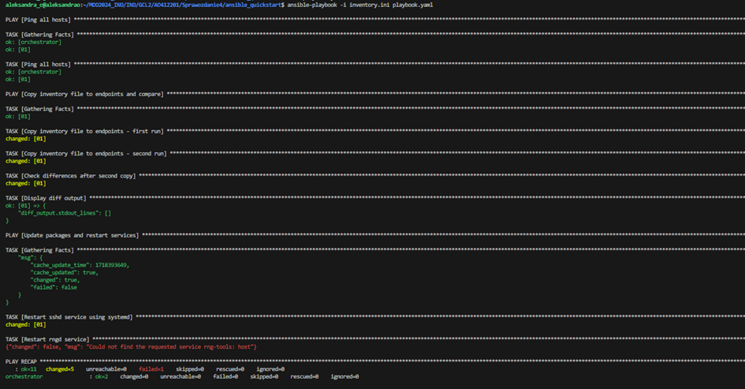
      Rozwiązaniem było zainstalowanie rngd. Należy użyć poleceń:
      ```bash
      instalacja rngd
      sudo apt update
      sudo apt install rng-tools
      ```
      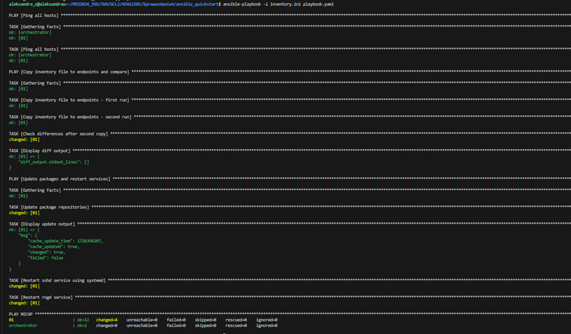

      - ok=10: 10 zadań zakończonych sukcesem.
      - changed=2: 2 zadania zakończyły się zmianami.
      - unreachable=0: Żaden host nie jest nieosiągalny.
      - failed=0: Żadne zadanie nie zakończyło się niepowodzeniem.
      - skipped=0: Żadne zadanie nie zostało pominięte.
      - rescued=0: Żadne zadanie nie wymagało ratowania.
      - ignored=0: Żadne zadanie nie zostało zignorowane.
     
   5. Wyłączenie sshd
      - wyłączenie sshd za pomocą polecenia: ```bash sudo systemctl stop shd```
      Otrzymanie błędu:
      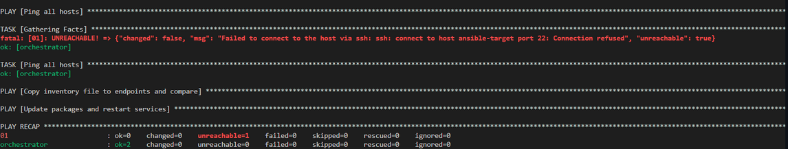
      - włączenie sshd i wyłączenie kabla sieciowego
      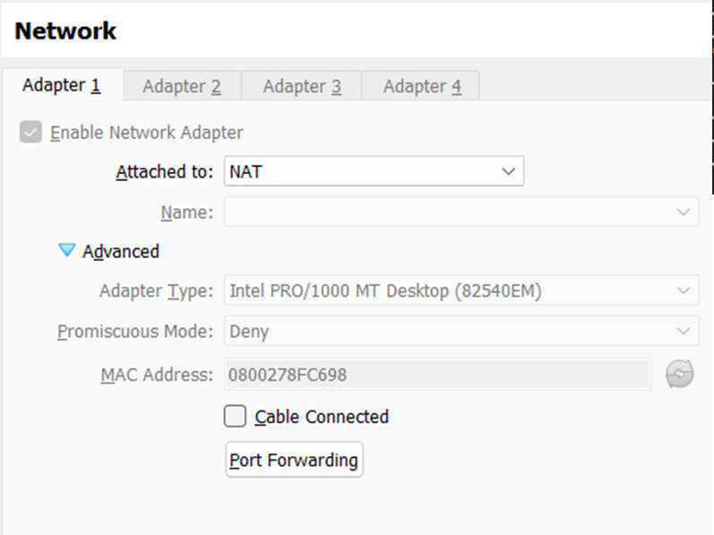
      Otrzymane błędy
      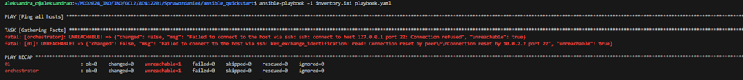

# Zarządzanie kontenerem
- Stworzenie drugiego playbooka, który pobiera z DockerHuba stworzony na poprzednich zajęciach obraz, a następnie uruchamia go i eksponuje na port 3000 na Endpoincie
   ```bash
   - name: Run 'Hot and Cold' game
     hosts: Endpoints
     become: no
     tasks:
    - name: Download game image from DockerHub
      docker_image:
        name: alexssandrr/react-hot-cold:latest
        source: pull
    - name: Run the game
      docker_container:
        name: react-hot-cold
        image: alexssandrr/react-hot-cold:latest
        ports:
          - "3000:3000"
        state: started
   ```
  - Pobranie Dockera na Endpoincie
     ```bash
     sudo snap install docker
     ```
     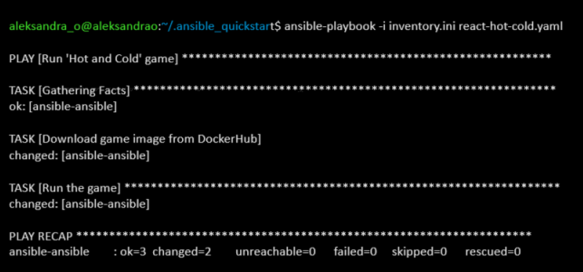
  - Sprawdzenie czy gra znajduje się na porcie 3000 Endpointa
    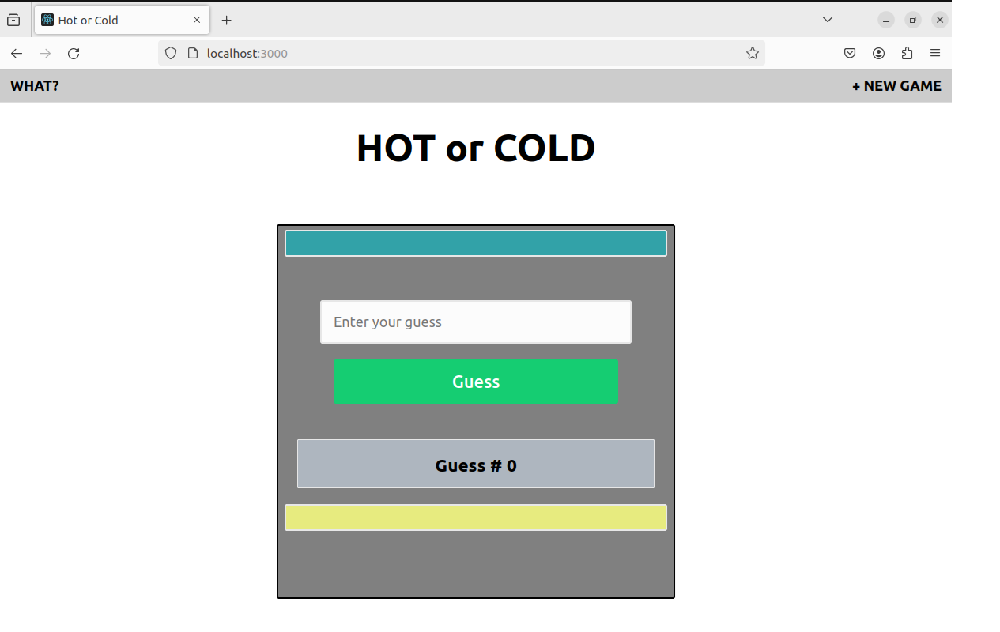
  - Zatrzymanie i usunięcie kontenera
    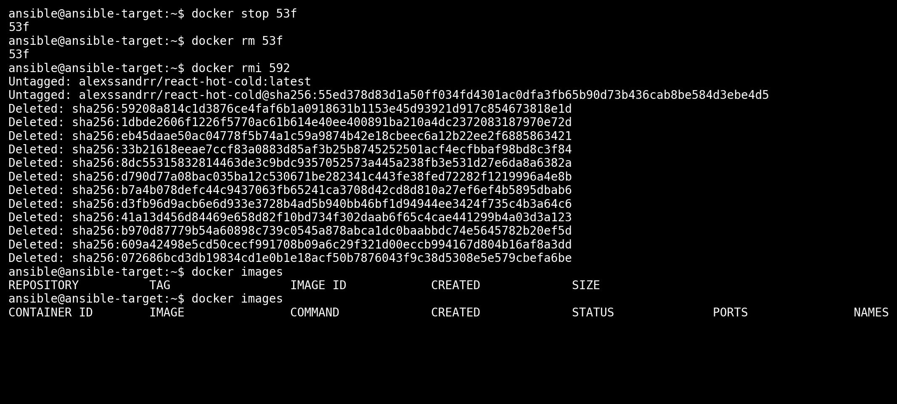
  
