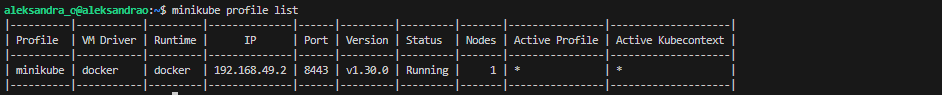
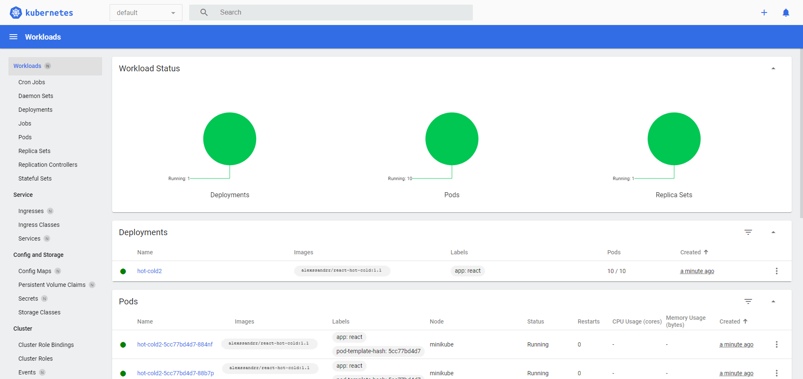
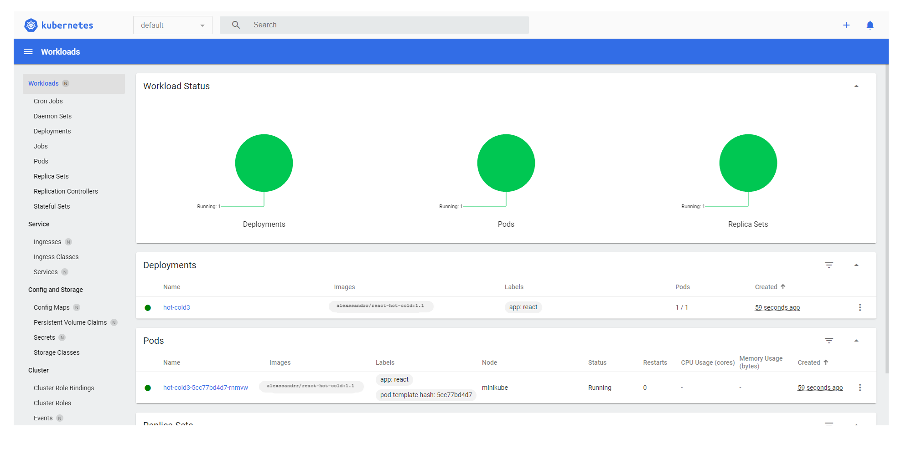
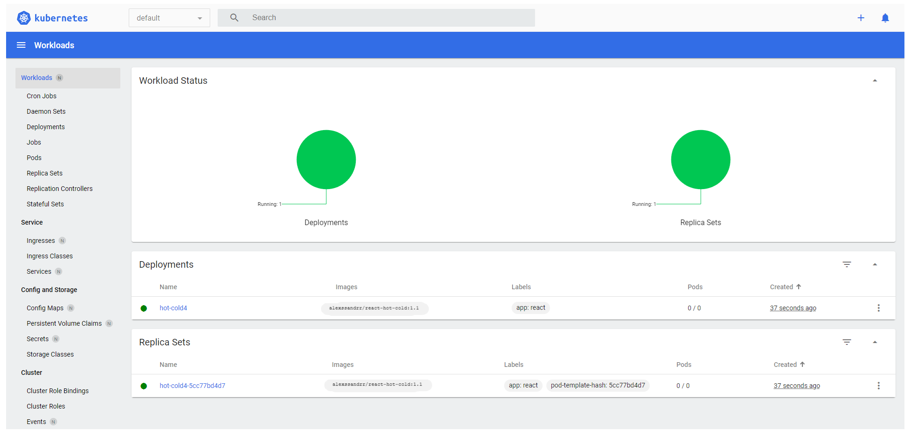
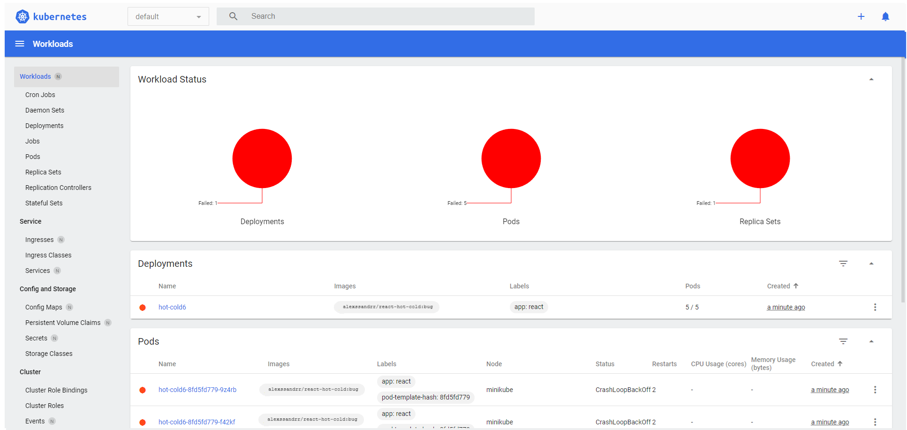
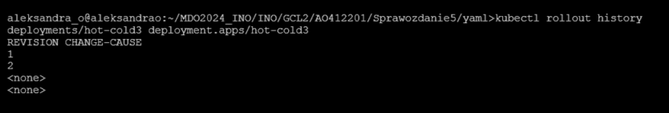
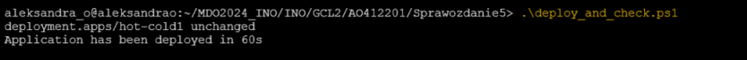

# Sprawozdanie 5
CEL: Celem labolatoriów było skonfigurowanie i uruchomienie klastra Kubernetes za pomocą narzędzi takich jak Minikube oraz kubectl. Kubernetes to system kontenerów, który automatyzuje procesy wdrażania i zarządzania aplikacji kontenerowych
Możemy w nim uruchomić różne obiekty, takie jak pods (uruchamia 1 lub więcej kontenerów), deployments (zarządza aktualizacjami poda) czy services.Minikube to narzędzie, które pozwala na uruchomienie pojedynczego klastra Kubernetes lokalnie na komputerze
## Instalacja klastra Kubernetes
1. Zapoznanie się z dokumentacją i krok po kroku zainstalowanie stosu k8s: https://minikube.sigs.k8s.io/docs/start/?arch=%2Fwindows%2Fx86-64%2Fstable%2F.exe+download
   - instalacja
     ```bash
     curl -LO https://storage.googleapis.com/minikube/releases/latest/minikube_latest_amd64.deb
     sudo dpkg -i minikube_latest_amd64.deb
     ```
     

   - uruchomienie klastrów
     ``` bash
     minikube start
     ```
   - pobranie kubectl
     ```bash
     minikube kubectl -- get po -A
     ```
     
   - wyświetlenie listy profili konfiguracyjnych Minikube dostępnych na hoście
     
   - działający kontener
     
   - uruchomienie minikube dashboard
     ```bash
     minikube dashboard
     ```
     lub
     ```bash
     minikube dashboard --url
     ```
     
     
  - uruchomienie aplikacji
    ```bash
    kubectl create deployment hot-cold-app --image=alexssandrr/react-hot-cold:latest
    deployment.apps/hot-cold-app created
    ```
    
    
  - wyeksportowanie aplikacji, tak aby mogła działać z mojego urządzenia
    ```bash
    kubectl expose deployment hot-cold-app --type=NodePort --port=8000
    service/hot-cold-app exposed
    minikube service hot-cold-app
    ```
    - umożliwienie dostęp do aplikacji na porcie 3000 na każdym węźle klastra Kubernetes
    - otwarcie przeglądarki internetowej z adresem URL
  - uruchomienie się aplikacji
    
    
2. Analiza posiadanego kontenera
   - sprawdzenie program jest zdolny do pracy w kontenerze i wyprowadza interfejs funkcjonalny przez sieć.
   - przygotowanie obrazu Dockera z aplikacją, na jego podstawie uruchomienie kontenera i sprawdzenie, czy pracuje w trybie ciągłym i nie kończy swojej pracy natychmiast po wykonaniu
     
     gdzie:
     
     ```bash --name my-node-app ``` : nazwa kontenera
     
     ```bash -d ``` : kontener będzie uruchomiony w tle
     
     ```bash -p 3000:3000 ```: określa przekierowanie portów
     
     ```node-deploy```: nazwa obrazu Docker, na podstawie którego ma zostać uruchomiony kontener

   - uruchomienie kontenera na klastrze Kubernetes
     ```bash
     minikube kubectl run -- <nazwa-wdrożenia> --image=<obraz-docker> --port=<wyprowadzany port> --labels app=<nazwa-wdrożenia>
     ```
   - przekierowanie portu
     ```bash
     minikube kubectl port-forward pod/container2 8000:3000
     ```

## Wdrażanie na zarządzalne kontenery: Kubernetes
1. Konwersja wdrożenia ręcznego
  - zapisanie wdrożenia aplikacji w pliku deployment-1.yaml, w którym zadeklarowano 5 replik.
    ```bash
    apiVersion: apps/v1
    kind: Deployment
    metadata:
    name: hot-cold1
    labels:
      app: react
    spec:
    replicas: 5
    selector:
    matchLabels:
      app: react
    template:
    metadata:
      labels:
        app: react
    spec:
      containers:
      - name: react
        image: alexssandrr/react-hot-cold:latest   
        ports:
        - containerPort: 3000
    ```
    gdzie:
    
    **apps/v1** oznacza, że korzystamy z API dla zasobów aplikacyjnych w Kubernetes
    
    **spec** co oznacza, liczbę replik aplikacji, które mają być uruchomione ( w tym przypadku 5)

    - Stworzenie serwisu aplikacji w pliku service.yaml
      ```bash
      apiVersion: v1
      kind: Service
      metadata:
        name: nodeport1
      spec:
        type: NodePort
        selector:
          app: react
        ports:
        - nodePort: 32410
          protocol: TCP
          port: 3000
          targetPort: 3000
      ```
      gdzie:
      **kind: Service** oznacza typ zasobu
      
      **spec: NodePort** oznacza, że Kubernetes przydzieli losowy port na każdym węźle klastra i przekieruje ruch na określony port wewnątrz serwisu
      
      **ports: nodePort** oznacza, które porty mają być wystawione w tym przypadku konkretny port (32410), na którym serwis będzie dostępny na węzłach klastra
      
      **ports: port** oznacza port(3000), pod którym serwis będzie dostępny wewnątrz klastra Kubernetes

    - Uruchomienie wdrożenia i serwis
      ```bash
      kubactl apply -f deployment1.yaml
      kubactl apply -f service.yaml
      ```
    - Zbadanie stanu
      ```bash
      kubectl status rollout deployment/hot-cold1
      ```
    - Uruchomienie aplikacji w przeglądarce
      ```bash
      minikube service nodeport1
      ```
      
      
    Widok w minikube dashboard
      
2. Przygotowanie nowego obrazu
  - Dwukrotnie puszczenie stworzonego na wcześniejszych zajęciach pipeline Jenkinsowy, aby uzyskać 2 wersje obrazu:
    
  - Stworzenie Dockerfile budującego obraz, którego uruchomienie kończy się błędem
    ```bash
    FROM node:latest
    RUN apt-get update && apt-get install git -y
    RUN git clone https://github.com/alexssandrr/react-hot-cold.git
    WORKDIR /react-hot-cold
    RUN npm install
    RUN npm run build
    RUN npm install -g serve
    CMD error
    ```
- Zbudowanie obrazu, wypchnięcie go na DocekrHuba z tagiem 'bug' i przetestowanie działania, a raczej jego brak
  ``` bash
  docker build -t bug_app .
  docker tag bug_app alexssandrr/react-hot-cold:bug
  docker push alexssandrr/react-hot-cold:bug
  docker run alexssandrr/react-hot-cold:bug
  ```
  

## Zmiany w deploymencie
  - aby wprowadzić kolejne zmiany należy usunąć istniejące deploymenty a następnie wdrożyć nowe
   ```bash
      kubectl get deployments
      kubectl delete deployment <nazwa poprzedniego deploymentu>
      kubectl apply -f <nazwa pliku z konfiguracją nowego deploymentu>
   ```
- aktualizacja pliku YAML: dwukrotne zwiększenie liczby replik - reszta bez zmian
  ```bash
  apiVersion: apps/v1
   kind: Deployment
   metadata:
     name: hot-cold2
     labels:
       app: react
   spec:
     replicas: 10
     selector:
       matchLabels:
         app: react
     template:
       metadata:
         labels:
           app: react
       spec:
         containers:
         - name: react
           image: alexssandrr/react-hot-cold:1.1 
           ports:
           - containerPort: 3000
   ```
    
  - Zmniejszenie liczby replik do 1
    ```bash
    apiVersion: apps/v1
      kind: Deployment
      metadata:
        name: hot-cold3
        labels:
          app: react
      spec:
        replicas: 1
        selector:
          matchLabels:
            app: react
        template:
          metadata:
            labels:
              app: react
          spec:
            containers:
            - name: react
              image: alexssandrr/react-hot-cold:1.1 
              ports:
              - containerPort: 3000
    ```
      
  - Zmniejszenie liczby replik do 0
    ```bash
    apiVersion: apps/v1
      kind: Deployment
      metadata:
        name: hot-cold4
        labels:
          app: react
      spec:
        replicas: 0
        selector:
          matchLabels:
            app: react
        template:
          metadata:
            labels:
              app: react
          spec:
            containers:
            - name: react
              image: alexssandrr/react-hot-cold:1.1 
              ports:
              - containerPort: 3000
     ```
    
    - Zastosowanie nowej wersji obrazu - praca na niej od pierwszego punktu
    - Zastosowanie starszej wersji
      ```bash
      apiVersion: apps/v1
      kind: Deployment
      metadata:
        name: hot-cold5
        labels:
          app: react
      spec:
        replicas: 5
        selector:
          matchLabels:
            app: react
        template:
          metadata:
            labels:
              app: react
          spec:
            containers:
            - name: react
              image: alexssandrr/react-hot-cold:1.0  
              ports:
              - containerPort: 3000
        ```
      - Zastosowanie obrazu z błędem
        ```bash
        apiVersion: apps/v1
         kind: Deployment
         metadata:
           name: hot-cold6
           labels:
             app: react
         spec:
           replicas: 5
           selector:
             matchLabels:
               app: react
           template:
             metadata:
               labels:
                 app: react
             spec:
               containers:
               - name: react
                 image: alexssandrr/react-hot-cold:bug
                 ports:
                 - containerPort: 3000
        ```
        
   - Przywracanie poprzednich wersji wdrożeń
     W pliku konfigurującym wdrożenie aplikacji z błędem zmeniłam nazwę wdrożenia tak, aby była taka sama jak w pliku z poprawnym wdrożeniem
     ``` bash name: hot-cold6 ```
     Zadbałam także o to, aby liczba replik była taka sama
     ```bash replicas: 1 ```
  - Uruchomienie obu wersji jedna po drugiej bez usuwania poprzedniej
    ```bash
    kubectl apply -f deployment3.yaml
    kubectl apply -f deployment6.yaml
    ```
  - kubectl rollout history - wyświetlenie historii zmian wdrożenia
    ```bash kubectl rollout history deploytemnts/hot-cold3 ```
    
  - kubectl rollout undo - cofnięcie ostatniej zmiany
    ```bash kubectl rollout undo deploytemnts/hot-cold3 ```
## Kontrola wdrożenia
Napisanie skryptu wdrażającego aplikację i weryfikującego czy została ona wdrożona w ciągu 60 sekund
```bash
$DEPLOYMENT_NAME = "hot-cold1"

kubectl apply -f yaml/deployment1.yaml

$end_time = (Get-Date).AddSeconds(60)

while ((Get-Date) -lt $end_time) {
    $status = kubectl rollout status deployment/$DEPLOYMENT_NAME
    if ($status -like "*successfully rolled out*") {
        Write-Output "Application has been deployed in 60s"
        exit 0
    }

    Start-Sleep -Seconds 5
}

Write-Output "Application has not been deployed in 60s"
exit 1
```

