# Sprawozdanie 1

## Projekt 1

### Cel projektu

Celem projektu było zarządzanie kodem, korzystanie z różnych metod uwierzytelniania w GitHubie, praktyczne zastosowanie kluczy SSH, praca z gałęziami w Git, tworzenie git hooków oraz dokumentowanie i przesyłanie zmian do zdalnego repozytorium.

### Streszczenie projektu

W projekcie zainstalowaliśmy klienta Git oraz skonfigurowaliśmy obsługę kluczy SSH. Sklonowaliśmy repozytorium przedmiotowe zarówno przez protokół HTTPS, jak i personal access token. Utworzyliśmy dwa klucze SSH, zabezpieczając jeden hasłem, i skonfigurowaliśmy je dla GitHuba. Przeszliśmy na gałąź główną i naszej grupy, tworząc również nową gałąź o nazwie "inicjały & nr indeksu". Dodaliśmy skrypt weryfikujący wiadomości commitów i umieściliśmy go w katalogu projektu. Następnie dodaliśmy plik ze sprawozdaniem, zaktualizowaliśmy repozytorium o zmiany oraz próbowaliśmy wciągnąć naszą gałąź do gałęzi grupowej. Ostatecznie zaktualizowaliśmy sprawozdanie i zrzuty ekranu, wysyłając zmiany do zdalnego repozytorium.

### Przebieg Zajęć:


#### 1.Klient Git i obsługa kluczy SSH.

Podczas instalacji Ubuntu na wirtualnej maszynie, a OpenSSH . Po uruchomieniu serwera sprawdziłam, czy wszystko jest zainstalowane, w tym bieżąca wersja Gita. Przez polecenie: 
```
git --version 
```
Dzięki instalacji OpenSSH nie ma problemów z obsługą kluczy SSH, co jest integralną częścią pakietu.


#### 2. Sklonowanie repozytorium przedmiotowego za pomocą HTTPS.

Następnie za pomocą podanej komendy sklonowałam repozytorium przedmiotowe:
```
git clone link
```
Wynikiem polecenia jest pobranie repozytorium dzięki czemu będzie można edytować jego treść.


Po zalogowaniu się na moje konto GitHub, wygenerowałam personal access token w ustawieniach konta.


Następnie sklonowałam ponownie repozytorium przedmiotowe za pomocą protokołu HTTPS, używając wygenerowanego tokena, co umożliwiło mi dostęp do repozytorium. Jest to alternatywny sposób uzyskania dostępu do repozytorium. 


#### 3. Sklonowanie repozytorium za pomocą klucza SSH

Protokół SSH służy do przesłania zaszyfrowanych informacji przez sieć dzieki czemu informacje są zabezpieczone podczas transferu, protokół ten jest również używany do uwierzytelniania uczestników wymiany danych. Protokuł SSH może służyć do uwierzytelniania podczas klonowania zdalnego repozytorium. 

Aby przygotoać się do sklomonawania repozytorium metodą SSH utworzyłam dwa klucze:

Jeden typu dsa, a drugi typu ecdsa
```
ssh-keygen -t dsa
ssh-keygen -t ecdsa
```


Aby dodać klucz do konta na github przeszłam do folderu .ssh i za pomocą komendy cat przekopiowałam adres klucza i następnie w ustawieniach na stronie github dodałam je. 
Przy próbie dodania klucza dsa napotkałam problem- okazało się że github nie obsługuje tego standardu kluczy. 


Przy próbie dodania klucza dsa napotkałam problem- okazało się że github nie obsługuje tego standardu kluczy. 


Więc wygenerowałam klucz typu ed25519 i pomyślnie dodałam go swojego konta.


Ostatecznie za pomocą SSH i komendy ```git clone``` sklonowałam repozytorium


#### 4.Przełączenie się na gałąź main i gałąź swojej grupy

Na samym początku po sklonowaniu repozytorium znalazłam sie w gałęzi main, aby zmienić gałąź na gałąź grupy urzyłam polecenia:
```
git checkout [nazwa]
```

#### 5. Utworzenie swojej gałęzi 

Do utworzenia gałęzi o nazwie moje BK403414 użyłam podobnego polecenia jak wcześniej lecz z opcją -b, git najpierw sprawdza czy istnieje taka gałąź, a jak jej nie ma to ją tworzy

```
git checkout -b nazwa
```

Żeby sprawdzić czy repozytorium jest ustawione na odpowiedniej gałęxi wpisałam polecenie ```git branch``` 

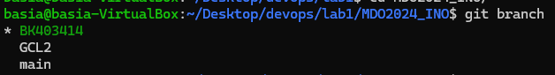

#### 6. Rozpoczęcie pracy na nowej gałęzi

Stworzylam katalog pod nazwą Sprawozdanie1, a następnie napisałam git hook, skrypt który ma weryfikować czy każdy commit message zaczelam od nazwy mojej gałęzi. 


Najpierw weszłam do katalogu .git/hooks gdzie utworzylam skrypt o nazwie commit-msg dokładnie tak jak zostało to  napisane w commit-msg.sample, od razu nadałam mu również uprawnienie komendą ```chmod +x commit-msg```

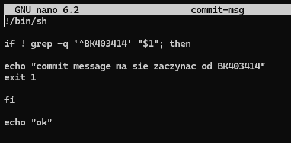

Zapisałam i dodałam zmiany: 

```
git add commit-msg
```


Sprawdziłam czy program zwróci błąd jeżeli nie podam mojego inicjału i numeru albumu: 

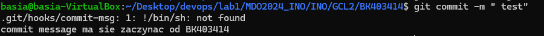


#### 7. Wykonanie sprawozdania

W pliku Sprawozdanie1 napisałam treść sprawozdania, a aby dodać screeny utworzyłam dodatkowy folder o nazwie screeny i dodawałam je w formieponiższej:
```

```

kopiowałam Screeny poprzez protokół  ```sftp```

Po utworzeniu zmian dodałam sprawozdanie do commita używając polecenia: ```git add```
oraz sprawdziłam wszystkie zmiany dzięki: ```git status``` 

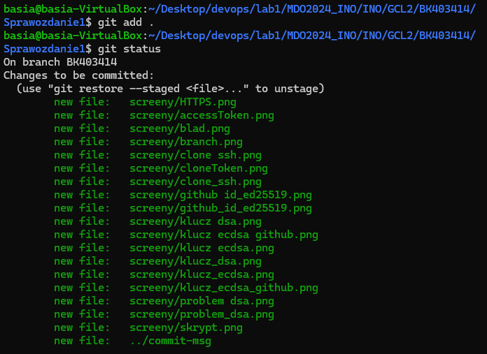

stworzylam commita z wiadomosią: ```git commit -m "zmiany" ```

Sprawdziłam czy wszystkie zmiany zostaly dodane 

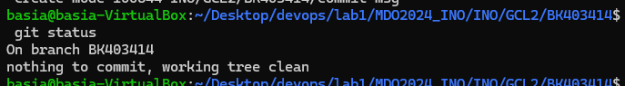

wyslanie zmian na zdalne źródło: ```git push```

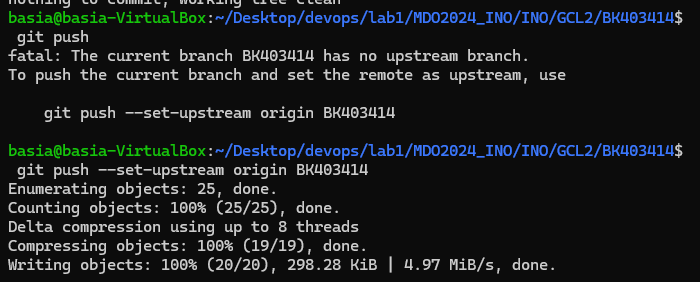

pobranie zmian ze zdalnego źródła: ```git pull origin```, zaktualizowalam lokalne repozytorium za pomoca polecenia git pull nastepnie zmienilam galąź na gałąź mojej grupy i dokonałam merge gałęzi grupowej z moją gałęzią przy pomocy git merge. 


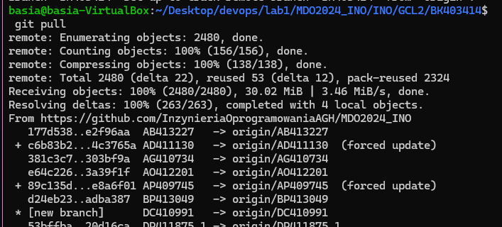

Na koniec sprawdziłam stan lokalnego repozytorium przy pomocy ``` git log``` 


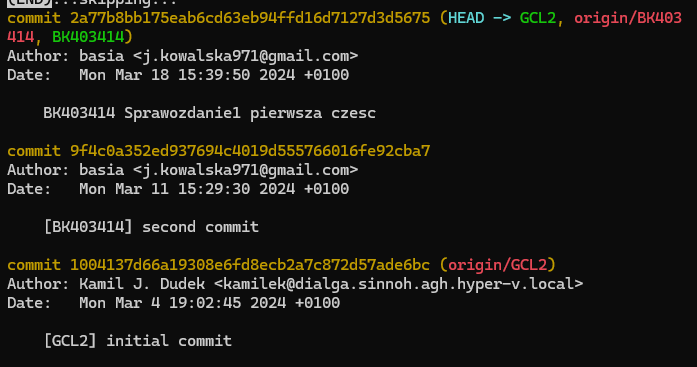

Następnie spróbowałam wypchnąć zmiany na zdalne repozytorium jednak nie mogłam tego zrobić z uwagi na zabezpieczenia tej gałęzi 


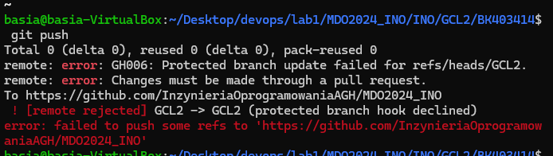


## Projekt 2

## Cel Projektu
Celem tego ćwiczenia jest przyswojenie umiejętności związanych z używaniem narzędzi Git i Docker oraz zapoznanie się z podstawowymi operacjami w tych technologiach, zrozumienie procesu instalacji Docker'a, rejestracji w Docker Hub, pobierania i uruchamiania obrazów kontenerów, tworzenia i uruchamiania własnych obrazów za pomocą plików Dockerfile oraz korzystania z repozytorium Git.

### Streszczenie projektu

Rozpoczęliśmy od instalacji Dockera w systemie Linux, umożliwiając sobie korzystanie z jego funkcji. Następnie zarejestrowaliśmy się w Docker Hub, co pozwoliło nam pobierać i udostępniać obrazy. W celu zapoznania się z działaniem, pobraliśmy podstawowe obrazy, takie jak hello-world, busybox, ubuntu oraz mysql. Przetestowaliśmy uruchomienie kontenera z obrazu busybox, wykonując w nim podstawowe operacje. Kolejnym krokiem było uruchomienie kontenera z obrazu fedora lub ubuntu, gdzie zbadaliśmy procesy wewnątrz kontenera oraz dokonaliśmy aktualizacji pakietów. Następnie stworzyliśmy własny plik Dockerfile, dodając obsługę git-a i zweryfikowaliśmy, czy zostało w nim ściągnięte nasze repozytorium. Na koniec, po czyszczeniu uruchomionych kontenerów i niepotrzebnych obrazów, dodaliśmy pliki Dockerfile do naszego folderu Sprawozdanie1 w repozytorium i wysłaliśmy Pull Request do gałęzi grupowej.


### Przebieg zajęć

#### 1. Instalacja Dockera i rejestracja na Docker Gub

Zainstalowałam Dockera przy pomocy polecenia 
```
sudo apt install docker.io
```
Uruchomiłam usługę dockera poprzez: 
```
duso systemctl enable docker
```

#### 2. Rejestracja w Docker Hub

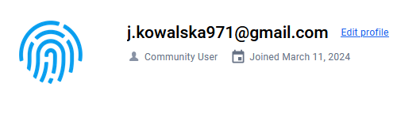

#### 3. Pobranie obrazów
Pobrałam obrazy hello-world, busybox, ubuntu oraz mysql używając komendy: 
```
sudo docker pull nazwa
```
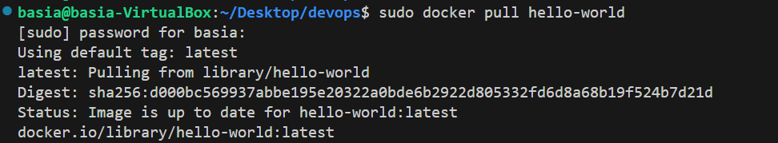


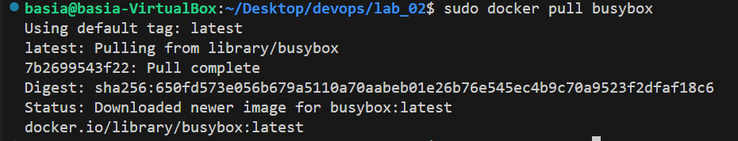


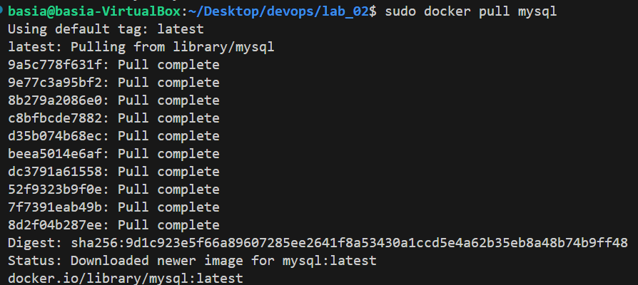


#### 4. Uruchomienie kontenera z obrazu busybox

Uruchomiłam kontener z obrazu busybox za pomocą komendy 

```
sudo docker run busybox
```

oraz sprawdziłam efekt takiego uruchomienia prezdz komende:

```
sudo docker container list --all
```


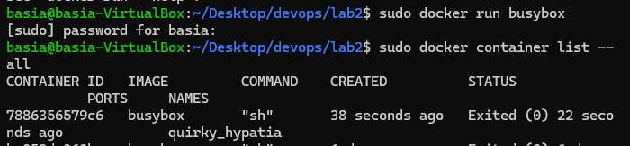

Aby uruchomić kontener tak aby działał w tle należy dodać flagi 
```-d``` ta flaga sprawia że kontener jest uruchamiany w tle, ```-t``` ta zapobiega zamknięciu się dockiera.

Dokonałam sprawdzenia przez komende ```sudo docker ps```


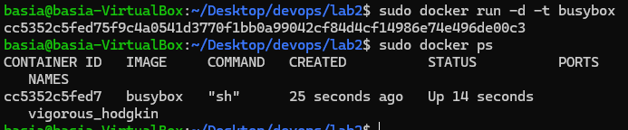

Podłączyłam się do kontenera interaktywnie dzięki komendzie ```sudo docker exec -ti [numerkontenera] sh``` oraz aby uzyskac numer wersji wisałam ```cat --help```


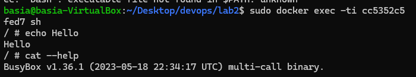

#### 5. Uruchomienie "systemu w kontenerze" ubuntu

Pobrałam system ubuntu, jak w podpunkcie 3.

Następnie uruchomiłam ubuntu, używając flag ```-it``` więc otwart zostal terminal dzięki czemu bede mogla wprowadzac dane oraz otrzymywac odpowiedzi od systemu. 

Jako pierwsze wprowadziłam komende, która pokazuje aktywne procesy na systemie 
``` 
ps
``` 
 
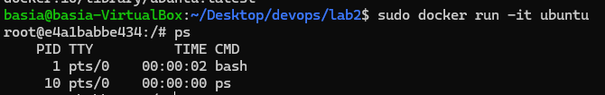

Drugim poleceniem zaktualizowałam posiadane pakiety:
```
apt-get update
```
 
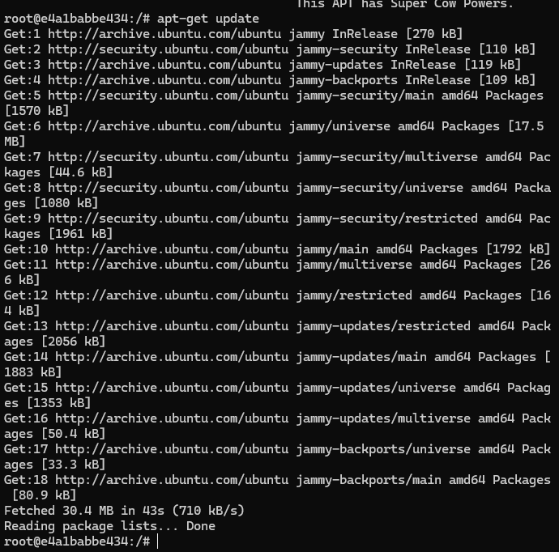

zakończyłam pracę terminala komendą ``` exit ```

#### 6. Zbudowanie i uruchomienie pliku Dockerfile

W moim katalogu utworzyłam plik Dockerfile. Przygotowany przeze mnie plik miał posłużyć do utworzenia obrazu bazującego na ubuntu. Kontener po uruchomieniu będzie aktualizował swoje pakiety po czym zainstaluje gita, ustawi nazwę użytkownika i email po czym sklonuje repozytorium przdmiotowe.

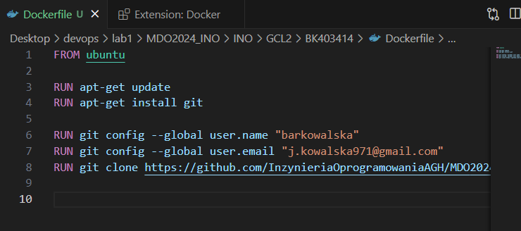

Zainstalowałam narzędzie do budowania obrazów przy pomocy dwóch poleceń: 
```
sudo apt-get install docker-buildx
sudo docker buildx install
```

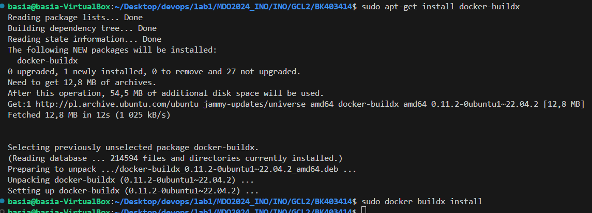

Zbudowałam obraz kontenera przy pomocy komendy: 
```
sudo docker build -t test-git .
```

Podczas budowania pojawił się błąd podczas instalacji pakietu git.

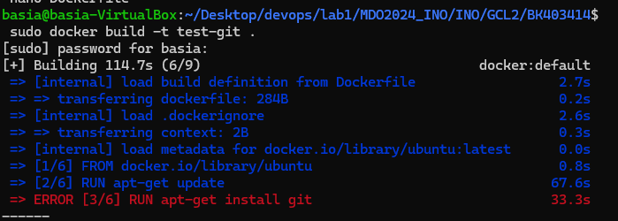

Okazało się że przed instalacją gita muszę zainstalować pakiet curl. 
Dokonałam zmian w Dokerfilu dodając instalację curl i flagę ``` -y ``` która sprawia że akceptowane są automatycznie zapytania podczas instalacji

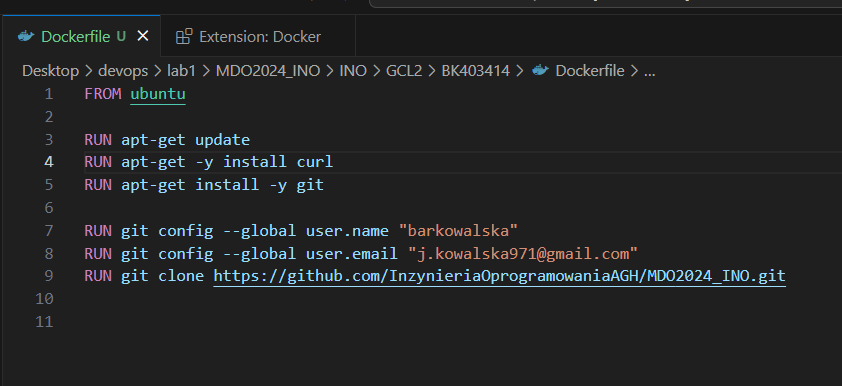


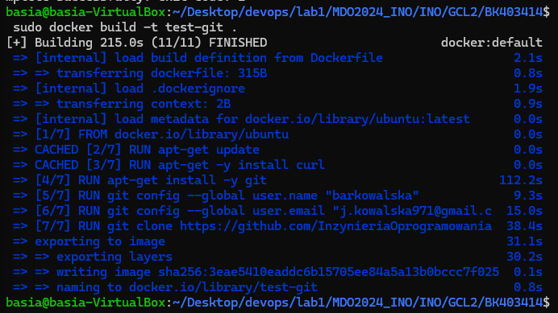

Uruchomiłam maszynę w trybie interaktywnym aby sprawdzić czy repozytorium zostało sklonowane poprawnie.

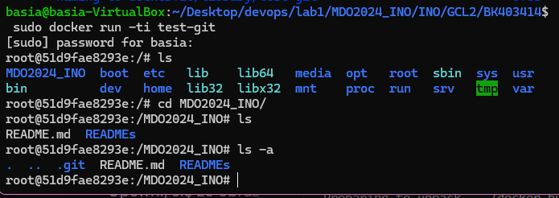

#### 7. Pokazanie uruchomionego (!-"działające") kontenery i wyczyszczenie ich


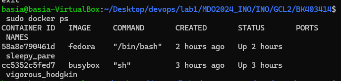

Aby zatrzymać dzuałające kontenery użyłam komendy 
```
sudo docker stop [id kontenera]
```

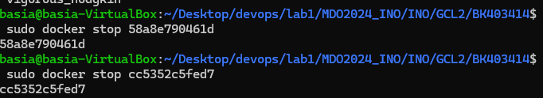

#### 8. Wyczyszczenie obrazu 

Aby usunąć obraz, pierwsze trzeba było usunąć kontener który korzystał z obrazu. ID kontenera znalazłam na liście kontenerów używając komendy 

```
sudo docker container list --all
```
Następnie, po usunięciu kontenera usunęłam obraz: 
```
sudo docker rmi test-git
```

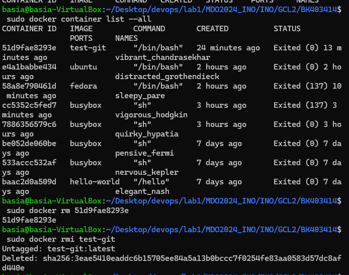

#### 9. Dodanie stworzonego pliku 

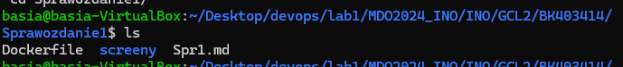

#### 10. Pull Request

Po zakończeniu zadania zaktualizowałam repozytorium poprzez git pull