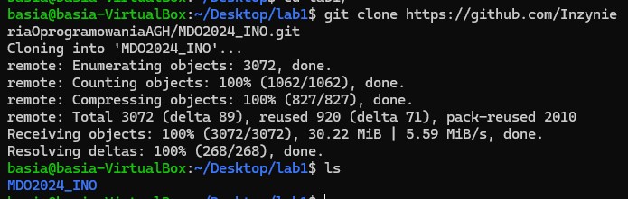
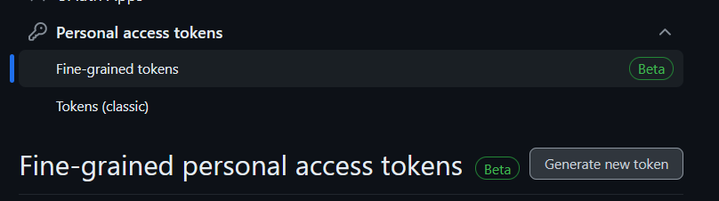
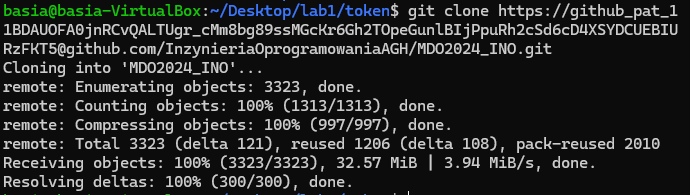
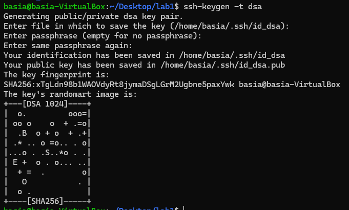
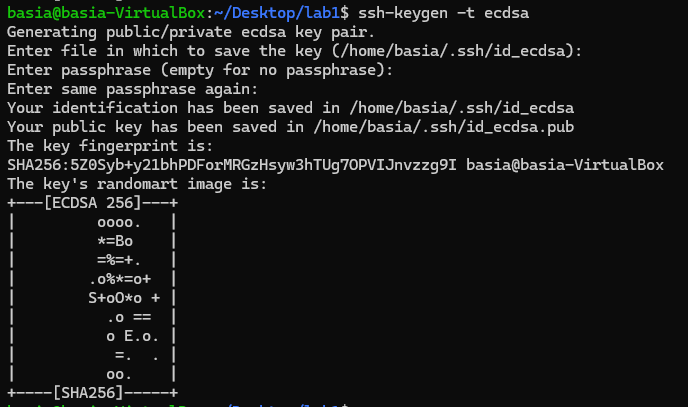
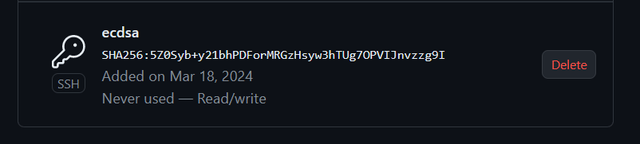
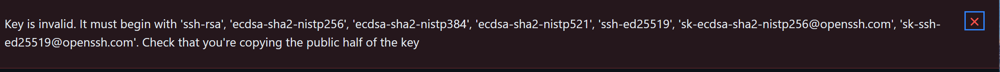
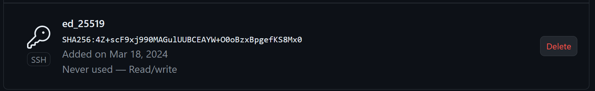
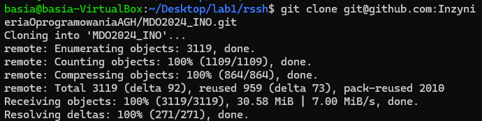

# Sprawozdanie 1

## Projekt 1

### Cel projektu

Celem projektu było zarządzanie kodem, korzystanie z różnych metod uwierzytelniania w GitHubie, praktyczne zastosowanie kluczy SSH, praca z gałęziami w Git, tworzenie git hooków oraz dokumentowanie i przesyłanie zmian do zdalnego repozytorium.

### Streszczenie projektu

### Przebieg Zajęć:

W projekcie zainstalowaliśmy klienta Git oraz skonfigurowaliśmy obsługę kluczy SSH. Sklonowaliśmy repozytorium przedmiotowe zarówno przez protokół HTTPS, jak i personal access token. Utworzyliśmy dwa klucze SSH, zabezpieczając jeden hasłem, i skonfigurowaliśmy je dla GitHuba. Przeszliśmy na gałąź główną i naszej grupy, tworząc również nową gałąź o nazwie "inicjały & nr indeksu". Dodaliśmy skrypt weryfikujący wiadomości commitów i umieściliśmy go w katalogu projektu. Następnie dodaliśmy plik ze sprawozdaniem, zaktualizowaliśmy repozytorium o zmiany oraz próbowaliśmy wciągnąć naszą gałąź do gałęzi grupowej. Ostatecznie zaktualizowaliśmy sprawozdanie i zrzuty ekranu, wysyłając zmiany do zdalnego repozytorium.

#### 1.Klient Git i obsługa kluczy SSH.

Podczas instalacji Ubuntu na wirtualnej maszynie, a OpenSSH . Po uruchomieniu serwera sprawdziłam, czy wszystko jest zainstalowane, w tym bieżąca wersja Gita. Przez polecenie: 
```
git --version 
```
Dzięki instalacji OpenSSH nie ma problemów z obsługą kluczy SSH, co jest integralną częścią pakietu.

// tutaj screen kota i wydruk

#### 2. Sklonowanie repozytorium przedmiotowego za pomocą HTTPS.

Następnie za pomocą podanej komendy sklonowałam repozytorium przedmiotowe:
```
git clone link
```
Wynikiem polecenia jest pobranie repozytorium dzięki czemu będzie można edytować jego treść.


Po zalogowaniu się na moje konto GitHub, wygenerowałam personal access token w ustawieniach konta.



Następnie sklonowałam ponownie repozytorium przedmiotowe za pomocą protokołu HTTPS, używając wygenerowanego tokena, co umożliwiło mi dostęp do repozytorium. Jest to alternatywny sposób uzyskania dostępu do repozytorium. 



#### 3. Sklonowanie repozytorium za pomocą klucza SSH

Protokół SSH służy do przesłania zaszyfrowanych informacji przez sieć dzieki czemu informacje są zabezpieczone podczas transferu, protokół ten jest również używany do uwierzytelniania uczestników wymiany danych. Protokuł SSH może służyć do uwierzytelniania podczas klonowania zdalnego repozytorium. 

Aby przygotoać się do sklomonawania repozytorium metodą SSH utworzyłam dwa klucze:

Jeden typu dsa, a drugi typu ecdsa
```
ssh-keygen -t dsa
ssh-keygen -t ecdsa
```



Aby dodać klucz do konta na github przeszłam do folderu .ssh i za pomocą komendy cat przekopiowałam adres klucza i następnie w ustawieniach na stronie github dodałam je. 
Przy próbie dodania klucza dsa napotkałam problem- okazało się że github nie obsługuje tego standardu kluczy. 



Przy próbie dodania klucza dsa napotkałam problem- okazało się że github nie obsługuje tego standardu kluczy. 



Więc wygenerowałam klucz typu ed25519 i pomyślnie dodałam go swojego konta.



Ostatecznie za pomocą SSH i komendy ```git clone``` sklonowałam repozytorium



#### 4.Przełączenie się na gałąź main i gałąź swojej grupy

Na samym początku po sklonowaniu repozytorium znalazłam sie w gałęzi main, aby zmienić gałąź na gałąź grupy urzyłam polecenia:
```
git checkout [nazwa]
```

#### 5. Utworzenie swojej gałęzi 

Do utworzenia gałęzi o nazwie moje BK403414 użyłam podobnego polecenia jak wcześniej lecz z opcją -b, git najpierw sprawdza czy istnieje taka gałąź, a jak jej nie ma to ją tworzy

```
git checkout -b nazwa
```

Żeby sprawdzić czy repozytorium jest ustawione na odpowiedniej gałęxi wpisałam polecenie ```git branch``` 


#### 6. Rozpoczęcie pracy na nowej gałęzi

Stworzylam katalog pod nazwą Sprawozdanie1, a następnie napisałam git hook, skrypt który ma weryfikować czy każdy commit message zaczelam od nazwy mojej gałęzi. 


Najpierw weszłam do katalogu .git/hooks gdzie utworzylam skrypt o nazwie commit-msg dokładnie tak jak zostało to  napisane w commit-msg.sample, od razu nadałam mu również uprawnienie komendą ```chmod +x commit-msg```


Zapisałam i dodałam zmiany: 

```
git add commit-msg
```


Sprawdziłam czy program zwróci błąd jeżeli nie podam mojego inicjału i numeru albumu: 


#### 7. Wykonanie sprawozdania

W pliku Sprawozdanie1 napisałam treść sprawozdania, a aby dodać screeny utworzyłam dodatkowy folder o nazwie screeny i dodawałam je w formieponiższej:
```

```

kopiowałam Screeny za pomocą polecenia ```scp``` nazwa zdjęcia i ścieżka do podanego katalogu

Po utworzeniu zmian dodałam sprawozdanie do commita używając polecenia: ```git add```
oraz sprawdziłam wszystkie zmiany dzięki: ```git status``` 


stworzylam commita z wiadomosią: ```git commit -m "zmiany" ```

Sprawdziłam czy wszystkie zmiany zostaly dodane 


wyslanie zmian na zdalne źródło: ```git push```


pobranie zmian ze zdalnego źródła: ```git pull origin```, zaktualizowalam lokalne repozytorium za pomoca polecenia git pull nastepnie zmienilam galąź na gałąź mojej grupy i dokonałam merge gałęzi grupowej z moją gałęzią przy pomocy git merge. 


Na koniec sprawdziłam stan lokalnego repozytorium przy pomocy ``` git log``` 


Następnie spróbowałam wypchnąć zmiany na zdalne repozytorium jednak nie mogłam tego zrobić z uwagi na zabezpieczenia tej gałęzi 


