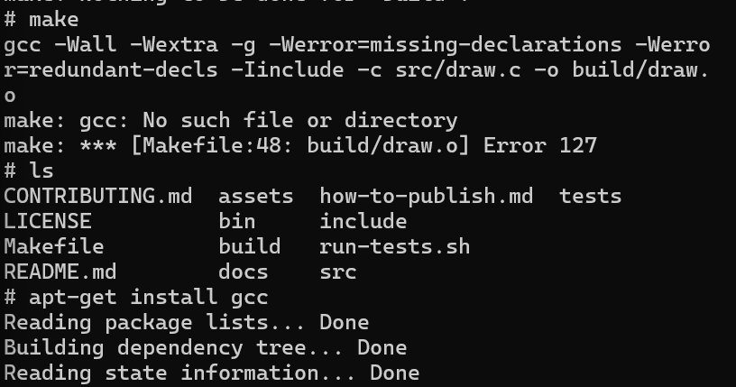
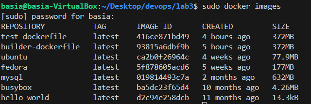
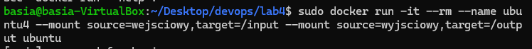

# Sprawozdanie 2

## Projekt 3

### Cel projektu

  Celem projektu jest wybór oprogramowania z otwartą licencją oraz przeprowadzenie 
procesu budowania i testowania tego oprogramowania w kontenerze Docker. Projekt 
obejmuje również automatyzację procesu budowania i testowania za pomocą plików 
Dockerfile oraz dyskusję na temat przygotowania ostatecznego artefaktu do wdrożenia.

### Streszczenie projektu

  W ramach projektu wybrałam oprogramowanie z otwartą licencją oraz przeprowadziłam
proces budowania i testowania w kontenerze Docker. Znalazłam odpowiednie 
repozytorium z kodem, sklonowałam je i przeprowadziłam proces budowania oraz
uruchomiłam testy jednostkowe. Następnie zaimplementowałam dwie konfiguracje
Dockerfile: jedną do budowania aplikacji, a drugą do testowania. Wykorzystałam 
Docker Compose do ujęcia kontenerów w kompozycję. Zainstalowałam skonteneryzowango Jenkinsa.

### Przebieg Zajęć:


####  Wybór oprogramowania na zajęcia

Wybrałam repozytorium "The Programmer Calculator", który jest prostym kalkulatorem dla programistów, który umożliwia pracę z różnymi
systemami liczbowymi (binarnym, szesnastkowym, dziesiętnym) jednocześnie, oraz wykonuje operacje bitowe.

```
https://github.com/alt-romes/programmer-calculator.git
```

* Dysponuje otwartą licencją: Licencja GPL-3.0 to otwarta licencja, która pozwala na swobodne korzystanie,
  i rozpowszechnianie oprogramowania pod warunkiem, że nie zostanie ono w żaden sposób zmodyfkowane.
 

* Jest umieszczone wraz ze swoimi narzędziami Makefile, który umożliwia uruchomienie repozytorium oraz Zawiera zdefiniowane i obecne w repozytorium testy.
  


  
#### Sklonowanie repozytorium oraz uruchomienie testów: 

Sklonowałam repozytorium poprzez HTTP użyłam do tego komendy  ``` git clone``` , aby uruchomić budowanie programu zainstalowałam potrzebne biblioteki przez ``` sudo apt-get install libncurses5-dev libncursesw5-dev ```

następnie używając komendy ``` make ``` uruchomiłam budowanie programu i na koniec uruchomiłam testy komendą: ``` make test``` 

 
 


 

 


 ### Przeprowadzenie buildu w kontenerze


 #### 1. Wykonałam kolejno build i test wewnątrz kontenera bazowego ubuntu.

 * Uruchomiłam polecenie ```sudo docker run -it ubuntu sh``` , aby uruchomić w sposób interaktywny kontener Docker z systemem Ubuntu, używając flagi ```-it ```, która pozwala na interaktywne działanie z kontenerem Docker.

Następnie poleceniem ```apt-get update```, zaktualizowałam listę pakietów dostępnych do zainstalowania.


* Ponieważ program Git nie był zainstalowany na maszynie wirtualnej, komenda ``` sudo apt install git```


* W celu zaopatrzenia kontener w wymagania wstępne uruchomiłam polecenie ```apt-get install libncurses5-dev libncursesw5-dev```.
 Polecenie to służy do zainstalowania bibliotek ncurses, które są niezbędne do uruchomienia niektórych programów.

 [](./screeny/lab2+3/dockerLib.png)

* W następnym kroku sklonowałam repozytorium, komendą ``` git clone https://github.com/alt-romes/programmer-calculator.git```,
 następnie otrzymałam błąd w trakcie próby użycia polecenia ```make``` z powodu braku zainstalowania opcji ``` make``` i ```gcc```


  

* Uruchomiłam program poleceniem ```make``` oraz uruchomiłam testy poleceniem ```bash ./run-tests.sh```, uruchomienie programu oraz testy przeszeszły pomyślnie.

 
  

  


### 2. Stworzenie dwóch plików Dockerfile automatyzujących kroki powyżej


* W visualu stworzyłam pierwszy kontener w którym zawarłam wszystkie polecenia z poprzedniego zadanie do momentu builda (make):

	##### Budowany obraz będzie oparty na systemie operacyjnym Ubuntu, następnie w RUN wykonuję wszystkie polecenia potrzebne do zbudowania programu, aktualizuje listę pakietów dostępnych w repozytoriach, instaluję pakiety w systemie (git, make, gcc i biblioteki), opcja -y automatycznie odpowiada tak podczas instalacji. 
  ##### RUN ```git clone``` klonuje repozytorium z GitHub do katalogu bieżącego kontenera.
  ##### WORKDIR zmienia katalog roboczy na utworzony programmer-calculator
  ##### RUN ```make``` uruchamia proces kompilacji i budowy kodu źródłowego zgodnie z Makefile w środowisku kontenera


* Zbudowałam obraz, podane polecenie rozpoczęło analizę pliku i wykonanie zawartych w nim instrukcji.
 
``` sudo docker build -t builder-dockerfile . -f ./builder.Dockerfile ```

   ##### opcja ```-t``` nadaje tag obrazowi, opcja ```-f``` określa ścieżke do pliku

##### Obraz został pomyślnie zbudowany


* Stworzyłam drugi kontener, który bazuje na pierwszym kontenerze i uruchamia testy

##### FROM ```builder-dockerfile``` oznacza że obraz bazowy będzie będzie wcześniej zrobiony kontener. 
##### RUN ```bash ./run-tests.sh``` uruchamia powłokę bash w skrypcie i wykonuje testy


* Zbudowałam obraz na wzór wcześniejszego, powtarzając komendę z zmianą nazw

``` sudo docker build -t builder-dockerfile . -f ./builder.Dockerfile ```

##### Obraz został pomyślnie zbudowany


### 3. Wykazanie że kontener wdraża się i pracuje poprawnie

* Uruchomienie kontenerów test-dockerfile i builder-dockerfile w trybie interaktywnym

  
  
  

* Weryfikacja uruchomienia obrazów

##### W tym celu użyłam polecenia ```sudo docker images```, które wyszukuje wszystkie obrazy przechowywane lokalnie w systemie



* Weryfikacja uruchomienia kontenerów
  
  ##### W tym ceu użyłam polecenia ```sudo docker ps``` który służy do wyświetlania listy uruchomionych kontenerów Docker.


 ##### Kontener to odizolowane środowisko uruchomieniowe dla aplikacji. Zawiera ona wszystko, czego aplikacja potrzebuje do działania, w tym kod, biblioteki, środowisko uruchomieniowe i konfigurację. Kontenery ​​mogą być uruchamiane na różnych platformach bez konieczności modyfikowania aplikacji.

 ##### Obraz to szablon, z którego tworzone są kontenery. Obraz zawiera wszystkie pliki i instrukcje potrzebne do uruchomienia kontenera. Obrazy są przechowywane w repozytoriach, skąd można je pobierać i używać do tworzenia kontenerów.


## Projekt 4


### Cel projektu

Celem tego laboratorium jest zapoznanie się z różnymi funkcjonalnościami
środowiska Docker, takimi jak zachowywanie stanu za pomocą woluminów oraz
eksponowanie portów, a także zdobycie doświadczenia z instalacją i konfiguracją 
konteneryzowanej instancji Jenkinsa.

### Streszczenie projektu

 W trakcie laboratorium poznałam różne aspekty środowiska Docker,
 w tym zarządzanie woluminami, eksponowanie portów oraz instalację 
 konteneryzowanej instancji Jenkinsa z pomocą DIND. Wykonałam szereg zadań
 praktycznych, obejmujących m.in. przygotowanie woluminów, budowanie i
 testowanie oprogramowania w kontenerze, oraz konfigurację serwera iperf3.


 ##### Woluminy są niezależnymi jednostkami pamięci, które przechowują dane  niezależnie od kontenerów. To pozwala na współdzielenie danych między kontenerami i ułatwia zarządzanie trwałymi danymi aplikacji.

 ## Przebieg Zajęć: 


####  Zachowywanie stanu

* Zapoznanie się z dokumentacją podaną w instrukcji
  
  ```https://docs.docker.com/storage/volumes/```
  
* Przygotowanie woluminów wejściowy i wyjściowy oraz podłączenie ich do kontenera bazowego i uruchomienie 

	Kolejno tworzę nowe woluminy o nazwie "wejściowy" i "wyjściowy" za pomocą polecenia
 ```sudo docker volume create```


Polecenie ```sudo docker volume ls``` potwierdza utworzenie woluminów przez wyświetlenie ich


 Następnie podanym poleceniem uruchamiam kontener o nazwie ubuntu4. Kontener ten jest oparty na obrazie Ubuntu z którego rozpoczynałam poprzednio pracę. 

 ```docker run -it --rm --name ubuntu4 --mount source=wejsciowy,target=/input --mount source=wyjsciowy,target=/output ubuntu ```
 
 Polecenie montuje dwa woluminy do kontenera: Wolumin wejsciowy jest montowany do katalogu /katalogIn w kontenerze, a wyjsciowy do katalogu /katalogout w kontenerze.

Dokładniejsze wytłumaczenie polecenia:
   
  ```--rm``` - kontener jest usuwany po zakończeniu jego pracy.
    ```--name``` - nadaje kontenerowi nazwę ubuntu4.
    ```-mount source=wejsciowy,target=/katalogIn``` - montuje wolumin wejsciowy do katalogu /katalogIn w kontenerze.
    ```-mount source wyjsciowy,target=/katalogout``` - montuje wolumin wyjsciowy do katalogu /katalogout w kontenerze.
    ```ubuntu``` - Nazwa obrazu Docker, na którym jest oparty kontener.
 


* Zainstalowanie niezbędnych wymagań wstępnych oraz sklonowanie repozytorium na wolumin wejściowy

	Kolejno zainstalowałam: ```apt update``` zaktualizowałam listę pakietów, ```apt-get install libncurses5-dev libncursesw5-dev``` aby zainstalować potrzebne biblioteki, ```apt-get install make``` i ```apt-get install gcc```   


Aby przygotowwać wolumin wejściowy wykonałam następujący czynności. Njapierw sklonowałam repozytorium do katalogu na hoscie, po czym uruchomiłam tymczasowy kontener do którego zamontowałam katalog z repozytorium oraz wolumin wejsciowy

```sudo docker run -it --rm --name ubuntu4 --mount source=wejsciowy, target=/input --mount type=bind, source=./programmer-calculator, target=/repo ubuntu```

Dokładniejsze wytłumaczenie polecenia:
```--rm``` powoduje automatyczne usunięcie kontenera po jego zakończeniu. 
```--name``` pozwala nadać kontenerowi nazwe ubuntu4
```--mount``` służy do montowania do systemu plików kontenera
```source``` definiuje co ma zostać zamontowane
```target``` gdzie ma zostać zamontowane
```type``` określa typ montowania

Polecenie od --mount montuje bieżący katalog jako "/input-mount" i katalog "programmer-calculator" jako "/repo" wewnątrz kontenera.


Następnie aby przekopiować repozytorium użyłam komendy cp,
w ten sposób przekopiowałam repozytorium z katalogu na hoscie do kontenera


*Uruchomienie builda w kontenerze i zapisanie powstałych plików na woluminie wyjściowych

Za pomocą narzedzia ```make``` zbudowałam program, skopiowałam katalog z plikami wykonywalnymi do wolumina wyjsciowego


* Ponowienie operacji klonowanie repozytorium

Ponownie skopiowałam repozytorium do woluminu wejściowego z poziomu kontenera do budowania na którym zainstalowałam wpierw gita


* Przedyskutowanie możliwości wykonania ww. kroków przez Dockerfile i docker build


Próba wykonania powyższych kroków przy pomocy Dockerfile nie powiodła się, ponieważ, jak się okazało, nie można zamontować woluminów wewnątrz dockerfile, możliwe jest jedynie zamontowanie katalogu.

####  Eksponowanie portu

* Zapoznanie się z dokumentacją podaną w instrukcji

	iPerf to narzędzie do pomiaru przepustowości sieci IP. Pozwala na testowanie wydajności połączeń TCP, UDP i SCTP w różnych warunkach, dostarczając informacji o przepustowości, stratach pakietów i innych parametrach. Jest to przydatne narzędzie do diagnozowania oraz optymalizacji wydajności sieci.

*  Uruchomienie wewnątrz konenera serweru iperf

	Najpierw uruchomiłam kontener jak wcześniej, zaktualizowałam aktualizacje i zaczęłam instalację iperf3 poleceniem ```apt-get install -y iperf3```


Następnie używając flagę ```-s```  uruchamiam serwer iperf3


* Połączenie się z serwerem z drugiego kontenera
  
	Stworzyłam drugi kontener w którym wykonałam dokładnie takie same kroki jak w pierwszym, zaktualizowałam i pobrałam iperf3, następnie kolejno dzięki komendzie ```sudo docker ps``` poznałam ID kontenera, który użyłam w poleceniu ```docker inspect -f'{{range .NetworkSettings.Networks}}{{.IPAddress}}{{end}}' f50204281fae``` dzięi któremu uzyskuję adres IP,  

 

 Używając komendy ```iperf3 -c 172.17.0.2``` nawiązałam połączenie z drugim serwerem

  

 

* Zapoznanie się z dokumentacją network create załączoną w instrukcji

Własna dedykowana sieć w Dockerze to sieć stworzona przez użytkownika za pomocą polecenia `docker network create`. Pozwala to na izolację kontenerów w ramach własnego środowiska sieciowego, co umożliwia kontrolę nad komunikacją między nimi oraz konfiguracją sieciowych zasobów. Użytkownik może dostosować różne parametry sieci, takie jak rodzaj sterownika, podsieć IP, bramka domyślna i inne, aby dopasować sieć do swoich potrzeb. Własne sieci są przydatne do organizacji aplikacji wewnątrz kontenerów i zapewnienia bezpiecznej i efektywnej komunikacji między nimi.

* Ponowienie wcześniejszych kroków wykorzystując własną dedykowaną sieć

	Początkowo poleceniem ```sudo docker network create -d bridge siecSiec```

Dokładne wyjaśnienie polecenia:

```docker network create```  tworzenie nowych sieci w Dockerze.
```-d``` typ sterownika sieci, który ma zostać użyty:  
```bridge``` jest domyślnym typem sterownika i tworzy wirtualny switch.


 

Jak w poprzednim zadaniu tworzę dwa kontenery, które danym poleceniu przyłączę do nowo powstałej sieci

```--network siecSiec```

 
 
 

Jak widać zamiast adresu IP mogłam użyć tylko nazwy aby nawiązać połączenie


* Połączenie się z serwerem spoza kontenera

 Z hosta: 
 
Ponownie utworzyłam kontenerna którym zostanie uruchomiony server tym razem opublikowałam odpowiedni port aby umożliwić komunikację z kontenerem z zewnątrz użyłam do tego flagi ```-p```, zamontowałam również katalog do którego zostaną przekopiowane logi.

```sudo docker run -it --network siecSiec --name serverS -p 5201:5201 --mount type=bind,source=./logs,target=/logs ubuntu bash```

dokładniejsze wyjaśnienie polecenia: 

```-p 5201:5201``` Opcja ta mapuje port 5201 wewnątrz kontenera na port 5201 na hoście. 


  

  
 
  

Łączenie powiodło się. Logi z kontenera wyciągnęłam za pomocą polecenia 
```sudo docker container logs serverS > logs/log```

## Instalacja Jenkinsa

Instalcję skonteneryzowanego Jenkinsa wykonałam zgodnie z polecenia z dokumentacji.

* Stworzenie sieci dla Jenkinsa
Przygotowanie do instalacji rozpoczęłam od utworzenia sieci dla Jenkinsa poleceniem:
```sudo docker network create -d bridge jenkins```

* Uruchomienie kontenera dla rozwiązani Docker-In-Doceker
W kolejnym kroku należało uruchomić kontener, który pozwoli na tworzenie "kontenerów w konterze".
Wykorzystałam do tego polecenie załączone do dokumentacji.

```
docker run --name jenkins-docker --rm --detach \
--privileged --network jenkins --network-alias docker \
--env DOCKER_TLS_CERTDIR=/certs \
--volume jenkins-docker-certs:/certs/client \
--volume jenkins-data:/var/jenkins_home \
--publish 2376:2376 \
docker:dind --storage-driver overlay2
```

* Zbudowanie obrazu kontenera Jenkinsa

Następnie zbudowałam Dockerfile, którego treść była załączona w dokumentacji.

```
FROM jenkins/jenkins:2.440.2-jdk17
USER root
RUN apt-get update && apt-get install -y lsb-release
RUN curl -fsSLo /usr/share/keyrings/docker-archive-keyring.asc \
  https://download.docker.com/linux/debian/gpg
RUN echo "deb [arch=$(dpkg --print-architecture) \
  signed-by=/usr/share/keyrings/docker-archive-keyring.asc] \
  https://download.docker.com/linux/debian \
  $(lsb_release -cs) stable" > /etc/apt/sources.list.d/docker.list
RUN apt-get update && apt-get install -y docker-ce-cli
USER jenkins
RUN jenkins-plugin-cli --plugins "blueocean docker-workflow"
```

Kontener zbudowałam przy pomocy polecenia:

``` docker build -t myjenkins-blueocean:2.440.2-1 -f jenkins.Dockerfile . ```

* Uruchomienie Jenkinsa

Uruchomiłam Jenkinsa przy pomocy polecenia:
```
docker run \
  --name jenkins-blueocean \
  --restart=on-failure \
  --detach \
  --network jenkins \
  --env DOCKER_HOST=tcp://docker:2376 \
  --env DOCKER_CERT_PATH=/certs/client \
  --env DOCKER_TLS_VERIFY=1 \
  --publish 8080:8080 \
  --publish 50000:50000 \
  --volume jenkins-data:/var/jenkins_home \
  --volume jenkins-docker-certs:/certs/client:ro \
  myjenkins-blueocean:2.440.2-1
```

* Konfiguracja Jenkinsa
Aby sfinalizować proces instalacji, należało z poziomu przeglądarki przejść przez ustawienie konfiguracji (m.in. stworzenie pierwszego administratora).
Najpierw musiałam dodać przekierowanie portu z maszyny wirtualnej, aby móc połączyć sie z Jeniknsem z przeglądarki na Windowsie.


 

 W celu dostępu do konfiguracji, musiałam wpisać hasło podane w logach, które odczytałam z kontera poprzez:
 ```  sudo docker exec jenkins-blueocean cat var/jenkins_home/secrets/initialAdminPassword ```
 Po zakończeniu konfiguracji ukazała mi się strona jenkinsa.

 
