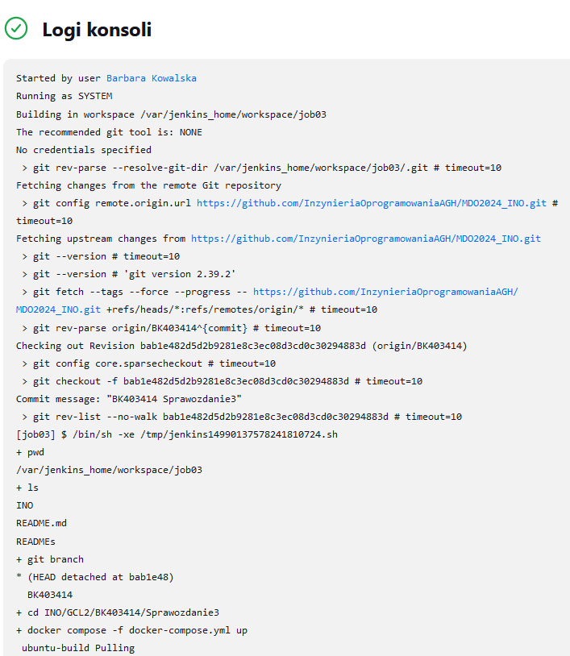

# Sprawozdanie 3

### Cel projektu

Celem projektu jest opracowanie procesu ciągłej integracji (CI) dla wybranego oprogramowania przy użyciu kontenerów Docker. Projekt zakłada automatyzację budowania, testowania i wdrażania aplikacji, zapewniając skalowalność, izolację i powtarzalność procesu.


### Streszczenie projektu

W ramach projektu został wybrany oprogramowanie z otwartą licencją, dla którego przeprowadzono proces ciągłej integracji w kontenerach Docker. Repozytorium z kodem zostało sklonowane, a następnie przeprowadzono proces budowania i uruchomiono testy. Implementowano dwie konfiguracje Dockerfile: jedną do budowania aplikacji i drugą do testowania. Wykorzystano Docker Compose do ujęcia kontenerów w spójną kompozycję. Dodatkowo, zainstalowano skonteneryzowanego Jenkinsa, który posłużył do automatyzacji procesu CI. Za pomocą Jenkinsa zdefiniowano pipeline, który obejmuje kroki budowania, testowania oraz wdrażania aplikacji. Jenkins zapewnia środowisko do zarządzania całym procesem CI oraz umożliwia monitorowanie i archiwizację logów dla przejrzystości i bezpieczeństwa procesu.

## Przygotowanie

Na poprzednich zajęciach wykonałam przygotowania do pracy z Jenkinsem:

#### Instalacja Jenkinsa

Instalację skonteneryzowanego Jenkinsa wykonałam zgodnie z polecenia z dokumentacji.

* Stworzenie sieci dla Jenkinsa
Przygotowanie do instalacji rozpoczęłam od utworzenia sieci dla Jenkinsa poleceniem:
```sudo docker network create -d bridge jenkins```

* Uruchomienie kontenera dla rozwiązani Docker-In-Doceker
W kolejnym kroku należało uruchomić kontener, który pozwoli na tworzenie "kontenerów w konterze".
Wykorzystałam do tego polecenie załączone do dokumentacji.

```
docker run --name jenkins-docker --rm --detach \
--privileged --network jenkins --network-alias docker \
--env DOCKER_TLS_CERTDIR=/certs \
--volume jenkins-docker-certs:/certs/client \
--volume jenkins-data:/var/jenkins_home \
--publish 2376:2376 \
docker:dind --storage-driver overlay2
```

* Zbudowanie obrazu kontenera Jenkinsa

Następnie zbudowałam Dockerfile, którego treść była załączona w dokumentacji.

```
FROM jenkins/jenkins:2.440.2-jdk17
USER root
RUN apt-get update && apt-get install -y lsb-release
RUN curl -fsSLo /usr/share/keyrings/docker-archive-keyring.asc \
  https://download.docker.com/linux/debian/gpg
RUN echo "deb [arch=$(dpkg --print-architecture) \
  signed-by=/usr/share/keyrings/docker-archive-keyring.asc] \
  https://download.docker.com/linux/debian \
  $(lsb_release -cs) stable" > /etc/apt/sources.list.d/docker.list
RUN apt-get update && apt-get install -y docker-ce-cli
USER jenkins
RUN jenkins-plugin-cli --plugins "blueocean docker-workflow"
```

Kontener zbudowałam przy pomocy polecenia:

``` docker build -t myjenkins-blueocean:2.440.2-1 -f jenkins.Dockerfile . ```

* Uruchomienie Jenkinsa

Uruchomiłam Jenkinsa przy pomocy polecenia:
```
docker run \
  --name jenkins-blueocean \
  --restart=on-failure \
  --detach \
  --network jenkins \
  --env DOCKER_HOST=tcp://docker:2376 \
  --env DOCKER_CERT_PATH=/certs/client \
  --env DOCKER_TLS_VERIFY=1 \
  --publish 8080:8080 \
  --publish 50000:50000 \
  --volume jenkins-data:/var/jenkins_home \
  --volume jenkins-docker-certs:/certs/client:ro \
  myjenkins-blueocean:2.440.2-1
```

* Konfiguracja Jenkinsa
Aby sfinalizować proces instalacji, należało z poziomu przeglądarki przejść przez ustawienie konfiguracji (m.in. stworzenie pierwszego administratora).
Najpierw musiałam dodać przekierowanie portu z maszyny wirtualnej, aby móc połączyć sie z Jeniknsem z przeglądarki na Windowsie.


 

 W celu dostępu do konfiguracji, musiałam wpisać hasło podane w logach, które odczytałam z kontera poprzez:
 ```  sudo docker exec jenkins-blueocean cat var/jenkins_home/secrets/initialAdminPassword ```
 Po zakończeniu konfiguracji ukazała mi się strona jenkinsa.

 

 W tle działają dwa kontenery:
 
 

 * Upewniłam się również że działają kontenery budujące i testujące, przez pobranie rozszerzenia docker-compose stworzenie docker-compose.yml załączonego do sprawozdania uruchomiłam je poprzez komendę ```docker-compose up```

 


 ## Uruchomienie 

  Konfiguracja wstępna i pierwsze uruchomienie: Klikając "Nowy projekt" -> "Ogólny projekt" stworzyłam 3 projekty:


1. Na wzór projektu z zajęć wyświetlający  m.in. wymagane "uname" 


      ```
      whoami
      uname -a 
      docker images
      pwd
      ls -la
      ```
      
  Zakończyło się sukcesem
      
   


  2. Projekt który zwraca błąd jeżeli godzina jest nieparzysta


   ```
  #!/bin/bash

  current_hour=$(date +"%H")
  echo $current_hour
  zmienna=$((current_hour % 2))
  echo $zmienna
  if [ $zmienna -eq 0 ]; then
      echo "Wszystko w porządku: Aktualna godzina jest parzysta."
      exit 0
  else   
	  echo "Błąd: Aktualna godzina jest nieparzysta!"
      exit 1
  fi
  ```

 


  3. "Prawdziwy" projekt w którym klonuję repozytorium, przechodzę na moją gałąź BK403414  i budują obrazy z dockerfiles i opcją docker-compose (obydwie opcje zakończyły się sukcjesem)


Na początku w opcjach Repozytorium kodu załączam link URL repozytorium z zajęć oraz podałąm nazwę mojej gałęzi


   


Treść skryptu: 

  ```
  pwd 
  ls
  git branch
  cd INO/GCL2/BK403414/Sprawozdanie3
  #docker build -f builder.Dockerfile -t builder-dockerfile . 
  #docker build -f test.Dockerfile -t tester .
  docker compose -f docker-compose.yml up 
  ```


Program zadział: 
 
    

   

## Pipeline

### Wstęp

Projekt wykonałam posługując się repozytorium które wybrałam na poprzednich zajęciach 'programmer-calculator', dysponuje ono README opisujące dokładnie uruchomienie, bibliotekami i testami oraz licencją GPL-3.0 zezwalającą na kopiowanie i udostępnianie programu.

* Wymagania wstępne:  
	* Przed przystąpieniem do napisania pipeline przygotowałam dwa pliki dockerfile:
		* plik służący do budowania, który opiera się na obrazie ubuntu i zawiera zależności potrzebne do pobrania plików źródłowych i  zbudowania programu: git, make, gcc, libncurses5-dev i libncursesw5-dev.
		
		
		* plik dockerfile służący do przeprowadzenia testów bazujący na kontenerze budującym.
		
* Diagram aktywności: 


* Diagram wdrążeniowy:


### Opis pipeline

Zdefiniowany przeze mnie wewnątrz Jenkinsa obiekt projektowy "pipeline" składa się z następujących etapów:

* ##### Prepare
	 Przygotowuje środowisko - usuwa stary katalog projektu jeśli został po poprzednim wykonaniu oraz przy pomocy polecenia ``` docker system prune --force``` zwalnia nieużywane zasoby.
	 
```
stage('Prepare') {
            steps {
                echo 'PREPARING...'
                script {
                    if (fileExists('MDO2024_INO'))
                    {
                    sh 'rm  -rf MDO2024_INO'
                    }
                }
                sh 'docker system prune --force'

            }
        }
```

* ##### Clone
	 W tym etapie klonowane jest repozytorium projektu.
	 
```
	stage('Clone') {
            steps {
                echo 'CLONING...'
                sh 'git clone https://github.com/InzynieriaOprogramowaniaAGH/MDO2024_INO.git'
                dir('MDO2024_INO') {
                    sh 'git checkout BK403414'
                }
                
            }
            
        } 
```

* ##### Build
	 Podczas etapu build program jest budowany przy użyciu wcześniej przygotowanego kontenera, który został przygotowany i opisany na poprzednich zajęciach oraz uruchamiany jest skrypt przygotowujący woluminy.

	   * Treść skryptu *
	   
	 
```
	stage('Build') {
            steps {
                echo 'BUILDING...'
                dir('MDO2024_INO/INO/GCL2/BK403414/Sprawozdanie3') {
		            sh 'chmod +x containers_prepare.sh'
		            sh ' ./containers_prepare.sh'
		            sh 'ls .'
                    sh 'docker build -f builder.Dockerfile -t builder-dockerfile .'
                }
            }
        }
```
 
* ##### Test
	 Podczas tego etapu uruchamiane są testy po kodzie dołączone do repozytorium, testy uruchamiane są w kontenerze bazującym na kontenerze bazującym za pomocą skryptu dołączonego do kodu programu.
	 
```
 stage('Test') {
            steps {
                echo 'TESTING...'
                dir('MDO2024_INO/INO/GCL2/BK403414/Sprawozdanie3') {
                    sh 'ls .'
                    sh 'docker build -f test.Dockerfile -t tester-dockerfile .'
                }
            }
        }
```

* ##### Deploy
	 Etap deploy ma za zadanie sprawdzenie działania programu w formie jaka zostanie udostępniona do klienta oraz w środowisku w jakim program powinien  być uruchamiany u użytkownika. Na mój etap deploy składają się dwa kroki: w pierwszym kroku uruchamiam kontener którego zadaniem jest wyciągniecie z kontenera budującego pliku binarnego i przeniesienie go do katalogu roboczego.
	 ```
			sh 'docker run --rm --name dockercpy -d -v $(pwd):/out builder-dockerfile cp bin/pcalc /out' 
	```
	 Po wyciągnięciu plik binarny jest pakowany razem z README i plikiem licencji do archiwum. Jest to postać w jakiej program zostanie opublikowany.
	 Z racji na to że program do działania potrzebuje jedynie pliku  binarnego oraz  instalacji dwóch dodatkowych dependencji to doszłam do wniosku, że najlepiej będzie wdrążyć w najprostszym wariancie opakowując go w plik.tar z dołączonym plikiem README oraz plikiem licencji. 
	 
	 ```
		sh 'mkdir artifacts'
	    sh 'tar -cvf artifacts/pcalc.tar pcalc README.txt LICENSE.txt'
	```
	 
	 Następnie budowany jest Dockerfile dla kontenera deploy. Kontener deploy będzie uruchomiony na podstawie obrazu kontenera ubuntu z dodanymi bibliotekami  ```libncurses5-dev libncursesw5-dev```, biblioteki pobierane są w wersji deweloperskiej, ponieważ z nieznanego mi powodu nieodnajdywane są biblioteki w wersji runtime'owej. Prawdopodobnie należałoby skorzystać z innego repozytorium bibliotek niż domyślne. Uruchomienie dockerfile bezpośrednio na maszynie wirtualnej nie wyrzuca błędów przy próbie pobrania bibliotek runtime'owych, co jest warte odnotowania. Podczas budowania przy pomocy polecenia ADD dodawany jest do kontenera katalog zawierający artefakt końcowy w postaci archiwum. Archiwum jest rozpakowywane, tak aby plik binarny mógł być użyty przez kontener.
	
	 Następnie uruchamiany jest kontener deploy, kontener ten wywołuje polecenie --version na programie tak aby sprawdzić czy uruchamia się poprawnie.
	 
	 ```sh 'docker run --rm --name deploy -d -v deployv:/deployv deploy-dockerfile /deployv/pcalc --version'```

	 Do działania programu potrzebny jest jedynie plik binarny a więc wszystkie dodatkowe pliki używane podczas etapu budowania w kontenerze budującym są niepotrzebne dlatego nie było sensu uruchamiać kontenera deploy na bazie kontenera budującego.
	 
	
```
	stage('Deploy') {
            steps {
                echo'DEPLOYING...'
                dir('MDO2024_INO/INO/GCL2/BK403414/Sprawozdanie3') {
                    sh 'docker run --rm --name dockercpy -d -v $(pwd):/out builder-dockerfile cp bin/pcalc /out'
                    sh 'mkdir artifacts'
                    sh 'tar -cvf artifacts/pcalc.tar pcalc README.txt LICENSE.txt'
                    sh 'docker build -f deploy.Dockerfile -t deploy-dockerfile .'
                    sh 'docker run --name deploy -d deploy-dockerfile ./pcalc --version'
                    sh 'docker logs deploy'
                    sh 'docker rm deploy'
                }
            }
        }
```
	 

* ##### Publish
	 W kroku publish publikowany jest artefakt końcowy. Zdecydowałam się na upublicznienie programu poprzez dołączenie go jako artefakt końcowy, ponieważ wynika to z wybranego przeze mnie sposobu dystrybucji (jako archiwum tar). Po dołączeniu artefaktu zasoby związane z dockerem są czyszczone przy pomocy polecenia ```sh 'docker system prune --all --volumes --force``` 
```
stage('Publish') {
            steps {
                echo'PUBLISHING...'
                dir('MDO2024_INO/INO/GCL2/BK403414/Sprawozdanie3/artifacts') {
                    archiveArtifacts artifacts: "pcalc.tar"
                    sh 'docker system prune --all --volumes --force'
                }
            }
        }
        
```
	  
	  * Treść README*
	  
	
## Podsumowanie

Cały pipeline: 
```
pipeline {
    agent any
    
    stages {
        stage('Prepare') {
            steps {
                echo 'PREPARING...'
                script {
                    if (fileExists('MDO2024_INO'))
                    {
                    sh 'rm  -rf MDO2024_INO'
                    }
                }
                sh 'docker system prune --force'

            }
        }
        stage('Clone') {
            steps {
                echo 'CLONING...'
                sh 'git clone https://github.com/InzynieriaOprogramowaniaAGH/MDO2024_INO.git'
                dir('MDO2024_INO') {
                    sh 'git checkout BK403414'
                    
                }
               
            }
            
        }
        stage('Build') {
            steps {
                echo 'BUILDING...'
                dir('MDO2024_INO/INO/GCL2/BK403414/Sprawozdanie3') {
                    sh 'chmod +x containers_prepare.sh'
                    sh ' ./containers_prepare.sh'
                    sh 'ls .'
                    sh 'docker build -f builder.Dockerfile -t builder-dockerfile .'
                }
            }
        }
        stage('Test') {
            steps {
                echo 'TESTING...'
                dir('MDO2024_INO/INO/GCL2/BK403414/Sprawozdanie3') {
                    sh 'ls .'
                    sh 'docker build -f test.Dockerfile -t tester-dockerfile .'
                }
            }
        }
        stage('Deploy') {
            steps {
                echo'DEPLOYING...'
                dir('MDO2024_INO/INO/GCL2/BK403414/Sprawozdanie3') {
                    sh 'docker run --rm --name dockercpy -d -v $(pwd):/out builder-dockerfile cp bin/pcalc /out'
                    sh 'mkdir artifacts'
                    sh 'tar -cvf artifacts/pcalc.tar pcalc README.txt LICENSE.txt'
                    sh 'docker build -f deploy.Dockerfile -t deploy-dockerfile .'
                    sh 'docker run --name deploy -d deploy-dockerfile ./pcalc --version'
                    sh 'docker logs deploy'
                    sh 'docker rm deploy'
                }
            }
        }
        stage('Publish') {
            steps {
                echo'PUBLISHING...'
                dir('MDO2024_INO/INO/GCL2/BK403414/Sprawozdanie3/artifacts') {
                    archiveArtifacts artifacts: "pcalc.tar"
                    sh 'docker system prune --all --volumes --force'
                }
            }
        }
        
    }
}
```

Projekt zakończony sukcesem: 


* Logi

Uzyskanie logów z kontenera deploy wymagały użycia polecenia ```
docker logs ```,  logi z budowania obrazów kontenera budującego i testującego nie wymagały dodatkowych czynności


* Różnica pomiędzy budowaniu na dedykowanym DIND a bezpośrednio na kontenerze CI:

Sposób izolacji środowiska i wykorzystanie zasobów jest różne w tych dwóch sposobach. DIND zapewnia pełną izolację, ale może być bardziej zasobożerne i wymaga złożonej konfiguracji warstw kontenerów. Natomiast uruchamianie kontenera CI bezpośrednio na hoście jest prostsze konfiguracyjnie i może być bardziej wydajne, choć nie oferuje takiej samej izolacji co DIND. 


Po pobraniu artefaktu program może zostać od razu uruchomiony, o ile wcześniej zostaną zainstalowane biblioteki wspomniane w README, bez problemu, ponieważ artefakt zawiera gotowy plik wykonywalny programu.

* Diagram UML 

Finalna wersja pipline różni się znacząco od tej założonej w diagramie UML. Przede wszystkim został poprawiony błąd i artefakt końcowy tworzeony jest w fazie deploy, a kontener deploy korzysta z tego artefaktu. W związku z tą zmianą nie jest już wykorzystywany dodatkowy wolumin, który wcześniej służył do przekopiowania danych z kontenera budującego do kontenera deploy.

* Alternatywnie można było to zrobić posługując się  pipeline script from SCM


Utworzyłam plik Jenkinsfile, na podstawie wcześniej utworzonego skryptu pipeline z którego usunęłam etapy Prepare i Clone oraz dodałam go do repozytorium.

Końcowo uzyskałam ten sam efekt co przy wcześniejszej metodzie


 

