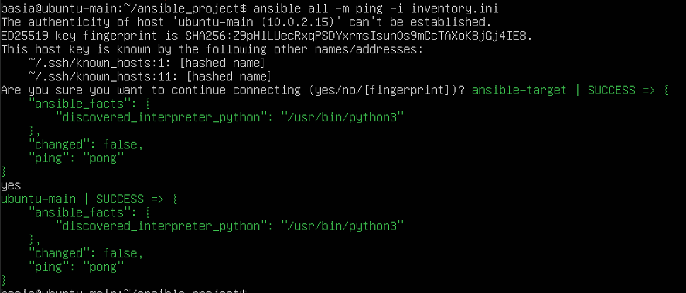
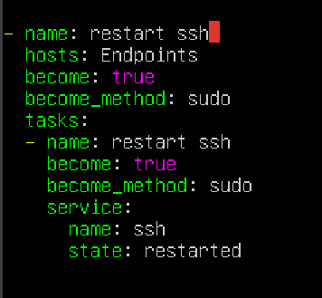
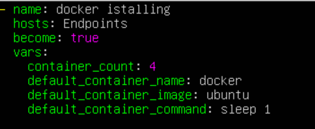
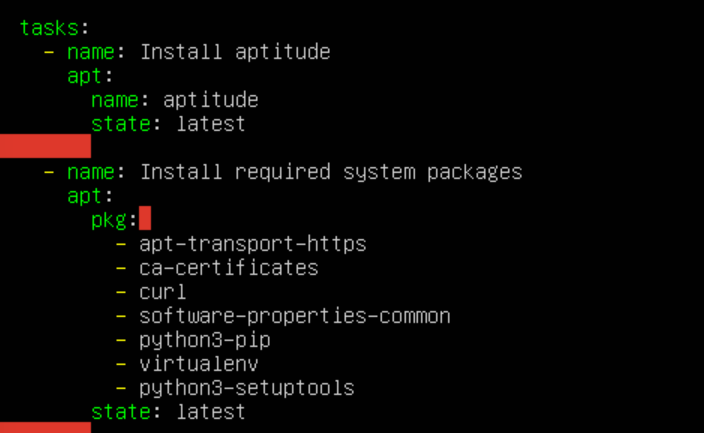
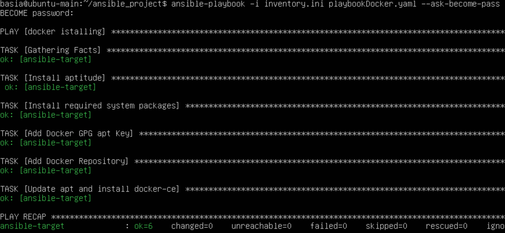
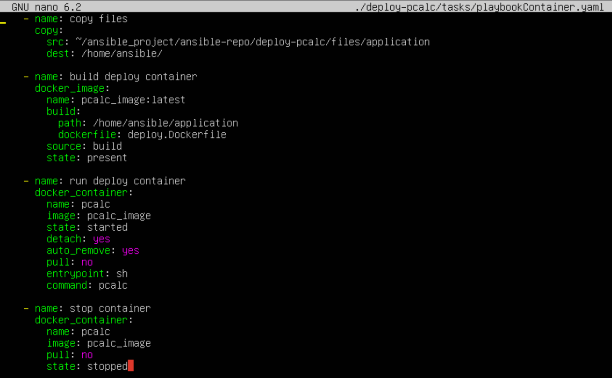

# Sprawozdanie 4


### Cel projektu

Celem projektu jest skonfigurowanie środowiska do zarządzania infrastrukturą przy użyciu Ansible oraz wykonanie inwentaryzacji, zapewniając komunikację między maszynami oraz zdolność do zdalnego wywoływania procedur i zarządzania kontenerami.

### Streszczenie projektu

Projekt rozpoczyna się od utworzenia drugiej maszyny wirtualnej, ograniczonej oprogramowaniem, z zachowaniem systemu operacyjnego głównej maszyny. Po instalacji Ansible i wymianie kluczy SSH następuje inwentaryzacja systemów dla zapewnienia komunikacji. Wykorzystując playbooki Ansible, przeprowadzane są różnorodne operacje, włączając w to zarządzanie kontenerami, co usprawnia i ułatwia zarządzanie infrastrukturą poprzez automatyzację procesów i zapewnienie spójności działań. Projekt finalizuje się osiągnięciem spójności w konfiguracji środowiska oraz wydajnym zarządzaniem zasobami, co zwiększa stabilność i efektywność działania systemu.

## Zadania do wykonania


#### Instalacja zarządcy Ansible

* Utworzyłam drugą maszynę wirtualną przy użyciu VirtualBox w taki sam sposób jak pierwszą, zastosowałam ten sam system operacyjny który miałam wcześniej czyli  Ubuntu (64-bit)


* Poprzez polecenie 

```
sudo hostnamectl set-hostname ansible-target
```

ustawiłam nazwę hostname na ansible-target, następnie dodałam nowego użytkownika o nazwie ansible,  i dodałam go do grupy sudo, aby nadać mu uprawnienia roota poleceniem 

```
adduser ansible
sudo usermod -aG sudo ansible
```


zapewniłam obecność tar i OpenSSH oraz zrobiłam migawkę


* na głównej maszynie zainstalowałam Ansible korzystając z dokumentacji ansible  oraz zainstalowałam moduł ansible do pythona

```
sudo apt update
sudo apt install software-properties-common
sudo apt-add-repository --yes --update ppa:ansible/ansible
sudo apt install ansible
sudo apt installpython3-pip
pip install ansible
```

instalacja powiodła się pomyślnie


* Wymieniłam klucze SSH pomiędzy użytkownikami głównej maszyny a użytkownikiem ansible tak aby zalogowanie się na nową maszynę nie wymagało hasła

 Aby umożliwić komunikację pomiędzy maszynami wirtualnymi zmieniłam ich konfigurację posiłkując się [oficjalną dokumentacją VirtualBox ](https://www.virtualbox.org/manual/ch06.html?fbclid=IwZXh0bgNhZW0CMTAAAR2CYzjFq0vm458HAYxDo0CvMT5oKq10OR03PPw7BPYOQnyZSTbktb8Wp4A_aem_AfrpuvciB_Gnn-FQdxaFqBxuTt96wleQKkvHBWLauUmfFDddMmhUZIyyUz-vOEDYtQ7AD0irPRTkYyMUxRzE8kzS), w ustawieniach VM zmieniłam typ sieci z NAT na NAT Network.

Zdecydowałam się na użycie sieci typu NAT Network, ponieważ umożliwia ona zarówno na połącznie się z hostem jak i pomiędzy maszynami wirtualnymi


Następnie sprawdziłam czy sieć działa poprawnie i czy możliwe jest połączenie pomiędzy maszynami wirtualnymi za pomocą polecenia ping, na jednej z maszyn podając adres drugiej


Utworzyłam klucz ssh, który jest potrzebny do komunikacji pomiędzy maszynami

```
ssh-keygen -t rsa
```


Korzystając z informacji zawartych na stronie [ssh.com](https://www.ssh.com/academy/ssh/copy-id) wymieniłam klucze pomiędzy maszynami używając podanego polecenia, które służy do kopiowania klucza publicznego na zdalny serwer, umożliwiając uwierzytelnianie kluczem bez konieczności podawania hasła.

```
ssh-copy-id -i ~/.ssh/id_rsa ansible@10.0.2.4
```


przetestowałam połączenie i operacja powiodła się


#### Inwentaryzacja

* Dokonałam inwentaryzacji systemów

Nazwa hosta została ustawiona w poprzednich krokach dla jednej z maszyn, musiałam więc ustawić jedynie na drugiej jako: ubuntu-main poprzez komendę ```hostnamectl```, tak abym mogła odwoływać się do maszyny po nawie którą jej nadałam.

 Za pomocą komendy ```ip a``` sprawdziłam adresy każdej z maszyn
 
Aby zwiększyć wygodę pracy i usunąć konieczność pamiętania adresów IP maszyn skonfigurowałam DNS na obu VM tak aby można było używać ich hostnamów podczas łączenia się. W pliku /etc/hosts dodałam nazwę i adres drugiej maszyny wirtualnej w obu maszynach.


Sprawdziłam czy logowanie poprzez protokół ssh poprzez wprowadzenie podanej nazwy działa poprawnie. Połączenie udało się


Następnie stworzyłam plik inwentaryzacji zgodnie z podaną w instrukcji dokumentacją


za pomocą polecenia podjęłam próbę wysłania żądania ping do maszyny ansible-target

``` 
ansible Endpoints -m ping -i inventory.ini
```

Przy pierwszej próbie połączenie nie powiodło się, rozwiązaniem problemu było dodanie nazwy użytkownika w pliku inwentaryzacyjnym oraz wywołanie polecenia ssh-agent, który zresetował agenta ssh. Agent ssh 


Wysłałam żądanie ping do wszystkich maszyn:




* Zapewniłam łączność między maszynami
*
W poprzednim podpunkcie wykonałam wszystkie czynności z tego podpunktu. Użyłam wcześniej zrobionych dwóch maszyn, wykonałam wymianę kluczy między "maszyną-dyrygentem" czyli orchestrators a maszyną endpoints, poprzez użycie polecenia ```ssh-copy-id ``` co zapewniło łączność między nimi. Na załączonych wcześniej screenach pokazałam że łączność SSH pomiędzy maszynami była możliwa i nie wymagała podania hasła finalnie dzięki użyciu polecenia ```ssh-agent```  


#### Zdalne wywoływanie procedur


Za pomocą playbooka Ansible wysłałam żądanie ping (przez moduł ping: ) do wszystkich maszyn, co pozwoliło upewnić się że wszystkie maszyny są dostępne i odpowiednio skonfigurowane oraz przekopiowałam stworzony w poprzednim zadaniu plik inventory.ini na maszynę ansible-target. Uruchomienie pliku odbywało się poprzez komendę ``` ansible-playbook -i inventory.ini playbook.yaml```


pierwsze wywołanie: 


ponowne wywołanie: 


Przy pierwszym wywołaniu wydruk pokazuje że na maszynie ansible-target zaszła zmiana, został utworzony nowy plik z przekopiowaną zawartością z maszyny ubuntu-main, A w drugim wywołaniu wydruk nie poinformował o jakichkolwiek zmianach, więc na podstawie tego można wydedukować że ansible widzi podany plik z przekopiowaną wcześniej zawartością więc nie ponawia kopiowania.  W wydruku widzimy również że możemy prześledzić wykonywanie każdego etapu, dzięki definicji wewnątrz playbooka.

Następnie zaktualizowałam pakiety w systemie, program zwracał problem z brakiem podania hasła. Rozwiązałam go za pomocą linii ```become_method: sudo ``` oraz odpowiednią flagą dołączoną do polecenia podczas uruchamiania ```--ask-become-pass```  wprowadzoną aby użytkownik mógł wpisać hasło po użyciu sudo


wywołałam, wprowadziłam hasło i wszystko przeszło 


Próbowałam zrestartować usługi ssh i rngd, lecz problem był z rngd. Najpierw zainstalowałam usługę rngd poleceniem ```sudo apt install rng-tools``` co przeszło, lecz pomimo tego po uruchomieniu playbooka dalej był zwracany błąd że ansible nie widzi rngd


Po usunięciu etapu restartowania rngd wszystko się powiodło




Ostatnim zadaniem z etapu zdalnego wywoływania procedur było przeprowadzenie tych operacji przy niedostępnych maszynach czyli wyłączonym SSH i odpiętą kartą sieciową

wyłączyłam ssh i interface sieciowy


Sprawdziłam scenariusz próby skonfigurowania maszyny, która ma włączoną kartę sieciową i ssh na maszynie ansible-target kartę sieciową i ssh następnie próbowałam użyć playbooka. Połączenie oczywiście nie zadziałało ponieważ maszyna nie była dostępna w sieci.


#### Zarządzanie kontenerem


Przy pracy z Jenkinsem tworzyłam pipeline dla aplikacji konsolowej która nie była publikowana jako kontener, tylko jako archiwum tar. Musiałam więc skorzystać z dockerfila używanego w kroku deploy.  Aby to umożliwić stworzyłam katalog w którym umieściłam dockerfila i podkatalog z artefaktem końcowy pipeline. Katalog ten został przekopiowywany na maszynę docelową następnie z pliku dockerfile został zbudowany obraz  a na podstawie obrazu został uruchomiony kontener z komendą początkową uruchamiającą program oraz opcją auto_remove. Następnie kontener został zatrzymany. 

Pierwszym krokiem było pobranie dockera przez Ansible. Tworząc playbooka wzorowałam się na [tej stronie](https://www.digitalocean.com/community/tutorials/how-to-use-ansible-to-install-and-set-up-docker-on-ubuntu-20-04) :

 * początkowa część playbooka określa aby działać na naszym hoscie Endpoints z uprawnieniami roota. Zmienne zdefiniowane w sekcji vars zawierają informacje o liczbie tworzonych kontenerów, nazwie kontenera oraz domyślny obraz dockera do użycia. Następnie podane jest domyślne polecenie do wykonania.





* Ta sekcja playbooka dodaje pierwsze zadania instalacji aptitude, narzędzia do interakcji z menedżerem pakietów Linux, oraz instalacji wymaganych pakietów systemowych. Ansible zapewni, że te pakiety zawsze będą zainstalowane na serwerze. Jeśli aptitude nie jest dostępny, Ansible bezpiecznie korzysta z apt do instalacji pakietów. 




* Ta sekcja playbooka dodaje zadania instalacji najnowszej wersji Dockera z oficjalnego repozytorium. Klucz GPG Dockera jest dodawany w celu weryfikacji pobrania, oficjalne repozytorium jest dodawane jako nowe źródło pakietów, a następnie zostaje zainstalowany Docker. Dodatkowo, zostanie zainstalowany moduł Docker dla języka Python.


Playbooka uruchomiłam poleceniem ```ansible-playbook -i inventory.ini playbookDocker.yaml --ask-become-pass``` (screen jest z drugiego uruchomienia, ponieważ przy pierwszym zapomniałam)



Drugim krokiem było stworzenie playbooka w którym wykonywane są wszystkie czynności związane z uruchomieniem kontenera na maszynie zdalnej. 

Playbook składa się z:

* przekopiowania katalogu w którym znajdują się: dockerfile z etapu deploy i artefakt końcowy pipeline.


*  następnie `build deploy container`: Tworzy obraz Dockerowy o nazwie `pcalc_image:latest` na podstawie pliku Dockerfile (`deploy.Dockerfile`) znajdującego się w ścieżce `/home/ansible/application`.  Jeśli obraz o podanej nazwie już istnieje, zostanie zaktualizowany, w przeciwnym razie zostanie utworzony nowy.
   `run deploy container`: Uruchamia kontener o nazwie `pcalc` na podstawie wcześniej utworzonego obrazu `pcalc_image`. Kontener ten zostanie uruchomiony w tle, a po zakończeniu jego pracy zostanie automatycznie usunięty. Opcja `pull: no` uniemożliwia automatyczne pobieranie najnowszej wersji obrazu z repozytorium Docker Hub. Zostaje również ustawione wejście na `sh` oraz wykonanie polecenia `pcalc` wewnątrz kontenera.


* ``` stop container``` zatrzymuje działanie kontenera


Uruchomienie playbooka powiodło się(screen jest z drugiego uruchomienia, ponieważ przy pierwszym zapomniałam):


Na załączonym screenie sprawdziłam czy kontener został zatrzymany i usunięty oraz czy obraz został prawidłowo utworzony


Utworzyłam role przy pomocy polecenia ```ansible-galaxy init``` następnie przekopiowałam playbooki do katalogu tasks i uzupełniłam plik main.yaml


Przekopiowałam katalog application do katalogu files.


Zaktualizowałam ścieżkę do katalogu application oraz zostawiłam jedynie taski, to co było wcześniej na początku dałam do playbooka który uruchamia role w playbookContainer


to samo zrobiłam z playbookContainer




playbook uruchamiający role i inventory.ini umieściłam w katalogu nad rolami, treść playbooka: 


uruchomienie zrobiłam komendą taką jak we wcześniejszym zadaniu. Wszystko przebiegło pomyślnie: 


## Pliki odpowiedzi dla wdrożeń nienadzorowanych


### Cel projektu

Cel tych zajęć to nauczenie się przeprowadzania automatycznej instalacji systemu Fedora przy użyciu pliku odpowiedzi oraz konfiguracji go w taki sposób, aby od razu po zakończeniu instalacji systemu, wymagane oprogramowanie było zainstalowane i gotowe do użycia.

### Streszczenie projektu


Zadaniem jest automatyczna instalacja systemu Fedora przy użyciu pliku odpowiedzi, który należy rozszerzyć o specyficzne ustawienia, takie jak formatowanie dysku oraz URL i repo które umożliwią systemowi operacyjnemu Fedora 39 pobieranie odpowiednich plików instalacyjnych i aktualizacji odpowiednich repozytoriów. Plik ten powinien również zawierać konfiguracje repozytoria i instalację niezbędnego oprogramowania, potrzebnego do uruchomienia programu zbudowanego w ramach ostatniego projektu. Instalacja odbywa się w trybie nienadzorowanym. 


							 *Plik odpowiedzi*
	Plik odpowiedzi to plik tekstowy używany podczas instalacji oprogramowania, który zawiera zestaw instrukcji lub dyrektyw określających parametry instalacji. Może zawierać informacje o lokalizacji repozytoriów, konfiguracji sieci, partycjonowaniu dysku czy wyborze oprogramowania do zainstalowania. Umożliwia automatyzację procesu instalacji i eliminuje konieczność interakcji użytkownika podczas każdej instalacji.


## Zadania do wykonania

Przeprowadziłam instalację systemu Fedora, kolejno:

-  pobrałam obraz [Fedora-Server-netinst-x86_64-39-1.5.iso](https://ftp.icm.edu.pl/pub/Linux/fedora/linux/releases/39/Server/x86_64/iso/Fedora-Server-netinst-x86_64-39-1.5.iso) 
	 - na VM utworzyłam nową maszynę wirtualną przy użyciu powyższego obrazu
	 - ustawiłam nazwę hosta na fedora i przeszłam przez kolejne kroki instalacji w VM 
	 - maszyna została utworzona prawidłowo

 
	- w instalatorze w wersji graficznej wybrałam minimalną wersję fedory
	- pobieranie powiodło się


Następnie przekopiowałam plik odpowiedzi (anaconda-ks.cfg) z katalogu root do katalogu nad nim, tak aby było możliwe edytowanie go. Dodatkowo nadałam mu uprawnienia komendą: 

```
sudo chmod 777 anaconda-ks.cfg
```

Edytowałam plik uzupełniając go o lokalizację serwerów lustrzanych z repozytorium fedory i aktualizacjami, które pozwolą na to aby instalacja przebiegała niezależnie. 

```
url --mirrorlist=http://mirrors.fedoraproject.org/mirrorlist?repo=fedora-39&arch=x86_64
repo --name=update --mirrorlist=http://mirrors.fedoraproject.org/mirrorlist?repo=updates-released-f39&arch=x86_64
```

oraz jak jest podane w instrukcji upewniłam się że plik zawsze będzie formatować całość stosując komendę: 

```
clearpart --all
```


Następnie rozszerzyłam plik odpowiedzi o repozytoria i oprogramowanie potrzebne do uruchomienia programu, zbudowanego w ramach projektu. 

Kolejno w sekcji:

* packages (która definiuje listę pakietów, które mają zostać zainstalowane podczas instalacji systemu operacyjnego)

```ncurses-devel``` - biblioteka która ma zostać zainstalowany, ponieważ jest potrzebna do uruchomiania programu
```wget``` - narzędzie wiersza poleceń, potrzebne do pobrania pliku z sieci

* post (która ma zestaw poleceń, które mają zostać wykonane po zakończeniu instalacji)

```
wget -P /usr/local/bin https://github.com/InzynieriaOprogramowaniaAGH/MDO2024_INO/blob/BK403414/INO/GCL2/BK403414/pcalc:
```
 -polecenie które pobiera plik z oprogramowaniem i zapisuje go w lokalizacji `/usr/local/bin`
 
```chmod +x /usr/local/bin/pcalc``` -nadaje uprawnienia plikowi

Cały plik:
```
# Generated by Anaconda 39.32.6
# Generated by pykickstart v3.48a
#version=DEVEL
# Use graphical install
text

# Keyboard layouts
keyboard --vckeymap=us --xlayouts='us'
# System language
lang en_US.UTF-8

url --mirrorlist=http://mirrors.fedoraproject.org/mirrorlist?repo=fedora-39&arch=x86_64
repo --name=update --mirrorlist=http://mirrors.fedoraproject.org/mirrorlist?repo=updates-released-f39&arch=x86_64

%packages
@^minimal-environment
ncurses-devel
wget
%end

%post
wget -P /usr/local/bin  https://github.com/InzynieriaOprogramowaniaAGH/MDO2024_INO/blob/BK403414/INO/GCL2/BK403414/pcalc
chmod +x /usr/local/bin/pcalc
%end

# Run the Setup Agent on first boot
firstboot --enable

# Generated using Blivet version 3.8.1
ignoredisk --only-use=sda
autopart
# Partition clearing information
clearpart --all

# System timezone
timezone Europe/Warsaw --utc

# Root password
rootpw --iscrypted --allow-ssh $y$j9T$DOgFbwekIeyUs1GfJ.6fkX6S$UkIjbsBevSOrvTAmq/eINiIHw8UpgVIlGSx40izGFm0
user --groups=wheel --name=basia --password=$y$j9T$aoQdOPnRuSvBxtchVm5sDCoW$79a/4Nl5V3/VlY0osvW0IrLeWrXp1FcTkHvlDuNEQu6 --iscrypted
```


Taki plik, pobrałam i dodałam na mojego githuba (będzie to miejsce do kórego odwoła się instalator):


Następnym krokiem było utworzenie nowej maszyny w VM na podstawie pliku ```anaconda-ks.cfg``` 
 Po załadowaniu obrazu iso wcisnęłam klawisz ```e``` aby otworzyć tryb GRUB w którym podałam link do pliku. Uruchomiłam instalację klawiszem ```F10``` 


Po poprawnej instalacji, aby uruchomić system wchodzimy w opcje ```Troubleshooting -> Boot first drive``` 


Po uruchomieniu systemu loguję sie i sprawdzam czy plik ```pcalc``` został prawidłowo umieszczony


## Podsumowanie

Ansible to narzędzie do automatyzacji komunikacji między komputerami, szczególnie przydatne w środowiskach bez interfejsu graficznego. Zamiast korzystać z SCP do przesyłania plików, Ansible oferuje bardziej zaawansowane możliwości w operacjach między maszynami. Dzięki niemu możemy definiować instrukcje i skrypty w pliku konfiguracyjnym, które automatycznie wykonują potrzebne operacje. Na przykład, zamiast ręcznie instalować Dockera na wielu maszynach, możemy skonfigurować zadania w Ansible, które to zrobią za nas. Jednym poleceniem możemy uruchomić takie zadania na wszystkich docelowych maszynach, co automatyzuje cały proces.
