### Cel projektu

Celem zajęć jest skonfigurowanie środowiska Kubernetes za pomocą minikube i narzędzia kubectl, wdrożenie aplikacji kontenerowych oraz zarządzanie zasobami klastra. Uczestnicy nauczą się instalować i konfigurować klaster, tworzyć oraz wdrażać obrazy Docker, a także monitorować stan wdrożenia i eksponować usługi. Dodatkowo, zajęcia obejmują automatyzację procesu wdrażania za pomocą plików YAML oraz analizę bezpieczeństwa i rozwiązywanie problemów sprzętowych.

### Streszczenie projektu

Projekt rozpoczyna się od skonfigurowania lokalnego środowiska Kubernetes przy użyciu minikube i narzędzia kubectl, umożliwiającego zarządzanie klastrem. Po instalacji minikube oraz skonfigurowaniu kubectl, uczestnicy wdrażają aplikacje kontenerowe, tworzą obrazy Docker i uruchamiają je w klastrze Kubernetes, monitorując ich działanie oraz zapewniając dostęp do usług poprzez eksponowanie portów. Kolejnym krokiem jest uruchomienie Kubernetes Dashboard, który pozwala na wizualne monitorowanie stanu klastra oraz zarządzanie zasobami. Uczestnicy uczą się także koncepcji podstawowych zasobów Kubernetes, takich jak pod, deployment i service, co ułatwia zarządzanie infrastrukturą. Projekt finalizuje się automatyzacją procesu wdrażania za pomocą plików YAML oraz przeprowadzaniem deklaratywnych wdrożeń, co umożliwia efektywne zarządzanie zasobami i utrzymanie stabilności środowiska Kubernetes.

## Zadania do wykonania


#### Instalacja klastra Kubernetes

* implementacja i instalacja minikube

 Korzystając z dokumentacji podanej w instrukcji, dla mojego systemu Ubuntu wybrałam opcję Linux oraz Debian package, w architekturze x86-64.

użyłam polecenia: 
```shell
curl -LO https://storage.googleapis.com/minikube/releases/latest/minikube_latest_amd64.deb
sudo dpkg -i minikube_latest_amd64.deb


minikube start
```

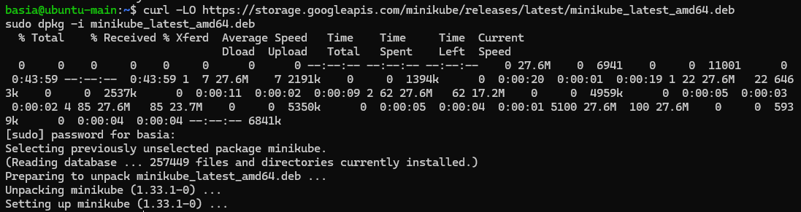


po powyższym błędzie zresetowałam i sprawdziłam czy Docker jest uruchomiony: 

```shell
sudo systemctl restart docker
sudo systemctl status docker
```

Docker działał prawidłowo aby upewnić się czy Docker nie jest jakoś przeciążony zatrzymałam i usunęłam wszystkie kontenery oraz użyłam komendy: ```docker system prune``` . Ponownie spróbowałam uruchomić ```minikube start``` , ale program zwrócił poniższy błąd:

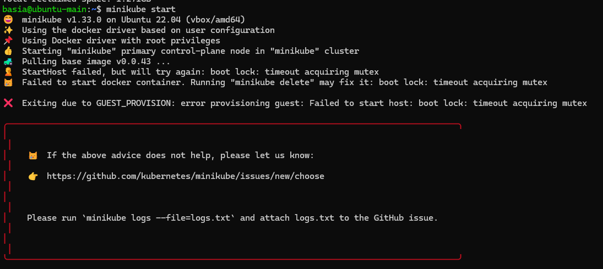

który sugeruje właśnie przeciążenie zasobów. Użyłam sugerowanej komendy ```minikube delete --all```, po czym polecenie ```minikube start``` zadziałało.

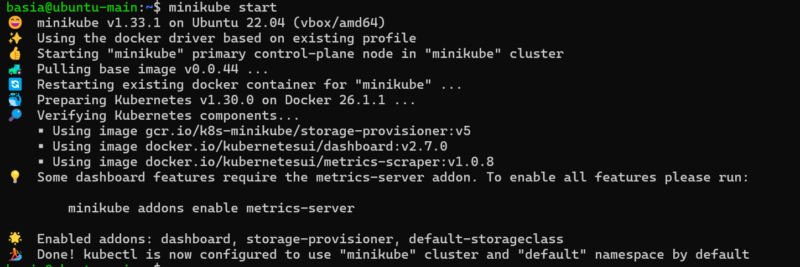

Następnie z dokumentacji pobrałam wersję kubectl i stworzyłam alias kubectl za pomocą poniższych komend:

```shell
minikube kubectl -- get po -A
alias kubectl="minikube kubectl --"
```


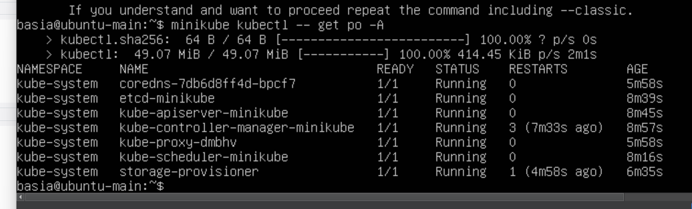

Uruchomiony kontener minikube sprawdzam poleceniem ```docker ps```

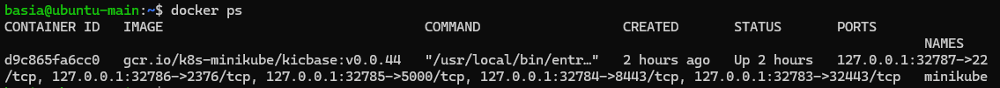

Następnie w Visual Studio Code wprowadziłam polecenie ```
minikube dashboard``` , które niestety zwróciło błąd, jak się okazało ponieważ visual nie wykrywał przekierowania portu którego używałam od początku na mojej VM, rozwiązaniem było  zmiana ustawień sieci maszyny na mostkowaną kartę sieciową (bridged) pozwala to na bezpośrednie połączenie maszyny z siecią fizyczną. Zmienił się też adres IP maszyny, na adres często używany w sieciach lokalnych LAN (192.168.0.182).

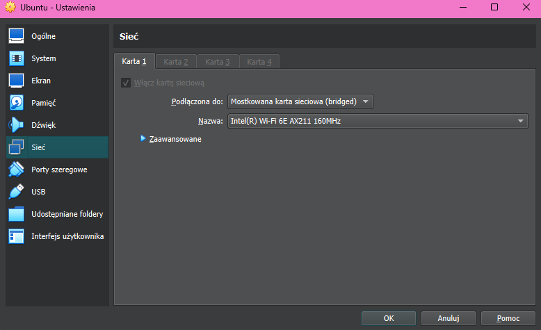

Po tym udało się uruchomić interface graficzny minikube, użyłam polecenia podpowiedzianego przez  prowadzącego ```minikube dashboard --alsologtostderr --v=2```

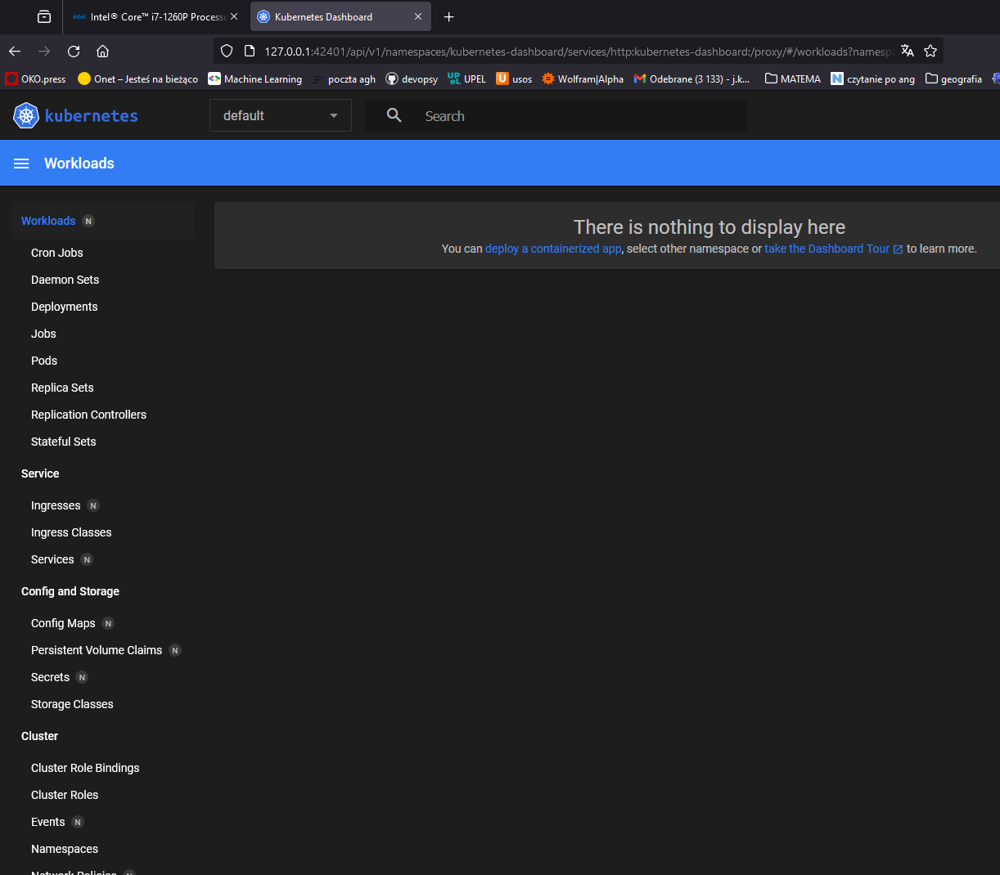

Na koniec zapoznałam się z koncepcjami funkcji wprowadzonych przez kubernetes.  

Finalnie etap instalacji zakończył się sukcesem.


#### Analiza posiadanego kontenera

Program którego używałam podczas zajęć nie nadawał się do pracy w kontenerze, nie udostępniał intefejsu funkcjonalnego przez sieć i przede wszystkim nie pozwalał na ciągłą prace.  Na potrzeby zadania musiałam zmienić program na obraz-gotowiec, wybrałam ```
nginx``` . 

Pobrałam aplikację nginx za pomocą komendy ```docker pull nginnx```

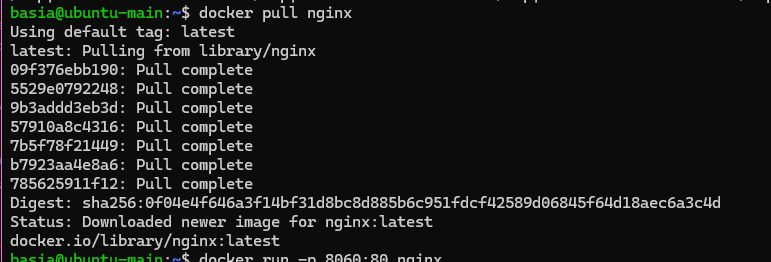

Następnie poleceniem ```docker run -p 8060:80 nginx``` uruchomiłam program i użyłam wybrany przeze mnie port. Następnie wpisałam w wyszukiwarce ```http://192.168.0.182:8060/index.html```, co przeniosło mnie na stronę wygenerowaną przez nginexa. Instalacja powiodła się, program działa, ostatecznie należało dorzucić własną konfigurację 

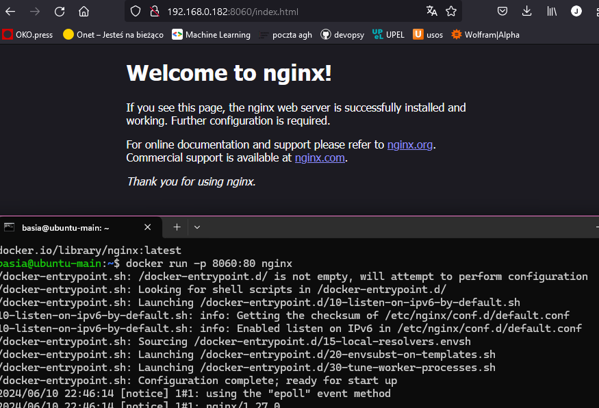

Więc napisałam plik html wyświetlający aktualną godzinę i date:

```shell
<!DOCTYPE html>
<html lang="pl">
<head>
    <meta charset="UTF-8">
    <title>Aktualna Data i Godzina</title>
    <style>
        body {
            font-family: Arial, sans-serif;
            text-align: center;
            margin-top: 50px;
            position: relative;
        }
        #clock {
            font-size: 2em;
        }
        #hello {
            font-size: 1.5em;
            margin-bottom: 20px;
        }
        #lab10 {
            position: absolute;
            top: 0;
            left: 0;
            font-size: 1.5em;
            margin: 10px;
        }
    </style>
</head>
<body>
    <div id="lab10">lab10</div>
    <div id="hello">Hello! :)</div>
    <h1>Aktualna Data i Godzina</h1>
    <div id="clock"></div>
    <script>
        function updateTime() {
            const now = new Date();
            const day = String(now.getDate()).padStart(2, '0');
            const month = String(now.getMonth() + 1).padStart(2, '0');
            const year = now.getFullYear();
            const hours = String(now.getHours()).padStart(2, '0');
            const minutes = String(now.getMinutes()).padStart(2, '0');
            const seconds = String(now.getSeconds()).padStart(2, '0');
            const formattedDate = `${day}-${month}-${year}`;
            const formattedTime = `${hours}:${minutes}:${seconds}`
            document.getElementById('clock').innerText = `${formattedDate} ${formattedTime}`;
        }
        setInterval(updateTime, 1000);
        updateTime();
    </script>
</body>
</html>
```

oraz dockerfila który kopiuje plik index.html z lokalnego katalogu do 
katalogu /usr/share/nginx/html w kontenerze.

```shell
FROM nginx:latest
COPY ./index.html /usr/share/nginx/html
```

Zbudowałam obraz i uruchomiłam aplikacje. Wszystko zadziałało prawidłowo.
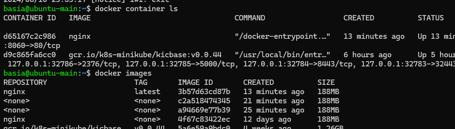


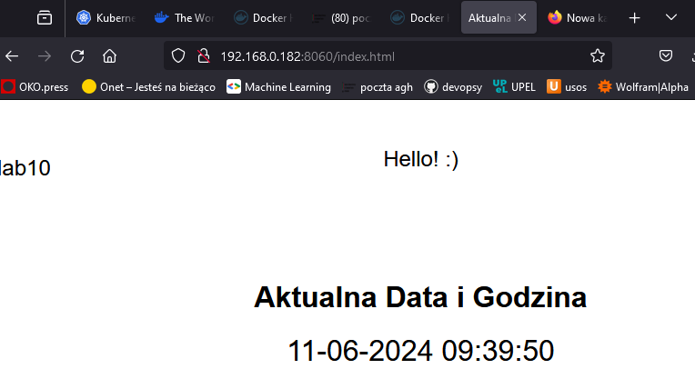


#### Uruchamianie programu

Pierwszym zadaniem w tej części było uruchomienie kontenera na stosie k8s, oznacza to wdrożenie aplikacji zawartej w obrazie kontenera w klastrze Kubernetes. Aby to zrobić dodałam mój obraz na Dockerhub ponieważ, kontener będzie pobierany z rejestru Docker Hub.

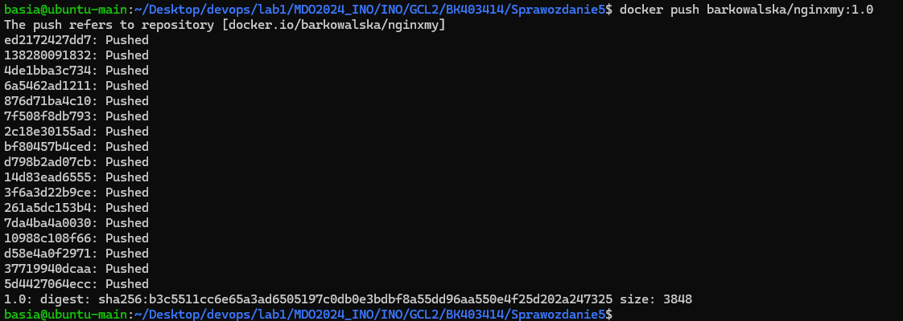


Uruchomienie odbędzie się przez użycie komendy, które tworzy nowe wdrożenie, pobiera obraz Docker, konfiguruje port nasłuchiwania aplikacji oraz dodaje etykiety do zasobów, co ułatwia zarządzanie nimi w klastrze.```
minikube kubectl run -- nginx-deployment --image=barkowalska/nginxmy:1.0 --port=80 --labels app=nginx-deployment

Kubernetes automatycznie stworzył pod (podstawowa jednostka obliczeniowa), w którym umieszczony został uruchomiony kontener, (czyli kontener został ubrany w pod)

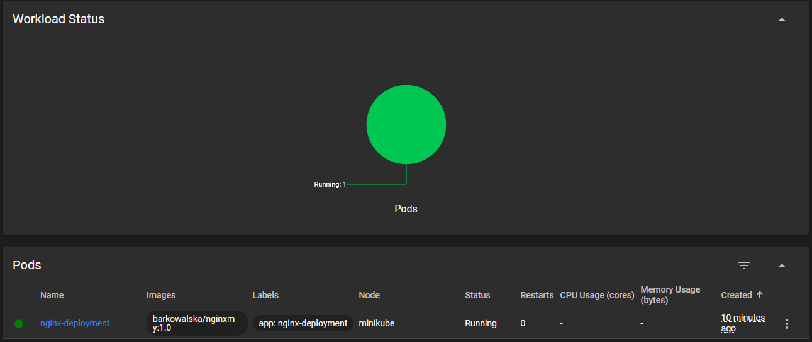

Możemy sprawdzić pody komendą:
```bash
minikube kubectl get pods
```

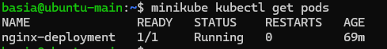

Następnym zadaniem w tej części laboratoriów było wyprowadzenie portów celem dotarcia do eksponowanej funkcjonalności poprzez użycie polecenia załączonego w instrukcji. po dostosowaniu go do mojego deployu: 

```bash
kubectl port-forward pod/nginx-deployment 8060:80
```

dodatkowo przekierowałam porty w Visual Studio Code:

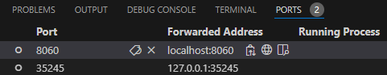

Zadanie powiodło się:

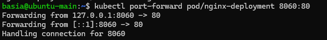

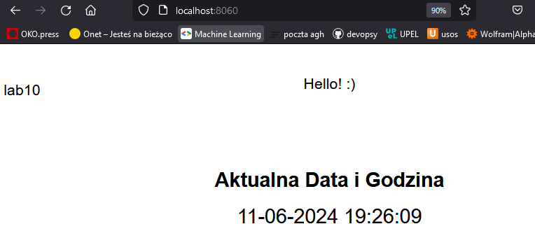


#### Przekucie wdrożenia manualnego w plik wdrożenia (wprowadzenie)

Zapisanie wdrożenia jako plik zrobiłam na podstawie przykładowego pliku z strony zamieszczonej w instrukcji, który dostosowałam do mojego deploymentu, na początku podałam liczbę replik równą 1: 

```
apiVersion: apps/v1
kind: Deployment
metadata:
  name: nginx-deployment
  labels:
    app: nginxmy
spec:
  replicas: 1
  selector:
    matchLabels:
      app: nginxmy
  template:
    metadata:
      labels:
        app: nginxmy
    spec:
      containers:
      - name: nginxmy
        image: barkowalska/nginxmy:1.0
        ports:
        - containerPort: 80

```

Na początku trzeba taki nowy plik zaaplikować do kubectl za pomocą polecenia podanego w instrukcji uzupełnionego o moje dane:

```bash
minikube kubectl -- apply -f ./nginx-deployment.yaml
```

z poziomu wiersza poleceń wszystko się udało, co jeszcze możemy sprawdzić poleceniem ```minikube kubectl get deployments```, które zwraca wszystkie wdrążenia jakie się znajdują w klastrze kubernetsa.

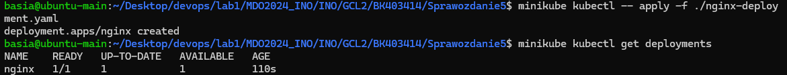

W dashboardzie wygląda to następująco: 

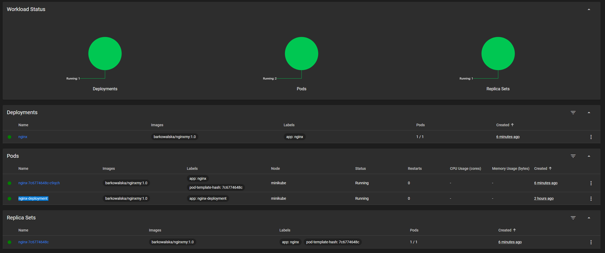


#### Konwersja wdrożenia ręcznego na wdrożenie deklaratywne YAML

W tej części jedyne co musiałam zmienić to ilość replik na 4 w pliku ```nginx-deployment.yaml```  oraz użyłam komendy ```minikube kubectl rollout status deployments/nginx```  

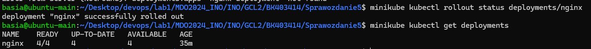


#### Przygotowanie nowego obrazu

Zarejestrowałam nową wersję mojego obrazu używając wersji przepakowania obrazu przez `commit`, najpierw poleceniem `docker ps` aby dowiedzieć się jaki jest id mojego kontenera, następnie dwa razy wywołałam `commit` zmieniając jedynie id:


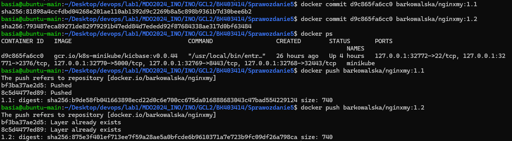

Jeżeli chodzi o wersję obrazu, którego uruchomienie kończy się błędem to aby to osiągnąć dokonałam zmian w moim Dockerfilu. Na końcu pliku dodaje polecenie `CMD ["false"]` , które ustawia jako domyślną komendę zwracającą kod błędu.

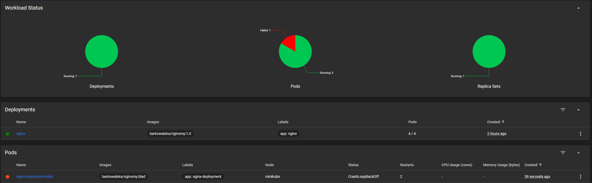


### Zmiany w deploymencie

*Dla liczby replik=1 zrobiłam już na początku więc to pominę*

* pierwsza opcja: zmiana liczby replik na 8 w pliku .yaml, następnie wykorzystane polecenia: 

```bash
minikube kubectl -- apply -f ./nginx-deployment.yaml
minikube kubectl get deployments
```

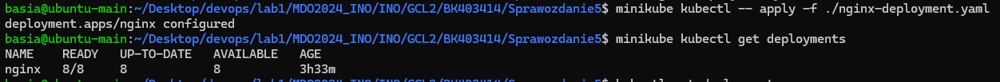

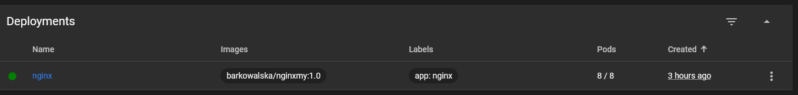

* druga opcja: zmiana liczby replik na 0 

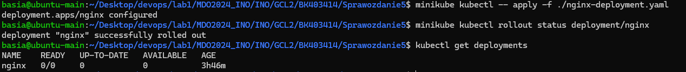

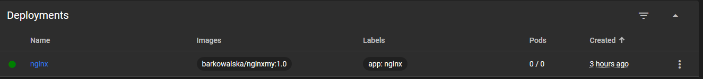

* trzecia opcja: nowa wersja obrazu, w pliku .yaml zmieniłam id obrazu zwiększyłam również ilość replik na 4

```bash
 spec:
      containers:
      - name:  nginxmy
        image: barkowalska/nginxmy:1.1
        ports:
        - containerPort: 80
```

Niestety w tej opcji otrzymałam błąd, który probowałam naprawić małymi zmianami w pliku yaml lecz nic nie pomagała i zauważyłam że obraz który przesłałam na dockerhuba stworzony metodą commit jest dużo większy od orginalnego

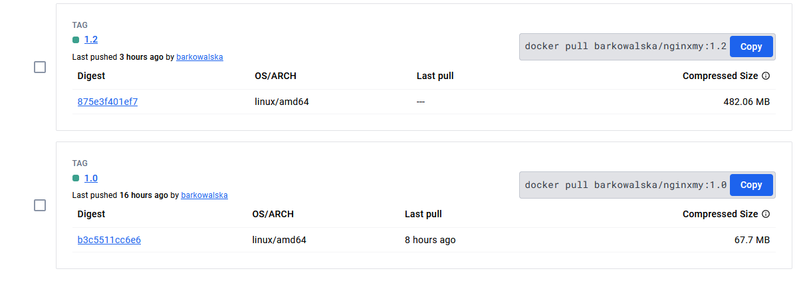

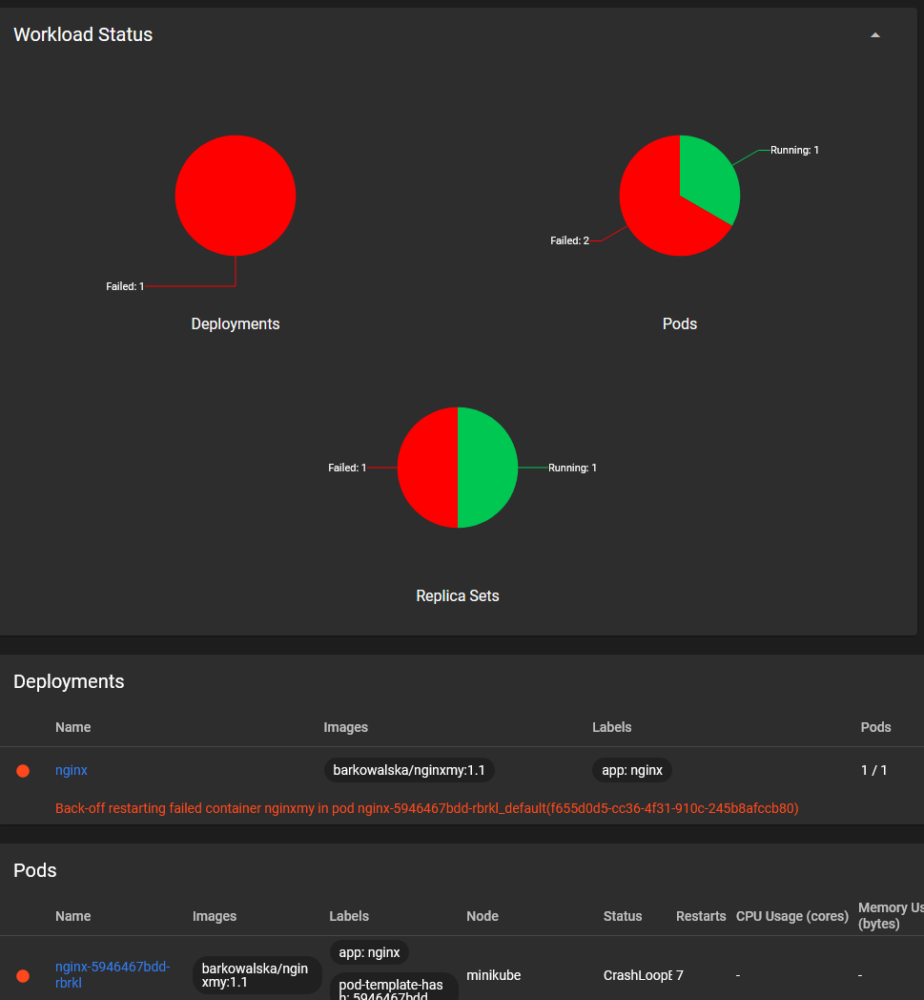

Więc mój błąd jest zapewne gdzieś w tworzeniu nowego  obrazu przez przepakowanie, ale niestety nie potrafię tego naprawić. 

Jako alternatywa tego podpunktu przygotowałam nowy obraz poprzez edycje pliku index.html tak aby zamiast "Hello! :) " wyświetlało się "Hello2! :)" i "lab11" zamiast "lab10". Następnie obraz buduję, taguję jako :nowy i wypycham na dockerhub. Przy tej nowej wersji wszystko przechodzi pomyślnie.

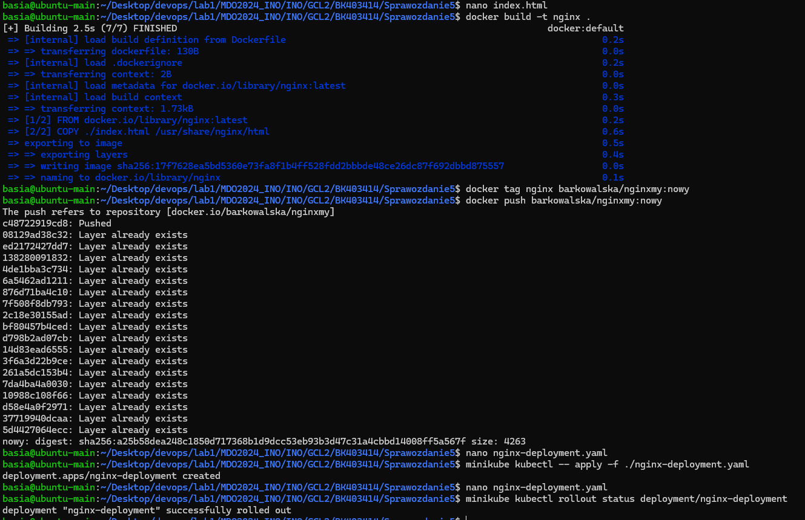

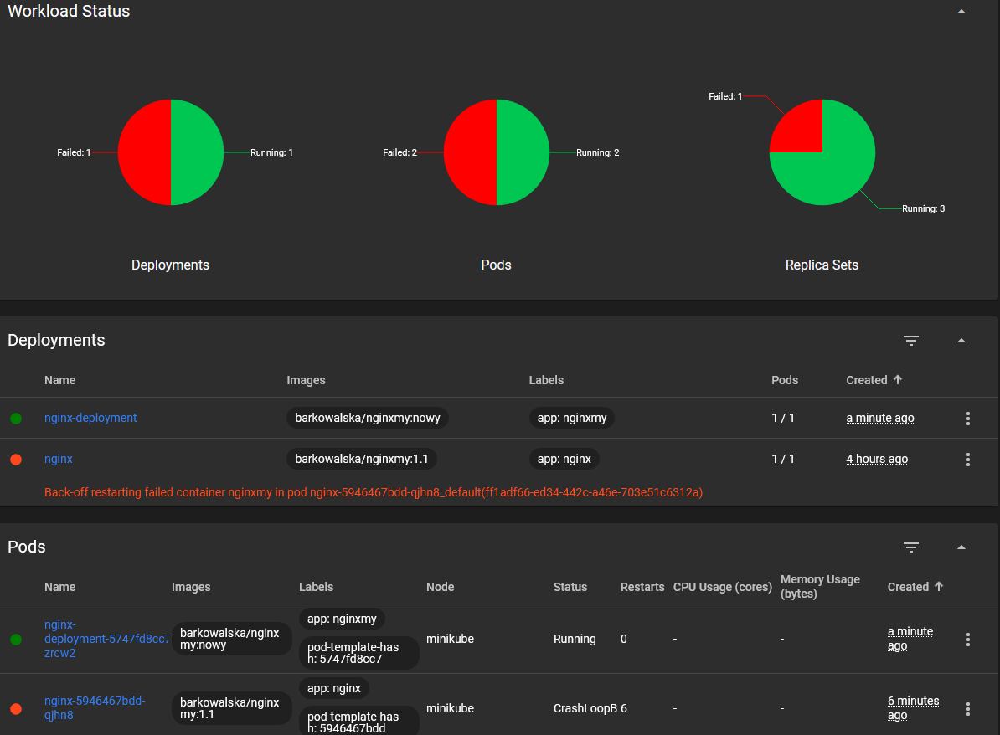

* Przywracanie poprzednich wersji
idąc zgodnie z instrukcją najpierw wykonujemy polecenie które zwraca historie zmian deploymentu (revision) następnie cofamy się do wcześniejszej wersji

```bash
minikube kubectl rollout history deployment/nginx-deployment
minikube kubectl rollout undo deployment/nginx-deployment
```

W moim przypadku cofam się do źle stworzonego nowego obrazu.

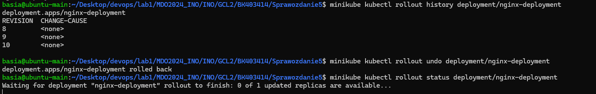

### Kontrola wdrożenia

Napisałam skrypt który sprawdza w ciągu 60 sekund, czy deploy  "nginx-deployment" zakończyło się pomyślnie. Aplikuje wdrożenie i używa polecenia "kubectl rollout status" z timeoutem. Jeśli wdrożenie zakończyło się pomyślnie, wypisuje komunikat "Wdrożenie zakończone pomyślnie". W przeciwnym razie wycofuje zmiany.

```bash
#!/bin/bash
DEPLOYMENT_NAME="nginx-deployment"
TIMEOUT=60

kubectl apply -f nginx-deployment.yaml

echo "Czekam $TIMEOUT sekund..."
sleep $TIMEOUT

status=$(minikube kubectl rollout status deployment "$DEPLOYMENT_NAME" 2>&1)

if [[ "$status" == *"successfully"* ]]; then
    echo "Wdrożenie zakończone pomyślnie."
    minikube kubectl rollout status deployment "$DEPLOYMENT_NAME"
    exit 0
else
    echo "Wdrożenie nie powiodło się."
    minikube kubectl rollout history deployment/"$DEPLOYMENT_NAME"
    exit 1
fi
```


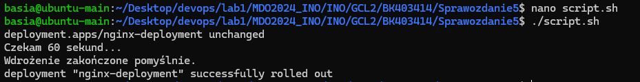


### Strategie wdrożenia

Różne wersje wdrożeń przygotowałam na podstawie przykładu na stronie kubernets załączonego do instrukcji

- Recreate
*Strategia wdrożenia "Recreate" polega na tym, że podczas aktualizacji wdrożenia, stare zasoby (np. kontenery) są usuwane, a nowe zasoby są tworzone od nowa. Czyli w trakcie aktualizacji wdrożenia wszystkie istniejące instancje aplikacji są zatrzymywane, a następnie tworzone są nowe instancje z najnowszą wersją kodu lub konfiguracji.*

Zmiana strategii: 
```bash
apiVersion: apps/v1
kind: Deployment
metadata:
  name: nginx-deployment-recreate
  labels:
    app:  nginxmy
spec:
  replicas: 4
  selector:
    matchLabels:
      app:  nginxmy
  strategy:
    type: Recreate
  template:
    metadata:
      labels:
        app:  nginxmy
    spec:
      containers:
      - name:  nginxmy
        image: barkowalska/nginxmy:1.0
        imagePullPolicy: IfNotPresent
        ports:
        - containerPort: 80
```

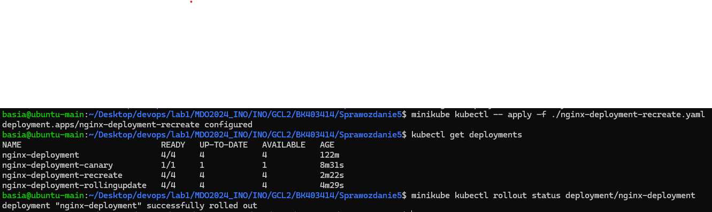


- Rolling Update (z parametrami `maxUnavailable` > 1, `maxSurge` > 20%)

*Strategia wdrażania "RollingUpdate" w Kubernetes umożliwia stopniowe aktualizowanie podów w Deployment, co minimalizuje przestoje aplikacji i zapewnia ciągłość działania. Przy zastosowaniu tej strategii, nowe wersje podów są uruchamiane stopniowo, a stare wersje są usuwane po weryfikacji poprawności działania nowych podów. Parametry podane w instrukcji kontrolują sposób, w jaki nowe pody są wdrażane oraz jak stare pody są usuwane*

```bash
apiVersion: apps/v1
kind: Deployment
metadata:
  name: nginx-deployment-rollingupdate
  labels:
    app:  nginxmy
spec:
  replicas: 4
  selector:
    matchLabels:
      app:  nginxmy
  strategy:
    type: RollingUpdate
    rollingUpdate:
      maxUnavailable: 2
      maxSurge: 22%
  template:
    metadata:
      labels:
        app:  nginxmy
    spec:
      containers:
      - name:  nginxmy
        image: barkowalska/nginxmy:1.0
        imagePullPolicy: IfNotPresent
        ports:
        - containerPort: 80
```


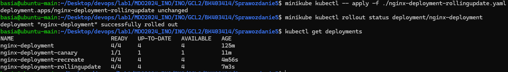


- Canary Deployment workload 

*Strategia wdrażania " Canary Deployment workload " w Kubernetes umożliwia wdrażanie nowej wersji aplikacji jednocześnie z istniejącą wersją, ale tylko dla części ruchu lub użytkowników. Dzięki temu można testować nową wersję w warunkach produkcyjnych przy minimalnym wpływie na użytkowników. Nowa wersja jest monitorowana pod kątem wydajności i stabilności, zanim zostanie wdrożona w pełni.* 

```bash
apiVersion: apps/v1
kind: Deployment
metadata:
  name: nginx-deployment-canary
  labels:
    app:  nginxmy
    version: canary
spec:
  replicas: 1
  selector:
    matchLabels:
      app:  nginxmy
      version: canary
  template:
    metadata:
      labels:
        app:  nginxmy
        version: canary
    spec:
      containers:
      - name:  nginxmy
        image: barkowalska/nginxmy:1.0
        imagePullPolicy: IfNotPresent
        ports:
        - containerPort: 80
```


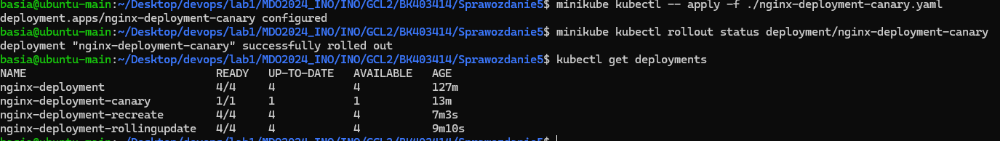


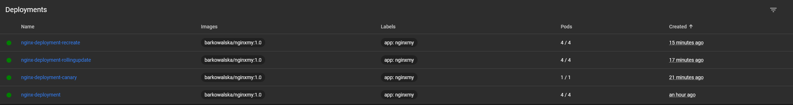

Główne różnice pomiędzy omówionymi strategiami: 

- Recreate: Wymienia wszystkie instancje aplikacji jednocześnie, co powoduje czasowy przestój aplikacji. Prosta w implementacji, ale aplikacja jest niedostępna podczas aktualizacji.

- Rolling Update: Stopniowo wymienia instancje aplikacji, co minimalizuje przestoje i utrzymuje ciągłą dostępność aplikacji. Może jednak powodować problemy synchronizacji danych.

- Canary Deployment: Wdraża nową wersję aplikacji tylko dla ograniczonej grupy użytkowników lub ruchu, pozwalając na testowanie nowej wersji bez wpływu na większość użytkowników. Umożliwia szybkie wykrywanie problemów i ich rozwiązanie przed pełnym wdrożeniem.
