# Sprawozdanie 1
Dagmara Pasek

### Cel ćwiczenia:
Celem wykonanego ćwiczenia było zapoznanie z systemem kontroli wersji, jakim jest Git oraz serwisem Github, tak aby sprawnie zarządzać projektami. Było to związane z zarządzaniem repozytorium kodu, obsługą kluczy ssh, klonowaniem repozytorium za pomocą protokołów: SSH i HTTPS oraz tworzeniem gałęzi i pracy na nich. Celem ćwiczenia wykonanego na drugich zajęciach było wprowadzenie do oprogramowania służącego do konteneryzacji, jakim jest Docker. Należało zainstalować Dockera, uruchomić różne kontenery, utworzyć własny plik Dockerfile oraz zapoznać się z podstawowymi operacjami. 

### Przebieg ćwiczenia 001:

1. Początkowo zainstalowałam maszynę wirtualną Ubuntu wykorzystując narzędzie Parallels. Skorzystałam z zainstalowanego już klienta Git. Sprawdziłam wersję wykorzystując polecenie:
```
   git --version
```

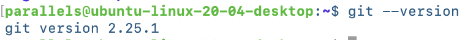


Obsługa kluczy SSH również była już zainstalowana, gdyż poniższe polecenie było rozpoznawane.
```
ssh
```
 

2. Kolejno sklonowałam repozytorium przedmiotowe za pomocą protokołu HTTPS. Utworzyłam osobny katalog, a w nim użyłam polecenia:
 ```
git clone
``` 


Zastosowałam również personal acces token do sklonowania repozytorium w inny sposób. Na Githubie weszłam w ustawienia profilu, Developer Settings i kolejno w okno Personal acces tokens, gdzie wygenerowałam nowy token o nazwie "Token1". Ponownie sklonowałam repozytorium. 


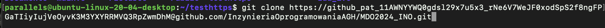

Klonowanie za pomocą HTTPS jest prostszym sposobem, jednak przy każdym pobieraniu kodu należy podawać hasło. Personal access token jest używany do uwierzytelnienia zamiast hasła, co wydaje się bezpieczniejsze. 


3. Jako trzeci krok, utworzyłam katalog, w którym sklonowałam repozytorium przy użyciu protokołu SSH. Za pomocą polecenia:
   
 ```
 ssh-keygen
 ```
   wygenerowałam nowy klucz. Za pomocą polecenia:
```
cat ./.ssh/id_rsa.pub
```
skopiowałam klucz publiczny i dodałam go do mojego konta na platformie Github, wchodząc w ustawienia. 

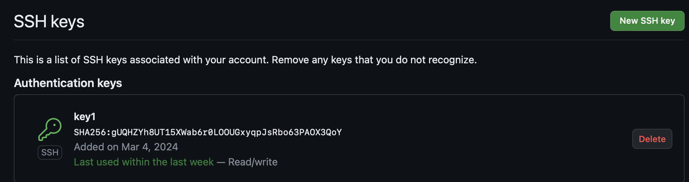

Plik "id_rsa.pub" zawierał klucz publiczny SSH. Pozwalało to na modyfikację repozytorium bez uwierzytelniania hasłem. Następnie sklonowałam repozytorium przedmiotu z wykorzystaniem protokołu SSH. 

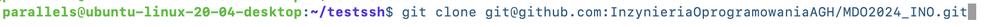


4. Przełączyłam się na gałąź main oraz gałąź grupy - GCL2. Wywołałam polecenie:
```
git branch
```
Wyświetlona została lista gałęzi w repozytorium. Gwiazdką oznaczona była aktywna gałąź. 

Polecenie:
```
git checkout -b
```
powodowało utworzenie nowej gałęzi i jednoczesne przełączanie się na nią. 


5. Stosując powyższe polecenie utworzyłam gałąź: DP411875_1 stanowiącą inicjały oraz numer indeksu i przełączyłam się na nią. 

Wyglądało to następująco:

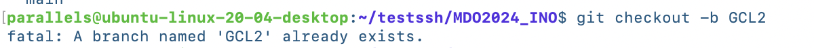

6. Rozpoczęłam pracę na nowej gałęzi. W katalogu grupy GCL2 utworzyłam katalog z inicjałami i numerem indeksu oraz "Sprawozdanie1". Napisałam git hooke'a, czyli skrypt weryfikujący, że każdy "commit message" zaczynał się od inicjałów i numeru indeksu. Utworzyłam go w moim katalogu, a następnie przekopiowałam do katalogu .git/hooks. Bazowałam się na przykładach zawartych w folderze .git i podfolderze hooks.
Treść githooke'a wyglądała następująco:

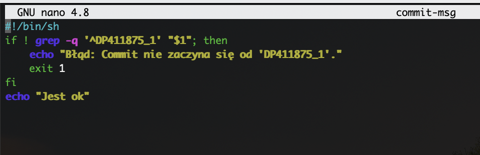

Przy każdym commicie pojawiał się komunikat, w zależności, czy dany commit zaczynał się od: "DP411875_1". Jeśli tak, wyświetlał się komunikat: "Jest ok". W przeciwnym razie: "Błąd: Commit nie zaczyna się od 'DP411875_1'."
Dokonałam sprawdzenia poprawności tego działania.

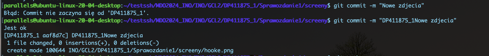

W katalogu dodałam plik ze sprawozdaniem oraz dodałam zrzuty ekranu jako inline. Aby to zrobić utworzyłam osobny katalog o nazwie "screeny", do którego kopiowałam zrzuty ekranu za pomocą polecenia:
```
scp ~/Desktop/spr.png parallels@192.168.0.96:~/testssh/MDO2024_INO/INO/GCL2/DP411875_1/Sprawozdanie1/screeny
```
Użyłam poniższej składni:
```

```

Aby wysłać zmiany do zdalnego źródła użyłam polecenia:
```
git add .
```
W ten sposób przeniosłam zmiany z katalogu roboczego do przechowalni. 

Kolejno użyłam:
```
git commit -m "Opis wprowadzonych zmian"
```
Następnie, aby pobrać zmiany ze zdalnego źródła zastosowałam polecenie:
```
git pull origin DP411875_1
```
Finalnie, aby przesłać zmiany na zdalne źródło zastosowałam:
```
git push
```
Wyglądało to następująco:

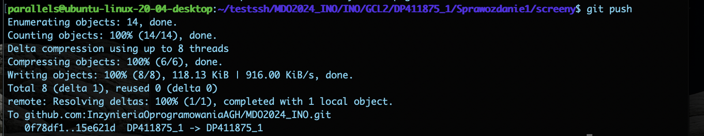

Finalnie należało wciągnąć swoją gałąź do gałęzi grupowej. Zrobiłam to podczas zajęć. Użyłam do tego polecenia:

```
git checkout GCL2
```
oraz

```
git push
```

# Część druga sprawozdania

### Przebieg ćwiczenia 002:

1. Zainstalowałam Dockera w systemie linuksowym stosując polecenie:
   ```
   sudo zypper install docker
   ```
   Użyłam do tego menadżera pakietów "zypper".

   Kolejno, aby móc zainstalować Dockera na Ubuntu zastosowałam komendę:
   ```
   sudo apt install docker.io
   ```

   Włączyłam Dockera jako usługę systemową stosując:
   ```
   sudo systemctl enable docker
   ```

   Aby sprawdzić bieżący status wykonywałam polecenie:
   ```
   sudo systemctl status docker
   ```

   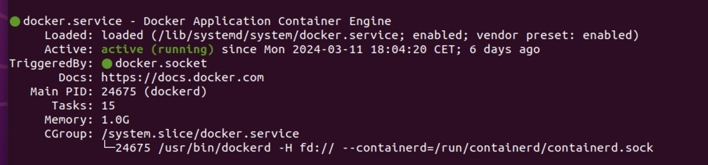
   

2. Zarejestrowałam się w Docker Hub, czyli w rejestrze zawierającym katalogi obrazów kontenerów.
3. Pobrałam kolejno obrazy: hello-world, busybox, ubuntu lub fedora, mysql.
   Zastosowałam do tego polecenie:
   ```
   sudo docker pull hello-world
   ```
   Analogicznie zmieniałam nazwy obrazów przy pobieraniu.

   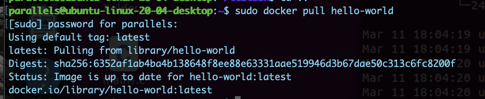

5. Uruchomiłam kontener z obrazu busybox stosując polecenie:
   ```
   sudo docker run busybox
   ```
   Nic się jednak nie pojawiło, ponieważ należało uruchomić ten kontener interaktywnie przy użyciu opcji -i.
   Opcja ta pozwalała na interakcję z terminalem oraz na wykonywanie poleceń i przekazywanie danych do i z kontenera.

   Podłączyłam się do kontenera interaktywnie i wywołałam numer wersji. Wywołałam:
   ```
   uname -a
   ```
   Pozwoliło to na wyświetlenie danych o systemie operacyjnym, w tym numeru wersji.

   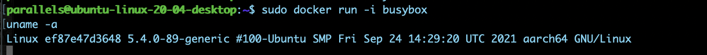
   
6. Uruchomiłam system w kontenerze - kontener z obrazu ubuntu. Zrobiłam to również interaktywnie stosując opcję -it. Dodanie 't'           powodowało, że kontener miał swój własny terminal, co było przydatne do obsługi wejścia i wyjścia wewnątrz kontenerów.

    Wewnątrz kontenera wywołałam polecenie:
   ```
   ps
   ```
   
   Wyświetlała ona informacje o procesach w systemie.

   Wywołałam również polecenie:
   ```
   top
   ```
   W porównaniu do 'ps' było to narzędzie do interaktywmego monitorowania procesów. Wyświetlone zostało również obciążenie CPU, zużycie    pamięci, czas działania systemu itd.


   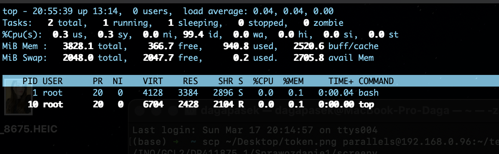

   Zaktualizowałam pakiety, przy użyciu:
   ```
   apt update
   ```

   Aby wyjść z kontenera użyłam:
   ```
   exit
   ```

   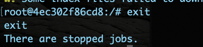

   Ctrl + D również zadziałało do wyjścia z kontenera.
   

7. Następnie utworzyłam własny plik Dockerfile, który został umieszczony w katalogu Sprawozdanie1.
   Treść: 
   Pierwsza linijka: FROM ubuntu:latest - określa obraz, który był użyty do utworzenia nowego obrazu. Jest to najnowsza wersja Ubuntu.
   Kolejno linijka: WORKDIR /repozytorium - powoduje, że wszystkie kolejne instrukcje będą wykonywane w katalogu 'repozytorium'.
   RUN apt-get update && apt-get install -y git - aktualizuje listy pakietów oraz instaluje gita.
   RUN git clone https://github.com/InzynieriaOprogramowaniaAGH/MDO2024_INO.git - wykonuje  klonowanie repozytorium Git.
   ENTRYPOINT ["/bin/bash"] -  po uruchomieniu kontenera otworzony zostaje terminal Bash.

   Dokonałam budowania:
   
   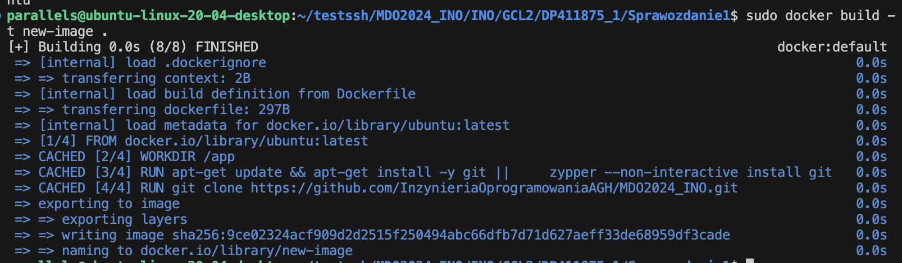

   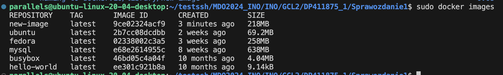
   
   Kolejno uruchomiłam w trybie interaktywnym i potwierdziłam obecność repozytorium.

   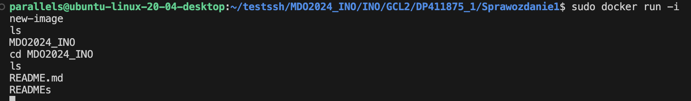
   
8. Pokazałam uruchomione, niedziałające kontenery. Użyłam do tego polecenia:
   ```
    sudo docker ps -a -f status=exited
   ```
   Opcja -f status=exited pozwalała na ograniczenie wyników do kontenerów które miały status exited - niedziałających.

   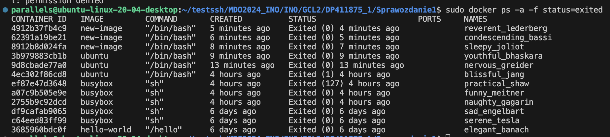

   Wyczyściłam niedziałające kontenery.
   ```
   sudo docker container rm -f $(sudo docker ps -a -q -f status=exited)
   ```
   Polecenie rm powodowało usunięcie kontenerów, a opcje: -f - wymuszenie usunięcia, -q - zwrócenie tylko identyfikatorów, -a -            wypisanie wszystkich.

    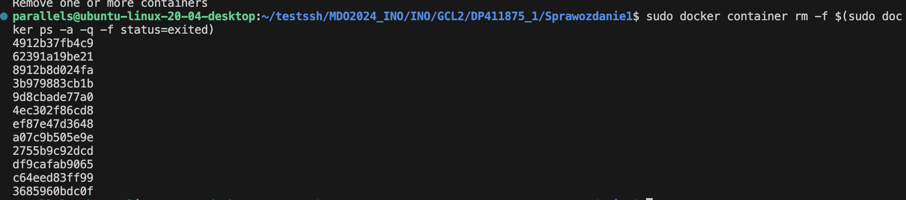

9. Usunięcie obrazów było analogiczne, jednak zamiast używać polecenia "rm" użyłam "rmi".

   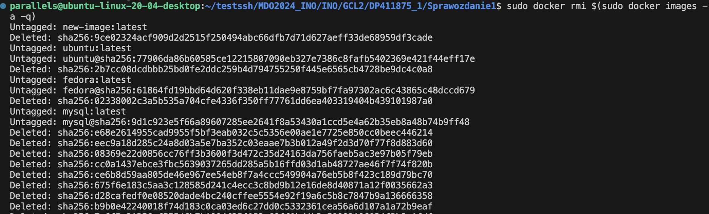
   

   
