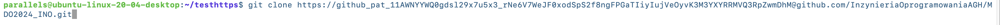

# Sprawozdanie 1
Dagmara Pasek

### Cel ćwiczenia:
Celem wykonanego ćwiczenia było zapoznanie z systemem kontroli wersji, jakim jest Git oraz serwisem Github, tak aby sprawnie zarządzać projektami. Było to związane z zarządzaniem repozytorium kodu, obsługą kluczy ssh, klonowaniem repozytorium za pomocą protokołów: SSH i HTTPS oraz tworzeniem gałęzi i pracy na nich. 

### Przebieg ćwiczenia:

1. Początkowo zainstalowałam maszynę wirtualną Ubuntu wykorzystując narzędzie Parallels. Skorzystałam z zainstalowanego już klienta Git. Sprawdziłam wersję wykorzystując polecenie:
```
   git --version
```


Obsługa kluczy SSH również była już zainstalowana, gdyż poniższe polecenie było rozpoznawane.
```
ssh
```
 

2. Kolejno sklonowałam repozytorium przedmiotowe za pomocą protokołu HTTPS. Utworzyłam osobny katalog, a w nim użyłam polecenia:
 ```
git clone
``` 


Zastosowałam również personal acces token do sklonowania repozytorium w inny sposób. Na Githubie weszłam w ustawienia profilu, Developer Settings i kolejno w okno Personal acces tokens, gdzie wygenerowałam nowy token o nazwie "Token1". Ponownie sklonowałam repozytorium. 


Klonowanie za pomocą HTTPS jest prostszym sposobem, jednak przy każdym pobieraniu kodu należy podawać hasło. Personal access token jest używany do uwierzytelnienia zamiast hasła, co wydaje się bezpieczniejsze. 


3. Jako trzeci krok, utworzyłam katalog, w którym sklonowałam repozytorium przy użyciu protokołu SSH. Za pomocą polecenia:
   
 ```
 ssh-keygen
 ```
   wygenerowałam nowy klucz. Za pomocą polecenia:
```
cat ./.ssh/id_rsa.pub
```
skopiowałam klucz publiczny i dodałam go do mojego konta na platformie Github, wchodząc w ustawienia. Plik "id_rsa.pub" zawierał klucz publiczny SSH. Pozwalało to na modyfikację repozytorium bez uwierzytelniania hasłem. Następnie sklonowałam repozytorium przedmiotu z wykorzystaniem protokołu SSH. 


4. Przełączyłam się na gałąź main oraz gałąź grupy - GCL2. Wywołałam polecenie:
```
git branch
```
Wyświetlona została lista gałęzi w repozytorium. Gwiazdką oznaczona była aktywna gałąź. 

Polecenie:
```
git checkout -b
```
powodowało utworzenie nowej gałęzi i jednoczesne przełączanie się na nią. 



5. Stosując powyższe polecenie utworzyłam gałąź: DP411875_1 stanowiącą inicjały oraz numer indeksu i przełączyłam się na nią. 


Wyglądało to następująco:


6. Rozpoczęłam pracę na nowej gałęzi. W katalogu grupy GCL2 utworzyłam katalog z inicjałami i numerem indeksu oraz "Sprawozdanie1". 


