# Sprawozdanie 2
Dagmara Pasek
411875

### Cel ćwiczenia:
Celem wykonanego ćwiczenia było zapoznanie z procesem budowania, testowania i wdrażania dowolnego oprogramowania. Użyto do tego narzędzia, jakim jest Docker. Należało wybrać odpowiednie oprogramowanie oraz przeprowadzić build w kontenerze. W kolejnym ćwiczeniu należało utworzyć woluminy, podłączyć je do kontenera bazowego. Celem było zapoznanie się z działaniami na kontenerach w Dockerze oraz z narzędziem iperf3, które służy do pomiaru przepustowości sieciowej. Finalnie dokonano instalacji Jenkinsa.

### Przebieg ćwiczenia 003:

#### Wybór oprogramowania na zajęcia:
1. Początkowo znalazłam repozytorium, które było szablonem dla projektów opartych na Node.js i TypeScript. Wybrałam je dlatego, że dysponowało otwartą licencją - MIT, która pozwalała na korzystanie z oprogramowania w dowolnym celu. Można zatem kopiować i modyfikować oprogramowanie.


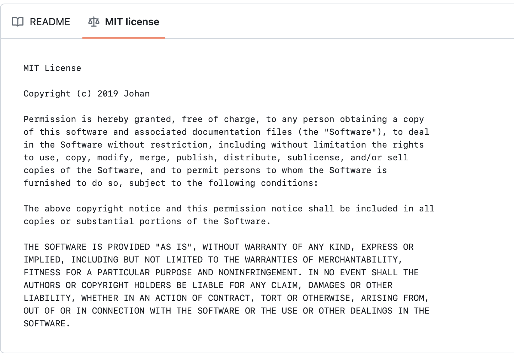


Do budowania natomiast używane było narzędzie npm, czyli Node Package Manager, który stanowi menadżer pakietów dla Node.js.

Oprogramowanie zawierało również osobny katalog z testami. 


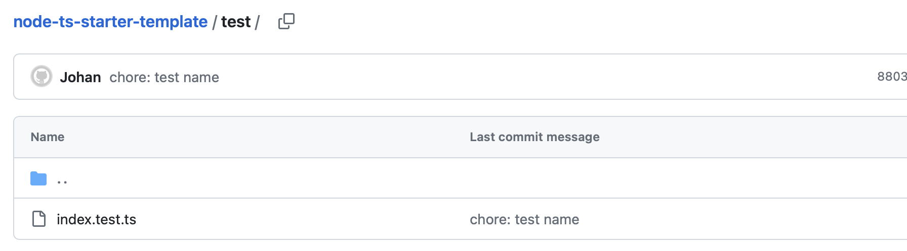


2. Kolejno sklonowałam repozytorium wykorzystując protokół HTTPS. Użyłam do tego polecenia:

```
git clone https://github.com/jaspenlind/node-ts-starter-template.git
```

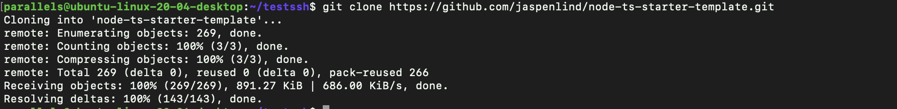


Doinstalowałam również wymagane zależności - menedżer pakietów dla środowiska uruchomieniowego JavaScript. Użyłam do tego polecenia:

```
npm install
```

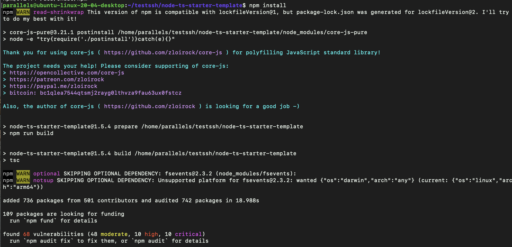


Użyłam polecenia:

```
npm run-script build
```
aby dokonać budowania. Wykonany był skrypt o nazwie "build", który był zdefiniowany w pliku package.json


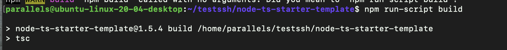

3. Finalnie uruchomiłam testy jednostkowe. 
Do ich wykonania użyłam polecenia:

```
npm test
```


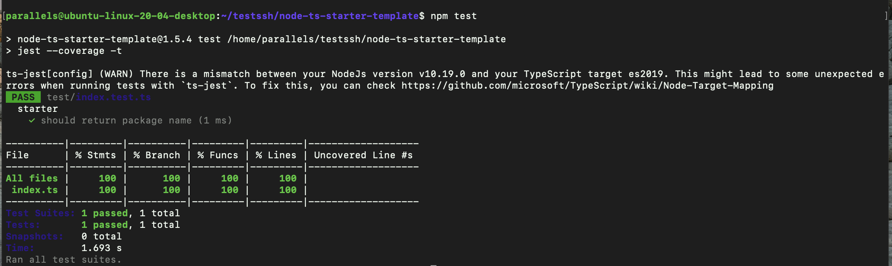


#### Przeprowadzenie buildu w kontenerze
4. Wykonałam kroki build i test wewnątrz wybranego przeze mnie kontenera bazowego, jakim był node. 
Uruchomiłam kontener interaktywnie, przez co automatycznie podłączyłam się do kontenera z TTY - terminalem. Umożliwiało to interaktywną pracę wewnątrz kontenera z powłoką Bash. Użyłam do tego polecenia:

```
sudo docker run -it node /bin/bash
```
Sklonowałam wewnątrz repozytorium. 

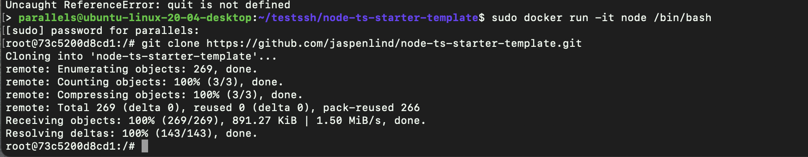

Weszłam do odpowiedniego katalogu i uruchomiłam build po zainstalowaniu zależności, a następnie uruchomiłam test. Używałam tych samych poleceń co poza kontenerem.

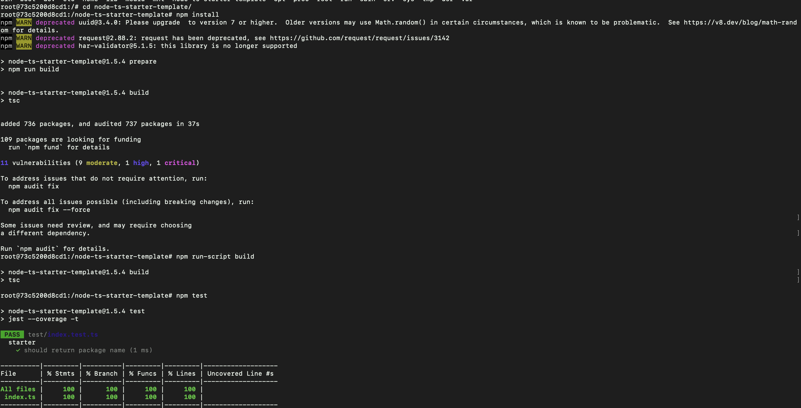


5. W katalogu 'Sprawozdanie2' utworzyłam dwa pliki Dockerfile automatyzujące kroki powyżej.
Kontener pierwszy przeprowadzał wszystkie kroki aż do builda. W plikach Dockerfile nie umieszczałam poleceń ENTRYPOINT lub CMD, tak aby po poprawnym przejściu testów lub buildu kontener zakończył się.

Utworzyłam plik 'Dockerfile_b', który zawierał używane wcześniej polecenia aż do buildu. Był on tzw. przepisem na obraz kontenera. Wyglądał następująco:

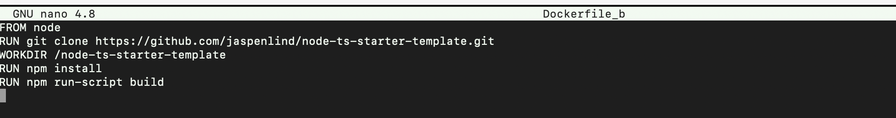

Dokonałam budowania przy użyciu polecenia:
```
sudo docker build -t build_file -f Dockerfile_b .
```

Build budował plik będący przepisem na obraz kontenera. 
Opcja -t pozwalała na utworzenie nowego obrazu o nazwie: 'build_file', a opcja -f pozwalała określić ścieżkę do pliku Dockerfile, który był użyty do budowy obrazu. 


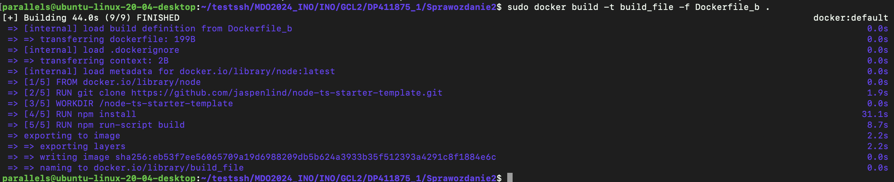

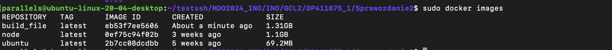
   

Kontener drugi bazował na pierwszym i wykonywał testy.

Utworzyłam drugi plik 'Dockerfile_t', który używał poleceń:


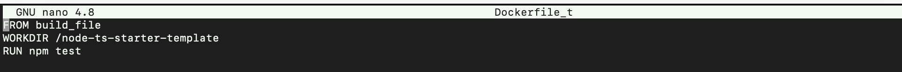

Ponownie dokonałam budowania:


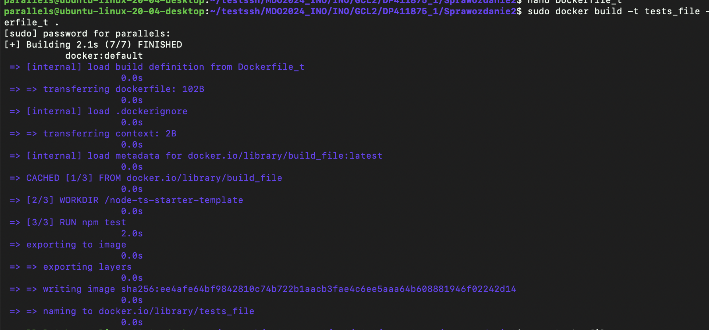

Utworzony został nowy obraz o nazwie: 'test_file'.

6. Kontener wdrażał się i pracował poprawnie. Gdy spróbowałam uruchomić kontener z powstałych obrazów nic się nie działo. Zbudowany program znajdował się w środku obrazów. Nie uruchamiane były żadne testy. Kontener wykonywał operacje jedynie na etapie budowania, a nie na etapie uruchamiana. 
 

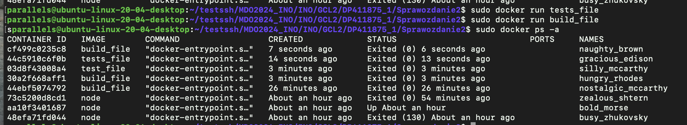


### Przebieg ćwiczenia 004:

#### Zachowywanie stanu:
1. Przygotowałam woluminy wejściowy i wyjściowy, o nazwach: vin, vout i podłączyłam je do kontenera bazowego, z którego rozpoczynano poprzednio pracę.

Do utworzenia woluminów użyłam polecenia:
```
sudo docker volume create
```


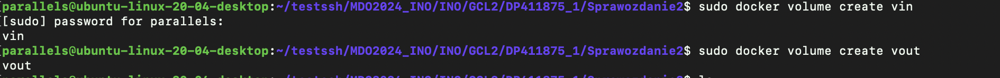

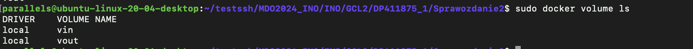

Podłączyłam utworzone woluminy do kontenera bazowego z którego rozpoczynałam pracę, czyli node. 

```
sudo docker run -it  --rm  --name mynode01 --mount source=vin,target=/in --mount source=vout,target=/out node bash
```
Opcja -it powodowała interaktywne uruchomienie kontenera z terminalem, -rm powodowała, że po zakończeniu działania kontener zostanie usunięty. Parametr mount powodował montowanie woluminów do odpowiednich ścieżek w kontenerze. Finalnie uruchomiona została konsola bash.

2. Uruchomiłam kontener, nie było potrzeby instalowania wymagań wstępnych, nie używałam również git'a.
3. Następnie przeszłam do klonowania repozytorium na wolumin wejściowy. Aby to zrobić początkowo uzyskałam informacje o lokalizacji woluminu wejściowego na hoście stosując polecenie:

```
sudo docker volume inspect vin
```
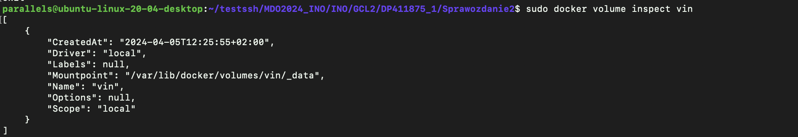

Kolejno używając:
```
sudo su
```
przełączyłam się na konto root'a, tak aby zmienić katalog do lokalizacji woluminu. 

Przeszłam do katalogu, a w nim dokonałam klonowania repozytorium, używanego w poprzednim ćwiczeniu.
```
git clone https://github.com/jaspenlind/node-ts-starter-template.git
```

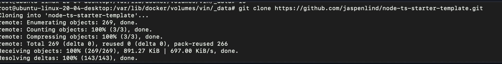

4. Uruchomiłam build w kontenerze. Tak jak w poprzednim ćwiczeniu zastosowałam polecenia:
   
```
npm install
```

oraz 

```
npm run-script build
```

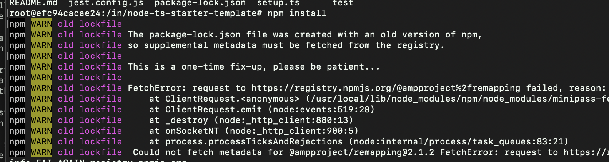

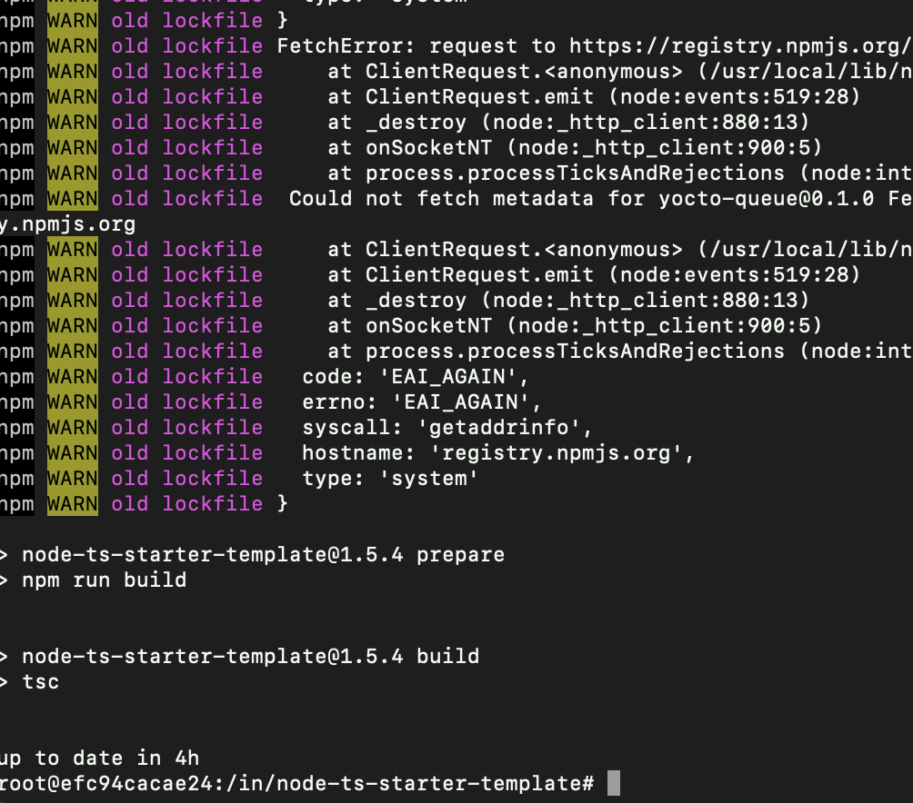

5. Zapisałam powstałe pliki na woluminie wyjściowym poprzez ich skopiowanie.

   ```
   cp -r node_modules ../../out
   ```

 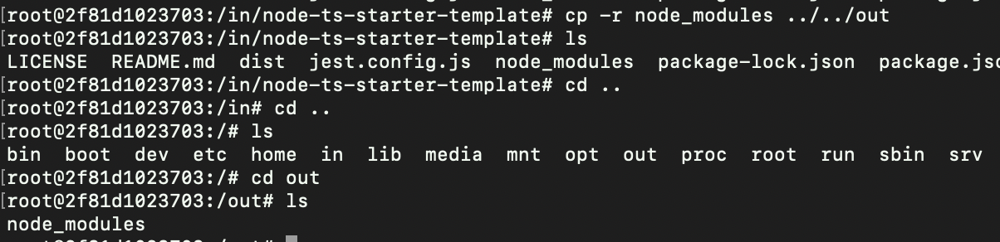 

6. Ponowiłam operację, ale klonowanie na wolumin wejściowy przeprowadziłam wewnątrz kontenera, ale w nowym folderze o nazwie: "new". Użyłam tej samej komendy do klonowania co wcześniej.

```
git clone https://github.com/jaspenlind/node-ts-starter-template.git /in/new
```

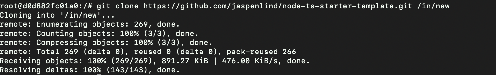

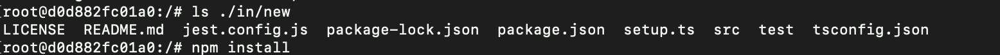


Wykonanie powyższych instrukcji w pliku Dockerfile było możliwe. Używająć ```history``` wyświetliły się wcześniej używane polecenia. Należało użyć 'RUN --mount'do zamontowania woluminów do kontenera podczas budowowania.
Dockerfile wyglądał następująco:
```
FROM node:latest

RUN mkdir in
RUN mkdir out

RUN --mount=type=bind,source=vin,target=/in
RUN --mount=type=bind,source=vout,target=/out
WORKDIR /in
RUN git clone https://github.com/jaspenlind/node-ts-starter-template.git
WORKDIR /in/node-ts-starter-template
RUN npm install
RUN npm run-script build
RUN cp -r node_modules ../../out
```


#### Eksponowanie portu:
Iperf3 jest narzędziem do pomiaru przepustowości sieciowej między dwoma punktami w sieci. Jest często stosowany w celu diagnozowania i testowania wydajności sieci. 
7. Uruchomiłam wewnątrz kontenera z obrazu ubuntu serwer iperf3. Aby to zrobić najpierw zaktualizowałam listy pakietów dostępnych do pobrania z repozytoriów źródłowych oraz zainstalowałam narzędzie iperf3.

```
apt update
apt install iperf3
```

Następnie uruchomiłam serwer iperf3 w następujący sposób:
```
iperf3 -s
```

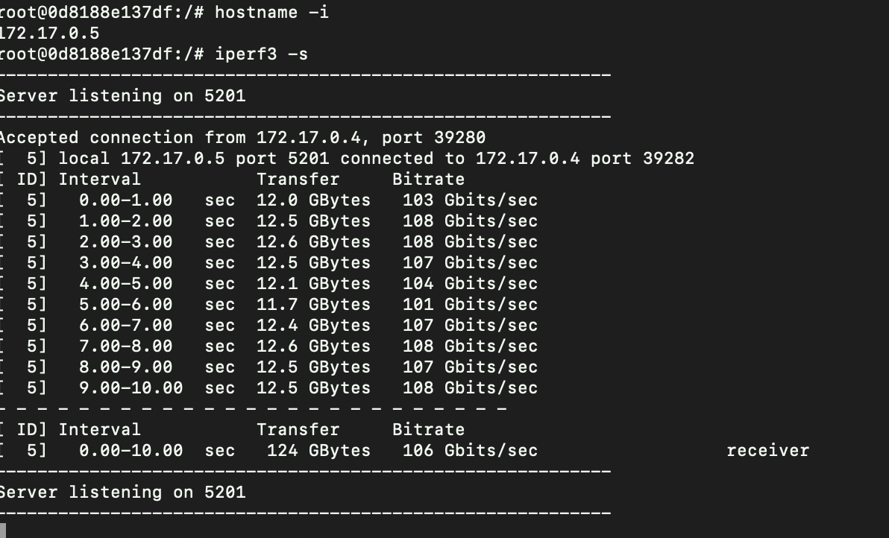

Aby znaleźć adres IP serwera użyłam:
```
hostname -i
```

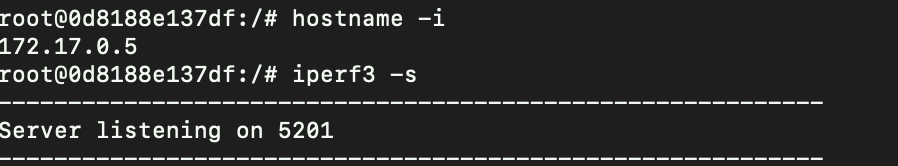

Kolejno w osobnym terminalu uruchomiłam drugi kontener z obrazu ubuntu, jako klient, a w nim zastosowałam polecenie:
```
iperf3 -c 172.17.0.5
```

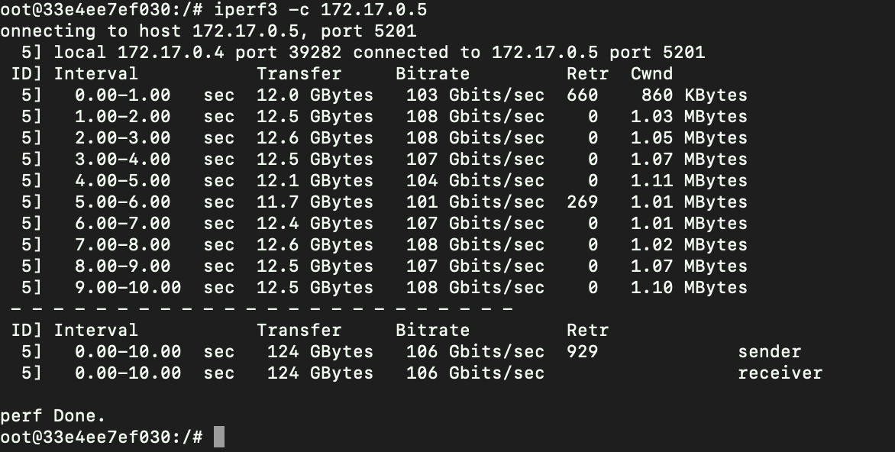


9. Utworzyłam własną sieć mostkową o nazwie: my_net. Jest to sieć wewnętrzna, która działa na poziomie kontenera i umożliwia komunikację między różnymi kontenerami oraz z hostem.

```
sudo docker network create my_net
```

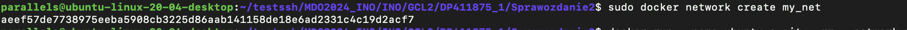


Kontener z serwerem uruchomiłam w tle stosując parametr -d, a kontener z klientem uruchomiłam z użyciem powłoki Bash. 
Przyłączyłam oba kontenery do utworzonej wcześniej sieci.

```
sudo docker run -d --name my_server -it --rm --network=my_net ubuntu bash
sudo docker run --name my_client -it --rm --network=my_net ubuntu bash
```

Sprawdziłam poprawność przyłączenia kontenerów do sieci używając:
```
sudo docker network inspect my_net
```


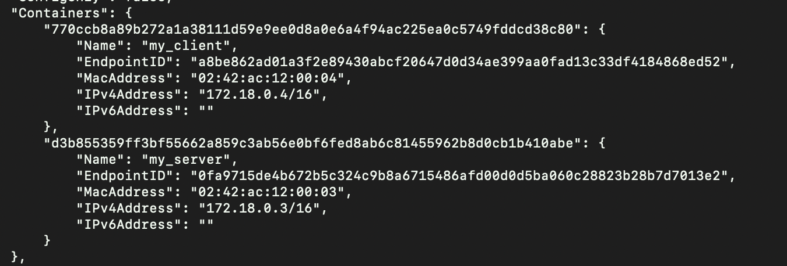

Uruchomiłam serwer na kontenerze stosując:

```
iperf3 -s
```

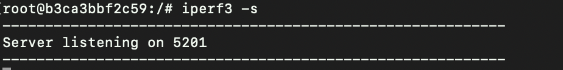


Na drugim kontenerze(z klientem) połączyłam klienta i serwera używając polecenia:

```
iperf3 -c serv
```
gdzie serv to nazwa kontenera. Nie używałam adresu IP serwera.


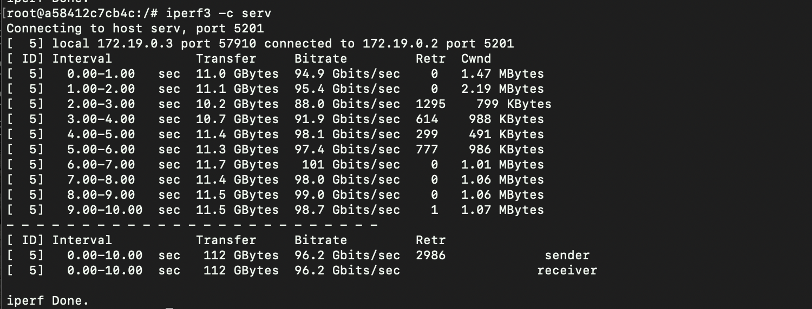


10. Połączyłam się również z hosta, czyli z maszyny wirtualnej do utworzonego wcześniej serwera. 


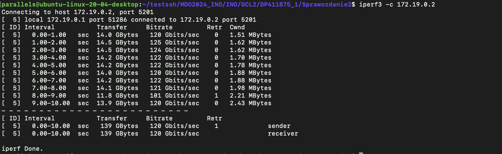


Próbowałam również połączyć się spoza hosta. Pobrałam na Mac'a iperf3, jednak nie udawało mi się połaczyć.


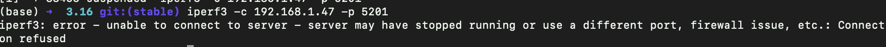


11. Przepustowość komunikacji:
    -połączenie przez sieć Dockera: 106 Gbits/sec
    -połączenie przez własną sieć mostkową: 96.2 Gbits/sec
    -połączenie z hosta - wirtualnej maszyny z serwerem: 120 Gbits/sec
    W przypadku łączenia się z hostem, przepustowość była największa. 
    Nie udało mi się połączyć do kontenera spoza hosta.


#### Instancja Jenkinsa:

12. Zapoznałam się z dokumentacją. Utworzyłam nową sieć o nazwie jenkins.

    ```
    sudo docker network create jenkins
    ```

    Uruchomiłam kontener z DIND:
```
    docker run --name jenkins-docker --rm --detach \
  --privileged --network jenkins --network-alias docker \
  --env DOCKER_TLS_CERTDIR=/certs \
  --volume jenkins-docker-certs:/certs/client \
  --volume jenkins-data:/var/jenkins_home \
  --publish 2376:2376 \
  docker:dind --storage-driver overlay2
  ```

Utworzyłam nowy plik Dockerfile, a w nim zawierały się narzędzia pozwalające na dostosowywanie obrazu.

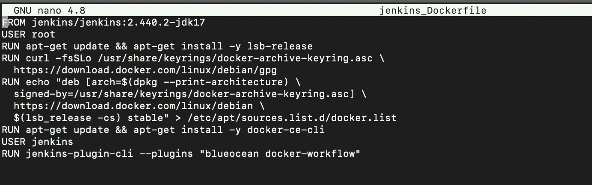

Dokonałam budowania, używając:
```
 sudo docker build -t myjenkins-blueocean:2.440.2-1 -f jenkins_Dockerfile .
```

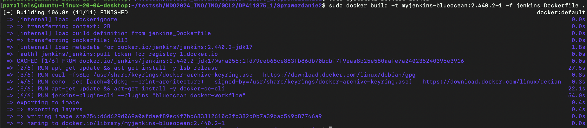

Uruchomiłam kontener jenkins na podstawie obrazu stosując:
```
docker run \
  --name jenkins-blueocean \
  --restart=on-failure \
  --detach \
  --network jenkins \
  --env DOCKER_HOST=tcp://docker:2376 \
  --env DOCKER_CERT_PATH=/certs/client \
  --env DOCKER_TLS_VERIFY=1 \
  --publish 8080:8080 \
  --publish 50000:50000 \
  --volume jenkins-data:/var/jenkins_home \
  --volume jenkins-docker-certs:/certs/client:ro \
  myjenkins-blueocean:2.440.2-1
```

Po wpisaniu w przeglądarkę:
```
http://localhost:8080
```
wyświetlało się okno z ekranem logowania. 

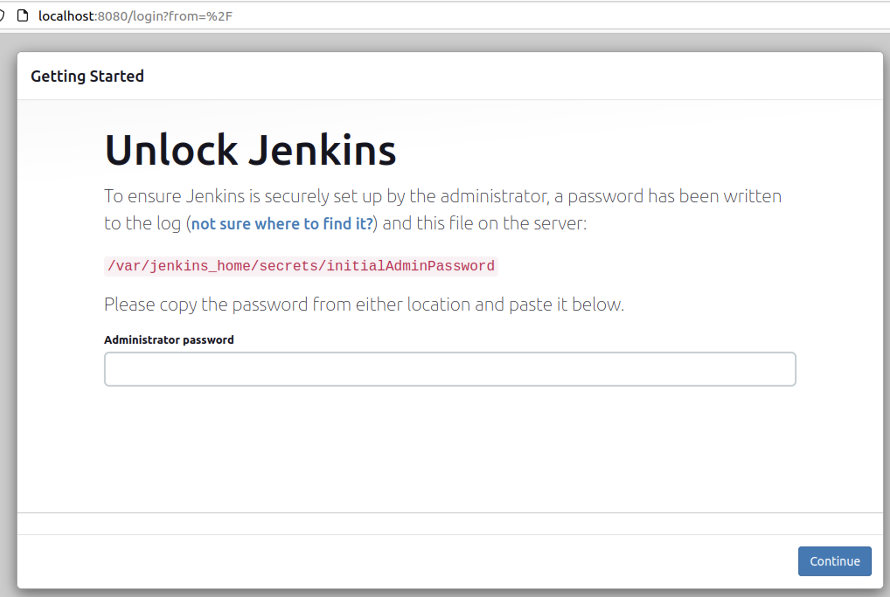


    
   
