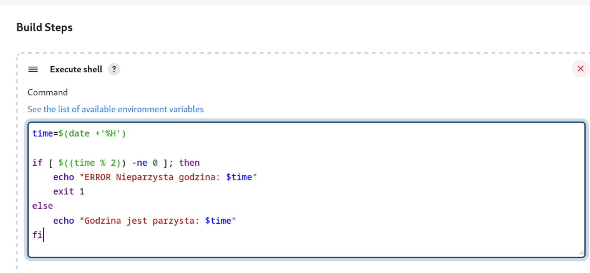
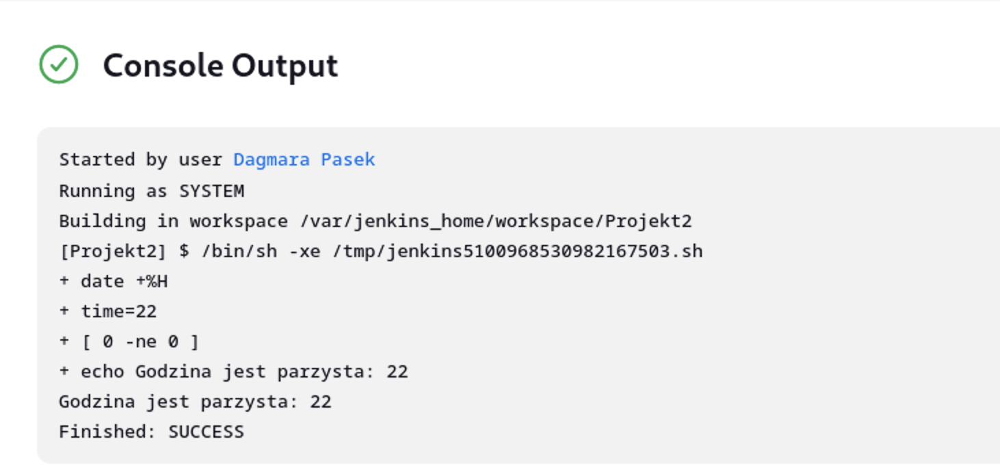
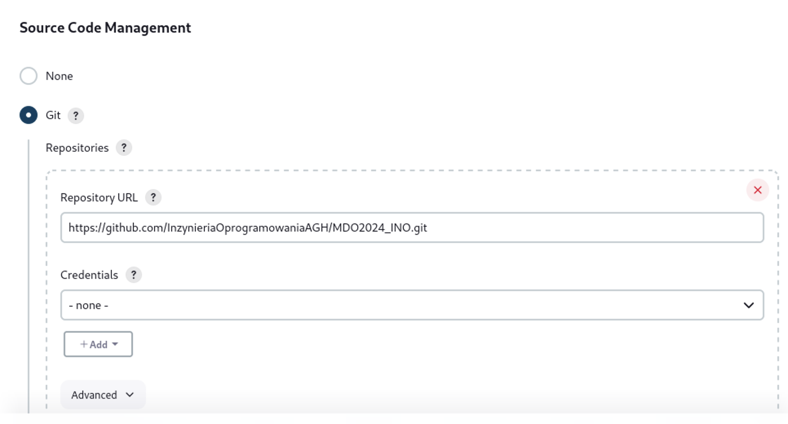
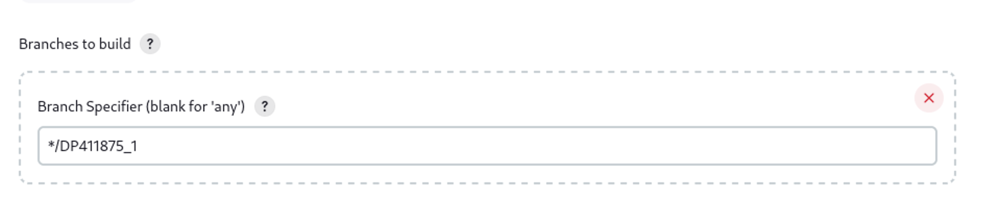
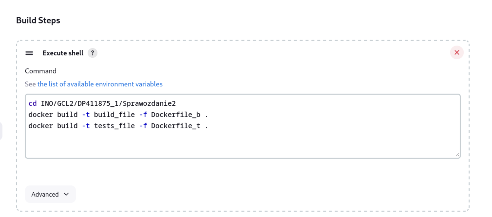
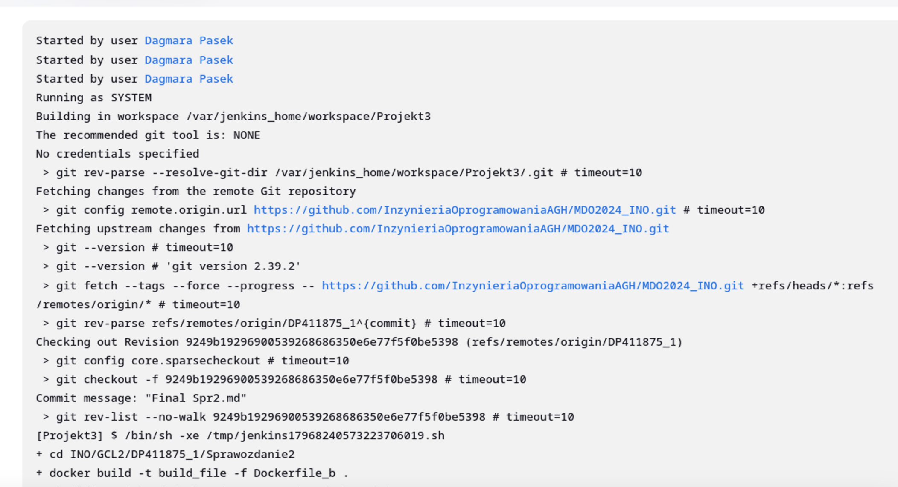
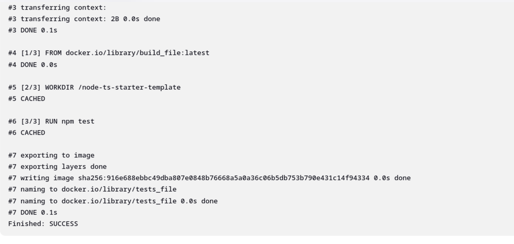

# Sprawozdanie 3
Dagmara Pasek
411875

### Cel ćwiczenia:
Celem tego ćwiczenia było zapoznanie się z CI - Continuous Integration oraz jego implementacją przy użyciu narzędzia Jenkins wraz z izolacją poszczególnych etapów w kontenerach Docker. Ćwiczenie miało na celu również zrozumienie roli pipeline'a w Jenkinsie jako narzędzia do automatyzacji procesów CI oraz zdobycie praktycznych umiejętności w konfigurowaniu i uruchamianiu pipeline'ów w Jenkinsie.

### Przebieg ćwiczenia 005:
#### Przygotowanie:
Upewniłam się, że działały konetery budujące i testujące utworzone na poprzednich zajęciach. Dokonałam instalacji Jenkins'a. Pliki Dockerfile wdrażające instancję Jenkinsa załączone są w katalogu Sprawozdanie2. 

 Opis wykonanej instalacji podczas poprzedniego ćwiczenia:
 
 Zapoznałam się z dokumentacją. Utworzyłam nową sieć o nazwie jenkins.

    ```
    sudo docker network create jenkins
    ```

    Uruchomiłam kontener z DIND:
```
    docker run --name jenkins-docker --rm --detach \
  --privileged --network jenkins --network-alias docker \
  --env DOCKER_TLS_CERTDIR=/certs \
  --volume jenkins-docker-certs:/certs/client \
  --volume jenkins-data:/var/jenkins_home \
  --publish 2376:2376 \
  docker:dind --storage-driver overlay2
  ```

Utworzyłam nowy plik Dockerfile, a w nim zawierały się narzędzia pozwalające na dostosowywanie obrazu.


Dokonałam budowania, używając:
```
 sudo docker build -t myjenkins-blueocean:2.440.2-1 -f jenkins_Dockerfile .
```


Uruchomiłam kontener jenkins na podstawie obrazu stosując:
```
docker run \
  --name jenkins-blueocean \
  --restart=on-failure \
  --detach \
  --network jenkins \
  --env DOCKER_HOST=tcp://docker:2376 \
  --env DOCKER_CERT_PATH=/certs/client \
  --env DOCKER_TLS_VERIFY=1 \
  --publish 8080:8080 \
  --publish 50000:50000 \
  --volume jenkins-data:/var/jenkins_home \
  --volume jenkins-docker-certs:/certs/client:ro \
  myjenkins-blueocean:2.440.2-1
```
Obraz Blue Ocean jest modyfikacją obrazu Jenkinsa, która zawiera interfejs użytkownika Blue Ocean oraz dodatkowe wtyczki i narzędzia umożliwiające bardziej zaawansowane i interaktywne procesy CI/CD. 

Po wpisaniu w przeglądarkę:
```
http://localhost:8080
```
wyświetlało się okno z ekranem logowania. 


Zalogowałam się i skonfigurowałam Jenkins'a.

#### Uruchomienie:
Utworzyłam pierwszy projekt, który wyświetlał uname. W sekcji budowania wybrałam opcję "powłoka" i napisałam poniższe polecenie:

```
uname -a
```


Po uruchomieniu logi wyglądały tak:


Kolejno utworzyłam drugi projekt, który zwracał błąd, gdy godzina była nieparzysta. Ponownie w sekcji budowania wybrałam opcję "powłoka" i wpisałam:



Skrypt ten pobierał aktualną godzinę w formacie 24-godzinnym i zapisywał ją do zmiennej "time". Następnie sprawdzał, czy godzina była parzysta czy nieparzysta, dzieląc ją przez 2 i sprawdzając resztę z dzielenia. Jeśli reszta z dzielenia była różna od zera (czyli godzina była nieparzysta), wyświetlał komunikat "ERROR Nieparzysta godzina: [aktualna godzina]" i kończył działanie skryptu z kodem błędu 1. Gdy godzina była parzysta, wyświetlał komunikat "Godzina jest parzysta: [aktualna godzina]".

Logi konsoli wyglądały następująco:




 Następnie utworzyłam trzeci projekt, w którym dokonałam klonowania repozytorium przedmiotowego. W sekcji z repozytorium kodu wkleiłam adres do repozytorium.

 

Przeszłam na moją gałąź:



i zbudowałam obrazy z wcześniej utworzonych Dockerfile dotyczących buildu i testu.



Logi konsoli wyglądały następująco:




### Wstęp:
#### Wymagania wstępne środowiska:
1. Repozytorium kodu źródłowego: Repozytorium to będzie źródłem kodu, który będzie budowany, testowany i publikowany. Korzystałam z repozytorium z poprzednich zajęć:
```
https://github.com/jaspenlind/node-ts-starter-template.git
```
2. Serwer Jenkins: Jenkins będzie używany do automatyzacji procesu CI. Musimy mieć zainstalowany i skonfigurowany serwer Jenkinsa.
3. Lokalny rejestr NPM (Verdaccio): Musimy mieć lokalny rejestr NPM, na którym będziemy publikować nasze pakiet przed prawdziwym publikowaniem.
4. Kontener Docker: Będę używać kontenera Docker do izolacji i zarządzania procesami budowania i publikowania naszych paczek NPM.


#### Opis diagramu aktywności:
1. Pobranie kodu źródłowego z repozytorium git.
2. Budowanie aplikacji za pomocą narzędzia npm.
3. Wykonywanie testów za pomocą polecenia ``` npm test ```.
4. Publikowanie paczek do lokalnego rejestru NPM Verdaccio) za pomocą polecenia ``` npm publish --registry verdaccio ```.
5. Pobranie z lokalnego rejestru NPM: Pobranie paczek z lokalnego rejestru NPM do kolejnego kontenera.
6. Publikacja paczek do prawdziwego rejestru NPM za pomocą polecenia ``` npm publish```.


#### Opis diagramu wdrożeniowego:
1. Repozytorium git, z którego pobieramy kod źródłowy.
2. Serwer Jenkinsa, który zarządza procesem CI.
3. Kontenery Docker, w których są wykonywane procesy budowania, testowania i publikowania paczek NPM.
4. Verdaccio - Lokalny rejestr NPM, na który publikowany jest pakiet przed ich finalną publikacją.
5. Prawdziwy rejestr NPM, gdzie ostatecznie publikowany jest pakiet.

   

### Pipeline:

Zdefiniowałam pipeline korzystający z kontenerów celem realizacji kroków build -> test. 


Powyższy pipeline wykorzystuje podejście budowania na kontenerze CI, bez wykorzystania dedykowanego kontenera DIND. Proces budowania i testowania odbywa się bezpośrednio na kontenerze CI, bez konieczności uruchamiania dodatkowego kontenera Docker wewnątrz. 


