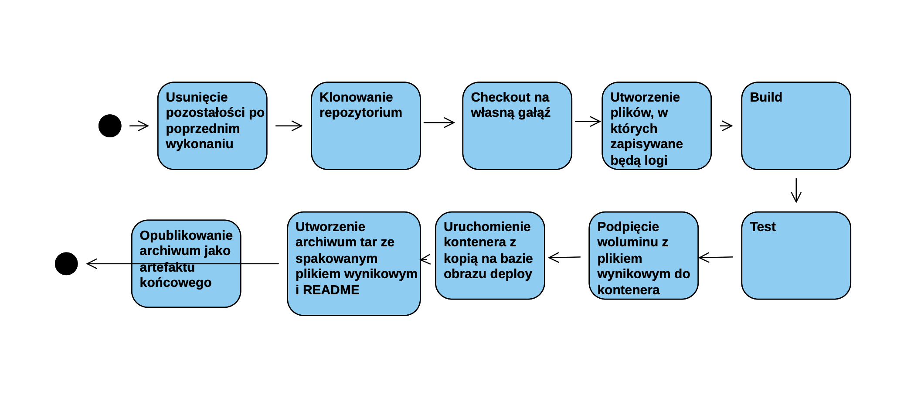
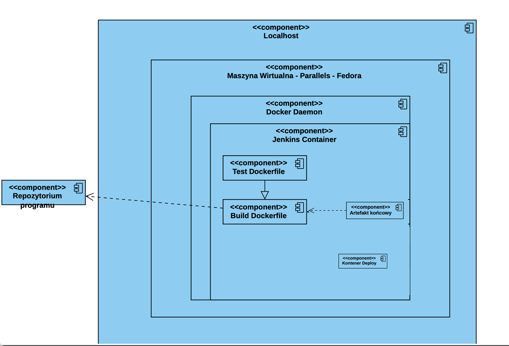
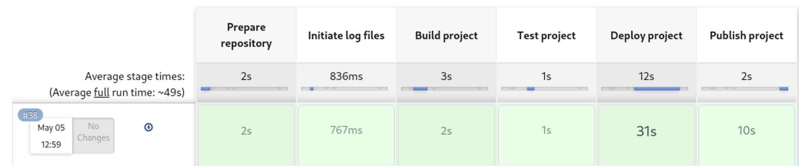

# Sprawozdanie 3
Dagmara Pasek
411875

### Cel ćwiczenia:
Celem tego ćwiczenia było zapoznanie się z CI - Continuous Integration oraz jego implementacją przy użyciu narzędzia Jenkins wraz z izolacją poszczególnych etapów w kontenerach Docker. Ćwiczenie miało na celu również zrozumienie roli pipeline'a w Jenkinsie jako narzędzia do automatyzacji procesów CI oraz zdobycie praktycznych umiejętności w konfigurowaniu i uruchamianiu pipeline'ów w Jenkinsie.

### Przebieg ćwiczenia 005:
#### Przygotowanie:
Napotkałam problem z konfiguracją proxy w Ubuntu, co powodowało komplikacje podczas korzystania z Docker. Aby rozwiązać ten problem, zdecydowałem się przenieść na system Fedora. 
Upewniłam się, że działały konetery budujące i testujące utworzone na poprzednich zajęciach. Dokonałam instalacji Jenkins'a. Pliki Dockerfile wdrażające instancję Jenkinsa załączone są w katalogu Sprawozdanie2. 

 Opis wykonanej instalacji podczas poprzedniego ćwiczenia:
 
 Zapoznałam się z dokumentacją. Utworzyłam nową sieć o nazwie jenkins.

    ```
    sudo docker network create jenkins
    ```

    Uruchomiłam kontener z DIND:
```
    docker run --name jenkins-docker --rm --detach \
  --privileged --network jenkins --network-alias docker \
  --env DOCKER_TLS_CERTDIR=/certs \
  --volume jenkins-docker-certs:/certs/client \
  --volume jenkins-data:/var/jenkins_home \
  --publish 2376:2376 \
  docker:dind --storage-driver overlay2
  ```

Utworzyłam nowy plik Dockerfile, a w nim zawierały się narzędzia pozwalające na dostosowywanie obrazu.


Dokonałam budowania, używając:
```
 sudo docker build -t myjenkins-blueocean:2.440.2-1 -f jenkins_Dockerfile .
```


Uruchomiłam kontener jenkins na podstawie obrazu stosując:
```
docker run \
  --name jenkins-blueocean \
  --restart=on-failure \
  --detach \
  --network jenkins \
  --env DOCKER_HOST=tcp://docker:2376 \
  --env DOCKER_CERT_PATH=/certs/client \
  --env DOCKER_TLS_VERIFY=1 \
  --publish 8080:8080 \
  --publish 50000:50000 \
  --volume jenkins-data:/var/jenkins_home \
  --volume jenkins-docker-certs:/certs/client:ro \
  myjenkins-blueocean:2.440.2-1
```
Obraz Blue Ocean jest modyfikacją obrazu Jenkinsa, która zawiera interfejs użytkownika Blue Ocean oraz dodatkowe wtyczki i narzędzia umożliwiające bardziej zaawansowane i interaktywne procesy CI/CD. 

Po wpisaniu w przeglądarkę:
```
http://localhost:8080
```
wyświetlało się okno z ekranem logowania. 


Zalogowałam się i skonfigurowałam Jenkins'a.

#### Uruchomienie:
Utworzyłam pierwszy projekt, który wyświetlał uname. W sekcji budowania wybrałam opcję "powłoka" i napisałam poniższe polecenie:

```
uname -a
```


Po uruchomieniu logi wyglądały tak:


Kolejno utworzyłam drugi projekt, który zwracał błąd, gdy godzina była nieparzysta. Ponownie w sekcji budowania wybrałam opcję "powłoka" i wpisałam:


Skrypt ten pobierał aktualną godzinę w formacie 24-godzinnym i zapisywał ją do zmiennej "time". Następnie sprawdzał, czy godzina była parzysta czy nieparzysta, dzieląc ją przez 2 i sprawdzając resztę z dzielenia. Jeśli reszta z dzielenia była różna od zera (czyli godzina była nieparzysta), wyświetlał komunikat "ERROR Nieparzysta godzina: [aktualna godzina]" i kończył działanie skryptu z kodem błędu 1. Gdy godzina była parzysta, wyświetlał komunikat "Godzina jest parzysta: [aktualna godzina]".

Logi konsoli wyglądały następująco:


 Następnie utworzyłam trzeci projekt, w którym dokonałam klonowania repozytorium przedmiotowego. W sekcji z repozytorium kodu wkleiłam adres do repozytorium.

 

Przeszłam na moją gałąź:


i zbudowałam obrazy z wcześniej utworzonych Dockerfile dotyczących buildu i testu.


Logi konsoli wyglądały następująco:


### Wstęp:
#### Wymagania wstępne środowiska:
Repozytorium kodu źródłowego: Repozytorium to będzie źródłem kodu, który będzie budowany, testowany i publikowany. Korzystałam z poniższego repozytorium:
```
https://github.com/irssi/irssi.git
```
Serwer Jenkins: Jenkins będzie używany do automatyzacji procesu CI. Musimy mieć zainstalowany i skonfigurowany serwer Jenkinsa.
Kontener Docker również jest niezbędny.


#### Diagram aktywności:




#### Diagram wdrożeniowy:




### Pipeline:
1. Początkowo w etapie "Prepare" wykonałam kilka kroków przygotowawczych. Usunęłam stary katalog projektu, który został po poprzednim wykonaniu, sklonowałam repozytorium przedmiotowe oraz przełączyłam się na odpowiednią gałąź, aby mieć najnowszą wersję kodu przed przystąpieniem do budowy aplikacji.

```
stage('Prepare') {
            steps {
                
                    sh '''
                    rm -rf MDO2024_INO
                    git clone https://github.com/InzynieriaOprogramowaniaAGH/MDO2024_INO.git
                    cd MDO2024_INO
                    git checkout DP411875_1
                    '''
            
            }
        }
```


2. Przed przejściem do budowania utworzyłam pliki, w których zapisywane były logi dotyczące etapów budowania i testowania.

```
stage('Create logs') {
            steps {
                dir('MDO2024_INO/INO/GCL2/DP411875_1/Sprawozdanie3/Build'){
                    sh 'touch b.log'
                }
                dir('MDO2024_INO/INO/GCL2/DP411875_1/Sprawozdanie3/Test'){
                    sh 'touch t.log'
                }
            }
            
        }
```

Zdefiniowałam pipeline korzystający z kontenerów celem realizacji kroków build -> test. 

3. Dockerfile , z którego korzystałam wyglądał następująco:

```
FROM fedora

RUN dnf -y update && \
    dnf -y install meson ninja* git gcc glib2-devel utf8proc-devel ncurses* perl-Ext* openssl-devel cmake make
RUN git clone https://github.com/irssi/irssi.git
WORKDIR /irssi
RUN meson Build
RUN ninja -C Build
```

```
stage('Build '){
            steps{
                dir('MDO2024_INO/INO/GCL2/DP411875_1/Sprawozdanie3/Build'){
                    sh 'docker build -t build_container -f Dockerfile_build . | tee b.log'
                    archiveArtifacts artifacts: "b.log"

                }
            }
        }
```
Powyższy pipeline wykorzystuje podejście budowania na kontenerze CI, bez wykorzystania dedykowanego kontenera DIND. Proces budowania i testowania odbywa się bezpośrednio na kontenerze CI, bez konieczności uruchamiania dodatkowego kontenera Docker wewnątrz. W przypadku wykorzystania DIND, zwykle tworzony jest oddzielny kontener Docker wewnątrz innego kontenera Docker, co umożliwia budowanie obrazów i uruchamianie kontenerów Docker wewnątrz kontenera Jenkinsa.
 
Aby zapisać otrzymane logi podczas budowania i testowania użyłam polecenia:
```
docker build -t build_container -f Dockerfile_build . | tee b.log
```
Polecenie tee jest używane tutaj, aby zapisać zarówno wyjście standardowe, jak i błędy z procesu budowy obrazu Dockerowego do pliku b.log.

Dodałam również polecenie służące do archiwizacji artefaktów:
```
 archiveArtifacts artifacts: "b.log"

```
Dzięki temu, po zakończeniu tego etapu w pipeline, plik b.log będzie dostępny jako artefakt, który można później wykorzystać lub przeglądać w interfejsie Jenkins.

4. Dockerfile służący do przeprowadzania testów bazował na kontenerze budującym:

```
FROM build_container
WORKDIR Build
RUN meson test
```

Fragment pipeline z testami wyglądał następująco:
```
stage('Tests'){
            steps{
                dir('MDO2024_INO/INO/GCL2/DP411875_1/Sprawozdanie3/Test'){
                    sh 'docker build -t test_container -f Dockerfile_test . | tee t.log'
                    archiveArtifacts artifacts: "t.log"
                }
                
            }
        }
```
Również zapisałam logi do odpowiedniego pliku: "t.log".

5. Kolejno po wykonaniu się buildu i testów przeszłam do etapu Deploy. Do kontenera z zainstalowanymi dependencjami  podpięłam wolumin z plikiem wynikowym kontenera budującego. W tym celu uruchomiłam dwa kontenery. Pierwszy z nich, o nazwie depl_1, został uruchomiony na podstawie obrazu build_container, przy użyciu polecenia docker run. Ustawiłam także zmienną środowiskową TERM na wartość xterm. Drugi kontener, o nazwie copy_1, został uruchomiony na podstawie obrazu deploy.

Kiedy kontenery były już uruchomione, skopiowałam zawartość katalogu ./irssi/Build/src/fe-text/irssi z kontenera depl_1 do lokalnego katalogu irssi_deployed. Następnie, skopiowałam zawartość katalogu irssi_deployed do woluminu /output w kontenerze copy_1.

Po skopiowaniu plików, stworzyłam archiwum art.tar, zawierające zawartość katalogu irssi_deployed oraz plik README.md z katalogu artifacts.

Na koniec, zatrzymałam oba kontenery, depl_1 i copy_1, aby zakończyć proces deployowania.


```       stage('Deploy'){
    steps{
        dir('MDO2024_INO/INO/GCL2/DP411875_1/Sprawozdanie3/Deploy') {
            sh 'docker build -t deploy . -f Dockerfile_deploy'
            
            sh 'docker run -t -d -e TERM=xterm --name depl_1 -v output:/output build_container'
            sh 'docker run -t -d -e TERM=xterm --name copy_1 -v output:/output deploy'
            
            sh 'docker cp depl_1:./irssi/Build/src/fe-text/irssi ./irssi_deployed'
            sh 'docker cp ./irssi_deployed copy_1:/output'
            
            sh 'tar -cvf artifacts/art.tar ./irssi_deployed ../artifacts/README.md'
        
            sh 'docker stop depl_1'
            sh 'docker stop copy_1' 
        }    
   }
}
```


6. Finalnie publikowany był artefakt końcowy. Wykonałam to poprzez dołączenie programu jako artefakt końcowy stosując archiwum tar. Wyczyściłam zasoby przy pomocy polecenia 
```
docker system prune --all --volumes --force
```

W pliku README.md zawarłam konieczne dependencje:
```
- libutf8proc-dev
- libcrypt1

```

Wszystkie etapy pomyślnie przeszły build. 




7. Cały pipeline wygląda następująco:
   ```
   pipeline {
    agent any
        parameters {
        string(name: 'IRRSI', defaultValue: '2.7', description: 'version')
    }
    stages {
        stage('Prepare') {
            steps {
                
                    sh '''
                    rm -rf MDO2024_INO
                    git clone https://github.com/InzynieriaOprogramowaniaAGH/MDO2024_INO.git
                    cd MDO2024_INO
                    git checkout DP411875_1
                    '''
            
            }
        }
        stage('Create logs') {
            steps {
                dir('MDO2024_INO/INO/GCL2/DP411875_1/Sprawozdanie3/Build'){
                    sh 'touch b.log'
                }
                dir('MDO2024_INO/INO/GCL2/DP411875_1/Sprawozdanie3/Test'){
                    sh 'touch t.log'
                }
            }
            
        }
        stage('Build '){
            steps{
                dir('MDO2024_INO/INO/GCL2/DP411875_1/Sprawozdanie3/Build'){
                    sh 'docker build -t build_container -f Dockerfile_build . | tee b.log'
                    archiveArtifacts artifacts: "b.log"

                }
            }
        }
        stage('Tests'){
            steps{
                dir('MDO2024_INO/INO/GCL2/DP411875_1/Sprawozdanie3/Test'){
                    sh 'docker build -t test_container -f Dockerfile_test . | tee t.log'
                    archiveArtifacts artifacts: "t.log"
                }
                
            }
        }
        
        
         stage('Deploy'){
    steps{
        dir('MDO2024_INO/INO/GCL2/DP411875_1/Sprawozdanie3/Deploy') {
            sh 'docker build -t deploy . -f Dockerfile_deploy'
            
            sh 'docker run -t -d -e TERM=xterm --name depl_1 -v output:/output build_container'
            sh 'docker run -t -d -e TERM=xterm --name copy_1 -v output:/output deploy'
            
            sh 'docker cp depl_1:./irssi/Build/src/fe-text/irssi ./irssi_deployed'
            sh 'docker cp ./irssi_deployed copy_1:/output'
            
            sh 'tar -cvf artifacts/art.tar ./irssi_deployed ../artifacts/README.md'
        
            sh 'docker stop depl_1'
            sh 'docker stop copy_1' 
        }    
       }
     }
        
        stage('Publish'){
        steps{
            dir('MDO2024_INO/INO/GCL2/DP411875_1/Sprawozdanie3/Deploy'){
            archiveArtifacts artifacts: "artifacts/art.tar"
            sh 'docker system prune --all --volumes --force'
                }    
            }
        }
    }
     }
```


