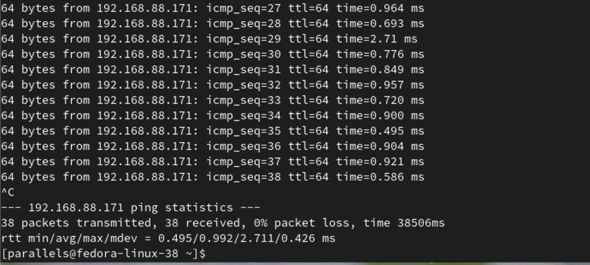

# Sprawozdanie 4
Dagmara Pasek
411875

### Cel ćwiczenia:
Celem tych zajęć było zapoznanie się i praktyczne wykorzystanie narzędzia Ansible do automatyzacji zarządzania infrastrukturą oraz zdobycie umiejętności w zakresie tworzenia playbooków, zarządzania inwentaryzacją, wymiany kluczy SSH, a także zarządzania kontenerami Docker. 

### Przebieg ćwiczenia 008:
# Instalacja zarządcy Ansible:
Utworzyłam drugą maszynę wirtualną o jak najmniejszym zbiorze zainstalowanego oprogramowania. 
Zastosowałam ten sam system operacyjny, co "główna" maszyna - Fedorę.


Aby zapewnić komunikację między maszynami nadałam typ sieci: Sieć mostkowana - domyślna karta obu maszynom.


Zapewniłam obecność programu tar i serwera OpenSSH (sshd).


Nadałam maszynie hostname ansible-target. 
Zastosowałam do tego polecenie:
```
sudo hostnamectl set-hostname ansible-target
```


Utworzyłam w systemie użytkownika ansible.


Na głównej maszynie wirtualnej zainstalowałam oprogramowanie Ansible korzystając z dokumentacji dołączonej w zadaniu. Użyłam polecenia:
```
 sudo dnf install ansible
```


Wymieniłam klucze SSH między użytkownikiem w głównej maszynie wirtualnej, a użytkownikiem ansible z nowej tak, by logowanie ssh ansible@ansible-target nie wymagało podania hasła.

Za pomocą polecenia ping sprawdziłam, czy uda się połączyć ze sobą maszyny. 




Udało się. Przeszłam więc do utworzenia klucza ssh na nowej maszynie. Użyłam polecenia:
```
ssh-keygen -t rsa
```


Przekopiowałam treść klucza na zdalny serwer, tak aby nie musieć podawać hasła przy łączeniu. Użyłam polecenia:
```
ssh-copy-id -i ~/.ssh/id_rsa ansible@ansible-target
```

Sprawdziłam łączenie się stosując na początku adres ip nowej maszyny:


Udało się. 

# Inwentaryzacja:
Dokonałam inwentaryzacji systemów.
Ustaliłam przewidywalne nazwy komputerów stosując hostnamectl. W poprzednim kroku ustawiłam nazwę hosta dla nowej maszyny, zatem ustaliłam jedynie nazwę dla głownej maszyny. Było to: daga-fedora.


Wprowadziłam nazwy DNS dla maszyn wirtualnych, stosując /etc/hosts, aby możliwe było wywoływanie komputerów za pomocą nazw, a nie tylko adresów IP.
W pliku /etc/hosts dodałam nazwy i adresy ip drugich maszyn.


Kolejno sprawdziłam łączenie się stosując polecenie:

```
ssh ansible@ansible-target
```


Udało się.

Utworzyłam plik inwentaryzacji playbook1.yaml. Użyłam formatu .yaml. Umieściłam w nim sekcje Orchestrators oraz Endpoints. Umieściłam nazwy maszyn wirtualnych w odpowiednich sekcjach.
```
orchestrators:
  hosts:
    main_host:
      ansible_host: daga-fedora
endpoints:
    hosts:
	target_host:
            ansible_host: ansible-target
            ansible_user: ansible

network:
  children:
    orchestrators:
    endpoints:
```
W sekcji orchestrators zawarłam nazwę głównej maszyny: daga-fedora. W sekcji endpoints zawarłam nazwę hosta, którym będzie zarządzać main_host. Logowanie będzie się odbywać za pomocą użytkownika ansible. W sekcji networks zdefiniowałam relacje między grupami hostów. Łączone zostały obie powyższe sekcje. 

Wysłałam żądanie ping do wszystkich maszyn. Zastosowałam do tego polecenie:
```
ansible -i inventory.yaml network -m ping
```
Opcja -m określała, że ma być użyty moduł ping. 
Opcja -i określała, że ma być użyty plik inwentaryzacyjny inventory.yaml. 


Zapewniłam łączność między maszynami powyżej, więc nie musiałam tego ponawiać. 

# Zdalne wykonywanie procedur

Utworzyłam playbook Ansible o nazwie: playbook1.yaml, za pomocą którego wysłałam żądanie ping do wszystkich maszyn.
Kolejno skopiowałam plik inwentaryzacji na maszynę endpoints. 
```
- name: Copy
  hosts: endpoints
  tasks:
    - name: Copy inventory file
      copy:
	src: /home/parallels/ansible_1/inventory.yaml
        dest: /home/ansible/ansible_1/inventory.yaml

```

Za pierwszym razem zwrócony został status CHANGED. Oznaczało to, że wprowadzone zostały zmiany - kopiowanie pliku.

Ponowiłam operację. Za drugim razem zwrócony został status OK, ponieważ plik był juz skopiowany. Nie została wyświetlona informacja o zmianach, więc plik z przekopiowaną wcześniej zawartością był widziany przez ansible.


Zaktualizowałam pakiety w systemie w następujący sposób:

```
- name: Packets update
  hosts: endpoints
  become: true
  tasks:
    - name: Update all packages to the latest version
      package:
	name: "*"
        state: latest
```
Playbook działał z uprawnieniami administratora, dzięki ustawieniu become: true. Poprzez dodanie flagi --ask-become-pass do komendy uruchamiającej playbook będzie uruchamiana opcja z podaniem hasła.

Kolejno zrestartowałam usługi sshd i rngd. 

```
- name: Restart sshd
  become: true
  service:
    name: sshd
    state: restarted
```
To zadanie ma na celu restart usługi sshd, która jest odpowiedzialna za obsługę połączeń SSH na serwerze.

```
- name: Restart rng
  become: true
  ansible.builtin.service:
    name: rngd
    state: restarted
```
 To zadanie ma na celu restart usługi rngd, która jest odpowiedzialna za dostarczanie losowych danych i zbieranie entropii z różnych źródeł w systemie i dostarczanie jej do jądra systemu operacyjnego.

 

Przeprowadiłam operacje względem maszyny z wyłączonym serwerem SSH, odpiętą kartą sieciową.
Na maszynie ansible target wykonałam polecenie:
```
sudo systemctl stop ssh
```
aby zatrzymać usługę ssh. 


Wykonanie playbooka wyświetliło komunikat: "Connection refused", co oznaczało, że nie uzyskano połączenia między obiema maszynami. 


Następnie odpięłam kartę sieciową w ustawieniach maszyny ansible-target. Przeszłam do opcji: Sieć, a następnie wybrałam Źródło: rozłączono.


Tym razem po wykonaniu playbooka otrzymałam komunikat: "Connectiom timed out". Połączenie również się nie udało. 


# Zarządzanie kontenerem:

Na poprzednich zajęciach moja aplikacja została opublikowana jako archiwum tar przy użyciu platformy Jenkins, zamiast jako obraz na DockerHubie. Utworzyłam zatem katalog app i przeniosłam do niego plik Dockerfile_deploy oraz to archiwum tar. 
W trakcie implementacji mojej aplikacji zauważyłam, że plik Dockerfile używany do wdrażania był pierwotnie skonfigurowany do działania na systemie Ubuntu. Gdy jednak próbowałam uruchomić aplikację na systemie Fedora, napotkałam problemy z niezgodnością nazw pakietów. Aby rozwiązać ten problem, musiałam dokonać odpowiednich zmian w pliku Dockerfile, aby uwzględnić różnice w nazwach pakietów między systemami Ubuntu a Fedora.

Zmieniony Dockerfile wyglądał następująco:
```
FROM fedora:latest
RUN dnf -y update && \
    dnf -y install glib2 utf8proc-devel libxcrypt

```
Utworzyłam playbook o nazwie playbook2.yaml, w którym wykonałam poniższe kroki:

Zainstalowałam i aktywowałam usługę Docker na hoście endpoints. Pierwsze zadanie instaluje pakiet Docker za pomocą modułu dnf, a drugie zapewnia, że usługa Docker będzie aktywowana i uruchomiona przy użyciu modułu systemd.

```
 - name: Install and enable Docker
  hosts: endpoints
  become: true
  tasks:
    - name: Install Docker
      dnf:
	name: docker
        state: present
      become: true

    - name: Ensure Docker service is enabled
      systemd:
	name: docker
        enabled: yes
        state: started
      become: true
```


Następnie plik Dockerfile jest kopiowany z lokalnej ścieżki /home/parallels/ssh/MDO2024_INO/INO/GCL2/DP411875_1/Sprawozdanie4/app na serwer docelowy do lokalizacji /home/ansible/ansible_1/. Ten proces zapewnia dostępność pliku Dockerfile na serwerze, co jest niezbędne do budowy obrazu Dockera.
Kolejne kroki w playbooku Ansible realizują proces budowy i uruchomienia kontenera na podstawie wcześniej skopiowanego pliku Dockerfile. W pierwszym zadaniu budowany jest obraz Docker o nazwie "deploy", korzystając z pliku Dockerfile znajdującego się w ścieżce /home/ansible/ansible_1/app o nazwie Dockerfile_deploy. Następnie, w drugim zadaniu, uruchamiany jest kontener Dockerowy o nazwie "my_container" z wykorzystaniem zbudowanego obrazu "deploy", gdzie parametry auto_remove: yes i detach: yes oznaczają, że kontener zostanie automatycznie usunięty po zakończeniu działania, a proces zostanie odłączony. 

```
- name: Download image for building/deploying the program
  hosts: endpoints
  tasks:
    - name: Copy Dockerfile for deployment
      copy:
	src: /home/parallels/ssh/MDO2024_INO/INO/GCL2/DP411875_1/Sprawozdanie4/app
        dest: /home/ansible/ansible_1/

- name: Build
  hosts: endpoints
  become: true
  tasks:
    - name: Build Docker image
      docker_image:
        name: deploy
        build:
          path: /home/ansible/ansible_1/app
          dockerfile: Dockerfile_deploy
        source: build
    - name: Run build
      docker_container:
        name: my_container   
        image: deploy
        auto_remove: yes
        detach: yes
```


Na maszynie ansible-target wykonałam polecenie:
```
sudo docker images
```
aby sprawdzić, czy utworzył się obraz o nazwie deploy.


Finalnie playbook usuwa kontener Dockerowy o nazwie "my_container", który był oparty na obrazie "deploy". Parametr state: absent wskazuje, że kontener zostanie usunięty, jeśli istnieje. 

```
- name: Delete container
      docker_container:
        name: my_container
        image: deploy
        state: absent
```

Sprawdziłam, czy nastąpiło usunięcie.


Ubrałam powyższe kroki w rolę, za pomocą szkieletowania ansible-galaxy. Na głównej maszynie wykonałam polecenie:
```
ansible-galaxy init irssi_roles
```
dzięki któremu utworzyłam role. Weszłam do katalogu tasks i edytowałam plik main.yml. Wkleiłam do niego treść wcześniej utworzonego playbooka.

Fragment tego pliku wygląda następująco:


W folderze wyżej utworzyłam osobny playbook o nazwie "playbook_roles", który uwzględniał rolę "irssi_roles". Jego treść:

```
- name: Deploy Docker container
  hosts: endpoints
  become: true
  roles:
    - irssi_roles
```
Wykonanie playbooka było takie samo, jak w krokach powyżej.


### Przebieg ćwiczenia 009:

Celem tego ćwiczenia była instalacja systemu operacyjnego Fedora za pomocą instalatora sieciowego (netinst) w trybie nienadzorowanym, a następnie konfiguracja systemu poprzez plik odpowiedzi. Dodatkowo, celem było umieszczenie w pliku odpowiedzi instrukcji dotyczących instalacji repozytoriów i oprogramowania potrzebnego do uruchomienia konkretnego programu, który został zbudowany w ramach projektu.

Zainstalowałam system Fedora, stosując instalator sieciowy netinst. Po poprawnej instalacji powinniśmy otrzymać plik anaconda-ks.cfg. Skopiowałam go stosując polecenie:
```
sudo cp /root/anaconda-ks.cfg ~/anaconda-ks.cfg
```
Na początku zmieniłam tryb instalacji z graficznej na tekstową.
Musiałam dodać wzmianki na temat potrzebnych repozytoriów:
```
url --mirrorlist=http://mirrors.fedoraproject.org/mirrorlist?repo=fedora-39&arch=aarch64
repo --name=update --mirrorlist=http://mirrors.fedoraproject.org/mirrorlist?repo=updates-released-f38&arch=aarch64
```
Zapewniłam, że zawsze plik będzie formatować całość, stosując polecenie:
```
clearpart --all
```
Nadałam inny hostname niż localhost, w moim przypadku: "daga".
Dodałam jeszcze polecenie
```
reboot
```
aby system od razu uruchomił się ponownie.

Pobrałam plik na Github i utworzyłam nową maszynę na podstawie tego pliku. Wybrałam opcję -e aby otworzyć tryb GRUB, w którym mogłam podać link do pliku, który wrzuciłam na Githuba.


Instalacja przebiegła pomyślnie.


Rozszerzyłam plik odpowiedzi o repozytoria i oprogramowanie potrzebne do uruchomienia programu, zbudowanego w ramach projektu. W sekcji post za pomocą polecenia wget pobrałam program z serwera. Umieściłam program w ścieżce stosownej dla binariów /usr/local/bin/.  W sekcji post wykonałam poniższe polecenia:
```
wget -P /usr/local/bin  https://raw.githubusercontent.com/InzynieriaOprogramowaniaAGH/MDO2024_INO/DP411875_1/INO/GCL2/DP411875_1/Sprawozdanie4/art.tar
tar -xf /usr/local/bin/art.tar -C /usr/local/bin

chmod +x /usr/local/bin/irssi_deployed
```

Należało rozpakować plik art.tar do katalogu /usr/local/bin. Opcja -xf oznaczała, że archiwum tar było ropakowane, a flaga f wskazywała na plik do rozpakowania. Finalnie nadałam uprawnienia wykonywalne plikowi wykonywalnemu "irssi_deployed". Pozwoliły one na uruchomienie pliku jako programu. 


