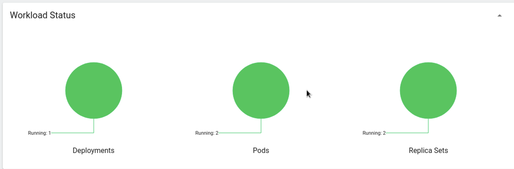
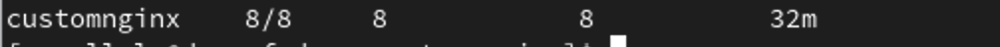

# Sprawozdanie 5
Dagmara Pasek
411875

### Cel ćwiczenia:
Celem tych zajęć było zainstalowanie i uruchomienie klastra Kubernetes za pomocą Minikube oraz kubectl, zapewniając jednocześnie bezpieczeństwo instalacji i zgodność z wymaganiami sprzętowymi. Należało przygotować i wdrożyć własny obraz Docker, uruchamiając aplikację jako kontener na Minikube oraz sprawdzając poprawność działania przez Dashboard i kubectl. Finalnie zapisano wdrożenie w pliku YML i przeprowadzono próbne wdrożenie przykładowego deploymentu. Należało upewnić się o dostępności co najmniej dwóch wersji obrazu, przygotować nową wersję obrazu oraz wprowadzić zmiany w deploymencie, takie jak zmiana liczby replik, aktualizacja obrazu oraz przywracanie poprzednich wersji wdrożeń. Następnie należało napisać skrypt weryfikujący poprawność wdrożenia oraz przygotować wersje wdrożeń stosujące różne strategie wdrożenia, takie jak Recreate, Rolling Update i Canary Deployment, analizując i opisując różnice między nimi. 

### Przebieg ćwiczenia 010:
# Instalacja klastra Kubernetes:
Minikube jest narzędziem, które umożliwia uruchamianie lokalnych klastrów Kubernetes na różnych systemach operacyjnych. 
Zaopatrzyłam się w implementację stosu k8s: minikube zgodnie z załączoną instrukcją znajdującą się w opisie zadania. Instalację wykonałam dla Fedory 38 w architekturze ARM64. Użyłam więc poniższych poleceń:
```
curl -LO https://storage.googleapis.com/minikube/releases/latest/minikube-linux-arm64
sudo install minikube-linux-arm64 /usr/local/bin/minikube && rm minikube-linux-arm64
```


Kolejno użyłam polecenia:

```
minikube kubectl -- get po -A
```
aby pobrać kubectl. Jest on narzędziem wiersza poleceń do zarządzania klastrami Kubernetes, umożliwiającym tworzenie, aktualizowanie, usuwanie i monitorowanie zasobów takich jak pody, deploymenty i usługi


Użyłam polecenia:
```
minikube start
```
aby uruchomić klaster minikube.

Zapewniłam bezpieczeństwo instalacji poprzez aktualizacje oprogramowania oraz pobieranie narzędzi z oficjalnych źródeł. 

Miałam problem z uruchomieniem Minikube, ponieważ automatycznie łączył się z QEMU zamiast z Dockerem. Aby to rozwiązać, musiałam ręcznie skonfigurować Minikube, dodając parametr --driver=docker podczas uruchamiania, co pozwoliło na poprawne działanie klastra. Dzięki tej konfiguracji udało się uruchomić Minikube bez dalszych problemów.


Aby zainstalować Minikube, potrzebny były co najmniej 2 procesory, 2 GB wolnej pamięci oraz 20 GB wolnego miejsca na dysku. Mogły zatem występować problemy z brakiem pamięci podczas instalacji albo z błędnie przydzieloną liczbą procesorów. Na szczęście moja maszyna spełniała powyższe wymagania. Przydzieliłam jej 2 procesory oraz 4 GB wolnej pamięci.

Sprawdziłam czy poprawnie został utworzony kontener stosując polecenie:
```
docker ps
```


Status klastra sprawdziłam stosując:
```
minikube status
```


Kolejno uruchomiłam Dashboard stosując polecenie:
```
minikube dashboard
```
Wywołałam je w terminalu wewnątrz maszyny, przez co od razu wyświetlało się okno w przeglądarce. 


Po otwarciu Dashboard,  możliwe było zobaczenie wizualizacji statusu klastra Kubernetes, w tym informacji o podach, deploymentach, usługach i innych zasobach klastra.

# Analiza posiadanego kontenera:
Poprzedni projekt - Irssi nie nadawał się do pracy jako kontener, ponieważ jego charakterystyka nie pozwalała na ciągłą pracę. Zmieniłem projekt na serwer Nginx, co umożliwiło lepsze dostosowanie go do kontenera, który może działać w tle. Dodatkowo, wzbogaciłem funkcjonalność serwera Nginx poprzez dodanie własnej strony powitalnej, wyświetlającej wiadomość "Hello from NGINX", oraz podpisanie serwera własnymi danymi.
Utworzyłam więc osobny katalog o nazwie custom-nginx i zawarłam w nim Dockerfile oraz prosty plik html. 

```
<!DOCTYPE html>
<html>
<head>
    <title>Welcome to NGINX</title>
</head>
<body>
    <h1>Hello from NGINX!</h1>
    <p>Created by Dagmara Pasek</p>
</body>
</html>
```

Dockerfile wyglądał tak:

```
FROM nginx:latest
COPY ./index.html /usr/share/nginx/html
```
Dockerfile definiował bazowy obraz, na którym został zbudowany nowy obraz. Kopiował również plik index.html z lokalnego systemu plików do katalogu /usr/share/nginx/html w kontenerze. 

Zbudowałam obraz stosując:
```
docker build -t custom-nginx .
```


Aby wykazać, że aplikacja pracuje jako kontener ponownie użyłam polecenia:
```
docker ps
```


Zalogowałam się również w DockerHub i opublikowałam obraz. Nadałam mu tag 1.0.
```
docker push dagappp/custom-nginx:1.0
```

# Uruchamianie oprogramowania
Uruchomiłam kontener na stosie k8s za pomocą polecenia:
```
minikube kubectl run -- <nazwa-wdrożenia> --image=<obraz-docker> --port=<wyprowadzany port> --labels app=<nazwa-wdrożenia>
```
Kontener uruchomiony w minikubie został automatycznie ubrany w pod.


Stosując 
```
minikube dashboard
```
można to zauważyć:




Użyłam również:
```
 kubectl get pods
```
 aby wyświetlić listę działających podów. (Screen z trochę późniejszego etapu):


Wyprowadziłam porty, używając polecenia:
```
kubectl port-forward pod/<nazwa-wdrożenia> <LO_PORT>:<PODMAIN_CNTNR_PORT>
```


Port 8082 był przekierowany na lokalny host.

Uruchomiłam przeglądarkę i przeszłam do http://localhost:8082 w której wyświetliło się:


# Konwersja wdrożenia ręcznego na wdrożenie deklaratywne YAML

Utworzyłam plik depl.yaml, który opisuje deployment, który posiada cztery repliki kontenera aplikacji. Każdy kontener działał na porcie 80 i używał obrazu dagappp/customnginx:1.0. Kontenery były zawsze restartowane w przypadku zakończenia działania.

```
apiVersion: apps/v1
kind: Deployment
metadata:
  name: custom-nginx
spec:
  replicas: 4
  selector:
    matchLabels:
      app: custom-nginx
  template:
    metadata:
      labels:
        app: custom-nginx
    spec:
      containers:
      - name: custom-nginx
        image: dagappp/customnginx:1.0
        imagePullPolicy: IfNotPresent
        ports:
        - containerPort: 80
        resources: {}
      restartPolicy: Always
```

Wdrożenie przeprowadziłam za pomocą:
```
kubectl -- apply -f ./depl.yaml 
```


Zbadałam stan za pomocą:
```
kubectl rollout status deployments/custom-nginx
```


Otrzymano komunikat "successfully rolled out" po zakończeniu wdrażania, co oznacza, że proces zakończył się sukcesem. 


Wynik wdrożenia w Dashboardzie wyglądał następująco:


Utworzone zostały 4 pody w ramach jednego deploymentu. 


# Przygotowanie nowego obrazu
Zarejestrowałam nową wersję swojego obrazu Deploy w Docker Hub. Aby to zrobić wykorzystałam komendę:
```
docker commit <id kontenera> 
```
Przepakowałam wybrany obraz, tworząc nowe wersje z tagami 2.0 i 3.0.  To pozwoliło utworzyć nowe warianty obrazu, każdy z oznaczeniem kolejnej wersji, bez konieczności zmieniania czegokolwiek poza tagiem. 
Id kontenera uzyskałam poprzez wykonanie polecenia:
```
docker ps
```


Ponownie opublikowałam obie wersje na Docker Hub stosując:
```
docker push dagappp/custom-nginx:2.0
```
oraz 

```
docker push dagappp/custom-nginx:3.0
```


Przygotowałam również wersję obrazu, którego uruchomienie kończyło się błędem. Dodałam do mojego Dockerfile linijkę:
```
CMD ["ERR"]
```
Nadałam tej wersji tag 3.1 podczas budowania.


Kontener nie uruchomił się, sprawdziłam to w Dashboardzie:


Wyświetlony był status "ImagePull" co oznaczało, że Kubernetes próbował pobrać obraz kontenera z zewnętrznego repozytorium, jednak nie udawało się to. 

# Zmiany w deploymencie
Aktualizowałam plik YAML z wdrożeniem i przeprowadzałam je ponownie po zastosowaniu następujących zmian:
-zwiększenie replik do 8
Dokonałam tego jedynie w miejscu:
```
spec:
  replicas: 8
```
Reszta pliku pozostała bez zmian.



W Dashboardzie wyglądało to tak:


-zmniejszenie replik do 1
```
spec:
  replicas: 1
```


-zmniejszenie replik do 0
```
spec:
  replicas: 0
```


-zastosowanie nowej wersji obrazu
Zastosowałam nową wersję obrazu - 2.0. Użyłam strategii Rolling Update. Polega ona na stopniowym wprowadzaniu nowej wersji aplikacji, zamiast aktualizowania wszystkich instancji jednocześnie. Plik aktualizuje 4 repliki custom-nginx z wersji 1.0 na wersję 2.0. Zmodyfikowałam do tego poprzedni plik depl.yaml:

```
apiVersion: apps/v1
kind: Deployment
metadata:
  name: customnginx
spec:
  replicas: 4
  selector:
    matchLabels:
      app: custom-nginx
  strategy:
    type: RollingUpdate
    rollingUpdate:
      maxUnavailable: 1
      maxSurge: 1
  template:
    metadata:
      labels:
	app: custom-nginx
    spec:
      containers:
      - name: customnginx
        image: dagappp/custom-nginx:2.0
        imagePullPolicy: IfNotPresent
        ports:
        - containerPort: 80
        resources: {}
      restartPolicy: Always

```


Przywracałam poprzednie wersje wdrożeń za pomocą poleceń:
```
kubectl rollout history
kubectl rollout undo
```


# Kontrola wdrożenia

Napisałam skrypt weryfikujący czy wdrożenie zdążyło się wdrożyć. Skrypt czeka 60 sekund, aby dać czas na przeprowadzenie aktualizacji. Sprawdza status wdrożenia Deploymentu custom-nginx za pomocą polecenia kubectl rollout status i zapisuje wynik w zmiennej status. Jeśli status zawiera słowo "successfully", oznacza to, że wdrożenie zakończyło się pomyślnie. Skrypt wypisuje "Zakonczono" i ponownie wyświetla status wdrożenia. W przeciwnym razie skrypt wypisuje "W trakcie", ponownie wyświetla status wdrożenia i wycofuje zmiany za pomocą polecenia kubectl undo.

```
#!/bin/bash

kubectl apply -f depl.yaml

sleep 60

status=$(minikube kubectl rollout status deployment/custom-nginx)

if [[ "$status" = *"successfully"* ]];
then
       echo "Zakonczono"
       minikube kubectl rollout status deployment custom-nginx
else
       echo "W trakcie"
       minikube kubectl rollout status deployment custom-nginx
       minikube kubectl undo deployment custom-nginx
fi
```


W moim przypadku wdrożenie zakończyło się pomyślnie. 

# Strategie wdrożenia
Przygotowałam wersje wdrożeń stosujące następujące strategie wdrożeń:
-Recreate: usuwa wszystkie istniejące pody aplikacji przed wdrożeniem nowych, zapewniając brak współistnienia starych i nowych wersji aplikacji. W rezultacie, aplikacja doświadcza przestoju, gdy stare pody są zatrzymywane, a nowe uruchamiane. Jest to przydatne, gdy konieczne jest całkowite wyłączenie starej wersji przed wprowadzeniem nowej, aby uniknąć problemów z kompatybilnością.

```
apiVersion: apps/v1
kind: Deployment
metadata:
  name: customnginx
spec:
  replicas: 4
  selector:
    matchLabels:
      app: custom-nginx
  strategy:
    type: Recreate
  template:
    metadata:
      labels:
        app: custom-nginx
    spec:
      containers:
      - name: customnginx
        image: dagappp/custom-nginx:1.0
        imagePullPolicy: IfNotPresent
        ports:
        - containerPort: 80
        resources: {}
      restartPolicy: Always
```


-Rolling Update: stopniowo aktualizuje aplikację poprzez zastępowanie starych instancji nowymi, minimalizując przestoje i zapewniając ciągłą dostępność usług. W przeciwieństwie do tego, strategia Recreate wyłącza i usuwa cały klaster lub grupę instancji aplikacji. Rolling Update umożliwia płynne przejście między wersjami, podczas gdy Recreate wymaga przełączenia na nową wersję jednocześnie, co może być bardziej ryzykowne dla stabilności systemu.

```
apiVersion: apps/v1
kind: Deployment
metadata:
  name: customnginx
spec:
  replicas: 4
  selector:
    matchLabels:
      app: custom-nginx
  strategy:
    type: RollingUpdate
    rollingUpdate:
      maxUnavailable: 2
      maxSurge: 20%
  template:
    metadata:
      labels:
        app: custom-nginx
    spec:
      containers:
      - name: customnginx
        image: dagappp/custom-nginx:3.0
        imagePullPolicy: IfNotPresent
        ports:
        - containerPort: 80
        resources: {}
      restartPolicy: Always
```


-Canary Development: nowa wersja aplikacji jest stopniowo wprowadzana do produkcji poprzez udostępnienie jej tylko dla niewielkiego, kontrolowanego podzbioru. W tym podejściu podzbiór otrzymuje nową wersję aplikacji, podczas gdy pozostałe części infrastruktury pozostają na starszej wersji. 

```
apiVersion: apps/v1
kind: Deployment
metadata:
  name: customnginx-canary
spec:
  replicas: 1
  selector:
    matchLabels:
      app: custom-nginx
      version: canary
  template:
    metadata:
      labels:
        app: custom-nginx
        version: canary
    spec:
      containers:
      - name: customnginx
        image: dagappp/custom-nginx:2.0-canary
        imagePullPolicy: IfNotPresent
        ports:
        - containerPort: 80
        resources: {}
      restartPolicy: Always

---

apiVersion: apps/v1
kind: Deployment
metadata:
  name: customnginx
spec:
  replicas: 3
  selector:
    matchLabels:
      app: custom-nginx
  template:
    metadata:
      labels:
        app: custom-nginx
        version: stable
    spec:
      containers:
      - name: customnginx
        image: dagappp/custom-nginx:2.0
        imagePullPolicy: IfNotPresent
        ports:
        - containerPort: 80
        resources: {}
      restartPolicy: Always

---

apiVersion: v1
kind: Service
metadata:
  name: customnginx
spec:
  ports:
  - port: 80
    targetPort: 80
  selector:
    app: custom-nginx
```


Główną różnicą między Canary Deployment a innymi strategiami, takimi jak Rolling Update czy Recreate, jest to, że Canary Deployment umożliwia wdrażanie nowej wersji aplikacji w małych, kontrolowanych krokach, co pozwala na monitorowanie jej wydajności i stabilności przed pełnym wdrożeniem dla wszystkich użytkowników. 


