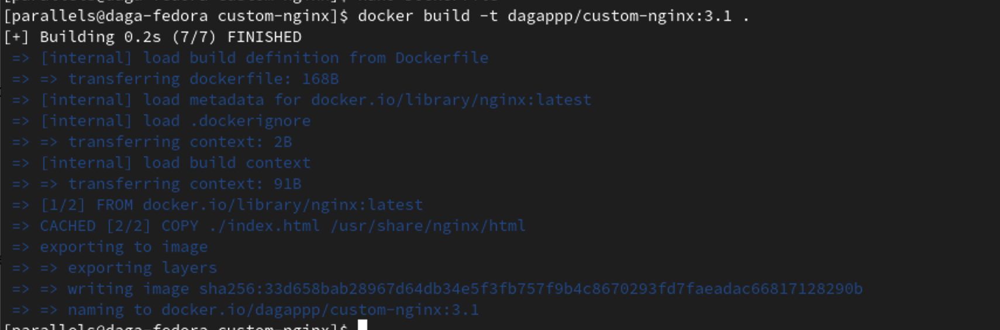

# Sprawozdanie 5
Dagmara Pasek
411875

### Cel ćwiczenia:
Celem tych zajęć było zainstalowanie i uruchomienie klastra Kubernetes za pomocą Minikube oraz kubectl, zapewniając jednocześnie bezpieczeństwo instalacji i zgodność z wymaganiami sprzętowymi. Należało przygotować i wdrożyć własny obraz Docker, uruchamiając aplikację jako kontener na Minikube oraz sprawdzając poprawność działania przez Dashboard i kubectl. Finalnie zapisano wdrożenie w pliku YML i przeprowadzono próbne wdrożenie przykładowego deploymentu. Należało upewnić się o dostępności co najmniej dwóch wersji obrazu, przygotować nową wersję obrazu oraz wprowadzić zmiany w deploymencie, takie jak zmiana liczby replik, aktualizacja obrazu oraz przywracanie poprzednich wersji wdrożeń. Następnie należało napisać skrypt weryfikujący poprawność wdrożenia oraz przygotować wersje wdrożeń stosujące różne strategie wdrożenia, takie jak Recreate, Rolling Update i Canary Deployment, analizując i opisując różnice między nimi. 

### Przebieg ćwiczenia 010:
# Instalacja klastra Kubernetes:
Minikube jest narzędziem, które umożliwia uruchamianie lokalnych klastrów Kubernetes na różnych systemach operacyjnych. 
Zaopatrzyłam się w implementację stosu k8s: minikube zgodnie z załączoną instrukcją znajdującą się w opisie zadania. Instalację wykonałam dla Fedory 38 w architekturze ARM64. Użyłam więc poniższych poleceń:
```
curl -LO https://storage.googleapis.com/minikube/releases/latest/minikube-linux-arm64
sudo install minikube-linux-arm64 /usr/local/bin/minikube && rm minikube-linux-arm64
```


Kolejno użyłam polecenia:

```
minikube kubectl -- get po -A
```
aby pobrać kubectl. Jest on narzędziem wiersza poleceń do zarządzania klastrami Kubernetes, umożliwiającym tworzenie, aktualizowanie, usuwanie i monitorowanie zasobów takich jak pody, deploymenty i usługi


Użyłam polecenia:
```
minikube start
```
aby uruchomić klaster minikube.

Zapewniłam bezpieczeństwo instalacji poprzez aktualizacje oprogramowania oraz pobieranie narzędzi z oficjalnych źródeł. 

Miałam problem z uruchomieniem Minikube, ponieważ automatycznie łączył się z QEMU zamiast z Dockerem. Aby to rozwiązać, musiałam ręcznie skonfigurować Minikube, dodając parametr --driver=docker podczas uruchamiania, co pozwoliło na poprawne działanie klastra. Dzięki tej konfiguracji udało się uruchomić Minikube bez dalszych problemów.


Aby zainstalować Minikube, potrzebny były co najmniej 2 procesory, 2 GB wolnej pamięci oraz 20 GB wolnego miejsca na dysku. Mogły zatem występować problemy z brakiem pamięci podczas instalacji albo z błędnie przydzieloną liczbą procesorów. Na szczęście moja maszyna spełniała powyższe wymagania. Przydzieliłam jej 2 procesory oraz 4 GB wolnej pamięci.

Sprawdziłam czy poprawnie został utworzony kontener stosując polecenie:
```
docker ps
```


Status klastra sprawdziłam stosując:
```
minikube status
```


Kolejno uruchomiłam Dashboard stosując polecenie:
```
minikube dashboard
```
Wywołałam je w terminalu wewnątrz maszyny, przez co od razu wyświetlało się okno w przeglądarce. 


Po otwarciu Dashboard,  możliwe było zobaczenie wizualizacji statusu klastra Kubernetes, w tym informacji o podach, deploymentach, usługach i innych zasobach klastra.

# Analiza posiadanego kontenera:
Poprzedni projekt - Irssi nie nadawał się do pracy jako kontener, ponieważ jego charakterystyka nie pozwalała na ciągłą pracę. Zmieniłem projekt na serwer Nginx, co umożliwiło lepsze dostosowanie go do kontenera, który może działać w tle. Dodatkowo, wzbogaciłem funkcjonalność serwera Nginx poprzez dodanie własnej strony powitalnej, wyświetlającej wiadomość "Hello from NGINX", oraz podpisanie serwera własnymi danymi.
Utworzyłam więc osobny katalog o nazwie custom-nginx i zawarłam w nim Dockerfile oraz prosty plik html. 

```
<!DOCTYPE html>
<html>
<head>
    <title>Welcome to NGINX</title>
</head>
<body>
    <h1>Hello from NGINX!</h1>
    <p>Created by Dagmara Pasek</p>
</body>
</html>
```

Dockerfile wyglądał tak:

```
FROM nginx:latest
COPY ./index.html /usr/share/nginx/html
```
Dockerfile definiował bazowy obraz, na którym został zbudowany nowy obraz. Kopiował również plik index.html z lokalnego systemu plików do katalogu /usr/share/nginx/html w kontenerze. 

Zbudowałam obraz stosując:
```
docker build -t custom-nginx .
```


Aby wykazać, że aplikacja pracuje jako kontener ponownie użyłam polecenia:
```
docker ps
```


Zalogowałam się również w DockerHub i opublikowałam obraz. Nadałam mu tag 1.0.
```
docker push dagappp/custom-nginx:1.0
```

# Uruchamianie oprogramowania
Uruchomiłam kontener na stosie k8s za pomocą polecenia:
```
minikube kubectl run -- <nazwa-wdrożenia> --image=<obraz-docker> --port=<wyprowadzany port> --labels app=<nazwa-wdrożenia>
```
Kontener uruchomiony w minikubie został automatycznie ubrany w pod.


Stosując 
```
minikube dashboard
```
można to zauważyć:


Użyłam również:
```
 kubectl get pods
```
 aby wyświetlić listę działających podów. (Screen z trochę późniejszego etapu):


Wyprowadziłam porty, używając polecenia:
```
kubectl port-forward pod/<nazwa-wdrożenia> <LO_PORT>:<PODMAIN_CNTNR_PORT>
```


Port 8082 był przekierowany na lokalny host.

Uruchomiłam przeglądarkę i przeszłam do http://localhost:8082 w której wyświetliło się:


# Konwersja wdrożenia ręcznego na wdrożenie deklaratywne YAML

Utworzyłam plik depl.yaml, który opisuje deployment, który posiada cztery repliki kontenera aplikacji. Każdy kontener działał na porcie 80 i używał obrazu dagappp/customnginx:1.0. Kontenery były zawsze restartowane w przypadku zakończenia działania.

```
apiVersion: apps/v1
kind: Deployment
metadata:
  name: custom-nginx
spec:
  replicas: 4
  selector:
    matchLabels:
      app: custom-nginx
  template:
    metadata:
      labels:
        app: custom-nginx
    spec:
      containers:
      - name: custom-nginx
        image: dagappp/customnginx:1.0
        imagePullPolicy: IfNotPresent
        ports:
        - containerPort: 80
        resources: {}
      restartPolicy: Always
```

Wdrożenie przeprowadziłam za pomocą:
```
kubectl -- apply -f ./depl.yaml 
```


Zbadałam stan za pomocą:
```
kubectl rollout status deployments/custom-nginx
```


Otrzymano komunikat "successfully rolled out" po zakończeniu wdrażania, co oznacza, że proces zakończył się sukcesem. 


Wynik wdrożenia w Dashboardzie wyglądał następująco:


Utworzone zostały 4 pody w ramach jednego deploymentu. 


# Przygotowanie nowego obrazu
Zarejestrowałam nową wersję swojego obrazu Deploy w Docker Hub. Aby to zrobić wykorzystałam komendę:
```
docker commit <id kontenera> 
```
Przepakowałam wybrany obraz, tworząc nowe wersje z tagami 2.0 i 3.0.  To pozwoliło utworzyć nowe warianty obrazu, każdy z oznaczeniem kolejnej wersji, bez konieczności zmieniania czegokolwiek poza tagiem. 
Id kontenera uzyskałam poprzez wykonanie polecenia:
```
docker ps
```


Ponownie opublikowałam obie wersje na Docker Hub stosując:
```
docker push dagappp/custom-nginx:2.0
```
oraz 

```
docker push dagappp/custom-nginx:3.0
```


Przygotowałam również wersję obrazu, którego uruchomienie kończyło się błędem. Dodałam do mojego Dockerfile linijkę:
```
CMD ["ERR"]
```
Nadałam tej wersji tag 3.1 podczas budowania.



Kontener nie uruchomił się, sprawdziłam to w Dashboardzie:


Wyświetlony był status "ImagePull" co oznaczało, że Kubernetes próbował pobrać obraz kontenera z zewnętrznego repozytorium, jednak nie udawało się to. 

# Zmiany w deploymencie


