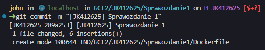
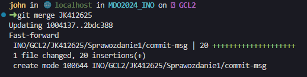

### Sprawozdanie 1

#### Konfiguracja maszyny

Systemem operacyjnym wykorzystywanym podczas realizacji tego sprawozdania był OpenSuse. Terminal to bash z nakładką [starship](https://starship.rs/).

#### Instalacja Git

Aby zainstalować pakiet git w środowisku OpenSuse należy skorzystać z zypper, który jest interfejsem menadżera pakietów [ZYpp](https://pl.wikipedia.org/wiki/ZYpp).

Aby zainstalować narzędzie git należy wywołać poniższą komendę.

```sh
sudo zypper install git
```

Potrzebne są uprawnienia roota w celu zainstalowania nowych pakietów w systemie dlatego przed poleceniem zypper użyto sudo.

#### Obsługa kluczy ssh

Openssh jest zestawem programów zapewniających szyfrowaną komunikację w sieci dzięki protokołowi SSH. W jego skład wchodzą następujące narzędzia:
- SSHD - SSH Daemon odpowiedzialny za odbieranie połączeń, uwierzytelnianie i szyfrowanie
- SSH - Klient ssh
- SCP - Narzędzie umorzliwiające przesyłanie plików przez protokół ssh
- SFTP - Secure File Transfer Protocol, pozwala na interaktywne przesyłanie plików przez ssh

Pakiet ten powinien być domyślnie zainstalowany na systemie. 

Do dalszej części zajęć potrzebne będą klucze ssh. Będą one używane w celu uwierzytelnienia nas, przez protokół ssh i umożliwią nam wprowadzanie zmian w repozytorium przetrzymywanym na Github. Pakiet OpenSSH zawiera przydatne narzędzie `ssh-keygen`, służące do tworzenia kluczy. Poniżej stworzone zostaną dwie pary kluczy różnych typów, jedna para zabezpieczona hasłem.

1. Typ **ed25519**
Należy wywołać komendę ssh-keygen z dwoma argumentami.

```sh
ssh-keygen -t ed25519 -C "your_email@example.com"
```
Argument `-t` oznacza typ klucza a `-C` komentarz (nie jest wymagany, ułatwia to jednak rozróżnianie kluczy).

Poniżej przykładowy wynik działania komendy.


Gdy wylistujemy obecny katalog zobaczymy, że stworzone zostały dwa nowe pliki.


Otrzymaliśmy dwa klucze: prywatny i publiczny (.pub). Klucz publiczny należy przekopiować do swojego profilu.

2. Typ **ecdsa**
W poprzedniej komendzie użytej do generacji kluczy podmieniamy typ. Dodatkow można zmienić algorytm szyfrowania (domyślny to aes256-ctr). Aby uzykać więcej dostępnych algorytmów szyfrowania można wywołać komendę `ssh -Q cipher`.

```sh
ssh-keygen -t ecdsa -C "your_email@example.com" -Z chacha20-poly1305@openssh.com
```

Przykładowy wynik:


 Również otrzymujemy dwa klucze: prywatny i publiczny. Tym razem nie podano nazwy pliku więc komenda ssh zapisała klucze w domyślnym katalogu `~/.ssh` z nazwą id_ecdsa.

#### Klonowanie repozytorium

Repozytorium może być sklonowane na dwa sposoby: za pomocą protokołu HTTPS i SSH. Gdy repozytorium jest publiczne nie musimy podawać naszych danych dostępowych lub kluczy ssh. 

Jednakże jeżeli musielibyśmy to zrobić to w przypadku klonowania repozytorium prywatnego za pomocą HTTPS niezbędne jest wygenerowanie `personal access token`. Github od jakiegoś czasu uniemożliwił logowanie przy pomocy nazwy użytkownika i hasła. Aby wygenerować PAT można skorzystać z [instrukcji](https://docs.github.com/en/authentication/keeping-your-account-and-data-secure/managing-your-personal-access-tokens). Gdy będziemy ściągać repozytorium prywatne git spyta się nas o nazwę użytkownika i tymczasowy token, który podaje się jako hasło.

W przypadku klonowania przy pomocy ssh, jedyne co należy zrobić to wrzucić wcześniej wygenerowany klucz do katalogu ~/.ssh i dodać go do ssh-agent komendą:

```shell
ssh-add ~/.ssh/id_ed25519
```

> Klucze dobrze jest trzymać w jednym miejscu, najlepiej domyślnym katalogu ~/.ssh aby ich nie zgubić. 

[Instrukcja dodawania klucza do konta github](https://docs.github.com/en/authentication/connecting-to-github-with-ssh/adding-a-new-ssh-key-to-your-github-account). Po dodaniu klucza do konta i wybraniu dla niego odpowiednich uprawnień, będziemy w stanie wprowadzać zmiany w naszych repozytoriach.

Aby sklonować repozytorium należy otworzyć repozytorium pod adresem [github](https://github.com/InzynieriaOprogramowaniaAGH/MDO2024_INO/tree/main), wybrać przycisk 'Code' a następnie wybrać zakładkę ssh i skopiować adres który użyjemy klonowania.


Aby sklonować repozytorium wywołamy komendę git clone:

```sh
git clone git@github.com:InzynieriaOprogramowaniaAGH/MDO2024_INO.git
```

Przykładowy wynik. Zostanie stworzony nowy katalog o tej samej nazwie co repozytorium, w miejscu w którym aktualnie jesteśmy.


#### Praca z gałęziami

Narzędzie git umożliwia tworzenie tzw. gałęzi, które pozwalają na oddzielanie serii commitów od głównej gałęzi main. Tworzenie i przełączenie się na brancha można zrobić na dwa sposoby.

1. Wywołanie dwóch komend:

```sh
git branch [nazwa_brancha]
git checkout [nazwa_brancha]
```

2. Wywołanie jednej komendy:

```sh
git checkout -b [nazwa_brancha]
```

Na zajęciach mieliśmy za zadanie przełączyć się na gałąź main, następnie na gałąź swojej grupy i na koniec stworzyć swoją i również się na nią przełączyć.

Przełączenie się na gałąź main. Dostaniemy informację, że jesteśmy już na głównej gałęzi.


Przełączenie się na gałąź grupy i sprawdzenie gdzie się znajdujemy (poleceniem git status lub git branch).


Następnie stworzenie i przełączenie się na brancha z moim numerem indeksu.


Po kolei: wszyszliśmy z głównej gałęzi main, przełączyliśmy się na gałąź GCL2 i na koniec przełączyliśmy się na JK412625. Z tego miejsca będzie później pushowane sprawozdanie do zdalnego repozytorium.

Poleceniem `mkdir` w katalogu grupy można stworzyć katalog z inicjałami i numerem indeksu. Wynikowo ścieżka dostępu do naszego katalogu ma wyglądać tak jak poniżej.


#### Git hooks

Git umożliwia interakcję z procesem tworzenia commitów. Wyróżniamy dwa rodzaje: server side i client side. Client side wykonuje się na systemie klienta, czyli w lokalnym środowisku a server side w zdalnym repozytorium. Na zajęciach mieliśmy napisać client side hooka, który umożliwia sprawdzenie commit message.
Wyróżniamy poniższe client side hooki:
- pre-commit - wykonywany przed rozpoczęciem tworzenia commita. Zwykle używany do uruchomienia testów czy [linterów kodu](https://blog.codacy.com/what-is-a-linter).
- prepare-commit-msg - wykonywany przed tworzeniem commit message. Zwykle używany do generowania domyślnej wiadomości  w commicie.
- commit-msg - wykonywany po dostarczeniu przez użytkownika treści commita. Zwykle wykonywany do sprawdzenia poprawności wiadomości (np. numer i nazwa ticketa w programie [JIRA](https://www.atlassian.com/pl/software/jira))
- post-commit - wykonywany po stworzeniu commita. Zwykle używany do notyfikacji np. emailem.

Aby sprawdzić poprawność wiadomości commit należy przygotować skrypt commit-msg. Git hooki umożliwiają użytkownikowi na definiowanie skryptów w dowolnym języku programowania, który może być uruchomiony z poziomu linii poleceń. Należy umieścić plik commit-msg w katalogu `.git/hooks/` aby skrypt uruchamiał się automatycznie podczas tworzenia commita.

Ja zdecydowałem się na język Python w wersji 3.11. Skrypt zaczyna się od dyrektywy interpretera (tzw. [shebang](https://en.wikipedia.org/wiki/Shebang_%28Unix%29)), który precyzuje w jaki sposób ma być uruchomiony skrypt. Pod nim znajduje się kod źródłowy analizujący commit message. Git przekazuje jako pierwszy argument z linii poleceń (argumentem zerowym jest nazwa pliku) relatywną ścieżkę do pliku z treścią wiadomości. 

W poniższym kodzie przyda się biblioteka sys, która umożliwi dostęp do argumentów skryptu poprzez sys.argv (lista argumentów o typie str). Funkcja `check_format` przyjmuje treść commita i sprawdza czy zaczyna się ona od inicjałów i numeru indeksu w nawiasach kwadratowych. Zwraca odpowienio typ bool w zależności od spełnienia warunku. Funkcja `read_commit_msg_file` odpowiada za pobranie zawartości commit message z pliku i zapisanie jej do zmiennej commit_msg. W bloku `if  __name__ == "__main__"` pobieramy nazwę commita i w zależności od wyniku wywołania funkcji `check_format` tworzymy wyjątek lub nie.

Jeżeli zwrócimy wyjątek to nie utworzy się commit. Zostanie wypisana wiadomość informująca użytkownika o tym jak powinna wyglądać prawidłowa wiadomość.

```python
#!/usr/bin/env python3
import sys

COMMIT_MSG = "[JK412625]"

def check_format(commit_msg: str) -> bool:
    return True if commit_msg.startswith(COMMIT_MSG) else False


def read_commit_msg_file(filename: str) -> str:
    with open(filename, 'r') as f:
        commit_msg = f.read()
    return commit_msg


if __name__ == "__main__":
    commit_msg = read_commit_msg_file(sys.argv[1])
    if not check_format(commit_msg):
        raise Exception(f"\nThe commit message should start with {COMMIT_MSG}\n" \
                             f"not: '{commit_msg[:11]}'")
```


Przykładowy wynik dla niepoprawnej wiadomości commit:


Gdy umieścimy na początku `commit-message` inicjały i nr. indeksu w kwadratowych nawiasach, commit powinien stworzyć się pomyślnie jak poniżej. Commit-message jest tym co umieszczamy po `-m` w komendzie `git commit`. Można również tworzyć treść commita w dowolnym edytorze. Wtedy należy uruchomić komendę `git commit` bez żadnych argumentów. Domyślny edytor konfiguruje się w pliku `.gitconfig`.



#### Wciąganie swojej gałęzi do gałęzi grupowej

Do łączenia gałęzi używana jest komenda `git merge`. Najpierw należy przepiąć się do gałęzi, do której będziemy przyłączać naszą gałąź. W tym przypadku to gałąź grupowa.


Następnie dokonujemy złączenia gałęzi wywołując komendę `git merge JK412625`.



#### Instalacja dockera

Aby zainstalować dockera na systemie OpenSuse należy skorzystać z instalatora pakietów zypper i wykonać komendy znajdujące się w [dokumentacji](https://en.opensuse.org/Docker) dla wersji Tumbleweed.

Aby uruchomić daemona dockera i sprawić żeby uruchamiał się wraz ze startem systemu, należy wykonać poniższą komendę.

```sh
sudo systemctl enable docker
```

Działanie daemona dockera można zweryfkować poleceniem

```sh
sudo systemctl status docker
```

Interesują nas dwie informacje, czy ma status `enabled` oraz `running`. Po zainstalowaniu dockera komendą zypper musiałem zrestartować system aby docker się uruchomił.


Na systemach innych niż OpenSuse może przydać się poniższy skrypt. Instaluje on dockera na systemie oraz dodaje użytkownika do grupy docker (nie trzeba wtedy uruchamiać poleceń docker z sudo).
https://github.com/unkn0w/noobs/blob/main/scripts/chce_dockera.sh

Aby dodać się do grupy użytkowników, którzy mogą uruchamiać dockera należy wykonać komendę:

```sh
sudo usermod -G docker -a $USER
```

Aby sprawdzić czy należymy do grupy dockera można wywołać komendę:


#### DockerHub

DockerHub jest repozytorium obrazów. Dzięki temu możemy udostępniać swoje lokalne obrazy  dla innych osób. Gdy te osoby będą chciały pobrać nasz obraz wystarczy uruchomić komendę `docker pull [użytkownik]/[nazwa_obrazu]`. Aby zobaczyć obrazy, które są przez nas stworzone można wejść na swój profil: `https://hub.docker.com/u/[nazwa_użytkownika]`.

Poniżej znajduje się mój profil z wgranym obrazem.


#### Pobieranie i uruchamianie obrazów

Podstawową komendą sprawdzającą czy jakiekolwiek obrazy są uruchomione jest `docker ps`. Na początku musimy mieć co uruchomić. W tym celu pobieramy obrazy `hello-world`, `busybox`, `ubuntu` lub `fedora`, `mysql`. Aby to zrobić należy wykonać komendę `docker pull [nazwa_obrazu]`, która spróbuje zaciągnąć obrazy z docker huba.

Aby zautomatyzować zaciąganie każdego obrazu, poniżej użyto pętli for each w bashu. Dla każdego elementu z listy wykonywana jest komenda `docker pull`.

```sh
for each in {hello-world,busybox,ubuntu};do docker pull $each;done
```


Żeby wylistować pobrane obrazy należy wykonać komendę `docker images`.


Następnym krokiem w instrukcji było uruchomienie kontenera busybox. Należy wykorzystać komendę `docker run [nazwa_obrazu]`.


Jak widać po uruchomieniu kontenera nic się nie dzieje. Gdy zobaczymy z jakim statusem zakończył się kontener zobaczymy, że zrobił to nie wyrzucając żadnych błędów. Aby rozpocząć interaktywną sesję należy dodać przełącznik `-it`, który łączy dwie opcje `--interactive` i `--tty`.


W drugim terminalu wykonano polecenie `docker ps`.


We wnętrzu kontenera możemy wykonać polecenie `busybox | grep BusyBox`, które zwróci nam numer wersji.


##### "System w kontenerze"

Docker udostępnia szereg tzw. obrazów bazowych, które posiadają składowe lub narzędzia takich systemów jak ubuntu, fedora czy inne. Gdy uruchomimy je bez żadnych argumentów, zakończą swoje działanie. Dlatego w poniższych komendach `docker run` dodawana jest opcja `-it`.

Uruchomienie kontenera z obrazem ubuntu.


Pokazanie pierwszego procesu w kontenerze


Procesy dockera na hoście wylistowane komendą `ps -auxf`. [Wytłumaczenie poszczególnych opcji.](https://explainshell.com/explain?cmd=ps+-auxf). Jak widać poniżej, w kontenerze uruchomiony jest proces `/bin/bash`.


Akutalizacja pakietów w kontenerze i wyjście. Na początku aktualizujemy listy repozytorów a następnie aktualizujemy pakiety.


Opcja `-y` w komendzie `apt upgrade` spowoduje, że proces apt nie spyta się nas o potwierdzenie instalacji.
Aby wyjść z kontenera wystaczy wywołać w nim komendę `exit`. Innym sposobem zatrzymania działania kontenera jest `docker stop [nazwa lub id kontenera]`.

##### Własny Dockerfile

Dockerfile służy do tworzenia swoich własnych obrazów na bazie tych podstawowych (np. ubuntu, alpine, python itp.). Oferuje on szereg dyrektów, które definiują w jaki sposób zostanie zbudowany kontener. Poniżej zostały użyte trzy podstawowe: `RUN`, `FROM` oraz `ENTRYPOINT`. Na początku wybieramy obraz bazowy, na który będziemy nakładać kolejne warstwy. Dyrektywa `RUN` uruchamia polecenie w kontenerze a `ENTRYPOINT` określa co ma być uruchomione po starcie. Lista poszczególnych dyrektyw i ich opisów znajduje się pod [linkiem](https://docs.docker.com/reference/dockerfile/).

Polecenia `apt` pozwalają na zainstalowanie gita. Następnie klonumemy repozytorium do katalogu `/`. Aby utrzymać kontener 'przy życiu', wykonywana jest komenda `tail -f /dev/null`, która próbuje cały czas odczytywać zasoby /dev/null, które jest [czarną dziurą](https://en.wikipedia.org/wiki/Null_device) (zwykle tam przekierowywane są błędy w bashu, aby uniknąć wypisywania ich na różne potoki). Dzięki temu ten proces będzie działał w nieskończoność.

```Dockerfile
FROM ubuntu:latest

RUN apt-get update && apt-get install -y git
RUN git clone https://github.com/InzynieriaOprogramowaniaAGH/MDO2024_INO.git

ENTRYPOINT ["tail", "-f", "/dev/null"]
```

Na poczatku trzeba zbudować ten obraz żeby można było uruchomić kontener, który go używa. W tym celu należy wykonać komendę `docker build . -t "sprawozdanie_1"`. Kropka w komendzie oznacza gdzie docker ma szukać pliku Dockerfile a `-t` dodaje tag czyli nazwę dla naszego obrazu.


Uruchomienie kontenera z nowo zbudowanym obrazem w trybie odłączonym (`--detached`, oznacza, że kontener uruchomi się w tle). Jak widać po wywołaniu `docker ps` widać nowo stworzony kontener.


Następnie trzeba się upewnić, że nasze repozytorium przedmiotowe zostało zklonowane. W tym celu wywoływana jest komenda `docker exec`, która pozwala na uruchomienie dowolnej komendy w kontenerze. Dzięki temu możemy np. podłączyć się w trybie interaktywnym do kontenera i zrzucić sobie shella.


Jak widać wyżej, repozytorium zostało sklonowane i mamy dostęp do narzędzia git.

#### Sprzątanie

Na koniec w instrukcji należało pokazać wszystkie działąjące kontenery i je wyczyścić. Domyślnie gdy wywołamy komendę `docker ps`, pokażą nam się tylko uruchomione kontenery. Aby zobaczyć wszystkie stworzone kontenery, nawet te, które nie są uruchomione należy dodać do poprzedniej komendy opcję `-a`. Gdy spojrzymy na status można zobaczyć w jakim stanie jest dany kontener.


Aby usunąć wszystkie nieużywane lub 'wiszące' obrazy, kontenery, wolumeny czy dockerowe sieci wystarczy użyć komendy `docker system prune` (należy używać z rozwagą). Żeby pozbyć się konkretnych kontenerów należy wywołać komendę `docker rm [id lub nazwa kontenera]`. 


Jak widać poniżej, usunęły się wszystkie zakończone kontenery.


Podobnie usuwa się obrazy, należy wywołać komendę `docker rmi [id lub nazwa obrazu]`. Należy dodać, że nie można usunąc obrazu jeżeli istnieje jakiś kontener, który z niego korzysta.


Jak widać wyskakuje błąd, gdy następuje próba usunięcia obrazu, który jest używany przez jakiś kontener.

